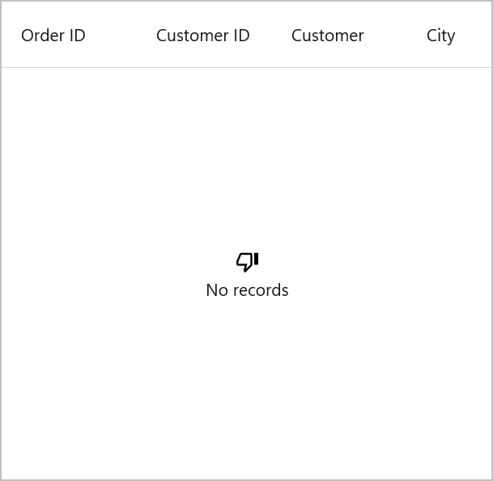

# EmptyView in MAUI DataGrid (SfDataGrid)

The `SfDataGrid` provides options to display and customize an empty view when no data is available to display using the following properties,

 * [EmptyView]() object can be set to a string or view when `SfDataGrid` has no items. The default value is null.
 * [EmptyViewTemplate]() is used to customize the appearance of `EmptyView`. The default value is null.

## Display a string when DataGrid has no items

We can specify the `EmptyView` property to a string that will be shown when the ItemsSource is null or when the collection that the `ItemsSource` property specifies is empty or null.



<syncfusion:SfDataGrid x:Name="dataGrid"
                         ItemsSource="{Binding NewOrderInfoCollection}"
                         ItemSize="56"
                         EmptyView="No Items">
</syncfusion:SfDataGrid>


dataGrid.EmptyView = "No Items";



## Display views when DataGrid has no items

The `EmptyView` property can be set to a view, which will be displayed when the [ItemsSource](https://help.syncfusion.com/cr/maui/Syncfusion.Maui.DataGrid.SfDataGrid.html#Syncfusion_Maui_DataGrid_SfDataGrid_ItemsSource) property is null, or when the collection specified by the `ItemsSource` property is null or empty.



<syncfusion:SfDataGrid x:Name="dataGrid"
                       ItemsSource="{Binding OrderInfoCollection}">
    <syncfusion:SfDataGrid.EmptyView>
        <StackLayout HorizontalOptions="Center" VerticalOptions="Center">
            <Label Text="&#xE7A4;" FontSize="20" TextColor="Black" FontFamily="MauiMaterialAssets.ttf"/>
            <Label Text="No records" FontSize="14"/>
        </StackLayout>
    </syncfusion:SfDataGrid.EmptyView>                   
</syncfusion:SfDataGrid>


StackLayout stackLayout = new StackLayout() { HorizontalOptions = LayoutOptions.Center };

var label1 = new Label()
{
    Text = "\uE7A4",
    FontSize = 20,
    FontFamily = "MauiMaterialAssets.ttf",
    HorizontalTextAlignment = TextAlignment.Center,
};
var label2 = new Label()
{
    Text = "No records",
    FontSize = 16,
    FontFamily = "Roboto-Regular",
    HorizontalTextAlignment = TextAlignment.Center,
};
stackLayout.Children.Add(label1);
stackLayout.Children.Add(label2);

dataGrid.EmptyView = stackLayout;



N> The view that the `EmptyView` displays may be a single view or a view that has multiple child views.

## Display a templated custom type when DataGrid has no items

We can set the `EmptyView` to a custom type that will displayed when the `ItemsSource` is null or the collection that the `ItemsSource` parameter specifies is empty or null. The `EmptyViewTemplate` can be used to modify the `EmptyView`'s appearance.
 


<ContentPage xmlns:syncfusion="clr-namespace:Syncfusion.Maui.DataGrid;assembly=Syncfusion.Maui.DataGrid"
             xmlns:local="clr-namespace:EmptyViewTemplate">
    <StackLayout>
      <SearchBar x:Name="filterText" 
        FontSize="16"
        Placeholder="Filter Inventory" TextChanged="filterText_TextChanged"/>
      <syncfusion:SfDataGrid x:Name="dataGrid"
                    ItemsSource="{Binding NewOrders}">
          <syncfusion:SfDataGrid.EmptyView>
              <local:FilterItem Filter="{Binding Source={x:Reference filterText},Path=Text}" x:Name="filter"/>
          </syncfusion:SfDataGrid.EmptyView>
          <syncfusion:SfDataGrid.EmptyViewTemplate>
              <DataTemplate>
                  <Label Text="{Binding Source={x:Reference filterText},Path=Text, StringFormat='{0} is not found'}"
                        HorizontalTextAlignment="Center"     
                        VerticalOptions="Center"
                          FontSize="14" FontFamily="Roboto-Regular"/>
              </DataTemplate>
          </syncfusion:SfDataGrid.EmptyViewTemplate>
      </syncfusion:SfDataGrid>
  </StackLayout>
</ContentPage>


dataGrid.EmptyView = new FilterItem() { Filter = filterText.Text};

dataGrid.EmptyViewTemplate = new DataTemplate(() =>
{
  Label label = new Label()
  {					
    FontSize = 18,
    FontFamily = "Roboto-Regular",
    VerticalOptions = LayoutOptions.CenterAndExpand,
    HorizontalTextAlignment = TextAlignment.Center
  };
  label.SetBinding(Label.TextProperty, new Binding(source:filterText, stringFormat: "{0} is not found", path:"Text"));
  return label;
});



The `FilterItem` type defines a `Filter` property.



public class FilterItem : BindableObject
{
  public static readonly BindableProperty FilterProperty = BindableProperty.Create(nameof(Filter), typeof(string), typeof(FilterItem), null);

  public string Filter
  {
      get { return (string)GetValue(FilterProperty); }
      set { SetValue(FilterProperty, value); }
  }
}



FilterItem object is set to the `EmptyView` property, and the `Filter` property is bound to the `SearchBar.Text` property. When `SearchBar.TextChanged` event is raised, the value of the `SearchBar.Text` property is stored in the `Filter` property.

## Change an empty view at runtime

The `EmptyView` can be changed to a particular view at run time and views that can be defined as [ContentView](https://learn.microsoft.com/en-us/dotnet/api/microsoft.maui.controls.contentview?view=net-maui-7.0) objects in the [ResourceDictionary](https://learn.microsoft.com/en-us/dotnet/api/microsoft.maui.controls.resourcedictionary?view=net-maui-7.0).



<ContentPage xmlns:syncfusion="clr-namespace:Syncfusion.Maui.DataGrid;assembly=Syncfusion.Maui.DataGrid"
             xmlns:local="clr-namespace:EmptyViewDemo">
  <ContentPage.Resources>
    <ResourceDictionary>
        <ContentView x:Key="SingleView">
            <Label Text="No records" FontSize="18" FontFamily="Roboto-Regular" HorizontalOptions="Center" 
                   VerticalOptions="Center"/>
        </ContentView>
        <ContentView x:Key="MultiView">
            <StackLayout VerticalOptions="Center">
                <Label Text="&#xE7A4;" 
                FontSize="40"
                FontFamily="MauiMaterialAssets.ttf"
                HorizontalTextAlignment="Center" />
                <Label TextColor="#666666" 
                Text="No records" FontSize="16" FontFamily="Roboto-Regular" HorizontalTextAlignment="Center" />
            </StackLayout>
        </ContentView>
    </ResourceDictionary>
  </ContentPage.Resources>
  <ContentPage.Content>
    <StackLayout>
        <HorizontalStackLayout >
            <Label Text="Changing empty view" HorizontalOptions="Start"/>
            <CheckBox Grid.Row="1"
             x:Name="checkBox" IsChecked="False"
             CheckedChanged="checkBox_CheckedChanged" />
        </HorizontalStackLayout>
        <syncfusion:SfDataGrid x:Name="dataGrid"
                   ItemsSource="{Binding NewOrders}"
                   EmptyView="{StaticResource SingleView}">
        </syncfusion:SfDataGrid>
    </StackLayout>
  </ContentPage.Content>
</ContentPage>


dataGrid.EmptyView = Resources["SingleView"];

checkBox.CheckedChanged += checkBox_CheckedChanged;



Based on value of [CheckBox.IsChecked](vhttps://learn.microsoft.com/en-us/dotnet/api/microsoft.maui.controls.checkbox.ischecked?view=net-maui-7.0) property, `EmptyView` is changed at run time.



private void checkBox_CheckedChanged(object sender, CheckedChangedEventArgs e)
{
  if(e.Value)
    dataGrid.EmptyView = Resources["MultiView"];
  else
    dataGrid.EmptyView = Resources["SingleView"];
}



## Change an empty view template at runtime

The `EmptyView` appearance can be changed at run time based on its value using the `EmptyViewTemplate` property.



<ContentPage xmlns:syncfusion="clr-namespace:Syncfusion.Maui.DataGrid;assembly=Syncfusion.Maui.DataGrid"
             xmlns:local="clr-namespace:EmptyViewTemplate">
  <ContentPage.Resources>
    <ResourceDictionary>
        <DataTemplate x:Key="BasicTemplate">
            <Label Text="No records" VerticalOptions="Center" HorizontalOptions="Center"/>
        </DataTemplate>
        <DataTemplate x:Key="AdvancedTemplate">
            <StackLayout VerticalOptions="Center">
                <Label Text="&#xE7A4;" FontFamily="MauiMaterialAssets.ttf" VerticalOptions="Center" HorizontalOptions="Center"/>
                <Label Text="No records" VerticalOptions="Center" HorizontalOptions="Center"/>
            </StackLayout>
        </DataTemplate>
        <local:EmptyViewDataTemplateSelector x:Key="DataTemplateSelector" 
                        BasicTemplate="{StaticResource BasicTemplate}" 
                        AdvancedTemplate="{StaticResource AdvancedTemplate}"/>
    </ResourceDictionary>
  </ContentPage.Resources> 

  <ContentPage.Content>
    <StackLayout>
        <SearchBar x:Name="filterText" 
           FontSize="16"
           Placeholder="Filter Inventory" TextChanged="filterText_TextChanged"/>
        <syncfusion:SfDataGrid x:Name="dataGrid"
                       ItemsSource="{Binding NewOrders}"
                       EmptyView="{Binding Source={x:Reference filterText},Path=Text}"
                       EmptyViewTemplate="{StaticResource DataTemplateSelector}">
        </syncfusion:SfDataGrid>
    </StackLayout>
    
</ContentPage.Content>
</ContentPage>


dataGrid.EmptyView = filterText.Text;

dataGrid.EmptyViewTemplate = new EmptyViewDataTemplateSelector() { BasicTemplate = this.Resources["BasicTemplate"] as DataTemplate, AdvancedTemplate = this.Resources["AdvancedTemplate"] as DataTemplate };



The `EmptyView` property is set to the `SearchBar.Text` property, and the `EmptyViewTemplate` property is set to an `EmptyViewDataTemplateSelector` object.



public class EmptyViewDataTemplateSelector : Microsoft.Maui.Controls.DataTemplateSelector
{
  public DataTemplate BasicTemplate { get; set; }
  public DataTemplate AdvancedTemplate { get; set; }

  public EmptyViewDataTemplateSelector()
  {
    
  }

  protected override DataTemplate OnSelectTemplate(object item, BindableObject container)
  {
    if(item.ToString().Count() > 10)
        return AdvancedTemplate;
    else
        return BasicTemplate;
  }
}



Template for `EmptyView` is set to AdvancedTemplate when SearchBar.Text.Count() is greater than 10. Otherwise, set it to BasicTemplate.

