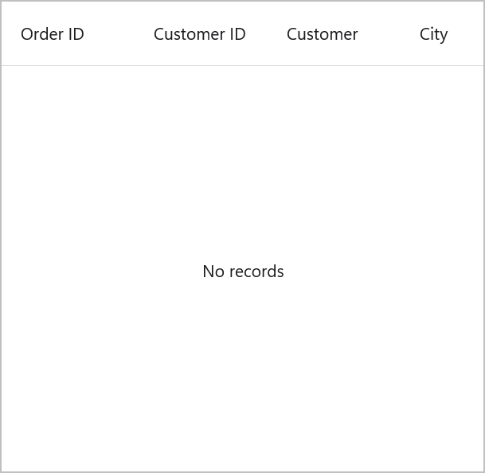
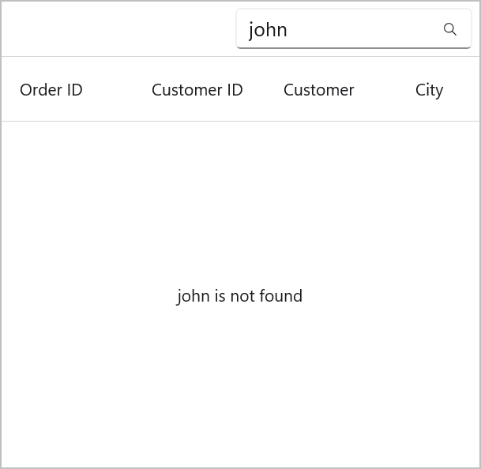

# EmptyView in MAUI DataGrid (SfDataGrid)

The [SfDataGrid](https://help.syncfusion.com/cr/maui/Syncfusion.Maui.DataGrid.SfDataGrid.html) provides options to display and customize an empty view when no data is available to display using the following properties,

 * [EmptyView]() object can be set to a string or view when `SfDataGrid` has no items. The default value is null.
 * [EmptyViewTemplate]() is used to customize the appearance of `EmptyView`. The default value is null.

## Display a string when DataGrid has no items

We can specify the `EmptyView` property to a string that will be shown when the [ItemsSource](https://help.syncfusion.com/cr/maui/Syncfusion.Maui.DataGrid.SfDataGrid.html#Syncfusion_Maui_DataGrid_SfDataGrid_ItemsSource) property is null or when the collection that the `ItemsSource` property specifies is empty or null.



<syncfusion:SfDataGrid x:Name="dataGrid"
                         ItemsSource="{Binding OrderInfoCollection}"
                         EmptyView="No records">
</syncfusion:SfDataGrid>


dataGrid.EmptyView = "No records";



## Display views when DataGrid has no items

The `EmptyView` property can be set to a view, which will be displayed when the `ItemsSource` property is null, or when the collection specified by the `ItemsSource` property is null or empty.



<syncfusion:SfDataGrid x:Name="dataGrid"
                       ItemsSource="{Binding OrderInfoCollection}">
    <syncfusion:SfDataGrid.EmptyView>
        <StackLayout HorizontalOptions="Center" VerticalOptions="Center">
            <Label Text="&#xE7A4;" FontSize="20" TextColor="Black" FontFamily="MauiMaterialAssets.ttf"/>
            <Label Text="No records" FontSize="14"/>
        </StackLayout>
    </syncfusion:SfDataGrid.EmptyView>                   
</syncfusion:SfDataGrid>


StackLayout stackLayout = new StackLayout() { HorizontalOptions = LayoutOptions.Center };

var label1 = new Label()
{
    Text = "\uE7A4",
    FontSize = 20,
    FontFamily = "MauiMaterialAssets.ttf",
    HorizontalTextAlignment = TextAlignment.Center,
};
var label2 = new Label()
{
    Text = "No records",
    FontSize = 16,
    FontFamily = "Roboto-Regular",
    HorizontalTextAlignment = TextAlignment.Center,
};
stackLayout.Children.Add(label1);
stackLayout.Children.Add(label2);

dataGrid.EmptyView = stackLayout;



N> The view that the `EmptyView` displays may be a single view or a view that has multiple child views.

## Display a DataTemplate when DataGrid has no items

We can set the `EmptyView` to a custom type that will displayed when the `ItemsSource` is null or the collection that the `ItemsSource` parameter specifies is empty or null. The `EmptyViewTemplate` can be used to modify the `EmptyView`'s appearance.
 


<ContentPage xmlns:syncfusion="clr-namespace:Syncfusion.Maui.DataGrid;assembly=Syncfusion.Maui.DataGrid"
             xmlns:local="clr-namespace:EmptyViewTemplate">
    <StackLayout>
      <SearchBar x:Name="filterText" 
        FontSize="16"
        Placeholder="Filter Inventory" TextChanged="filterText_TextChanged"/>
      <syncfusion:SfDataGrid x:Name="dataGrid"
                    ItemsSource="{Binding OrderInfoCollection}">
          <syncfusion:SfDataGrid.EmptyView>
              <local:FilterItem Filter="{Binding Source={x:Reference filterText},Path=Text}" x:Name="filter"/>
          </syncfusion:SfDataGrid.EmptyView>
          <syncfusion:SfDataGrid.EmptyViewTemplate>
              <DataTemplate>
                  <Label Text="{Binding Source={x:Reference filterText},Path=Text, StringFormat='{0} is not found'}"
                        HorizontalTextAlignment="Center"     
                        VerticalOptions="Center"
                          FontSize="14" FontFamily="Roboto-Regular"/>
              </DataTemplate>
          </syncfusion:SfDataGrid.EmptyViewTemplate>
      </syncfusion:SfDataGrid>
  </StackLayout>
</ContentPage>


dataGrid.EmptyView = new FilterItem() { Filter = filterText.Text};

dataGrid.EmptyViewTemplate = new DataTemplate(() =>
{
  Label label = new Label()
  {					
    FontSize = 18,
    FontFamily = "Roboto-Regular",
    VerticalOptions = LayoutOptions.CenterAndExpand,
    HorizontalTextAlignment = TextAlignment.Center
  };
  label.SetBinding(Label.TextProperty, new Binding(source:filterText, stringFormat: "{0} is not found", path:"Text"));
  return label;
});



The `FilterItem` type defines a `Filter` property.



public class FilterItem : BindableObject
{
  public static readonly BindableProperty FilterProperty = BindableProperty.Create(nameof(Filter), typeof(string), typeof(FilterItem), null);

  public string Filter
  {
      get { return (string)GetValue(FilterProperty); }
      set { SetValue(FilterProperty, value); }
  }
}



FilterItem object is set to the `EmptyView` property, and the `Filter` property is bound to the `SearchBar.Text` property. When `SearchBar.TextChanged` event is raised, the value of the `SearchBar.Text` property is stored in the `Filter` property.

