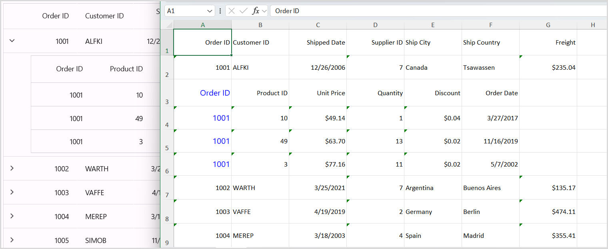

# Export To Excel in MAUI DataGrid (SfDataGrid)

The [SfDataGrid](https://help.syncfusion.com/cr/maui/Syncfusion.Maui.DataGrid.SfDataGrid.html) enables data export to Excel, offering several customization options such as personalized appearance, exclusion of specific columns or headers, adjustment of custom row height and column width, and more.

To export the SfDataGrid to an Excel file, the following NuGet package should be installed.

<table>
<tr>
<th> Project </th>
<th> Required package </th>
</tr>
<tr>
<td> .NET MAUI</td>
<td> Syncfusion.Maui.DataGridExport</td>
</tr>
</table>

## Save Service class in portable project.
Add the new class file with name as SaveService to the Project and add below code in it. This is the helper class used to save and view the excel file in Windows, Android, iOS and MAC devices.



namespace GettingStarted
{
  public partial class SaveService
  {
    //Method to save document as a file and view the saved document.
    public partial void SaveAndView(string filename, string contentType, MemoryStream stream);
  }
}



### Save and View the excel documents in windows.
Add the new class file with name SaveWindows file under Platforms-> Windows directory to save and view the Excel document in the windows machine and use the below code in it.



using Microsoft.Maui.Controls;
using System;
using System.Collections.Generic;
using System.IO;
using System.Threading.Tasks;
using Windows.Storage;
using Windows.Storage.Pickers;
using Windows.Storage.Streams;
using Windows.UI.Popups;

namespace GettingStarted
{
    public partial class SaveService
    {
        public async partial void SaveAndView(string filename, string contentType, MemoryStream stream)
        {
            StorageFile stFile;
            string extension = Path.GetExtension(filename);
            //Gets process windows handle to open the dialog in application process. 
            IntPtr windowHandle = System.Diagnostics.Process.GetCurrentProcess().MainWindowHandle;
            if (!Windows.Foundation.Metadata.ApiInformation.IsTypePresent("Windows.Phone.UI.Input.HardwareButtons"))
            {
                //Creates file save picker to save a file. 
                FileSavePicker savePicker = new();
                if (extension == ".xlsx")
                {
                    savePicker.DefaultFileExtension = ".xlsx";
                    savePicker.SuggestedFileName = filename;
                    //Saves the file as xlsx file.
                    savePicker.FileTypeChoices.Add("XLSX", new List<string>() { ".xlsx" });
                }
               
                WinRT.Interop.InitializeWithWindow.Initialize(savePicker, windowHandle);
                stFile = await savePicker.PickSaveFileAsync();
            }
            else
            {
                StorageFolder local = ApplicationData.Current.LocalFolder;
                stFile = await local.CreateFileAsync(filename, CreationCollisionOption.ReplaceExisting);
            }
            if (stFile != null)
            {
                using (IRandomAccessStream zipStream = await stFile.OpenAsync(FileAccessMode.ReadWrite))
                {
                    //Writes compressed data from memory to file.
                    using Stream outstream = zipStream.AsStreamForWrite();
                    outstream.SetLength(0);
                    //Saves the stream as file.
                    byte[] buffer = stream.ToArray();
                    outstream.Write(buffer, 0, buffer.Length);
                    outstream.Flush();
                }
                //Create message dialog box. 
                MessageDialog msgDialog = new("Do you want to view the document?", "File has been created successfully");
                UICommand yesCmd = new("Yes");
                msgDialog.Commands.Add(yesCmd);
                UICommand noCmd = new("No");
                msgDialog.Commands.Add(noCmd);

                WinRT.Interop.InitializeWithWindow.Initialize(msgDialog, windowHandle);

                //Showing a dialog box. 
                IUICommand cmd = await msgDialog.ShowAsync();
                if (cmd.Label == yesCmd.Label)
                {
                    //Launch the saved file. 
                    await Windows.System.Launcher.LaunchFileAsync(stFile);
                }
            }
        }
    }
}



### Save and View the Excel document in Android.
Add the new class file with name SaveAndroid file under Platforms->Android directory to save and view the Excel document in the Android Device and use the below code in it.



using Android.Content;
using Android.OS;
using Java.IO;
using System;
using System.IO;
using System.Threading.Tasks;

namespace GettingStarted
{
    public partial class SaveService
    {
        public partial void SaveAndView(string filename, string contentType, MemoryStream stream)
        {
            string exception = string.Empty;
            string? root = System.Environment.GetFolderPath(System.Environment.SpecialFolder.MyDocuments);

            Java.IO.File myDir = new(root + "/Syncfusion");
            myDir.Mkdir();

            Java.IO.File file = new(myDir, filename);

            if (file.Exists())
            {
                file.Delete();
            }

            try
            {
                FileOutputStream outs = new(file);
                outs.Write(stream.ToArray());

                outs.Flush();
                outs.Close();
            }
            catch (Exception e)
            {
                exception = e.ToString();
            }
            if (file.Exists())
            {

                if (Build.VERSION.SdkInt >= Android.OS.BuildVersionCodes.N)
                {
                    var fileUri = AndroidX.Core.Content.FileProvider.GetUriForFile(Android.App.Application.Context, Android.App.Application.Context.PackageName + ".provider", file);
                    var intent = new Intent(Intent.ActionView);
                    intent.SetData(fileUri);
                    intent.AddFlags(ActivityFlags.NewTask);
                    intent.AddFlags(ActivityFlags.GrantReadUriPermission);
                    Android.App.Application.Context.StartActivity(intent);
                }
                else
                {
                    var fileUri = Android.Net.Uri.Parse(file.AbsolutePath);
                    var intent = new Intent(Intent.ActionView);
                    intent.SetDataAndType(fileUri, contentType);
                    intent = Intent.CreateChooser(intent, "Open File");
                    intent!.AddFlags(ActivityFlags.NewTask);
                    Android.App.Application.Context.StartActivity(intent);
                }

            }
        }
    }
}



Create a new XML file with the name of provider_path.xml under the Resources-> xml folder of Android project and add the following code in it. Eg: Resources/xml/provider_path.xml



<?xml version="1.0" encoding="UTF-8" ?>
<paths xmlns:android="http://schemas.android.com/apk/res/android">
   <external-path name="external_files" path="."/>
</paths>



Add the following code to the AndroidManifest.xml file located under Properties folder.



<?xml version="1.0" encoding="utf-8"?>
<manifest xmlns:android="http://schemas.android.com/apk/res/android">
  
	<application android:allowBackup="true" android:icon="@mipmap/appicon" android:roundIcon="@mipmap/appicon_round" android:supportsRtl="true">
		<provider
        android:name="androidx.core.content.FileProvider"
        android:authorities="${applicationId}.provider"
        android:exported="false"
        android:grantUriPermissions="true">
			<meta-data
				android:name="android.support.FILE_PROVIDER_PATHS"
				android:resource="@xml/file_paths" />
		</provider>
	</application>
	<uses-permission android:name="android.permission.ACCESS_NETWORK_STATE" />
	<uses-permission android:name="android.permission.INTERNET" />
</manifest>



### Save and View the Excel document in iOS

Add the new class file with name SaveIOS file under Platforms -> iOS directory to save and view the Excel document in the iOS device and use the below code in it.



using QuickLook;
using System;
using System.IO;
using System.Threading.Tasks;
using UIKit;

namespace GettingStarted
{
    public partial class SaveService
    {
        public partial void SaveAndView(string filename, string contentType, MemoryStream stream)
        {
            string exception = string.Empty;
            string path = Environment.GetFolderPath(Environment.SpecialFolder.Personal);
            string filePath = Path.Combine(path, filename);
            try
            {
                FileStream fileStream = File.Open(filePath, FileMode.Create);
                stream.Position = 0;
                stream.CopyTo(fileStream);
                fileStream.Flush();
                fileStream.Close();
            }
            catch (Exception e)
            {
                exception = e.ToString();
            }
            if (contentType != "application/html" || exception == string.Empty)
            {
                //Added this code to resolve the warning thrown when CI compiles.
                UIViewController? currentController = UIApplication.SharedApplication.ConnectedScenes.OfType<UIWindowScene>().SelectMany(scene => scene.Windows).FirstOrDefault(window => window.IsKeyWindow)!.RootViewController;
                while (currentController!.PresentedViewController != null)
                    currentController = currentController.PresentedViewController;

                QLPreviewController qlPreview = new();
                QLPreviewItem item = new QLPreviewItemBundle(filename, filePath);
                qlPreview.DataSource = new PreviewControllerDS(item);
                currentController.PresentViewController((UIViewController)qlPreview, true, null);
            }
        }
    }

    public class QLPreviewItemFileSystem : QLPreviewItem
    {
        readonly string _fileName, _filePath;

        public QLPreviewItemFileSystem(string fileName, string filePath)
        {
            _fileName = fileName;
            _filePath = filePath;
        }

        public override string PreviewItemTitle
        {
            get
            {
                return _fileName;
            }
        }
        public override NSUrl PreviewItemUrl
        {
            get
            {
                return NSUrl.FromFilename(_filePath);
            }
        }
    }

    public class QLPreviewItemBundle : QLPreviewItem
    {
        readonly string _fileName, _filePath;
        public QLPreviewItemBundle(string fileName, string filePath)
        {
            _fileName = fileName;
            _filePath = filePath;
        }

        public override string PreviewItemTitle
        {
            get
            {
                return _fileName;
            }
        }
        public override NSUrl PreviewItemUrl
        {
            get
            {
                var documents = NSBundle.MainBundle.BundlePath;
                var lib = Path.Combine(documents, _filePath);
                var url = NSUrl.FromFilename(lib);
                return url;
            }
        }
    }


    public class PreviewControllerDS : QLPreviewControllerDataSource
    {
        private readonly QLPreviewItem _item;

        public PreviewControllerDS(QLPreviewItem item)
        {
            _item = item;
        }

        public override nint PreviewItemCount(QLPreviewController controller)
        {
            return (nint)1;
        }

        public override IQLPreviewItem GetPreviewItem(QLPreviewController controller, nint index)
        {
            return _item;
        }
    }
}



### Save and View the Excel document in MacCatalyst

Add the new class file with name SaveMAC file under Platforms -> MacCatalyst directory to save and view the Excel document in the MAC Device and use the below code in it.



using Foundation;
using QuickLook;
using System;
using System.IO;
using System.Threading.Tasks;
using UIKit;

namespace GettingStarted
{
    public partial class SaveService
    {
        public partial void SaveAndView(string filename, string contentType, MemoryStream stream)
        {
            string path = Environment.GetFolderPath(Environment.SpecialFolder.MyDocuments);
            string filePath = Path.Combine(path, filename);
            stream.Position = 0;
            //Saves the document
            using FileStream fileStream = new(filePath, FileMode.Create, FileAccess.ReadWrite);
            stream.CopyTo(fileStream);
            fileStream.Flush();
            fileStream.Dispose();
            //Launch the file
            //Added this code to resolve the warning thrown when CI compiles.
            UIViewController? currentController = UIApplication.SharedApplication.ConnectedScenes.OfType<UIWindowScene>().SelectMany(scene => scene.Windows).FirstOrDefault(window => window.IsKeyWindow)!.RootViewController;
            while (currentController!.PresentedViewController != null)
                currentController = currentController.PresentedViewController;
            UIView? currentView = currentController.View;

            QLPreviewController qlPreview = new();
            QLPreviewItem item = new QLPreviewItemBundle(filename, filePath);
            qlPreview.DataSource = new PreviewControllerDS(item);
            currentController.PresentViewController((UIViewController)qlPreview, true, null);
        }
    }
}
public class QLPreviewItemFileSystem : QLPreviewItem
{
    readonly string _fileName, _filePath;

    public QLPreviewItemFileSystem(string fileName, string filePath)
    {
        _fileName = fileName;
        _filePath = filePath;
    }

    public override string PreviewItemTitle
    {
        get
        {
            return _fileName;
        }
    }
    public override NSUrl PreviewItemUrl
    {
        get
        {
            return NSUrl.FromFilename(_filePath);
        }
    }
}

public class QLPreviewItemBundle : QLPreviewItem
{
    readonly string _fileName, _filePath;
    public QLPreviewItemBundle(string fileName, string filePath)
    {
        _fileName = fileName;
        _filePath = filePath;
    }

    public override string PreviewItemTitle
    {
        get
        {
            return _fileName;
        }
    }
    public override NSUrl PreviewItemUrl
    {
        get
        {
            var documents = NSBundle.MainBundle.BundlePath;
            var lib = Path.Combine(documents, _filePath);
            var url = NSUrl.FromFilename(lib);
            return url;
        }
    }
}

public class PreviewControllerDS : QLPreviewControllerDataSource
{
    private readonly QLPreviewItem _item;

    public PreviewControllerDS(QLPreviewItem item)
    {
        _item = item;
    }

    public override nint PreviewItemCount(QLPreviewController controller)
    {
        return (nint)1;
    }

    public override IQLPreviewItem GetPreviewItem(QLPreviewController controller, nint index)
    {
        return _item;
    }
}




The following code sample illustrates the process of exporting data to Excel. It utilizes the [DataGridExcelExportingController.ExportToExcel](https://help.syncfusion.com/cr/maui/Syncfusion.Maui.DataGrid.Exporting.DataGridExcelExportingController.html#Syncfusion_Maui_DataGrid_Exporting_DataGridExcelExportingController_ExportToExcel_Syncfusion_Maui_DataGrid_SfDataGrid_) method, with the SfDataGrid passed as an argument.



    <StackLayout>
        <Button Text="Export"
                Clicked="ExportToExcel_Clicked" />
        <syncfusion:SfDataGrid x:Name="dataGrid"
                               Margin="20"
                               VerticalOptions="FillAndExpand"
                               ItemsSource="{Binding OrderInfoCollection}"
                               GridLinesVisibility="Both"
                               HeaderGridLinesVisibility="Both"
                               AutoGenerateColumnsMode="None"
                               ColumnWidthMode="Auto">
            <syncfusion:SfDataGrid.Columns>
                <syncfusion:DataGridNumericColumn Format="D"
                                                  HeaderText="Order ID"
                                                  MappingName="OrderID">
                </syncfusion:DataGridNumericColumn>
                <syncfusion:DataGridTextColumn HeaderText="Customer ID"
                                               MappingName="CustomerID">
                </syncfusion:DataGridTextColumn>
                <syncfusion:DataGridTextColumn MappingName="Customer"
                                               HeaderText="Customer">
                </syncfusion:DataGridTextColumn>
                <syncfusion:DataGridTextColumn HeaderText="Ship City"
                                               MappingName="ShipCity">
                </syncfusion:DataGridTextColumn>
                <syncfusion:DataGridTextColumn HeaderText="Ship Country"
                                               MappingName="ShipCountry">
                </syncfusion:DataGridTextColumn>
            </syncfusion:SfDataGrid.Columns>
        </syncfusion:SfDataGrid>
    </StackLayout>


private void ExportToExcel_Clicked(object sender, EventArgs e)
{
    // Perform exporting to Excel sheet operations here.
    DataGridExcelExportingController excelExport = new DataGridExcelExportingController();
    var excelEngine = excelExport.ExportToExcel(this.dataGrid);
    var workbook = excelEngine.Excel.Workbooks[0];
    MemoryStream stream = new MemoryStream();
    workbook.SaveAs(stream);
    workbook.Close();
    excelEngine.Dispose();

    string OutputFilename = "DefaultDataGrid.xlsx";
    SaveService saveService = new();
    saveService.SaveAndView(OutputFilename, "application/vnd.openxmlformats-officedocument.spreadsheetml.sheet", stream);
}




N> The SfDataGrid is unable to export the DataGridTemplateColumn to PDF or Excel because it is not possible to access to the loaded views necessary for drawing them with specific range, values, and so on from the DataGridTemplateColumn.

## ExportToExcel

To export the data to Excel, you can use the [DataGridExcelExportingController.ExportToExcel](https://help.syncfusion.com/cr/maui/Syncfusion.Maui.DataGrid.Exporting.DataGridExcelExportingController.html#Syncfusion_Maui_DataGrid_Exporting_DataGridExcelExportingController_ExportToExcel_Syncfusion_Maui_DataGrid_SfDataGrid_) method, which requires passing the SfDataGrid as an argument.




private void Button_Clicked(object sender, EventArgs e)
{
    DataGridExcelExportingController excelExport = new DataGridExcelExportingController();
    DataGridExcelExportingOption option = new DataGridExcelExportingOption();
    var excelEngine = excelExport.ExportToExcel(this.datagrid, option);            
    var workbook = excelEngine.Excel.Workbooks[0];
    MemoryStream stream = new MemoryStream();
    workbook.SaveAs(stream);
    workbook.Close();
    excelEngine.Dispose();
    string OutputFilename = "ExportFeature.xlsx";
    SaveService saveService = new();
    saveService.SaveAndView(OutputFilename, "application/vnd.openxmlformats-officedocument.spreadsheetml.sheet", stream);
}




## Exporting Options

Furthermore, you can export the data to Excel by providing the grid and [DataGridExcelExportingOption](https://help.syncfusion.com/cr/maui/Syncfusion.Maui.DataGrid.Exporting.DataGridExcelExportingOption.html#properties) as arguments to the `ExportToExcel` method, which provides various customization options.



DataGridExcelExportingController excelExport = new DataGridExcelExportingController();
DataGridExcelExportingOption exportOption = new DataGridExcelExportingOption();
exportOption.CanExportColumnWidth = false;
exportOption.DefaultColumnWidth = 150;
var excelEngine = excelExport.ExportToExcel(this.dataGrid, exportOption);



The SfDataGrid offers various properties within the `DataGridExcelExportingOption` class to enable customization of the grid when exporting it to Excel.

### Exporting formatted text and actual value

The actual value will be exported to Excel by default. To export the display text, you need to set the `ExportMode` property as Text.



DataGridExcelExportingController excelExport = new DataGridExcelExportingController ();
DataGridExcelExportingOption options = new DataGridExcelExportingOption ();
options.ExportMode = ExportMode.Text;
var excelEngine = excelExport.ExportToExcel(dataGrid, options);
var workBook = excelEngine.Excel.Workbooks[0];



### Getting RowIndex, ColumnIndex and Columns for customization

#### ExcelColumnIndex

The [ExcelColumnIndex](https://help.syncfusion.com/cr/maui/Syncfusion.Maui.DataGrid.Exporting.DataGridExcelExportingOption.html#Syncfusion_Maui_DataGrid_Exporting_DataGridExcelExportingOption_ExcelColumnIndex) Property retrieves or internally sets the column index that is being exported to Excel. Each column is exported based on this index to identify the current exporting column.

#### ExcelRowIndex

The [ExcelRowIndex](https://help.syncfusion.com/cr/maui/Syncfusion.Maui.DataGrid.Exporting.DataGridExcelExportingOption.html#Syncfusion_Maui_DataGrid_Exporting_DataGridExcelExportingOption_ExcelRowIndex) Property retrieves the row index that is being exported to Excel. Each row is exported based on this index to identify the current exporting row index.

#### Columns

By using the `System.Collections.IEnumerable Columns` property, you can retrieve or set the [ExcludedColumns](https://help.syncfusion.com/cr/maui/Syncfusion.Maui.DataGrid.Exporting.DataGridExcelExportingOption.html#Syncfusion_Maui_DataGrid_Exporting_DataGridExcelExportingOption_ExcludedColumns) collection of columns, which contains all the columns to be exported. The columns in the ExcludedColumns list will not be included in the Columns collection.

## Customize header, stacked header, groups, table summary and unbound row when exporting

### Export groups

By default, all the groups in the data grid will be exported to Excel sheet. To export the data grid without groups, set the [DataGridExcelExportingOption.CanExportGroups](https://help.syncfusion.com/cr/maui/Syncfusion.Maui.DataGrid.Exporting.DataGridExcelExportingOption.html#Syncfusion_Maui_DataGrid_Exporting_DataGridExcelExportingOption_CanExportGroups) property to `false`.



DataGridExcelExportingOption option = new DataGridExcelExportingOption();
option.CanExportGroups = true;



* CanExportGroups = true; 


* CanExportGroups = false;


### Export header

By default, the column headers will be exported to Excel sheet. To export the SfDataGrid without column headers, set the [DataGridExcelExportingOption.CanExportHeader](https://help.syncfusion.com/cr/maui/Syncfusion.Maui.DataGrid.Exporting.DataGridExcelExportingOption.html#Syncfusion_Maui_DataGrid_Exporting_DataGridExcelExportingOption_CanExportHeader) property to `false`.



DataGridExcelExportingOption option = new DataGridExcelExportingOption();
option.CanExportHeader = false;




### Export stacked header

By default, the column headers will not be exported to Excel sheet. To export the SfDataGrid with stacked headers column, set the [DataGridExcelExportingOption.CanExportStackedHeaders](https://help.syncfusion.com/cr/maui/Syncfusion.Maui.DataGrid.Exporting.DataGridExcelExportingOption.html#Syncfusion_Maui_DataGrid_Exporting_DataGridExcelExportingOption_CanExportStackedHeaders) property to `true`.



DataGridExcelExportingOption option = new DataGridExcelExportingOption();
option.CanExportStackedHeaders = true;




### Export group summary

By default, the `GroupSummary` rows in the data grid will be exported to Excel. To export the `SfDataGrid` without group summaries, set the [DataGridExcelExportingOption.CanExportGroupSummary](https://help.syncfusion.com/cr/maui/Syncfusion.Maui.DataGrid.Exporting.DataGridExcelExportingOption.html#Syncfusion_Maui_DataGrid_Exporting_DataGridExcelExportingOption_CanExportGroupSummary) property to `false`.



DataGridExcelExportingOption option = new DataGridExcelExportingOption();
option.CanExportGroupSummary= true;
option.CanExportGroups = true;




#### Export table summary

By default, table summaries in the data grid will be exported to Excel. To export the SfDataGrid without table summaries, set the [DataGridExcelExportingOption.CanExportTableSummary](https://help.syncfusion.com/cr/maui/Syncfusion.Maui.DataGrid.Exporting.DataGridExcelExportingOption.html#Syncfusion_Maui_DataGrid_Exporting_DataGridExcelExportingOption_CanExportGroupSummary) property to `false`.



DataGridExcelExportingOption option = new DataGridExcelExportingOption();
option.CanExportTableSummary= true;



* CanExportTableSummary = true;


* CanExportTableSummary = false;


### Export groups with outlines

To export the data grid with applied grouping, enable the option to expand or collapse groups in the Excel sheet by setting the [DataGridExcelExportingOption.CanAllowOutlining](https://help.syncfusion.com/cr/maui/Syncfusion.Maui.DataGrid.Exporting.DataGridExcelExportingOption.html#Syncfusion_Maui_DataGrid_Exporting_DataGridExcelExportingOption_CanAllowOutlining) to `true`. By default, this property is set to false, so you cannot expand or collapse the groups in the Excel sheet.



DataGridExcelExportingOption option = new DataGridExcelExportingOption();
option.CanAllowOutlining = true;



#### Export unbound row

By default, unbound row in the data grid will not be exported to Excel. To export the SfDataGrid with unbound row, set the [DataGridExcelExportingOption.CanExportUnboundRow](https://help.syncfusion.com/cr/maui/Syncfusion.Maui.DataGrid.Exporting.DataGridExcelExportingOption.html#Syncfusion_Maui_DataGrid_Exporting_DataGridExcelExportingOption_CanExportUnboundRows) property to `true`.



DataGridExcelExportingOption option = new DataGridExcelExportingOption();
option.CanExportUnboundRow= true;



* CanExportUnboundRow = true;


### Exclude columns when exporting

By default, all columns (including hidden columns) in the SfDataGrid are exported to Excel. To exclude specific columns when exporting to Excel, add those columns to the [DataGridExcelExportingOption.ExcludeColumns](https://help.syncfusion.com/cr/maui/Syncfusion.Maui.DataGrid.Exporting.DataGridExcelExportingOption.html#Syncfusion_Maui_DataGrid_Exporting_DataGridExcelExportingOption_ExcludedColumns) property in the `DataGridExcelExportingOption` list.



DataGridExcelExportingOption option = new DataGridExcelExportingOption();
        var list = new List<string>();
        list.Add("OrderID");
        list.Add("Customer");
        option.ExcludedColumns = list;




### Export Selected Rows of SfDataGrid

The SfDataGrid enables you to export only the currently selected rows in the grid to the worksheet using the `DataGridExcelExportingController.ExportToExcel` method. To achieve this, you need to pass the instance of the SfDataGrid and the `SfDataGrid.SelectedRows` collection as arguments.

Please refer to the code snippet below, which demonstrates how to export the selected rows to Excel:



ObservableCollection<object> selectedItems = dataGrid.SelectedRows;
var excelEngine = excelExport.ExportToExcel(this.dataGrid, selectedItems);




### Customize Exporting Excel Version

The SfDataGrid enables the exportation of data to Excel in specific versions through the utilization of the [DataGridExcelExportingOption.ExcelVersion](https://help.syncfusion.com/cr/maui/Syncfusion.Maui.DataGrid.Exporting.DataGridExcelExportingOption.html#Syncfusion_Maui_DataGrid_Exporting_DataGridExcelExportingOption_ExcelVersion) property.



DataGridExcelExportingOption option = new DataGridExcelExportingOption();
option.ExcelVersion = Syncfusion.XlsIO.ExcelVersion.Excel2013;



### Exporting the grid from a specified row and column index 

#### StartColumnIndex

By default, the exported SfDataGrid will start from the 0th column in the Excel sheet. You can specify the starting column by using the [DataGridExcelExportingOption.StartColumnIndex](https://help.syncfusion.com/cr/maui/Syncfusion.Maui.DataGrid.Exporting.DataGridExcelExportingOption.html#Syncfusion_Maui_DataGrid_Exporting_DataGridExcelExportingOption_StartColumnIndex) property.



DataGridExcelExportingOption option = new DataGridExcelExportingOption();
option.StartColumnIndex = 3;




#### StartRowIndex

By default, the exported SfDataGrid will start from the 0th row in the Excel sheet. You can specify the starting row by using the [DataGridExcelExportingOption.StartRowIndex](https://help.syncfusion.com/cr/maui/Syncfusion.Maui.DataGrid.Exporting.DataGridExcelExportingOption.html#Syncfusion_Maui_DataGrid_Exporting_DataGridExcelExportingOption_StartRowIndex) property.


DataGridExcelExportingOption option = new DataGridExcelExportingOption();
option.StartRowIndex = 3;




### Exporting with sorting and filtering

The SfDataGrid enables the export of the data grid to Excel while allowing sorting and filtering options to be enabled on the column header in the Excel sheet. This can be achieved by setting the [DataGridExcelExportingOption.CanAllowSortingAndFiltering](https://help.syncfusion.com/cr/maui/Syncfusion.Maui.DataGrid.Exporting.DataGridExcelExportingOption.html#Syncfusion_Maui_DataGrid_Exporting_DataGridExcelExportingOption_CanAllowSortingAndFiltering) property to `true`. By default, this property is set to false.



DataGridExcelExportingOption option = new DataGridExcelExportingOption();
option.CanAllowSortingAndFiltering = true;




### Applying styles while exporting

The SfDataGrid allows exporting the data with the applied `DefaultStyle` by setting the [DataGridExcelExportingOption.CanApplyGridStyle](https://help.syncfusion.com/cr/maui/Syncfusion.Maui.DataGrid.Exporting.DataGridExcelExportingOption.html#Syncfusion_Maui_DataGrid_Exporting_DataGridExcelExportingOption_CanApplyGridStyle) to `true`. By default, the data will be exported without the `DefaultStyle`.



DataGridExcelExportingOption option = new DataGridExcelExportingOption();
option.CanApplyGridStyle = true;




The SfDataGrid also allows exporting the data with alternate row color by setting [AlternateRowBackground](https://help.syncfusion.com/cr/maui/Syncfusion.Maui.DataGrid.DataGridStyle.html#Syncfusion_Maui_DataGrid_DataGridStyle_AlternateRowBackground) in `SfDataGrid.DefaultStyle` and [DataGridExcelExportingOption.CanApplyGridStyle](https://help.syncfusion.com/cr/maui/Syncfusion.Maui.DataGrid.Exporting.DataGridExcelExportingOption.html#Syncfusion_Maui_DataGrid_Exporting_DataGridExcelExportingOption_CanApplyGridStyle) to `true`.


#### TopTableSummaryStyle

The SfDataGrid supports exporting the top table summary with custom style by using the [DataGridExcelExportingOption.TopTableSummaryStyle](https://help.syncfusion.com/cr/maui/Syncfusion.Maui.DataGrid.Exporting.DataGridExcelExportingOption.html#Syncfusion_Maui_DataGrid_Exporting_DataGridExcelExportingOption_TopTableSummaryStyle) property.



DataGridExcelExportingOption option = new DataGridExcelExportingOption();
option.TopTableSummaryStyle = new DataGridExportCellStyle()
{
    BackgroundColor = Color.FromArgb("#AFD5FB"),
    BorderColor = Colors.DarkBlue,
    TextColor = Colors.Black,
    FontInfo = new DataGridExportFontInfo()
    {
        Italic = true,
    }
};



 

#### BottomTableSummaryStyle

The SfDataGrid supports exporting the bottom table summary with custom style by using the [DataGridExcelExportingOption.BottomTableSummaryStyle](https://help.syncfusion.com/cr/maui/Syncfusion.Maui.DataGrid.Exporting.DataGridExcelExportingOption.html#Syncfusion_Maui_DataGrid_Exporting_DataGridExcelExportingOption_BottomTableSummaryStyle) property.



DataGridExcelExportingOption option = new DataGridExcelExportingOption();
option.BottomTableSummaryStyle = new DataGridExportCellStyle()
{
    BackgroundColor = Color.FromArgb("0074E3"),
    BorderColor = Colors.DarkBlue,
    TextColor = Colors.White,
    FontInfo = new DataGridExportFontInfo()
    {
        Bold = true,
    }
};



 

#### GroupCaptionStyle

The SfDataGrid supports exporting the GroupCaptionSummaries with custom style by using the [DataGridExcelExportingOption.GroupCaptionStyle](https://help.syncfusion.com/cr/maui/Syncfusion.Maui.DataGrid.Exporting.DataGridExcelExportingOption.html#Syncfusion_Maui_DataGrid_Exporting_DataGridExcelExportingOption_GroupCaptionStyle) property.



DataGridExcelExportingOption option = new DataGridExcelExportingOption();
option.GroupCaptionStyle = new DataGridExportCellStyle()
{
    BackgroundColor = Color.FromArgb("0074E3"),
    BorderColor = Colors.DarkBlue,
    TextColor = Colors.White,
    FontInfo = new DataGridExportFontInfo()
    {
        Bold = true,
    }
};



 

#### HeaderStyle

The SfDataGrid allows exporting the column headers with custom style by using the [DataGridExcelExportingOption.HeaderStyle](https://help.syncfusion.com/cr/maui/Syncfusion.Maui.DataGrid.Exporting.DataGridExcelExportingOption.html#Syncfusion_Maui_DataGrid_Exporting_DataGridExcelExportingOption_HeaderStyle) property.



DataGridExcelExportingOption option = new DataGridExcelExportingOption();
option.HeaderStyle = new DataGridExportCellStyle()
{
    BackgroundColor = Color.FromArgb("0074E3"),
    BorderColor = Colors.DarkBlue,
    TextColor = Colors.White,
};



 

#### RecordStyle

The SfDataGrid allows exporting the records with custom style by using the [DataGridExcelExportingOption.RecordStyle](https://help.syncfusion.com/cr/maui/Syncfusion.Maui.DataGrid.Exporting.DataGridExcelExportingOption.html#Syncfusion_Maui_DataGrid_Exporting_DataGridExcelExportingOption_RecordStyle) property.



DataGridExcelExportingOption option = new DataGridExcelExportingOption();
option.RecordStyle = new DataGridExportCellStyle()
{
    BackgroundColor = Color.FromArgb("#AFD5FB"),
    BorderColor = Colors.DarkBlue,
    TextColor = Colors.Black,
    FontInfo = new DataGridExportFontInfo()
    {
        Italic = true,
    }
};




#### GroupSummaryStyle 

The `SfDataGrid` allows exporting the `GroupSummary` rows with custom style by using the [DataGridExcelExportingOption.GroupSummaryStyle](https://help.syncfusion.com/cr/maui/Syncfusion.Maui.DataGrid.Exporting.DataGridExcelExportingOption.html#Syncfusion_Maui_DataGrid_Exporting_DataGridExcelExportingOption_GroupSummaryStyle) property.



DataGridExcelExportingOption option = new DataGridExcelExportingOption();
option.GroupSummaryStyle = new DataGridExportCellStyle()
{
    BackgroundColor = Color.FromArgb("0074E3"),
    BorderColor = Colors.DarkBlue,
    TextColor = Colors.White,
    FontInfo = new DataGridExportFontInfo()
    {
        Bold = true,
    }
};




## Row Height and Column Width customization

### DefaultColumnWidth

The SfDataGrid allows customizing the column width in Excel file by using the [DataGridExcelExportingOption.DefaultColumnWidth](https://help.syncfusion.com/cr/maui/Syncfusion.Maui.DataGrid.Exporting.DataGridExcelExportingOption.html#Syncfusion_Maui_DataGrid_Exporting_DataGridExcelExportingOption_DefaultColumnWidth) property. The `DefaultColumnWidth` value will be applied to all the columns in the Excel sheet.



DataGridExcelExportingOption option = new DataGridExcelExportingOption();
option.DefaultColumnWidth = 150;
option.CanExportColumnWidth = false;



### DefaultRowHeight

The SfDataGrid allows customizing the row height in Excel file by using the [DataGridExcelExportingOption.DefaultRowHeight](https://help.syncfusion.com/cr/maui/Syncfusion.Maui.DataGrid.Exporting.DataGridExcelExportingOption.html#Syncfusion_Maui_DataGrid_Exporting_DataGridExcelExportingOption_DefaultRowHeight) property. The `DefaultRowHeight` value will be applied to all the rows in the Excel sheet.



DataGridExcelExportingOption option = new DataGridExcelExportingOption();
option.DefaultRowHeight = 80;
option.CanExportRowHeight = false;




### ExportColumnWidth

By default, the data grid columns will be exported to Excel with `DataGridExcelExportingOption.DefaultColumnWidth` value. You can also export the data grid to Excel with exact column widths by setting the [DataGridExcelExportingOption.CanExportColumnWidth](https://help.syncfusion.com/cr/maui/Syncfusion.Maui.DataGrid.Exporting.DataGridExcelExportingOption.html#Syncfusion_Maui_DataGrid_Exporting_DataGridExcelExportingOption_CanExportColumnWidth) property to `true`. 



DataGridExcelExportingOption option = new DataGridExcelExportingOption();
option.CanExportColumnWidth = true;




### ExportRowHeight

By default, the data grid rows will be exported to Excel with `DataGridExcelExportingOption.DefaultRowHeight` value. You can also export the data grid to Excel with exact row heights by setting the [DataGridExcelExportingOption.CanExportRowHeight](https://help.syncfusion.com/cr/maui/Syncfusion.Maui.DataGrid.Exporting.DataGridExcelExportingOption.html#Syncfusion_Maui_DataGrid_Exporting_DataGridExcelExportingOption_CanExportRowHeight) property to `true`.



DataGridExcelExportingOption option = new DataGridExcelExportingOption();
option.CanExportRowHeight = true;




## Events

The SfDataGrid provides the following events when exporting to Excel:

* `RowExporting`: Raised when exporting a row at the execution time.
* `CellExporting`: Raised when exporting a cell at the execution time.

### Row exporting

The `DataGridRowExcelExportingEventHandler` delegate allows customizing the styles for record rows and group caption rows. The `RowExporting` event is triggered with [DataGridRowExcelExportingEventArgs](https://help.syncfusion.com/cr/maui/Syncfusion.Maui.DataGrid.Exporting.DataGridRowExcelExportingEventArgs.html) that contains the following properties:

* `Range`: Specifies the Excel range to be exported. It provides full access to the exporting cell in Excel.
* `Record`: Gets the collection of the exported underlying data objects.
* `RowType`: Specifies the row type by using `ExportRowType` enum. You can use this property to check the row type and apply different styles based on the row type.
* `Worksheet`: Sets the `Worksheet` properties such as sheet protection, gridlines, and so on. 

You can use these events to customize the properties of exported grid rows. The following code example illustrates how to change the row style based on the cell type when exporting.



DataGridExcelExportingController excelExport = new DataGridExcelExportingController();
excelExport.RowExporting += ExcelExport_RowExporting;
private void ExcelExport_RowExporting(object sender, DataGridRowExcelExportingEventArgs e)
{
    if (!(e.Record.Data is OrderInfo))
        return;

    if (e.RowType == ExportRowType.Record)
    {
        e.Range.CellStyle.ColorIndex = Syncfusion.XlsIO.ExcelKnownColors.Aqua;
    }
}



### CellExporting

The `DataGridCellExcelExportingEventHandler` delegate allows customizing the styles for header cells, record cells, and group caption cells. The `CellExporting` event is triggered with [DataGridCellExcelExportingEventArgs](https://help.syncfusion.com/cr/maui/Syncfusion.Maui.DataGrid.Exporting.DataGridCellExcelExportingEventArgs.html) that contains the following properties:

* `CellType`: Specifies the cell type by using `ExportCellType` enum. Checks the cell type and apply different cell styles based on the cell type.
* `CellValue`: Contains the exported actual value. Applies formatting in Excel by using the `Range` property.
* `ColumnName`: Specifies the column name (MappingName) of the exporting cell. You can apply formatting for a particular column by checking the `column name`.
* `Handled`: Determines whether the cell is exported to Excel or not.
* `Range`: Specifies the Excel range to be exported. It provides full access to the exporting cell in Excel.
* `Record`: Gets the collection of the exported underlying data objects. 

You can use these events to customize the properties of the grid cells exported to excel. The following code example illustrates how to customize the column style based on the row data



DataGridExcelExportingController excelExport = new DataGridExcelExportingController();
excelExport.RowExporting += ExcelExport_RowExporting;
private void ExcelExport_RowExporting(object sender, DataGridRowExcelExportingEventArgs e)
{
    if (!(e.Record.Data is OrderInfo))
        return;

    if (e.CellType == ExportCellType.RecordCell && e.ColumnName == "FirstName")
    {
        e.Range.CellStyle.ColorIndex = Syncfusion.XlsIO.ExcelKnownColors.Red;
    }
}



## Exporting DetailsView

By default, [DetailsViewDataGrid](https://help.syncfusion.com/cr/maui/Syncfusion.Maui.DataGrid.DetailsViewDataGrid.html) will not be exported to Excel. You can export `DetailsViewDataGrid` by setting [CanExportDetailsView](https://help.syncfusion.com/cr/maui/Syncfusion.Maui.DataGrid.Exporting.DataGridExcelExportingOption.html#Syncfusion_Maui_DataGrid_Exporting_DataGridExcelExportingOption_CanExportDetailsView) property as true. You can customize its exporting operation by using [DataGridChildExcelExportingEventArgs](https://help.syncfusion.com/cr/maui/Syncfusion.Maui.DataGrid.Exporting.DataGridChildExcelExportingEventArgs.html).

### Excluding DetailsViewDataGrid while exporting

You can exclude particular DetailsViewDataGrid while exporting by using the `DataGridChildExcelExportingEventArgs.Cancel` property.

```csharp
private void Button_Clicked_1(object sender, EventArgs e)
{
    DataGridExcelExportingController excelExport = new DataGridExcelExportingController();
    DataGridExcelExportingOption option = new DataGridExcelExportingOption();
    excelExport.DataGridChildExcelExporting += ExcelExport_DataGridChildExcelExporting;
    option.CanExportDetailsView= true;
    var excelEngine = excelExport.ExportToExcel(this.dataGrid, option);
    var workbook = excelEngine.Excel.Workbooks[0];
    MemoryStream stream = new MemoryStream();
    workbook.SaveAs(stream);
    workbook.Close();
    excelEngine.Dispose();
    string OutputFilename = "ExportFeature.xlsx";
    SaveService saveService = new();
    saveService.SaveAndView(OutputFilename, "application/vnd.openxmlformats-officedocument.spreadsheetml.sheet", stream);
}

private void ExcelExport_DataGridChildExcelExporting(object? sender, DataGridChildExcelExportingEventArgs e)
{
    var recordEntry = e.NodeEntry as RecordEntry;

    if ((recordEntry?.Data as Orders)?.OrderID == 1002)
        e.Cancel = true;
}
```


Here, `DetailsViewDataGrid` is not exported for the parent record having OrderID as 1002.

### Customizing DetailsViewDataGrid cells

Similar to the parent DataGrid, you can also customize the cells of the DetailsViewDataGrid using the [DataGridCellExcelExportingEventArgs](https://help.syncfusion.com/cr/maui/Syncfusion.Maui.DataGrid.Exporting.DataGridCellExcelExportingEventArgs.html). By utilizing the [DataGridCellExcelExportingEventArgs.DetailsViewDefinition](https://help.syncfusion.com/cr/maui/Syncfusion.Maui.DataGrid.Exporting.DataGridCellExcelExportingEventArgs.html#Syncfusion_Maui_DataGrid_Exporting_DataGridCellExcelExportingEventArgs_DetailsViewDefinition) property, you can identify the specific DetailsViewDataGrid and make your customizations.

```csharp
    private void Button_Clicked_1(object sender, EventArgs e)
    {
        DataGridExcelExportingController excelExport = new DataGridExcelExportingController();
        DataGridExcelExportingOption option = new DataGridExcelExportingOption();
        excelExport.CellExporting += ExcelExport_CellExporting;
        option.CanExportDetailsView= true;
        var excelEngine = excelExport.ExportToExcel(this.dataGrid, option);
        var workbook = excelEngine.Excel.Workbooks[0];
        MemoryStream stream = new MemoryStream();
        workbook.SaveAs(stream);
        workbook.Close();
        excelEngine.Dispose();
        string OutputFilename = "ExportFeature.xlsx";
        SaveService saveService = new();
        saveService.SaveAndView(OutputFilename, "application/vnd.openxmlformats-officedocument.spreadsheetml.sheet", stream);
    }

    private void ExcelExport_CellExporting(object? sender, DataGridCellExcelExportingEventArgs e)
    {
        if (e.DetailsViewDefinition == null && e.DetailsViewDefinition?.RelationalColumn != "OrdersList")
        {
            return;
        }

        if (e.ColumnName == "OrderID")
        {
            e.Range.CellStyle.Font.Size = 12;
            e.Range.CellStyle.Font.Color = ExcelKnownColors.Blue;
            e.Range.CellStyle.Font.FontName = "Segoe UI";
        }
    }
```

