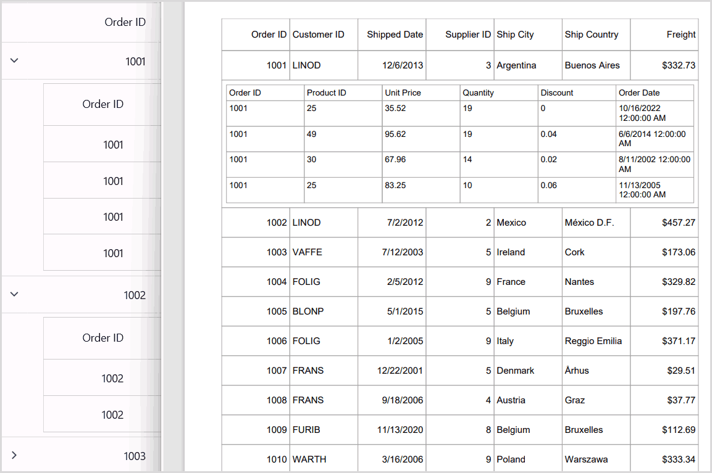
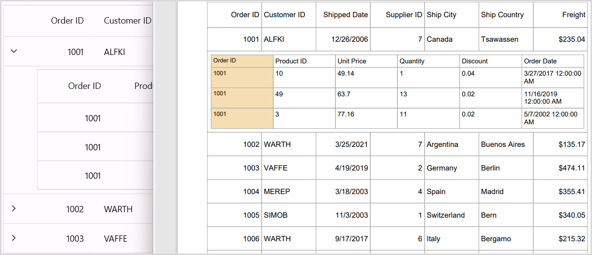
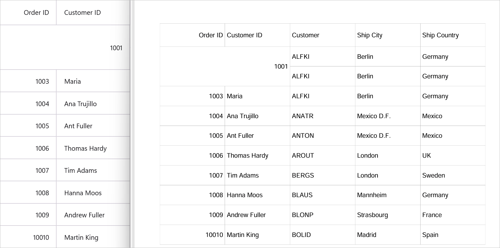

# Export To PDF in MAUI DataGrid (SfDataGrid)

The [SfDataGrid](https://help.syncfusion.com/cr/maui/Syncfusion.Maui.DataGrid.SfDataGrid.html) offers comprehensive support for exporting data to PDF, providing a range of customization options to suit your specific needs. This feature allows you to personalize the exported PDF's appearance, exclude specific columns or headers, and even define custom row heights and column widths, among other possibilities.

To quickly get started with export to PDF in [.NET MAUI DataGrid](https://www.syncfusion.com/maui-controls/maui-datagrid), watch this video:

<style>#MAUIDataGridVideoTutorial{width : 90% !important; height: 400px !important }</style> <iframe id='MAUIDataGridVideoTutorial' src='https://www.youtube.com/embed/h8c_qnnG7iE'></iframe>

To export the SfDataGrid to a PDF file, install the following NuGet package:

<table>
<tr>
<th> Project </th>
<th> Required package </th>
</tr>
<tr>
<td> .NET MAUI </td>
<td> Syncfusion.Maui.DataGridExport</td>
</tr>
</table>

## Implement SaveService Class

Create a platform-agnostic SaveService class in your portable project with partial methods that will be implemented for each platform (Windows, Android, iOS, MacCatalyst). This helper class handles saving and viewing PDF files across all platforms.

### Step 1: Create the Base SaveService Class

Add a new class file named `SaveService.cs` to your portable project root and add the following code:



namespace GettingStarted
{
  public partial class SaveService
  {
    //Method to save document as a file and view the saved document.
    public partial void SaveAndView(string filename, string contentType, MemoryStream stream);
  }
}



### Step 2: Implement Windows Platform

Add a new partial class file named `SaveService.cs` under `Platforms/Windows/` directory to save and view PDF documents on Windows:



using Microsoft.Maui.Controls;
using System;
using System.Collections.Generic;
using System.IO;
using System.Threading.Tasks;
using Windows.Storage;
using Windows.Storage.Pickers;
using Windows.Storage.Streams;
using Windows.UI.Popups;

namespace GettingStarted
{
    public partial class SaveService
    {
        public async partial void SaveAndView(string filename, string contentType, MemoryStream stream)
        {
            StorageFile stFile;
            string extension = Path.GetExtension(filename);
            //Gets process windows handle to open the dialog in application process. 
            IntPtr windowHandle = System.Diagnostics.Process.GetCurrentProcess().MainWindowHandle;
            if (!Windows.Foundation.Metadata.ApiInformation.IsTypePresent("Windows.Phone.UI.Input.HardwareButtons"))
            {
                //Creates file save picker to save a file. 
                FileSavePicker savePicker = new();
                if (extension == ".pdf")
                {
                    savePicker.DefaultFileExtension = ".pdf";
                    savePicker.SuggestedFileName = filename;
 
                    //Saves the file as Pdf file.
                    savePicker.FileTypeChoices.Add("PDF", new List<string>() { ".pdf" });
                }
                WinRT.Interop.InitializeWithWindow.Initialize(savePicker, windowHandle);
                stFile = await savePicker.PickSaveFileAsync();
            }
            else
            {
                StorageFolder local = ApplicationData.Current.LocalFolder;
                stFile = await local.CreateFileAsync(filename, CreationCollisionOption.ReplaceExisting);
            }
            if (stFile != null)
            {
                using (IRandomAccessStream zipStream = await stFile.OpenAsync(FileAccessMode.ReadWrite))
                {
                    //Writes compressed data from memory to file.
                    using Stream outstream = zipStream.AsStreamForWrite();
                    outstream.SetLength(0);
                    //Saves the stream as file.
                    byte[] buffer = stream.ToArray();
                    outstream.Write(buffer, 0, buffer.Length);
                    outstream.Flush();
                }
                //Create message dialog box. 
                MessageDialog msgDialog = new("Do you want to view the document?", "File has been created successfully");
                UICommand yesCmd = new("Yes");
                msgDialog.Commands.Add(yesCmd);
                UICommand noCmd = new("No");
                msgDialog.Commands.Add(noCmd);

                WinRT.Interop.InitializeWithWindow.Initialize(msgDialog, windowHandle);

                //Showing a dialog box. 
                IUICommand cmd = await msgDialog.ShowAsync();
                if (cmd.Label == yesCmd.Label)
                {
                    //Launch the saved file. 
                    await Windows.System.Launcher.LaunchFileAsync(stFile);
                }
            }
        }
    }
}




### Step 3: Implement Android Platform

Add a new partial class file named `SaveService.cs` under `Platforms/Android/` directory to save and view PDF documents on Android:



using Android.Content;
using Android.OS;
using Java.IO;
using System;
using System.IO;
using System.Threading.Tasks;

namespace GettingStarted
{
    public partial class SaveService
    {
        public partial void SaveAndView(string filename, string contentType, MemoryStream stream)
        {
            string exception = string.Empty;
            string? root = System.Environment.GetFolderPath(System.Environment.SpecialFolder.MyDocuments);

            Java.IO.File myDir = new(root + "/Syncfusion");
            myDir.Mkdir();

            Java.IO.File file = new(myDir, filename);

            if (file.Exists())
            {
                file.Delete();
            }

            try
            {
                FileOutputStream outs = new(file);
                outs.Write(stream.ToArray());

                outs.Flush();
                outs.Close();
            }
            catch (Exception e)
            {
                exception = e.ToString();
            }
            if (file.Exists())
            {

                if (Build.VERSION.SdkInt >= Android.OS.BuildVersionCodes.N)
                {
                    var fileUri = AndroidX.Core.Content.FileProvider.GetUriForFile(Android.App.Application.Context, Android.App.Application.Context.PackageName + ".provider", file);
                    var intent = new Intent(Intent.ActionView);
                    intent.SetData(fileUri);
                    intent.AddFlags(ActivityFlags.NewTask);
                    intent.AddFlags(ActivityFlags.GrantReadUriPermission);
                    Android.App.Application.Context.StartActivity(intent);
                }
                else
                {
                    var fileUri = Android.Net.Uri.Parse(file.AbsolutePath);
                    var intent = new Intent(Intent.ActionView);
                    intent.SetDataAndType(fileUri, contentType);
                    intent = Intent.CreateChooser(intent, "Open File");
                    intent!.AddFlags(ActivityFlags.NewTask);
                    Android.App.Application.Context.StartActivity(intent);
                }

            }
        }
    }
}



Create a new XML file named `provider_path.xml` under **Resources → xml** folder of the Android project and add the following code:



<?xml version="1.0" encoding="UTF-8" ?>
<paths xmlns:android="http://schemas.android.com/apk/res/android">
   <external-path name="external_files" path="."/>
</paths>



Add the following code to the `AndroidManifest.xml` file located under **Properties** folder:



<?xml version="1.0" encoding="utf-8"?>
<manifest xmlns:android="http://schemas.android.com/apk/res/android">
	<application android:allowBackup="true" android:icon="@mipmap/appicon" android:roundIcon="@mipmap/appicon_round" android:supportsRtl="true">
		<provider
        android:name="androidx.core.content.FileProvider"
        android:authorities="${applicationId}.provider"
        android:exported="false"
        android:grantUriPermissions="true">
			<meta-data
				android:name="android.support.FILE_PROVIDER_PATHS"
				android:resource="@xml/file_paths" />
		</provider>
	</application>
	<uses-permission android:name="android.permission.ACCESS_NETWORK_STATE" />
	<uses-permission android:name="android.permission.INTERNET" />
</manifest>



### Step 4: Implement iOS Platform

Add a new partial class file named `SaveService.cs` under `Platforms/iOS/` directory to save and view PDF documents on iOS:



using QuickLook;
using System;
using System.IO;
using System.Threading.Tasks;
using UIKit;

namespace GettingStarted
{
    public partial class SaveService
    {
        public partial void SaveAndView(string filename, string contentType, MemoryStream stream)
        {
            string exception = string.Empty;
            string path = Environment.GetFolderPath(Environment.SpecialFolder.Personal);
            string filePath = Path.Combine(path, filename);
            try
            {
                FileStream fileStream = File.Open(filePath, FileMode.Create);
                stream.Position = 0;
                stream.CopyTo(fileStream);
                fileStream.Flush();
                fileStream.Close();
            }
            catch (Exception e)
            {
                exception = e.ToString();
            }
            if (contentType != "application/html" || exception == string.Empty)
            {
                //Added this code to resolve the warning thrown when CI compiles.
                UIViewController? currentController = UIApplication.SharedApplication.ConnectedScenes.OfType<UIWindowScene>().SelectMany(scene => scene.Windows).FirstOrDefault(window => window.IsKeyWindow)!.RootViewController;
                while (currentController!.PresentedViewController != null)
                    currentController = currentController.PresentedViewController;

                QLPreviewController qlPreview = new();
                QLPreviewItem item = new QLPreviewItemBundle(filename, filePath);
                qlPreview.DataSource = new PreviewControllerDS(item);
                currentController.PresentViewController((UIViewController)qlPreview, true, null);
            }
        }
    }
    public class QLPreviewItemFileSystem : QLPreviewItem
    {
        readonly string _fileName, _filePath;

        public QLPreviewItemFileSystem(string fileName, string filePath)
        {
            _fileName = fileName;
            _filePath = filePath;
        }

        public override string PreviewItemTitle
        {
            get
            {
                return _fileName;
            }
        }
        public override NSUrl PreviewItemUrl
        {
            get
            {
                return NSUrl.FromFilename(_filePath);
            }
        }
    }

    public class QLPreviewItemBundle : QLPreviewItem
    {
        readonly string _fileName, _filePath;
        public QLPreviewItemBundle(string fileName, string filePath)
        {
            _fileName = fileName;
            _filePath = filePath;
        }

        public override string PreviewItemTitle
        {
            get
            {
                return _fileName;
            }
        }
        public override NSUrl PreviewItemUrl
        {
            get
            {
                var documents = NSBundle.MainBundle.BundlePath;
                var lib = Path.Combine(documents, _filePath);
                var url = NSUrl.FromFilename(lib);
                return url;
            }
        }
    }


    public class PreviewControllerDS : QLPreviewControllerDataSource
    {
        private readonly QLPreviewItem _item;

        public PreviewControllerDS(QLPreviewItem item)
        {
            _item = item;
        }

        public override nint PreviewItemCount(QLPreviewController controller)
        {
            return (nint)1;
        }

        public override IQLPreviewItem GetPreviewItem(QLPreviewController controller, nint index)
        {
            return _item;
        }
    }
}



### Step 5: Implement MacCatalyst Platform

Add a new partial class file named `SaveService.cs` under `Platforms/MacCatalyst/` directory to save and view PDF documents on Mac:



using Foundation;
using QuickLook;
using System;
using System.IO;
using System.Threading.Tasks;
using UIKit;

namespace GettingStarted
{
    public partial class SaveService
    {
        public partial void SaveAndView(string filename, string contentType, MemoryStream stream)
        {
            string path = Environment.GetFolderPath(Environment.SpecialFolder.MyDocuments);
            string filePath = Path.Combine(path, filename);
            stream.Position = 0;
            //Saves the document
            using FileStream fileStream = new(filePath, FileMode.Create, FileAccess.ReadWrite);
            stream.CopyTo(fileStream);
            fileStream.Flush();
            fileStream.Dispose();
            //Launch the file
            //Added this code to resolve the warning thrown when CI compiles.
            UIViewController? currentController = UIApplication.SharedApplication.ConnectedScenes.OfType<UIWindowScene>().SelectMany(scene => scene.Windows).FirstOrDefault(window => window.IsKeyWindow)!.RootViewController;
            while (currentController!.PresentedViewController != null)
                currentController = currentController.PresentedViewController;
            UIView? currentView = currentController.View;

            QLPreviewController qlPreview = new();
            QLPreviewItem item = new QLPreviewItemBundle(filename, filePath);
            qlPreview.DataSource = new PreviewControllerDS(item);
            currentController.PresentViewController((UIViewController)qlPreview, true, null);
        }
    }
}
public class QLPreviewItemFileSystem : QLPreviewItem
{
    readonly string _fileName, _filePath;

    public QLPreviewItemFileSystem(string fileName, string filePath)
    {
        _fileName = fileName;
        _filePath = filePath;
    }

    public override string PreviewItemTitle
    {
        get
        {
            return _fileName;
        }
    }
    public override NSUrl PreviewItemUrl
    {
        get
        {
            return NSUrl.FromFilename(_filePath);
        }
    }
}

public class QLPreviewItemBundle : QLPreviewItem
{
    readonly string _fileName, _filePath;
    public QLPreviewItemBundle(string fileName, string filePath)
    {
        _fileName = fileName;
        _filePath = filePath;
    }

    public override string PreviewItemTitle
    {
        get
        {
            return _fileName;
        }
    }
    public override NSUrl PreviewItemUrl
    {
        get
        {
            var documents = NSBundle.MainBundle.BundlePath;
            var lib = Path.Combine(documents, _filePath);
            var url = NSUrl.FromFilename(lib);
            return url;
        }
    }
}

public class PreviewControllerDS : QLPreviewControllerDataSource
{
    private readonly QLPreviewItem _item;

    public PreviewControllerDS(QLPreviewItem item)
    {
        _item = item;
    }

    public override nint PreviewItemCount(QLPreviewController controller)
    {
        return (nint)1;
    }

    public override IQLPreviewItem GetPreviewItem(QLPreviewController controller, nint index)
    {
        return _item;
    }
}



You can export the SfDataGrid to PDF by using the extension methods provided in the `Syncfusion.Maui.DataGrid.Exporting` namespace:

* `ExportToPdf`
* `ExportToPdfGrid`

The following code illustrates how to create and display a SfDataGrid in a view:



<StackLayout>
    <Button Text="Export" Clicked="ExportToPDF_Clicked"/>
    <syncfusion:SfDataGrid  x:Name="dataGrid"
                            AutoGenerateColumnsMode="None"
                            VerticalOptions="FillAndExpand"
                            ColumnWidthMode="Auto"
                            ItemsSource="{Binding OrderInfoCollection}" >
        <syncfusion:SfDataGrid.Columns>
            <syncfusion:DataGridNumericColumn MappingName="OrderID" HeaderText="Order ID" Format="d"/>
            <syncfusion:DataGridTextColumn MappingName="CustomerID" HeaderText="Customer ID"/>
            <syncfusion:DataGridTextColumn MappingName="Customer" HeaderText="Customer"/>
            <syncfusion:DataGridTextColumn MappingName="ShipCountry" HeaderText="Ship Country"/>
            <syncfusion:DataGridTextColumn MappingName="ShipCity" HeaderText="Ship City"/>
        </syncfusion:SfDataGrid.Columns>
    </syncfusion:SfDataGrid>
</StackLayout>



## ExportToPdf

To export the data to PDF, you can use the [DataGridPdfExportingController.ExportToPdf](https://help.syncfusion.com/cr/maui/Syncfusion.Maui.DataGrid.Exporting.DataGridPdfExportingController.html#Syncfusion_Maui_DataGrid_Exporting_DataGridPdfExportingController_ExportToPdf_Syncfusion_Maui_DataGrid_SfDataGrid_) method, which requires passing the SfDataGrid as an argument.




private void ExportToPDF_Clicked(object sender, EventArgs e)
{
    MemoryStream stream = new MemoryStream();
    DataGridPdfExportingController pdfExport = new DataGridPdfExportingController();
    DataGridPdfExportingOption option = new DataGridPdfExportingOption();
    var pdfDoc = new PdfDocument();
    pdfDoc = pdfExport.ExportToPdf(this.dataGrid, option);
    pdfDoc.Save(stream);
    pdfDoc.Close(true);
    SaveService saveService = new();
    saveService.SaveAndView("ExportFeature.pdf", "application/pdf", stream);
}




## ExportToPdfGrid

Alternatively, you can use the [DataGridPdfExportingController.ExportToPdfGrid](https://help.syncfusion.com/cr/maui/Syncfusion.Maui.DataGrid.Exporting.DataGridPdfExportingController.html#Syncfusion_Maui_DataGrid_Exporting_DataGridPdfExportingController_ExportToPdfGrid_Syncfusion_Maui_DataGrid_SfDataGrid_Syncfusion_Maui_Data_ICollectionViewAdv_Syncfusion_Maui_DataGrid_Exporting_DataGridPdfExportingOption_Syncfusion_Pdf_PdfDocument_) method to export the data to PDF. This method also requires passing the SfDataGrid as an argument.



private void ExportToPDF_Clicked(object sender, EventArgs e)
{
    DataGridPdfExportingController pdfExport = new DataGridPdfExportingController();
    MemoryStream stream = new MemoryStream();
    var pdfDoc = new PdfDocument();
    PdfPage page = pdfDoc.Pages.Add();
    var exportToPdfGrid = pdfExport.ExportToPdfGrid(this.dataGrid, this.dataGrid.View, new DataGridPdfExportingOption()
    {
        CanFitAllColumnsInOnePage = false,

    }, pdfDoc);
    exportToPdfGrid.Draw(page, new Syncfusion.Drawing.PointF(10, 10));
    pdfDoc.Save(stream);
    pdfDoc.Close(true);
    SaveService saveService = new();
    saveService.SaveAndView("ExportFeature.pdf", "application/pdf", stream);
}




> **Note:** SfDataGrid cannot export the `DataGridTemplateColumn` to PDF or Excel due to the inability to access the loaded views and accurately capture their content and layout in a specific range and value from the `DataGridTemplateColumn`.

## Exporting options

### Exclude columns when exporting

By default, all columns, including hidden columns, are exported to PDF in the SfDataGrid. If you want to exclude specific columns during PDF export, you can add those columns to the [DataGridPdfExportingOption.ExcludeColumns](https://help.syncfusion.com/cr/maui/Syncfusion.Maui.DataGrid.Exporting.DataGridPdfExportingOption.html#Syncfusion_Maui_DataGrid_Exporting_DataGridPdfExportingOption_ExcludeColumns) list.



DataGridPdfExportingOption option = new DataGridPdfExportingOption();
var list = new List<string>();
list.Add("OrderID");
list.Add("CustomerID");
option.ExcludedColumns = list;




### Obtaining a PDF document

The [DataGridPdfExportingOption.PdfDocument](https://help.syncfusion.com/cr/maui/Syncfusion.Maui.DataGrid.Exporting.DataGridPdfExportingOption.html#Syncfusion_Maui_DataGrid_Exporting_DataGridPdfExportingOption_PdfDocument) enables the export of the SfDataGrid to either an existing or a new PDF document.



DataGridPdfExportingOption option = new DataGridPdfExportingOption();
PdfDocument pdfDocument = new PdfDocument();
pdfDocument.Pages.Add();
pdfDocument.Pages.Add();
pdfDocument.Pages.Add();
option.StartPageIndex = 1;
option.PdfDocument = pdfDocument;



### Obtaining columns for customization

By utilizing the property `Columns`, you can retrieve or modify the `System.Collections.IEnumerable columns` collection, which includes all the columns intended for export. Any columns listed in the ExcludedColumns List will not be included in the Columns collection.

### Column header on each page

To display or conceal the column headers on every page of the exported PDF document, you can use the [DataGridPdfExportingOption.CanRepeatHeaders](https://help.syncfusion.com/cr/maui/Syncfusion.Maui.DataGrid.Exporting.DataGridPdfExportingOption.html#Syncfusion_Maui_DataGrid_Exporting_DataGridPdfExportingOption_CanRepeatHeaders) property. By default, its value is set to true.



DataGridPdfExportingOption option = new DataGridPdfExportingOption();
option.CanRepeatHeaders = true;




### Customize header, stacked header, groups, table summary and unbound row when exporting

#### Export groups

By default, all the groups in the data grid will be exported to PDF document. To export the data grid without groups, set the [DataGridPdfExportingOption.CanExportGroups](https://help.syncfusion.com/cr/maui/Syncfusion.Maui.DataGrid.Exporting.DataGridPdfExportingOption.html#Syncfusion_Maui_DataGrid_Exporting_DataGridPdfExportingOption_CanExportGroups) property to `false`.



DataGridPdfExportingOption option = new DataGridPdfExportingOption();
option.CanExportGroups = true;




#### Exclude column headers when exporting

By default, the column headers will be exported to the PDF document. To export the SfDataGrid without column headers, set the [DataGridPdfExportingOption.CanExportHeader](https://help.syncfusion.com/cr/maui/Syncfusion.Maui.DataGrid.Exporting.DataGridPdfExportingOption.html#Syncfusion_Maui_DataGrid_Exporting_DataGridPdfExportingOption_CanExportHeader) property to `false`.



DataGridPdfExportingOption option = new DataGridPdfExportingOption();
option.CanExportHeader = false;




#### Export stacked headers

By default, stacked column headers will not be exported to the PDF document. To export the SfDataGrid with stacked headers, set the [DataGridPdfExportingOption.CanExportStackedHeaders](https://help.syncfusion.com/cr/maui/Syncfusion.Maui.DataGrid.Exporting.DataGridPdfExportingOption.html#Syncfusion_Maui_DataGrid_Exporting_DataGridPdfExportingOption_CanExportStackedHeaders) property to `true`.



DataGridPdfExportingOption option = new DataGridPdfExportingOption();
option.CanExportStackedHeaders = true;




#### Export table summaries

By default, table summaries will be exported to the PDF document. To exclude table summaries when exporting the SfDataGrid, set the [DataGridPdfExportingOption.CanExportTableSummary](https://help.syncfusion.com/cr/maui/Syncfusion.Maui.DataGrid.Exporting.DataGridPdfExportingOption.html#Syncfusion_Maui_DataGrid_Exporting_DataGridPdfExportingOption_CanExportTableSummary) property to `false`.



DataGridPdfExportingOption option = new DataGridPdfExportingOption();
option.CanExportTableSummary = true;




#### Export group summaries

By default, group summary rows will be exported to the PDF document. To exclude group summaries when exporting the SfDataGrid, set the [DataGridPdfExportingOption.CanExportGroupSummary](https://help.syncfusion.com/cr/maui/Syncfusion.Maui.DataGrid.Exporting.DataGridPdfExportingOption.html#Syncfusion_Maui_DataGrid_Exporting_DataGridPdfExportingOption_CanExportGroupSummary) property to `false`.



DataGridPdfExportingOption option = new DataGridPdfExportingOption();
option.CanExportGroupSummary = true;




#### Export unbound rows

By default, unbound rows will not be exported to the PDF document. To include unbound rows when exporting the SfDataGrid, set the [DataGridPdfExportingOption.CanExportUnboundRow](https://help.syncfusion.com/cr/maui/Syncfusion.Maui.DataGrid.Exporting.DataGridPdfExportingOption.html#Syncfusion_Maui_DataGrid_Exporting_DataGridPdfExportingOption_CanExportUnboundRows) property to `true`.



DataGridPdfExportingOption option = new DataGridPdfExportingOption();
option.CanExportUnboundRow = true;




#### Exporting the selected rows of SfDataGrid

The SfDataGrid allows you to export only the currently selected rows in the grid to a document using the `DataGridPdfExportingController.ExportToPdf` method. To achieve this, you need to pass the instance of the SfDataGrid and the [SfDataGrid.SelectedRows](https://help.syncfusion.com/cr/maui/Syncfusion.Maui.DataGrid.SfDataGrid.html#Syncfusion_Maui_DataGrid_SfDataGrid_SelectedRowsProperty) collection as arguments to the method.

Please refer to the code below for exporting only the selected rows to a PDF document:



ObservableCollection<object> selectedItems = dataGrid.SelectedRows;
var pdfDoc = pdfExport.ExportToPdf(this.dataGrid, selectedItems);



### Export all columns on one page

To fit all columns on a single page when exporting, set the [DataGridPdfExportingOption.CanFitAllColumnsInOnePage](https://help.syncfusion.com/cr/maui/Syncfusion.Maui.DataGrid.Exporting.DataGridPdfExportingOption.html#Syncfusion_Maui_DataGrid_Exporting_DataGridPdfExportingOption_CanFitAllColumnsInOnePage) property to `true`.



DataGridPdfExportingOption option = new DataGridPdfExportingOption();
option.CanFitAllColumnsInOnePage = true;




### Exporting from a specific page and position

The SfDataGrid allows exporting data to a specific starting position on a particular PDF page using the following options:

* **StartPageIndex** — Start exporting on a specific page number
* **StartPoint** — Start exporting at specific x, y coordinates

#### StartPageIndex

Use the [DataGridPdfExportingOption.StartPageIndex](https://help.syncfusion.com/cr/maui/Syncfusion.Maui.DataGrid.Exporting.DataGridPdfExportingOption.html#Syncfusion_Maui_DataGrid_Exporting_DataGridPdfExportingOption_StartPageIndex) property to export data starting from a specific page number:



DataGridPdfExportingOption option = new DataGridPdfExportingOption();
option.StartPageIndex = 2;



#### StartPoint

Use the [DataGridPdfExportingOption.StartPoint](https://help.syncfusion.com/cr/maui/Syncfusion.Maui.DataGrid.Exporting.DataGridPdfExportingOption.html#Syncfusion_Maui_DataGrid_Exporting_DataGridPdfExportingOption_StartPoint) property to export data starting at specific x, y coordinates on a PDF page:



DataGridPdfExportingOption option = new DataGridPdfExportingOption();
option.StartPoint = new Syncfusion.Drawing.PointF(0, 500);




### Applying styles while exporting

To apply the DataGrid's default style to the exported PDF, set the [DataGridPdfExportingOption.CanApplyGridStyle](https://help.syncfusion.com/cr/maui/Syncfusion.Maui.DataGrid.Exporting.DataGridPdfExportingOption.html#Syncfusion_Maui_DataGrid_Exporting_DataGridPdfExportingOption_CanApplyGridStyle) property to `true`. By default, data is exported without applying the grid's style.



DataGridPdfExportingOption option = new DataGridPdfExportingOption();
option.CanApplyGridStyle = true;




You can also export alternate row colors by setting [AlternateRowBackground](https://help.syncfusion.com/cr/maui/Syncfusion.Maui.DataGrid.DataGridStyle.html#Syncfusion_Maui_DataGrid_DataGridStyle_AlternateRowBackground) in `SfDataGrid.DefaultStyle` and [DataGridPdfExportingOption.CanApplyGridStyle](https://help.syncfusion.com/cr/maui/Syncfusion.Maui.DataGrid.Exporting.DataGridPdfExportingOption.html#Syncfusion_Maui_DataGrid_Exporting_DataGridPdfExportingOption_CanApplyGridStyle) to `true`.


You can customize the following styles when exporting to PDF:

* `HeaderStyle` — Column header cells
* `RecordStyle` — Data record cells
* `TopTableSummaryStyle` — Top table summary rows
* `BottomTableSummaryStyle` — Bottom table summary rows
* `GroupCaptionStyle` — Group caption rows
* `GroupSummaryStyle` — Group summary rows

#### HeaderStyle

The SfDataGrid allows exporting the column headers with custom style by using the [DataGridPdfExportingOption.HeaderStyle](https://help.syncfusion.com/cr/maui/Syncfusion.Maui.DataGrid.Exporting.DataGridPdfExportingOption.html#Syncfusion_Maui_DataGrid_Exporting_DataGridPdfExportingOption_HeaderStyle) property.



DataGridPdfExportingOption option = new DataGridPdfExportingOption();
option.HeaderStyle = new PdfGridCellStyle()
{
    BackgroundBrush = PdfBrushes.Yellow,
    Borders = new PdfBorders() { Bottom = PdfPens.Aqua, Left = PdfPens.AliceBlue, Right = PdfPens.Red, Top = PdfPens.RoyalBlue },
    CellPadding = new PdfPaddings(2, 2, 2, 2),
    TextBrush = PdfBrushes.Red,
    TextPen = PdfPens.Green,
    StringFormat = new PdfStringFormat() { Alignment = PdfTextAlignment.Right, CharacterSpacing = 3f, WordSpacing = 10f }
};




#### RecordStyle

The SfDataGrid allows exporting records with a custom style by using the [DataGridPdfExportingOption.RecordStyle](https://help.syncfusion.com/cr/maui/Syncfusion.Maui.DataGrid.Exporting.DataGridPdfExportingOption.html#Syncfusion_Maui_DataGrid_Exporting_DataGridPdfExportingOption_RecordStyle) property.




 DataGridPdfExportingOption option = new DataGridPdfExportingOption();
option.RecordStyle = new PdfGridCellStyle()
{
    BackgroundBrush = PdfBrushes.Red,
    Borders = new PdfBorders() { Bottom = PdfPens.Aqua, Left = PdfPens.AliceBlue, Right = PdfPens.Red, Top = PdfPens.RoyalBlue },
    CellPadding = new PdfPaddings(2, 2, 2, 2),
    TextBrush = PdfBrushes.White,
    TextPen = PdfPens.Green,
    StringFormat = new PdfStringFormat() { Alignment = PdfTextAlignment.Right, CharacterSpacing = 3f, WordSpacing = 10f }
};



#### TopTableSummaryStyle

The SfDataGrid supports exporting the top table summary with custom style by using the [DataGridPdfExportingOption.TopTableSummaryStyle](https://help.syncfusion.com/cr/maui/Syncfusion.Maui.DataGrid.Exporting.DataGridPdfExportingOption.html#Syncfusion_Maui_DataGrid_Exporting_DataGridPdfExportingOption_TopTableSummaryStyle) property.



DataGridPdfExportingOption option = new DataGridPdfExportingOption();
 option.TopTableSummaryStyle = new PdfGridCellStyle()
{
    BackgroundBrush = PdfBrushes.Gray,
    Borders = new PdfBorders() { Bottom = PdfPens.AliceBlue, Left = PdfPens.AliceBlue, Right = PdfPens.AliceBlue, Top = PdfPens.AliceBlue },
    CellPadding = new PdfPaddings(5,5,5,5),
    TextBrush = PdfBrushes.White,
    TextPen = PdfPens.White,
    StringFormat = new PdfStringFormat() { Alignment = PdfTextAlignment.Center, CharacterSpacing = 3f, WordSpacing = 10f }
};




#### BottomTableSummaryStyle

The SfDataGrid supports exporting the bottom table summary with custom style by using the [DataGridPdfExportingOption.BottomTableSummaryStyle](https://help.syncfusion.com/cr/maui/Syncfusion.Maui.DataGrid.Exporting.DataGridPdfExportingOption.html#Syncfusion_Maui_DataGrid_Exporting_DataGridPdfExportingOption_BottomTableSummaryStyle) property.



DataGridPdfExportingOption option = new DataGridPdfExportingOption();
option.BottomTableSummaryStyle = new PdfGridCellStyle()
{
    BackgroundBrush = PdfBrushes.Gray,
    Borders = new PdfBorders() { Bottom = PdfPens.AliceBlue, Left = PdfPens.AliceBlue, Right = PdfPens.AliceBlue, Top = PdfPens.AliceBlue },
    CellPadding = new PdfPaddings(5,5,5,5),
    TextBrush = PdfBrushes.White,
    TextPen = PdfPens.White,
    StringFormat = new PdfStringFormat() { Alignment = PdfTextAlignment.    Center, CharacterSpacing = 3f, WordSpacing = 10f }
};




#### GroupCaptionStyle

The SfDataGrid supports exporting the group caption summaries with custom style by using the [DataGridPdfExportingOption.GroupCaptionStyle](https://help.syncfusion.com/cr/maui/Syncfusion.Maui.DataGrid.Exporting.DataGridPdfExportingOption.html#Syncfusion_Maui_DataGrid_Exporting_DataGridPdfExportingOption_GroupCaptionStyle) property.



DataGridPdfExportingOption option = new DataGridPdfExportingOption();
option.GroupCaptionStyle = new PdfGridCellStyle()
{
    BackgroundBrush = PdfBrushes.Gray,
    Borders = new PdfBorders() { Bottom = PdfPens.AliceBlue, Left = PdfPens.AliceBlue, Right = PdfPens.AliceBlue, Top = PdfPens.AliceBlue },
    CellPadding = new PdfPaddings(5,5,5,5),
    TextBrush = PdfBrushes.White,
    TextPen = PdfPens.White,
    StringFormat = new PdfStringFormat() { Alignment = PdfTextAlignment.Center, CharacterSpacing = 10f, WordSpacing = 10f }
};




#### GroupSummaryStyle

`SfDataGrid` supports exporting `GroupSummary` rows with custom style by using the [DataGridPdfExportingOption.GroupSummaryStyle](https://help.syncfusion.com/cr/maui/Syncfusion.Maui.DataGrid.Exporting.DataGridPdfExportingOption.html#Syncfusion_Maui_DataGrid_Exporting_DataGridPdfExportingOption_GroupSummaryStyle) property.



DataGridPdfExportingOption option = new DataGridPdfExportingOption();
option.GroupSummaryStyle = new PdfGridCellStyle()
{
    BackgroundBrush = PdfBrushes.Green,
    TextBrush = PdfBrushes.Yellow,
    TextPen = PdfPens.White,
    StringFormat = new PdfStringFormat() { Alignment = PdfTextAlignment.Right, CharacterSpacing = 3f, WordSpacing = 10f }
};




### Customizing borders

The SfDataGrid provides the ability to customize grid borders by using the [DataGridPdfExportingOption.GridLineType](https://help.syncfusion.com/cr/maui/Syncfusion.Maui.DataGrid.Exporting.DataGridPdfExportingOption.html#Syncfusion_Maui_DataGrid_Exporting_DataGridPdfExportingOption_GridLineType) property.

#### Both

Set the `DataGridPdfExportingOption.GridLineType` to `GridLineType.Both` to export the data grid with both horizontal and vertical borders:



DataGridPdfExportingOption option = new DataGridPdfExportingOption();
option.GridLineType = GridLineType.Both;




#### Horizontal

Set the `DataGridPdfExportingOption.GridLineType` to `GridLineType.Horizontal` to export the data grid with horizontal borders only:



DataGridPdfExportingOption option = new DataGridPdfExportingOption();
option.GridLineType = GridLineType.Horizontal;




#### Vertical

Set the `DataGridPdfExportingOption.GridLineType` to `GridLineType.Vertical` to export the data grid with vertical borders only:



DataGridPdfExportingOption option = new DataGridPdfExportingOption();
option.GridLineType = GridLineType.Vertical;




#### None

Set the `DataGridPdfExportingOption.GridLineType` to `GridLineType.None` to export the data grid without any borders:



DataGridPdfExportingOption option = new DataGridPdfExportingOption();
option.GridLineType = GridLineType.None;




## Setting header and footer

The SfDataGrid allows you to include additional content at the top (header) or bottom (footer) of each page when exporting to PDF. This is achieved by handling the [DataGridPdfExportingController.HeaderAndFooterExporting](https://help.syncfusion.com/cr/maui/Syncfusion.Maui.DataGrid.Exporting.DataGridPdfExportingController.html#Syncfusion_Maui_DataGrid_Exporting_DataGridPdfExportingController_HeaderAndFooterExporting) event.

To insert a string in the header or footer, you need to use the `PdfHeaderFooterEventHandler`. By setting the `PdfPageTemplateElement` to `PdfHeaderFooterEventArgs.PdfDocumentTemplate.Top`, you can load the content at the top of the page. Similarly, setting the `PdfPageTemplateElement` to `PdfHeaderFooterEventArgs.PdfDocumentTemplate.Bottom` will load the content at the bottom of the page.



DataGridPdfExportingController pdfExport = new DataGridPdfExportingController();
pdfExport.HeaderAndFooterExporting += PdfExport_HeaderAndFooterExporting;
private void PdfExport_HeaderAndFooterExporting(object sender, DataGridPdfHeaderFooterEventArgs e)
{
    PdfFont font = new PdfStandardFont(PdfFontFamily.TimesRoman, 20f, PdfFontStyle.Bold);
    var width = e.PdfPage.GetClientSize().Width;
    PdfPageTemplateElement header = new PdfPageTemplateElement(width, 38);
    header.Graphics.DrawString("Order Details", font, PdfPens.Black, 70, 3);
    e.PdfDocumentTemplate.Top = header;

    PdfPageTemplateElement footer = new PdfPageTemplateElement(width, 38);
    footer.Graphics.DrawString("Order Details", font, PdfPens.Black, 70, 3);
    e.PdfDocumentTemplate.Bottom = footer;
}




## Change PDF page orientation

You can change the page orientation of a PDF document during the export process. The default page orientation is `portrait`.

To modify the page orientation, export the data grid using the `ExportToPdfGrid` method. Then, draw the PDF grid into a PDF document by setting the `PageSettings.Orientation` property of the PDF document:



var pdfDoc = new PdfDocument();
option.PdfDocument = pdfDoc;
pdfDoc.PageSettings.Orientation = PdfPageOrientation.Landscape;




## Row height and column width customization

### ExportColumnWidth

By default, columns are exported using the [DataGridPdfExportingOption.DefaultColumnWidth](https://help.syncfusion.com/cr/maui/Syncfusion.Maui.DataGrid.Exporting.DataGridPdfExportingOption.html#Syncfusion_Maui_DataGrid_Exporting_DataGridPdfExportingOption_DefaultColumnWidth) value. To export with the actual column widths from the data grid, set [DataGridPdfExportingOption.CanExportColumnWidth](https://help.syncfusion.com/cr/maui/Syncfusion.Maui.DataGrid.Exporting.DataGridPdfExportingOption.html#Syncfusion_Maui_DataGrid_Exporting_DataGridPdfExportingOption_CanExportColumnWidth) to `true`:



DataGridPdfExportingOption option = new DataGridPdfExportingOption();
option.CanExportColumnWidth = true;



### ExportRowHeight

By default, rows are exported using the [DataGridPdfExportingOption.DefaultRowHeight](https://help.syncfusion.com/cr/maui/Syncfusion.Maui.DataGrid.Exporting.DataGridPdfExportingOption.html#Syncfusion_Maui_DataGrid_Exporting_DataGridPdfExportingOption_DefaultRowHeight) value. To export with the actual row heights from the data grid, set [DataGridPdfExportingOption.CanExportRowHeight](https://help.syncfusion.com/cr/maui/Syncfusion.Maui.DataGrid.Exporting.DataGridPdfExportingOption.html#Syncfusion_Maui_DataGrid_Exporting_DataGridPdfExportingOption_CanExportRowHeight) to `true`:



DataGridPdfExportingOption option = new DataGridPdfExportingOption();
option.CanExportRowHeight = true;



### DefaultColumnWidth

The SfDataGrid allows customizing column width in the PDF document using the `DataGridPdfExportingOption.DefaultColumnWidth` property. This value will be applied to all columns in the exported PDF:



DataGridPdfExportingOption option = new DataGridPdfExportingOption();
option.DefaultColumnWidth = 150;
option.CanExportColumnWidth = false;



### DefaultRowHeight

The SfDataGrid allows customizing row height in the PDF document using the `DataGridPdfExportingOption.DefaultRowHeight` property. This value will be applied to all rows in the exported PDF:



DataGridPdfExportingOption option = new DataGridPdfExportingOption();
option.DefaultRowHeight = 80;
option.CanExportRowHeight = true;



## Events

The SfDataGrid provides the following events during the export process:

* `RowExporting` — Raised when a row is being exported; allows customization of row styles
* `CellExporting` — Raised when a cell is being exported; allows customization of cell styles

### RowExporting

The `RowExporting` event is triggered with [DataGridRowPdfExportingEventArgs](https://help.syncfusion.com/cr/maui/Syncfusion.Maui.DataGrid.Exporting.DataGridRowPdfExportingEventArgs.html), which contains the following properties:

* [PdfGrid](https://help.syncfusion.com/cr/maui/Syncfusion.Maui.DataGrid.Exporting.DataGridRowPdfExportingEventArgs.html#Syncfusion_Maui_DataGrid_Exporting_DataGridRowPdfExportingEventArgs_PdfGrid): Customizes the properties of the pdfGrid, such as `Background`, `CellPadding`, `CellSpacing`, and more.
* [PdfRow](https://help.syncfusion.com/cr/maui/Syncfusion.Maui.DataGrid.Exporting.DataGridRowPdfExportingEventArgs.html#Syncfusion_Maui_DataGrid_Exporting_DataGridRowPdfExportingEventArgs_PdfRow): Specifies the `PDFGridRow` to be exported and allows customization of the properties of a particular row.
* [Record](https://help.syncfusion.com/cr/maui/Syncfusion.Maui.DataGrid.Exporting.DataGridRowPdfExportingEventArgs.html#Syncfusion_Maui_DataGrid_Exporting_DataGridRowPdfExportingEventArgs_Record): Retrieves the collection of exported underlying data objects.
* [RowType](https://help.syncfusion.com/cr/maui/Syncfusion.Maui.DataGrid.Exporting.DataGridRowPdfExportingEventArgs.html#Syncfusion_Maui_DataGrid_Exporting_DataGridRowPdfExportingEventArgs_RowType): Specifies the row type using the `ExportRowType` enum. It checks the row type and applies different styles based on the type.

Use this event to customize row styles during export. The following example demonstrates how to change the background color of record rows based on data values:



pdfExport.RowExporting += pdfExport_RowExporting; 
void pdfExport_RowExporting (object sender, DataGridRowPdfExportingEventArgs e)
{
    if (e.RowType == ExportRowType.Record) {
        if ((e.Record.Data as OrderInfo).IsClosed)
            e.PdfRow.Style.BackgroundBrush = PdfBrushes.Yellow;
        else
        e.PdfRow.Style.BackgroundBrush = PdfBrushes.LightGreen;
    }
}




### CellExporting

The `CellExporting` event is triggered with [DataGridCellPdfExportingEventArgs](https://help.syncfusion.com/cr/maui/Syncfusion.Maui.DataGrid.Exporting.DataGridCellPdfExportingEventArgs.html), which contains the following properties:

* **CellType** — Specifies the cell type (using `ExportCellType` enum) to apply different cell styles
* **CellValue** — Contains the exported cell value used to format the PDF
* **ColumnName** — Specifies the column name (MappingName) to apply formatting for specific columns
* **Handled** — Set to `true` to prevent the cell from being exported to PDF
* **PdfGridCell** — Specifies the `PDFGridCell` to be exported; customize properties like `Background`, `Foreground`, `Font`, `Alignment`, etc.
* **Record** — Retrieves the underlying data object for the exported cell

Use this event to customize cell styles during export. The example below demonstrates customizing background color, text color, and cell values for different cell types:



pdfExport.CellExporting += pdfExport_CellExporting;  
void pdfExport_CellExporting(object sender, DataGridCellPdfExportingEventArgs e)
{
    if (e.CellType == ExportCellType.HeaderCell)
    {
        e.PdfGridCell.Style.BackgroundBrush = PdfBrushes.Navy;
        e.PdfGridCell.Style.TextBrush = PdfBrushes.White;
        
    }

    if (e.CellType == ExportCellType.RecordCell)
    {
        e.PdfGridCell.Style.BackgroundBrush = PdfBrushes.LightBlue;
        e.PdfGridCell.Style.TextBrush = PdfBrushes.Black;
    }        
}




## Cell customization

### Customize cells based on column name

You can customize record cell styles for specific columns by handling the `CellExporting` event and checking the `ColumnName` property:



pdfExport.CellExporting += PdfExport_CellExporting;
private void PdfExport_CellExporting(object sender, DataGridCellPdfExportingEventArgs e)
{
    if (e.CellType == ExportCellType.RecordCell && e.ColumnName == "OrderID")
    {
        e.PdfGridCell.Style.TextBrush = PdfBrushes.LightBlue;
    }
}




## Exporting DetailsView

By default, [DetailsViewDataGrid](https://help.syncfusion.com/cr/maui/Syncfusion.Maui.DataGrid.DetailsViewDataGrid.html) rows are not exported to PDF. To export nested detail grids, set the [CanExportDetailsView](https://help.syncfusion.com/cr/maui/Syncfusion.Maui.DataGrid.Exporting.DataGridPdfExportingOption.html#Syncfusion_Maui_DataGrid_Exporting_DataGridPdfExportingOption_CanExportDetailsView) property to `true`:

```csharp
MemoryStream stream = new MemoryStream();
DataGridPdfExportingController pdfExport = new DataGridPdfExportingController();
DataGridPdfExportingOption option = new DataGridPdfExportingOption();
option.CanExportDetailsView = true;
var pdfDoc = pdfExport.ExportToPdf(this.dataGrid, option);
pdfDoc.Save(stream);
pdfDoc.Close(true);
SaveService saveService = new();
saveService.SaveAndView("ExportFeature.pdf", "application/pdf", stream);
```


By default, only expanded detail grids are exported. To export all detail grids regardless of expansion state, set [CanExportAllDetails](https://help.syncfusion.com/cr/maui/Syncfusion.Maui.DataGrid.Exporting.DataGridPdfExportingOption.html#Syncfusion_Maui_DataGrid_Exporting_DataGridPdfExportingOption_CanExportAllDetails) to `true`:

```csharp
MemoryStream stream = new MemoryStream();
DataGridPdfExportingController pdfExport = new DataGridPdfExportingController();
DataGridPdfExportingOption option = new DataGridPdfExportingOption();
option.CanExportDetailsView = true;
option.CanExportAllDetails = true;
var pdfDoc = pdfExport.ExportToPdf(this.dataGrid, option);
pdfDoc.Save(stream);
pdfDoc.Close(true);
SaveService saveService = new();
saveService.SaveAndView("ExportFeature.pdf", "application/pdf", stream);
```


Here, first record only expanded in SfDataGrid. But all the DetailsViewDataGrid’s are shown in exported PDF document.

You can customize its exporting operation by using [DataGridChildPdfExportingEventArgs](https://help.syncfusion.com/cr/maui/Syncfusion.Maui.DataGrid.Exporting.DataGridChildPdfExportingEventArgs.html).

> **Note:** While exporting DetailsViewDataGrid, [CanFitAllColumnInOnePage](https://help.syncfusion.com/cr/maui/Syncfusion.Maui.DataGrid.Exporting.DataGridPdfExportingOption.html#Syncfusion_Maui_DataGrid_Exporting_DataGridPdfExportingOption_CanFitAllColumnsInOnePage) is set to true internally as horizontal pagination is not supported for DetailsViewDataGrid.

### Excluding DetailsViewDataGrid while exporting

You can exclude particular DetailsViewDataGrid while exporting, by using the `DataGridChildPdfExportingEventArgs.Cancel`.

```csharp
private void Button_Clicked(object sender, EventArgs e)
{
    MemoryStream stream = new MemoryStream();
    DataGridPdfExportingController pdfExport = new DataGridPdfExportingController();
    DataGridPdfExportingOption option = new DataGridPdfExportingOption();
    pdfExport.DataGridChildPdfExporting += PdfExport_DataGridChildPdfExporting;
    option.CanExportDetailsView = true;
    var pdfDoc = pdfExport.ExportToPdf(this.dataGrid, option);
    pdfDoc.Save(stream);
    pdfDoc.Close(true);
    SaveService saveService = new();
    saveService.SaveAndView("ExportFeature.pdf", "application/pdf", stream);
}

private void PdfExport_DataGridChildPdfExporting(object? sender, DataGridChildPdfExportingEventArgs e)
{
    var recordEntry = e.NodeEntry as RecordEntry;

    if ((recordEntry?.Data as Orders)?.OrderID == 1002)
        e.Cancel = true;
}
```


Here, `DetailsViewDataGrid` is not exported for the parent record having OrderID as 1002.

### Customizing DetailsViewDataGrid cells

Similar to the parent DataGrid, you can also customize the cells of the DetailsViewDataGrid by using the DataGridCellPdfExportingEventArgs. By utilizing the [DataGridCellPdfExportingEventArgs.DetailsViewDefinition](https://help.syncfusion.com/cr/maui/Syncfusion.Maui.DataGrid.Exporting.DataGridCellPdfExportingEventArgs.html#Syncfusion_Maui_DataGrid_Exporting_DataGridCellPdfExportingEventArgs_DetailsViewDefinition) property, you can identify the specific DetailsViewDataGrid and customize it accordingly.

```csharp
    private void Button_Clicked_1(object sender, EventArgs e)
    {
        MemoryStream stream = new MemoryStream();
        DataGridPdfExportingController pdfExport = new DataGridPdfExportingController();
        DataGridPdfExportingOption option = new DataGridPdfExportingOption();
        pdfExport.DataGridChildPdfExporting += PdfExport_DataGridChildPdfExporting;
        pdfExport.CellExporting += PdfExport_CellExporting;
        option.CanExportDetailsView = true;
        var pdfDoc = pdfExport.ExportToPdf(this.dataGrid, option);
        pdfDoc.Save(stream);
        pdfDoc.Close(true);
        SaveService saveService = new();
        saveService.SaveAndView("ExportFeature.pdf", "application/pdf", stream);
    }

    private void PdfExport_CellExporting(object? sender, DataGridCellPdfExportingEventArgs e)
    {
        if (e.DetailsViewDefinition == null && e.DetailsViewDefinition?.RelationalColumn != "OrdersList")
        {
            return;
        }

        if (e.ColumnName == "OrderID")
        {
            var cellStyle = new PdfGridCellStyle();
            cellStyle.BackgroundBrush = PdfBrushes.Wheat;
            cellStyle.Borders.All = new PdfPen(PdfBrushes.DarkGray, 0.2f);
            e.PdfGridCell.Style = cellStyle;
        }
    }
```


## Exporting merged cells

The SfDataGrid supports exporting merged cells when generating a PDF document. By default, merged cells are not exported. To enable merged cell export, set the [ExportMergedCells](https://help.syncfusion.com/cr/maui/Syncfusion.Maui.DataGrid.Exporting.DataGridPdfExportingOption.html#Syncfusion_Maui_DataGrid_Exporting_DataGridPdfExportingOption_ExportMergedCells) property to `true` in `DataGridPdfExportingOption` before calling `ExportToPdf`:



MemoryStream stream = new MemoryStream();
DataGridPdfExportingController pdfExport = new DataGridPdfExportingController();
DataGridPdfExportingOption option = new DataGridPdfExportingOption();
option.ExportMergedCells = true;
var pdfDoc = pdfExport.ExportToPdf(this.dataGrid, option);
pdfDoc.Save(stream);
pdfDoc.Close(true);
SaveService saveService = new();
saveService.SaveAndView("ExportFeature.pdf", "application/pdf", stream);



