# Filtering in MAUI DataGrid (SfDataGrid)

Filtering is the process of retrieving the values from the collection which satisfy the specified condition. The [SfDataGrid](https://help.syncfusion.com/cr/maui/Syncfusion.Maui.DataGrid.SfDataGrid.html) provides the view filtering support.

To get start quickly with filtering in .NET MAUI DataGrid, you can check on this video:

 <iframe id='MAUIDataGridVideoTutorial' src='https://www.youtube.com/embed/KpN28Mi0Qn0'></iframe>

## Programmatic filtering
### View filtering

The `SfDataGrid` supports filtering the records in the view by setting the [SfDataGrid.View.Filter](https://help.syncfusion.com/cr/maui/Syncfusion.Maui.Data.ICollectionViewAdv.html#Syncfusion_Maui_Data_ICollectionViewAdv_Filter) property where `Filter` is a predicate.

N> In order to refresh filtering for the newly added row or column, set the [SfDataGrid.View.LiveDataUpdateMode](https://help.syncfusion.com/cr/maui/Syncfusion.Maui.Data.ICollectionViewAdv.html#Syncfusion_Maui_Data_ICollectionViewAdv_LiveDataUpdateMode) to [LiveDataUpdateMode.AllowDataShaping](https://help.syncfusion.com/cr/maui/Syncfusion.Maui.Data.LiveDataUpdateMode.html#Syncfusion_Maui_Data_LiveDataUpdateMode_AllowDataShaping).



private void Button_Clicked(object sender, EventArgs e)
{
	this.dataGrid.View.Filter = FilterRecords;
	this.dataGrid.View.RefreshFilter();
}

public bool FilterRecords(object record)
{
	OrderInfo? orderInfo = record as OrderInfo;

	if(orderInfo != null && orderInfo.ShipCity == "Germany")
	{
		return true;
	}
	return false;
}



N> View filtering is not supported when [ItemsSource](https://help.syncfusion.com/cr/maui/Syncfusion.Maui.DataGrid.SfDataGrid.html#Syncfusion_Maui_DataGrid_SfDataGrid_ItemsSource) is [DataTable](https://learn.microsoft.com/en-us/dotnet/api/system.data.datatable?view=net-6.0).
 
### Filter based on conditions

In addition, the records can be filtered based on the conditions. For example, the records can be filtered based on the given input or contrast to the input. The condition-based filtering can also be achieved for all or any particular column.

The records can be filtered based on any of the following conditions:

* Equals
* Does not equal
* Contains

The above mentioned conditions are the mostly used conditions. Add new conditions and alter the following code samples based on your requirement.



public bool FilterRecords(object record)
{
    OrderInfo orderInfo = record as OrderInfo;

    if (orderInfo != null)
    {
        if (columns.SelectedItem.ToString() == "All Columns")
        {
            if (conditions.SelectedItem.ToString() == "Contains")
            {
                var filterText = FilterText.ToLower();
                if (orderInfo.OrderID.ToString().ToLower().Contains(filterText) ||
                    orderInfo.CustomerID.ToLower().Contains(filterText) ||
                    orderInfo.Customer.ToLower().Contains(filterText) ||
                    orderInfo.ShipCountry.ToLower().Contains(filterText) ||
                    orderInfo.ShipCity.ToLower().Contains(filterText))
                    return true;
                return false;
            }
            else if (conditions.SelectedItem.ToString() == "Equals")
            {
                if (CheckEquals(orderInfo.OrderID.ToString()) ||
                    CheckEquals(orderInfo.CustomerID) ||
                    CheckEquals(orderInfo.Customer) ||
                    CheckEquals(orderInfo.ShipCountry) ||
                    CheckEquals(orderInfo.ShipCity))
                    return true;
                return false;
            }
            else
            {
                if (!CheckEquals(orderInfo.OrderID.ToString()) ||
                   !CheckEquals(orderInfo.CustomerID) ||
                   !CheckEquals(orderInfo.Customer) ||
                   !CheckEquals(orderInfo.ShipCountry) ||
                   !CheckEquals(orderInfo.ShipCity))
                    return true;
                return false;
            }
        }
        else
        {
            var value = record.GetType().GetProperty(columns.SelectedItem.ToString().Replace(" ",""));
            var exactValue = value.GetValue(record, null);
            if (conditions.SelectedItem.ToString() == "Contains")
            {
                return FilterText.ToLower().Contains(exactValue.ToString().ToLower());
            }
            else if (conditions.SelectedItem.ToString() == "Equals")
            {
                return CheckEquals(exactValue.ToString());
            }
            else
            {
                return !CheckEquals(exactValue.ToString());
            }
        }
    }
    return false;
}

public bool CheckEquals(string value)
{
    return FilterText.Equals(value);
}

private void Button_Clicked(object sender, EventArgs e)
{
	this.dataGrid.View.Filter = FilterRecords;
	this.dataGrid.View.RefreshFilter();
}



The following code example illustrates how to create a [Picker](https://learn.microsoft.com/en-us/dotnet/maui/user-interface/controls/picker) for conditions and add appropriate strings to that Picker and how the records will be filtered based on selected conditions.



<Grid Grid.Row="1" Grid.Column="0">
    <Grid.ColumnDefinitions>
        <ColumnDefinition Width="150"/>
        <ColumnDefinition Width="150"/>
        <ColumnDefinition Width="150"/>
    </Grid.ColumnDefinitions>

    <Picker
        x:Name="columns"
        Grid.Row="0" Grid.Column="0">
        <Picker.Items>
            <x:String>All Columns</x:String>
            <x:String>Order ID</x:String>
            <x:String>Customer ID</x:String>
            <x:String>Customer</x:String>
            <x:String>Ship City</x:String>
            <x:String>Ship Country</x:String>
        </Picker.Items>
        <Picker.SelectedItem>
            <x:String>All Columns</x:String>
        </Picker.SelectedItem>
    </Picker>
    <Picker 
        x:Name="conditions"
        Grid.Row="0" Grid.Column="1">
        <Picker.Items>
            <x:String>Equals</x:String>
            <x:String>Does Not Equal</x:String>
            <x:String>Contains</x:String>
        </Picker.Items>
    </Picker>

    <Button Grid.Row="0" Grid.Column="3" Text="Filter" Clicked="Button_Clicked"/>
</Grid>



### Clear filtering

Clear the applied filtering by setting the `SfDataGrid.View.Filter` property to `null`.



private void Button_Clicked(object sender, EventArgs e)
{
	this.dataGrid.View.Filter = null;
	this.dataGrid.View.RefreshFilter();
}



## UI Filtering
The .NET MAUI DataGrid (SfDataGrid) provides excel like filtering UI and also advanced filter UI to filter the data easily. UI filtering can be enabled by setting [SfDataGrid.AllowFiltering]() property to true , where you can open filter UI by clicking the Filter icon in column header and filter the records. The filtering UI appears as a popup menu on desktop and as a new page on mobile platforms.



<syncfusion:SfDataGrid x:Name="dataGrid"
                       ItemsSource="{Binding Employees}" 
                       AllowFiltering="True"/>


this.dataGrid.AllowFiltering = true;



We can enable/disable filtering for particular column by setting [DataGridColumn.AllowFiltering]() property.



<syncfusion:DataGridTextColumn AllowFiltering="True"
                                MappingName="EmployeeID"/>


dataGrid.Columns["EmployeeID"].AllowFiltering = true;



### Built in UI views
The SfDataGrid filter UI consists of two distinct user interfaces.

 - Checkbox Filter UI - Offers an Excel-like filter interface with a list of check boxes.

 - Advanced Filter UI - Offers advanced filter options for data filtering.

 When the filter pop-up is opened, both the Checkbox Filter and the Advanced Filter are loaded by default. The AdvancedFilter button in the UI view allows you to move between AdvancedFilter and CheckboxFilter.

The following image shows the checkbox filter popup menu on the desktop platform,

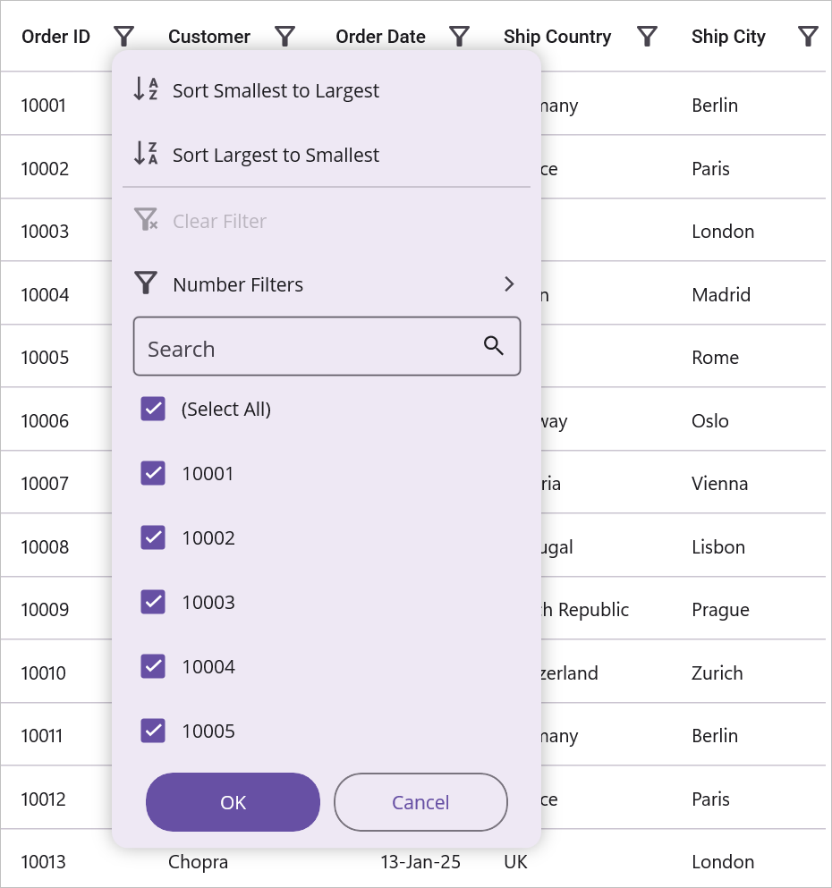

The following image shows the advanced filter popup menu on the desktop platform,

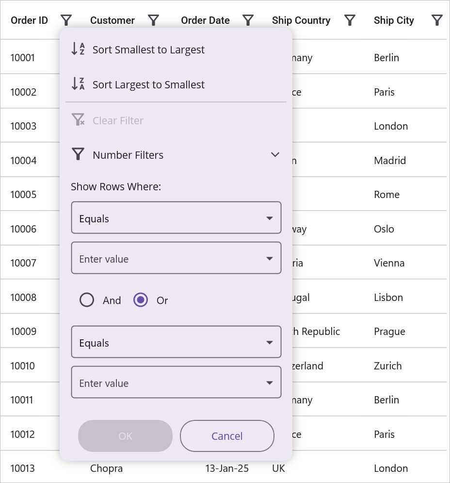

### Checkbox filtering
Checkbox filtering is similar to Excel's filter popup, which displays a checked list box of unique items along with a search text field. The items which are in the checked state will be visible in the view. Other items will be filtered out from the view.

The checkbox filter popup menu with a few selected values in the checkbox list view for filtering is displayed in the following image.

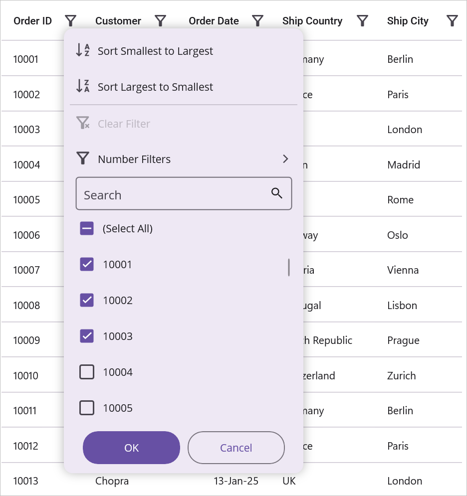

### Advanced filtering
Multiple filter choices are available in the advanced filter UI to make data filtering simple. By automatically identifying the underlying date type, filter menu options are loaded based on the Advanced filter type.

The supported built-in filter types are shown below.

1. Text Filters - Displays a variety of menu options for filtering the text column.
2. Number Filters - Displays a variety of menu options for filtering numeric data.
3. Date Filters - Displays a variety of menu options and a DatePicker to filter the DateTime column.

<table>
<tr>
<th>Text Filters </th>
<th>Number Filters </th>
<th>Date Filters </th>
</tr>
<tr>
<td>When the string value is loaded to the <code>DataGridColumn</code>, then <code>TextFilters</code> options are loaded in advanced filter view. </td>
<td>When the numeric value is loaded to the <code>DataGridColumn</code>, then <code>NumberFilters</code> options are loaded in advanced filter view. </td>
<td> When the DateTime type value is loaded to the <code>DataGridColumn</code>, then <code>DateFilters</code> options are loaded in advanced filter view. </td>
</tr>
<tr>
<td align="left" valign="top"><b>Filter menu options</b> <ul><li>Equals</li> <li>Does Not Equal</li> <li>Begins With</li> <li>Does Not Begin With</li> <li>Ends With</li> <li>Does Not End With</li> <li>Contains</li> <li>Does Not Contain</li> <li>Empty</li> <li>Not Empty</li> <li>Null</li> <li>Not Null</li></ul> </td>
<td align="left" valign="top"><b>Filter menu options</b> <ul><li>Equals</li> <li>Does Not Equal</li> <li>Less Than</li> <li>Less Than Or Equal</li> <li>Greater Than</li> <li>Greater Than Or Equal</li> <li>Null</li> <li>Not Null</li></ul> </td>
<td align="left" valign="top"><b>Filter menu options</b> <ul><li>Equals</li> <li>Does Not Equal</li> <li>Before</li> <li>Before Or Equal</li> <li>After</li> <li>After Or Equal</li> <li>Null</li> <li>Not Null</li></ul> </td>
</tr>
</table>

#### Case sensitive
By default, casing is not considered while filtering. Because, filter predicates will be created with [IsCaseSensitive]() as `false`. The case sensitive icon in the advanced filter UI can be used to enable `IsCaseSensitive` as `true` for the column. This option is only available for the `TextFilters` filter view.

## Events
SfDataGrid provide the following events to UI filtering.

### FilterChanging
[FilterChanging]() event invokes when the filtering is being applied to the particular column through UI filtering. Using this event we can change the [FilterPredicates](), [FilterType]() and [FilterBehavior]().



<syncfusion:SfDataGrid x:Name="dataGrid"
                       ItemsSource="{Binding Employees}" 
                       AllowFiltering="True"
                       FilterChaning="dataGrid_FilterChanging"/>


private void dataGrid_FilterChanging(object sender, DataGridFilterChangingEventArgs e)
{

}



### FilterChanged
[FilterChanged]() is event invoked after the filtering is applied to the particular column through UI filtering. You can use this event to get the filter records.



<syncfusion:SfDataGrid x:Name="dataGrid"
                       ItemsSource="{Binding Employees}" 
                       AllowFiltering="True"
                       FilterChanged="dataGrid_FilterChanged"/>


private void dataGrid1_FilterChanged(object sender, DataGridFilterChangedEventArgs e)
{

}



### FilterItemsPopulating
When the filter list items in filter view are being populated, the [FilterItemsPopulating]() event is raised. This event allows you to modify DataGridFilterView properties.



<syncfusion:SfDataGrid x:Name="dataGrid"
                       ItemsSource="{Binding Employees}" 
                       AllowFiltering="True"
                       FilterItemsPopulating="dataGrid_FilterItemsPopulating"/>


private void dataGrid_FilterItemsPopulating(object sender, Syncfusion.Maui.DataGrid.DataGridFilterItemsPopulatingEventArgs e)
{

}



### FilterItemsPopulated
[FilterItemsPopulated]() event is raised after filter list items are populated. You can change GridFilterControl ItemSource by using this event.



<syncfusion:SfDataGrid x:Name="dataGrid"
                       ItemsSource="{Binding Employees}" 
                       AllowFiltering="True"
                       FilterItemsPopulated="dataGrid_FilterItemsPopulated"/>


private void dataGrid_FilterItemsPopulated(object sender, DataGridFilterItemsPopulatedEventArgs e)
{

}



## Changing built-in UI views
You can choose which filter UI view to show in the DataGrid (SfDataGrid) for a column or the whole grid using the [DataGridFilterView.FilterMode]() property.

The options are listed below.

1. CheckboxFilter: Shows only the Checkbox filter view.
2. AdvancedFilter: Shows only the Advanced filter view.
3. Both: Shows both filter views.

### Changing filter UI for DataGrid
We can change the filter UI for all the columns in DataGrid by changing the `FilterMode` property in DataGridFilterView by setting style and added it to [SfDataGrid.FilterPopupStyle]().




<ContentPage.Resources>
    
</ContentPage.Resources>

<syncfusion:SfDataGrid x:Name="dataGrid"
                       ItemsSource="{Binding Employees}" 
                       AllowFiltering="True"
                       FilterPopupStyle="{StaticResource filterViewStyle}"/>



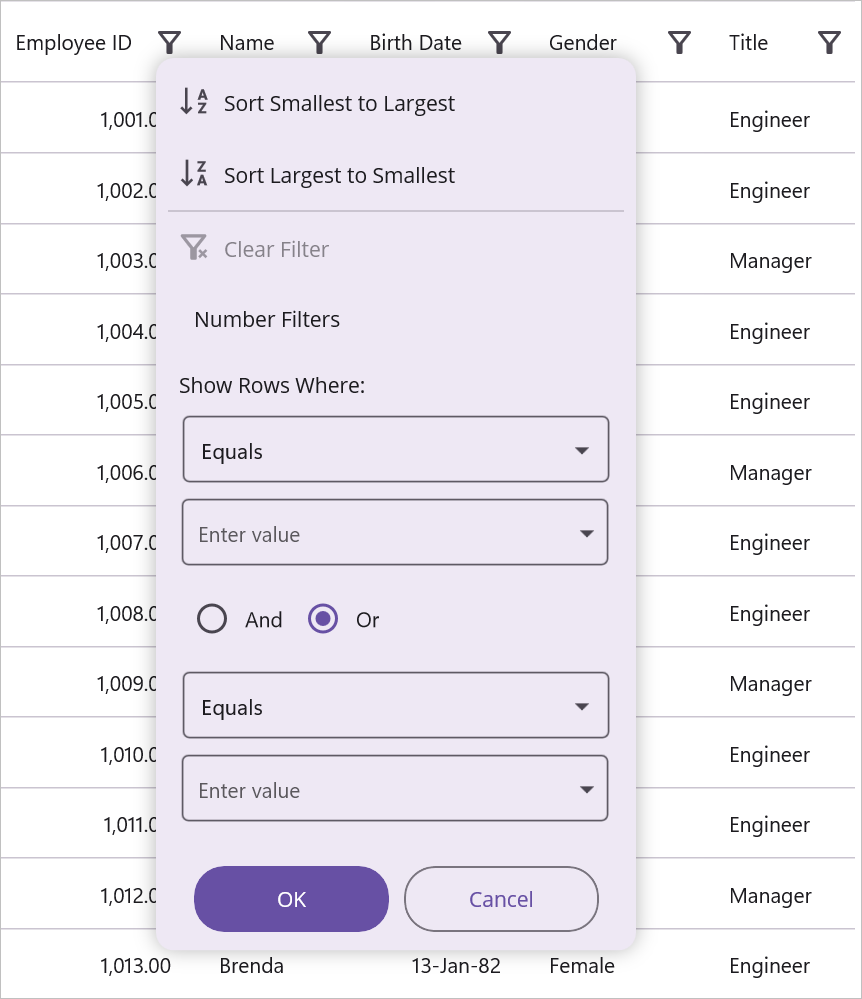

### Changing filter UI for particular column
Filter UI view can be changed for a particular column in DataGrid by changing the `FilterMode` property in DataGridFilterView by writing style and added it to [DataGridColumn.FilterPopupStyle]() property.




<ContentPage.Resources>
    
</ContentPage.Resources>

<syncfusion:DataGridTextColumn MappingName="EmployeeID"
                                FilterPopupStyle="{StaticResource filterViewStyle}"/>



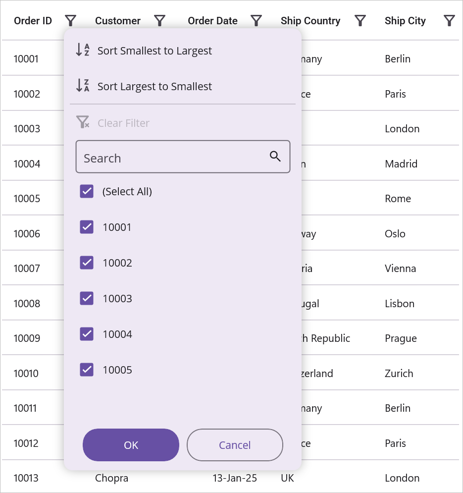

## Changing Advanced filter type
[FilterBehavior]() determines the Advanced filter type loaded in filter view. You can change the advanced filter type using `FilterBehavior`.

 - StringTyped - TextFilters will be loaded in AdvancedFilterControl.
 - Strongly Typed – Advanced filter type is automatically detected based on underlying data type.



<syncfusion:DataGridTextColumn MappingName="EmployeeID" FilterBehavior="StringTyped"/>


dataGrid.Columns["EmployeeID"].FilterBehavior = FilterBehavior.StringTyped;



## Increased loading Performance
Setting `FilterMode` to AdvancedFilter and [CanGenerateUniqueItems]() to `false` will improve [DataGridFilterView's]() loading performance. Instead of Combobox control, Entry is loaded which lets you manually enter text for filtering.



<ContentPage.Resources>
    
    
</ContentPage.Resources>

<syncfusion:SfDataGrid x:Name="dataGrid"
                       ItemsSource="{Binding Employees}" 
                       AllowFiltering="True"
                       FilterPopupStyle="{StaticResource filterViewStyle}"/>



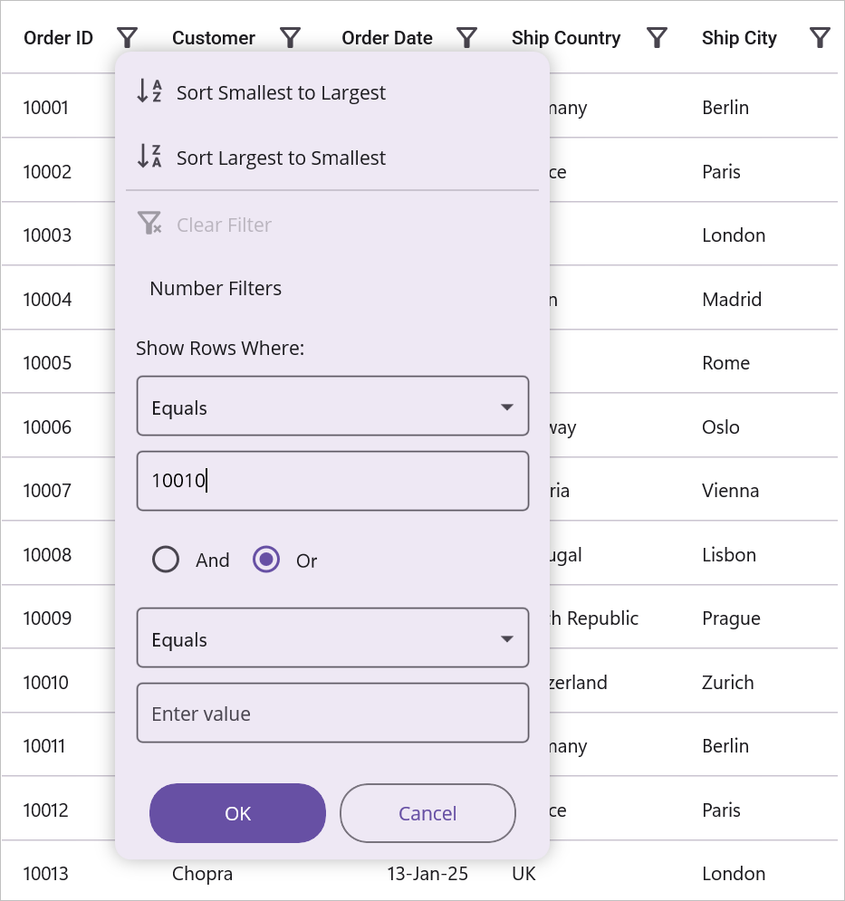

## Filtering null values
By default the [AllowBlankFilters]() property is set to true. So, the filter items must have null values. `AllowBlankFilters` must be set to `false` if you want to remove null values from the list of filter items. 

When we set `AllowBlankFilters` as `True`, Combobox options have Null and Not Null choices in advanced filter and checkbox items include a Blanks option in checkbox filtering UI.



<syncfusion:DataGridTextColumn MappingName="EmployeeID" AllowBlankFilters="False">


dataGrid.Columns["EmployeeID"].AllowBlankFilters = false;



Checkbox Filter with `AllowBlankFilters` as `True`

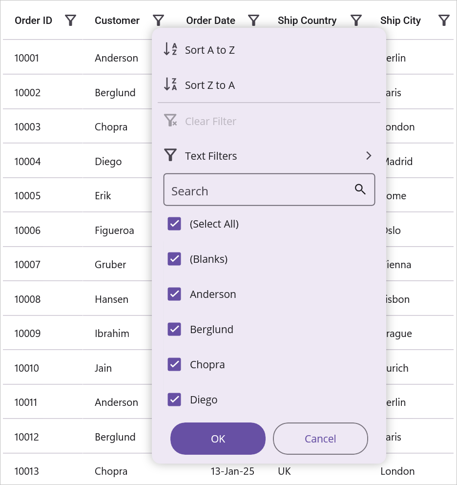

Advanced Filter with `AllowBlankFilters` as `True`

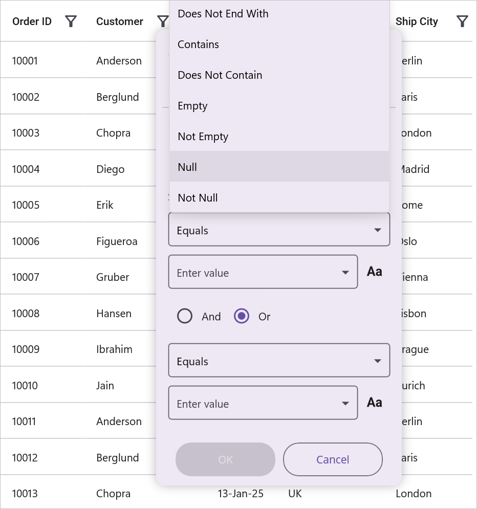

## Instant Filtering
By default, filtering is applied to the columns when OK button is clicked in UI filtering. You must set [ImmediateUpdateColumnFilter]() to True if you wish to update the filters instantly whenever the filter items are updated in the filter popup menu.

In this, Done button is displayed to close the filter popup instead of OK and Cancel buttons.



<syncfusion:DataGridTextColumn MappingName="EmployeeID" ImmediateUpdateColumnFilter="True">


dataGrid.Columns["EmployeeID"].ImmediateUpdateColumnFilter = true;



Checkbox Filter with `ImmediateUpdateColumnFilter` as `True`

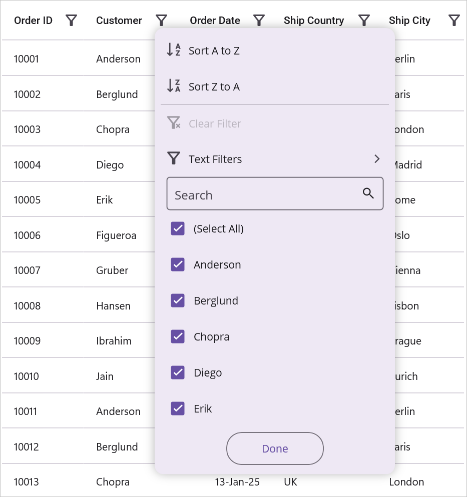

Advanced Filter with `ImmediateUpdateColumnFilter` as `True`

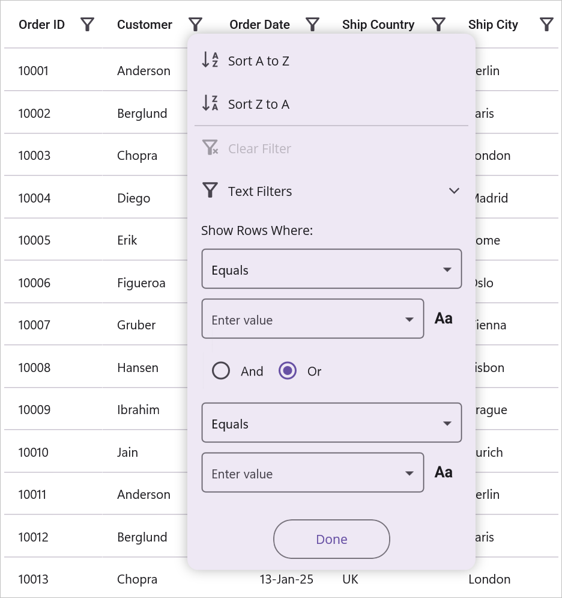

## Customizing the filter popup menu options
### Visibility of sort options
The sort options in the filter popup will be enabled only when we set [SortingMode]() as `Single` or `Multiple`. OtherWise the icons are in disable state. If you want to remove the sort options from the filter popup, set the [SortOptionsVisibility]() to `false` using `FilterPopupStyle`. As the default value of `SortOptionsVisibility` is `true`, the sort options is visible in the popup menu.



<ContentPage.Resources>
    
</ContentPage.Resources>

<syncfusion:SfDataGrid x:Name="dataGrid"
                       ItemsSource="{Binding Employees}" 
                       AllowFiltering="True"
                       FilterPopupStyle="{StaticResource filterViewStyle}"/>



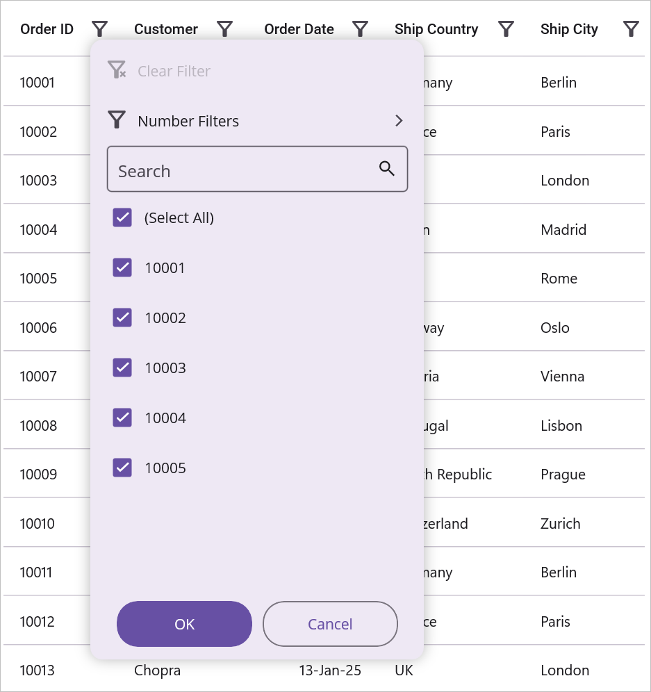

### Customizing the sorting text
We can customize the text present in the sort options using [AscendingSortString]() and [DescendingSortString]().



dataGrid.FilterItemsPopulating += dataGrid_FilterItemsPopulating;

private void dataGrid_FilterItemsPopulating(object sender, Syncfusion.Maui.DataGrid.DataGridFilterItemsPopulatingEventArgs e)
{
    if (e.Column.MappingName == "Name")
    {
        e.FilterControl.AscendingSortString = "Sort ascending";
        e.FilterControl.DescendingSortString = "Sort descending";
    }
}



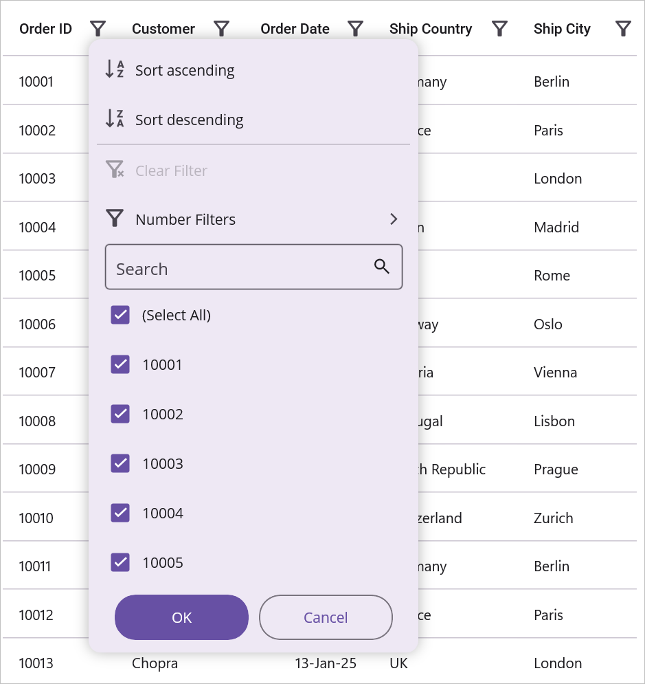

### Customize the filter popup size
You can customize the FilterPopup size using [FilterPopupHeight]() and [FilterPopupWidth]() properties by writing style of TargetType as DataGridFilterView.



<ContentPage.Resources>
    
</ContentPage.Resources>

<syncfusion:SfDataGrid x:Name="dataGrid"
                       ItemsSource="{Binding Employees}" 
                       AllowFiltering="True"
                       FilterPopupStyle="{StaticResource filterViewStyle}"/>



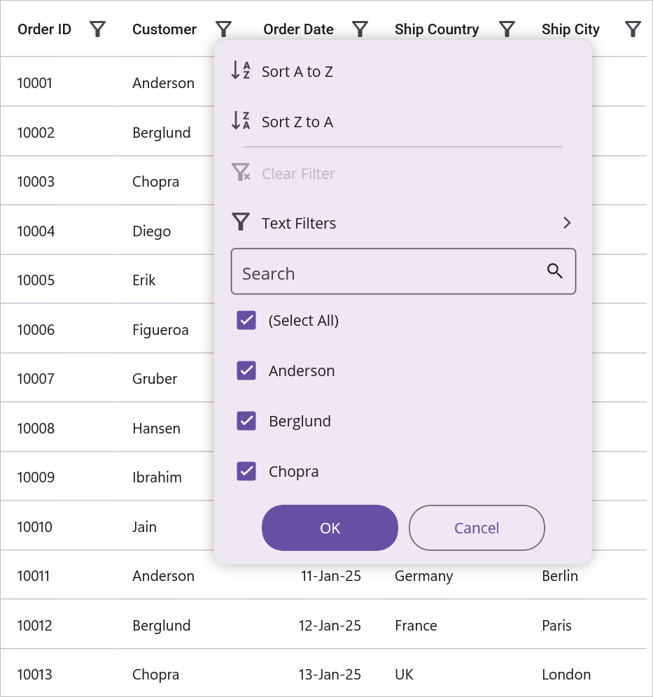

## Customize the filter icon
### Change the filter icon color
The default color of the filter icon can be customized by setting the [DataGridStyle.FilterIconColor]() property.



<syncfusion:SfDataGrid x:Name="dataGrid"
                        AllowFiltering="True"
                        ItemsSource="{Binding Employees}" >
        <syncfusion:SfDataGrid.DefaultStyle>
                <syncfusion:DataGridStyle FilterIconColor="DarkBlue" />
        </syncfusion:SfDataGrid.DefaultStyle>
</syncfusion:SfDataGrid>



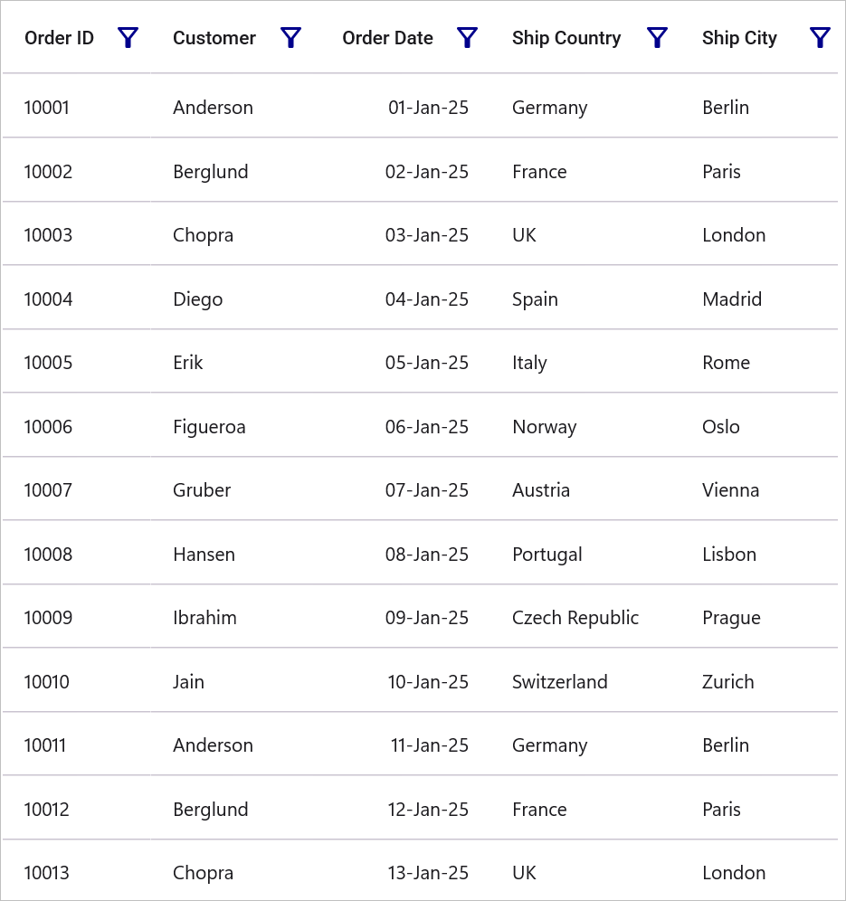

### Load filter icon through template
The `SfDataGrid` uses an icon to open the filter popup in UI filtering. You can personalize the filtering icon by using the [SfDataGrid.FilterIconTemplate](https://help.syncfusion.com/cr/maui/Syncfusion.Maui.DataGrid.SfDataGrid.html#Syncfusion_Maui_DataGrid_SfDataGrid_FilterIconTemplate) property. This property allow you to define a custom template that appears in the column header instead of default filter icon.



<syncfusion:SfDataGrid ItemsSource="{Binding Employees}"
                            x:Name="dataGrid"
                            AllowFiltering="True">
        <syncfusion:SfDataGrid.FilterIconTemplate>
                <DataTemplate>
                    <Image Source="filter.png"/>
                </DataTemplate>
        </syncfusion:SfDataGrid.FilterIconTemplate>
</syncfusion:SfDataGrid>



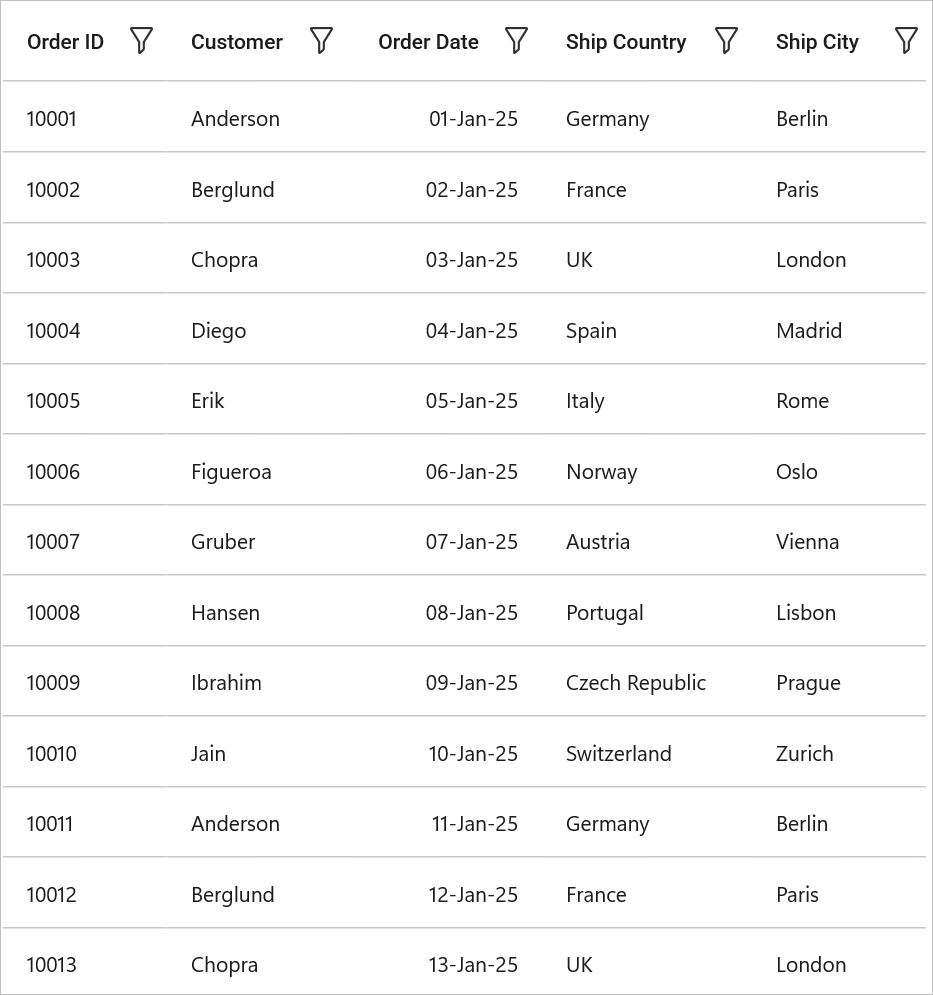

### Load filter icon through template selector
When choosing a `FilterIconTemplate` as a DataTemplateSelector, you have the option to supply two different templates for columns.



<ContentPage.Resources>
    <ResourceDictionary>
        <DataTemplate x:Key="FilterIcon1">
            <Image Source="filter.png"/>
        </DataTemplate>
        <DataTemplate x:Key="FilterIcon2">
            <Image Source="filterNew.png"/>
        </DataTemplate>
    </ResourceDictionary>
</ContentPage.Resources>

<ContentPage.Content>
<syncfusion:SfDataGrid ItemsSource="{Binding EmployeeDetails}"
                            x:Name="dataGrid"
                            AllowFiltering="True"
                            >
        <syncfusion:SfDataGrid.FilterIconTemplate >
            <local:FilterIconTemplateSelector IconTemplate1="{StaticResource FilterIcon1 }" IconTemplate2="{StaticResource FilterIcon2}" />
        </syncfusion:SfDataGrid.FilterIconTemplate>
</syncfusion:SfDataGrid>
<ContentPage.Content>



public class FilterIconTemplateSelector : DataTemplateSelector
{
    public DataTemplate? IconTemplate1 { get; set; }

    public DataTemplate? IconTemplate2 { get; set; }

    protected override DataTemplate OnSelectTemplate(object item, BindableObject container)
    {
        var column = item as DataGridColumn;
        if (column == null)
        {
            return null;
        }

        if (column.MappingName == "EmployeeID")
        {
            return IconTemplate1;
        }
        else
        {
            return IconTemplate2;
        }
    }
}



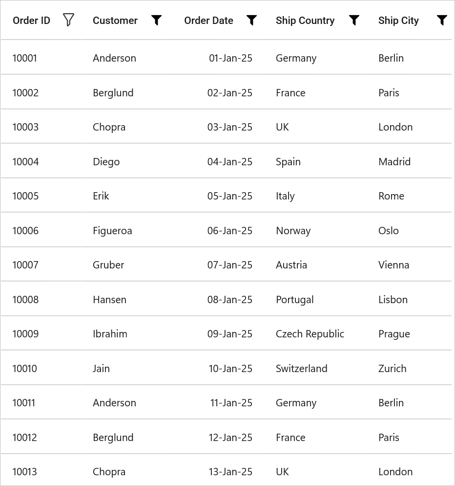

