# Filtering in MAUI DataGrid (SfDataGrid)

Filtering is the process of retrieving values in a collection that satisfy specified conditions. The [SfDataGrid](https://help.syncfusion.com/cr/maui/Syncfusion.Maui.DataGrid.SfDataGrid.html) provides two filtering approaches: programmatic filtering via predicates and UI-based filtering through interactive menus.

To get started quickly with filtering in [.NET MAUI DataGrid](https://www.syncfusion.com/maui-controls/maui-datagrid), you can check on this video:

 <iframe id='MAUIDataGridVideoTutorial' src='https://www.youtube.com/embed/KpN28Mi0Qn0'></iframe>

## Programmatic Filtering

Programmatic filtering allows you to apply custom filter predicates directly through code. This approach is useful when you need dynamic filtering logic or want to filter based on complex conditions not available in the UI.

### View Filtering

The `SfDataGrid` supports filtering records by setting the [SfDataGrid.View.Filter](https://help.syncfusion.com/cr/maui/Syncfusion.Maui.Data.ICollectionViewAdv.html#Syncfusion_Maui_Data_ICollectionViewAdv_Filter) property to a filter predicate.

> **Note:** The View property is automatically initialized when ItemsSource is set on the DataGrid. Ensure the DataGrid has loaded and ItemsSource is assigned before accessing the View.

> **Note:** In order to refresh filtering for the newly added row or column, set the [SfDataGrid.View.LiveDataUpdateMode](https://help.syncfusion.com/cr/maui/Syncfusion.Maui.Data.ICollectionViewAdv.html#Syncfusion_Maui_Data_ICollectionViewAdv_LiveDataUpdateMode) to [LiveDataUpdateMode.AllowDataShaping](https://help.syncfusion.com/cr/maui/Syncfusion.Maui.Data.LiveDataUpdateMode.html#Syncfusion_Maui_Data_LiveDataUpdateMode_AllowDataShaping).



private void Button_Clicked(object sender, EventArgs e)
{
	this.dataGrid.View.Filter = FilterRecords;
	this.dataGrid.View.RefreshFilter();
}

/// 

/// RefreshFilter() must be called after setting the Filter predicate to apply the filter.
/// 

public bool FilterRecords(object record)
{
	OrderInfo? orderInfo = record as OrderInfo;

	if(orderInfo != null && orderInfo.ShipCity == "Germany")
	{
		return true;
	}
	return false;
}



**Important:** View filtering is not supported when [ItemsSource](https://help.syncfusion.com/cr/maui/Syncfusion.Maui.DataGrid.SfDataGrid.html#Syncfusion_Maui_DataGrid_SfDataGrid_ItemsSource) is [DataTable](https://learn.microsoft.com/en-us/dotnet/api/system.data.datatable?view=net-6.0). Use UI filtering instead or convert your DataTable to an IEnumerable collection of data objects.
 
### Custom condition-based filtering

### Condition-Based Filtering

In addition to simple predicates, you can implement condition-based filtering where records are filtered based on user-defined logic. For example, records can be filtered to include specific values (Contains, Equals) or exclude values (Does Not Equal). Custom condition-based filtering can be applied to all columns or to individual columns.

Common filtering conditions include:

* Equals
* Does not equal
* Contains

To implement additional conditions beyond these, modify the code samples below based on your requirements.



public bool FilterRecords(object record)
{
    OrderInfo orderInfo = record as OrderInfo;

    if (orderInfo != null)
    {
        if (columns.SelectedItem.ToString() == "All Columns")
        {
            if (conditions.SelectedItem.ToString() == "Contains")
            {
                var filterText = FilterText.ToLower();
                if (orderInfo.OrderID.ToString().ToLower().Contains(filterText) ||
                    orderInfo.CustomerID.ToLower().Contains(filterText) ||
                    orderInfo.Customer.ToLower().Contains(filterText) ||
                    orderInfo.ShipCountry.ToLower().Contains(filterText) ||
                    orderInfo.ShipCity.ToLower().Contains(filterText))
                    return true;
                return false;
            }
            else if (conditions.SelectedItem.ToString() == "Equals")
            {
                if (CheckEquals(orderInfo.OrderID.ToString()) ||
                    CheckEquals(orderInfo.CustomerID) ||
                    CheckEquals(orderInfo.Customer) ||
                    CheckEquals(orderInfo.ShipCountry) ||
                    CheckEquals(orderInfo.ShipCity))
                    return true;
                return false;
            }
            else
            {
                if (!CheckEquals(orderInfo.OrderID.ToString()) ||
                   !CheckEquals(orderInfo.CustomerID) ||
                   !CheckEquals(orderInfo.Customer) ||
                   !CheckEquals(orderInfo.ShipCountry) ||
                   !CheckEquals(orderInfo.ShipCity))
                    return true;
                return false;
            }
        }
        else
        {
            var value = record.GetType().GetProperty(columns.SelectedItem.ToString().Replace(" ",""));
            if (value == null) return false; // Handle case where property doesn't exist
            var exactValue = value.GetValue(record, null);
            if (exactValue == null) return false; // Handle null values
            if (conditions.SelectedItem.ToString() == "Contains")
            {
                return FilterText.ToLower().Contains(exactValue.ToString().ToLower());
            }
            else if (conditions.SelectedItem.ToString() == "Equals")
            {
                return CheckEquals(exactValue.ToString());
            }
            else
            {
                return !CheckEquals(exactValue.ToString());
            }
        }
    }
    return false;
}

public bool CheckEquals(string value)
{
    return FilterText.Equals(value);
}

private void Button_Clicked(object sender, EventArgs e)
{
	this.dataGrid.View.Filter = FilterRecords;
	this.dataGrid.View.RefreshFilter();
}



The following code example illustrates how to create a [Picker](https://learn.microsoft.com/en-us/dotnet/maui/user-interface/controls/picker) for conditions and add appropriate strings to that Picker and how the records will be filtered based on selected conditions.



<Grid>
    <Grid.ColumnDefinitions>
        <ColumnDefinition Width="150"/>
        <ColumnDefinition Width="150"/>
        <ColumnDefinition Width="150"/>
    </Grid.ColumnDefinitions>

    <Picker
        x:Name="columns"
        Grid.Column="0">
        <Picker.Items>
            <x:String>All Columns</x:String>
            <x:String>Order ID</x:String>
            <x:String>Customer ID</x:String>
            <x:String>Customer</x:String>
            <x:String>Ship City</x:String>
            <x:String>Ship Country</x:String>
        </Picker.Items>
        <Picker.SelectedItem>
            <x:String>All Columns</x:String>
        </Picker.SelectedItem>
    </Picker>
    <Picker 
        x:Name="conditions"
        Grid.Column="1">
        <Picker.Items>
            <x:String>Equals</x:String>
            <x:String>Does Not Equal</x:String>
            <x:String>Contains</x:String>
        </Picker.Items>
    </Picker>

    <Button Grid.Column="2" Text="Filter" Clicked="Button_Clicked"/>
</Grid>



### Clearing Filters

To remove all applied filters and show the complete dataset:



private void ClearFilter(object sender, EventArgs e)
{
	this.dataGrid.View.Filter = null;
	this.dataGrid.View.RefreshFilter();
}



> **Note:** Filters are applied before sorting and grouping operations. When you clear a filter, the view is refreshed and sorting/grouping will be reapplied to the full dataset.

## UI Filtering

UI filtering provides interactive, user-friendly filtering through column header menu options. The SfDataGrid offers two built-in filter UIs: a checkbox-based filter similar to Excel, and an advanced filter with multiple condition types.

Enable UI filtering by setting the [SfDataGrid.AllowFiltering](https://help.syncfusion.com/cr/maui/Syncfusion.Maui.DataGrid.SfDataGrid.html#Syncfusion_Maui_DataGrid_SfDataGrid_AllowFiltering) property to `true`. When enabled, users can access the filter menu by clicking the filter icon in column headers. The filter UI appears as a popup menu on desktop platforms and as a full page on mobile platforms.



<syncfusion:SfDataGrid x:Name="dataGrid"
                       ItemsSource="{Binding OrderInfoCollection}" 
                       AllowFiltering="True"/>


OrderInfoViewModel orderInfoViewModel = new OrderInfoViewModel();
SfDataGrid dataGrid = new SfDataGrid();
dataGrid.ItemsSource = orderInfoViewModel.OrderInfoCollection;
this.dataGrid.AllowFiltering = true;



To enable or disable filtering for a specific column, set the [DataGridColumn.AllowFiltering](https://help.syncfusion.com/cr/maui/Syncfusion.Maui.DataGrid.DataGridColumn.html#Syncfusion_Maui_DataGrid_DataGridColumn_AllowFiltering) property.



<syncfusion:DataGridTextColumn AllowFiltering="True"
                                MappingName="OrderID"/>


dataGrid.Columns["OrderID"].AllowFiltering = true;



### Built-in Filter UI Types

The SfDataGrid filter UI provides two distinct interfaces:

 - **Checkbox Filter UI** — Displays an Excel-like filter interface with a list of checkboxes for selecting values.

 - **Advanced Filter UI** — Provides condition-based filtering options (Equals, Contains, Greater Than, etc.) with custom value entry.

Both filter types are loaded by default when the filter popup opens. Use the filter menu button to switch between Checkbox Filter and Advanced Filter modes.

The following image shows the checkbox filter popup menu on the desktop platform,

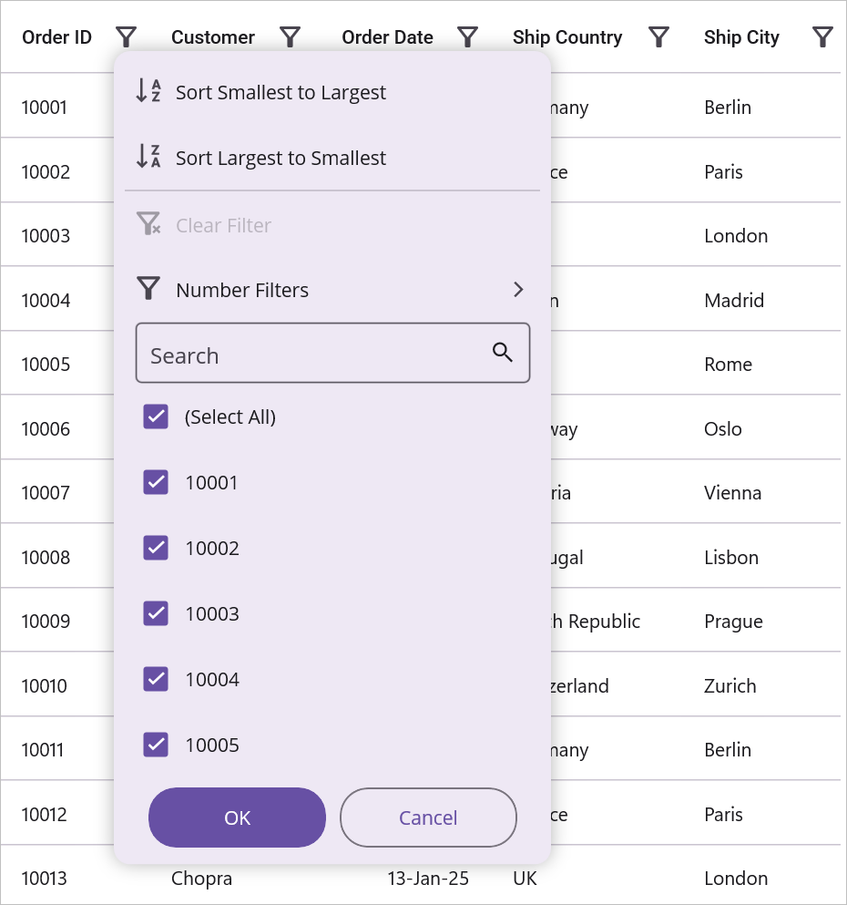

The following image shows the advanced filter popup menu on the desktop platform,

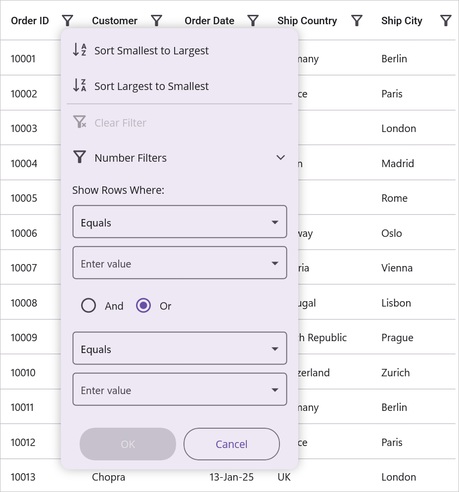

### Checkbox Filtering

Checkbox filtering displays an Excel-like popup with a list of unique values and a search field. Only items that are checked will be visible in the DataGrid; unchecked items are filtered out.

The checkbox filter popup menu with a few selected values in the checkbox list view for filtering is displayed in the following image.

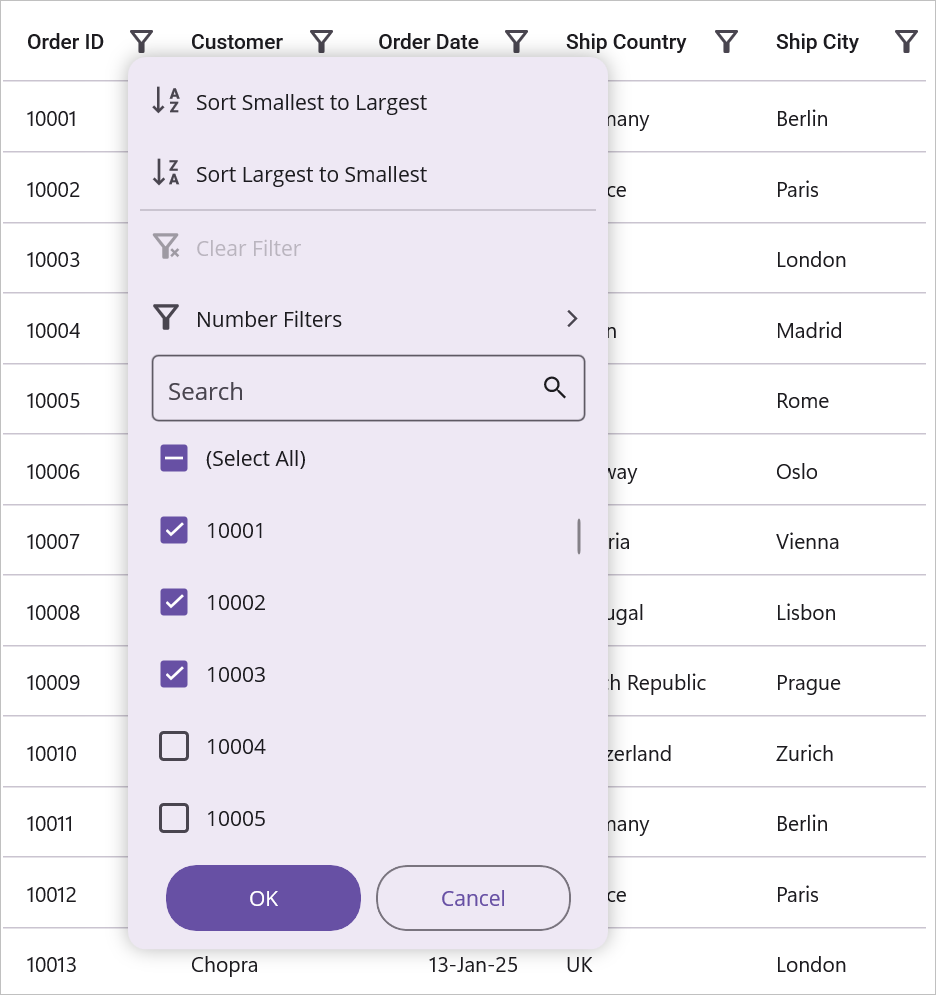

### Advanced Filtering

The advanced filter UI provides multiple condition options for precise data filtering. Filter options are automatically determined based on the column's data type (text, numeric, or date).

**Supported filter types by column data type:**

1. **Text Filters** — For string columns; provides options like Equals, Contains, Begins With, etc.
2. **Number Filters** — For numeric columns; provides comparison options like Greater Than, Less Than, etc.
3. **Date Filters** — For DateTime columns; includes date-specific options and a DatePicker for value selection.

<table>
<tr>
<th>Text Filters </th>
<th>Number Filters </th>
<th>Date Filters </th>
</tr>
<tr>
<td>When the string value is loaded to the <code>DataGridColumn</code>, then <code>TextFilters</code> options are loaded in advanced filter view. </td>
<td>When the numeric value is loaded to the <code>DataGridColumn</code>, then <code>NumberFilters</code> options are loaded in advanced filter view. </td>
<td> When the DateTime type value is loaded to the <code>DataGridColumn</code>, then <code>DateFilters</code> options are loaded in advanced filter view. </td>
</tr>
<tr>
<td align="left" valign="top"><b>Filter menu options</b> <ul><li>Equals</li> <li>Does Not Equal</li> <li>Begins With</li> <li>Does Not Begin With</li> <li>Ends With</li> <li>Does Not End With</li> <li>Contains</li> <li>Does Not Contain</li> <li>Empty</li> <li>Not Empty</li> <li>Null</li> <li>Not Null</li></ul> </td>
<td align="left" valign="top"><b>Filter menu options</b> <ul><li>Equals</li> <li>Does Not Equal</li> <li>Less Than</li> <li>Less Than Or Equal</li> <li>Greater Than</li> <li>Greater Than Or Equal</li> <li>Null</li> <li>Not Null</li></ul> </td>
<td align="left" valign="top"><b>Filter menu options</b> <ul><li>Equals</li> <li>Does Not Equal</li> <li>Before</li> <li>Before Or Equal</li> <li>After</li> <li>After Or Equal</li> <li>Null</li> <li>Not Null</li></ul> </td>
</tr>
</table>

#### Case-Sensitive Filtering

By default, text filtering is case-insensitive (with [IsCaseSensitive](https://help.syncfusion.com/cr/maui/Syncfusion.Maui.Data.FilterPredicate.html#Syncfusion_Maui_Data_FilterPredicate_IsCaseSensitive) set to `false`). In the advanced text filter UI, use the case-sensitive toggle icon to enable case-sensitive comparisons when needed. This option is available only for text-based filters.

## Filter Events

SfDataGrid provides the following events for responding to filter operations:

### FilterChanging

The [FilterChanging](https://help.syncfusion.com/cr/maui/Syncfusion.Maui.DataGrid.SfDataGrid.html#Syncfusion_Maui_DataGrid_SfDataGrid_FilterChanging) event is raised before a filter is applied to a column through the UI. Use this event to customize the [FilterPredicates](https://help.syncfusion.com/cr/maui/Syncfusion.Maui.DataGrid.DataGridFilterChangingEventArgs.html#Syncfusion_Maui_DataGrid_DataGridFilterChangingEventArgs_FilterPredicates), [FilterType](https://help.syncfusion.com/cr/maui/Syncfusion.Maui.Data.FilterPredicate.html#Syncfusion_Maui_Data_FilterPredicate_FilterType), or [FilterBehavior](https://help.syncfusion.com/cr/maui/Syncfusion.Maui.Data.FilterPredicate.html#Syncfusion_Maui_Data_FilterPredicate_FilterBehavior) before filtering takes effect.



<syncfusion:SfDataGrid x:Name="dataGrid"
                       ItemsSource="{Binding OrderInfoCollection}" 
                       AllowFiltering="True"
                       FilterChanging="dataGrid_FilterChanging"/>


OrderInfoViewModel orderInfoViewModel = new OrderInfoViewModel();
SfDataGrid dataGrid = new SfDataGrid();
dataGrid.ItemsSource = orderInfoViewModel.OrderInfoCollection;
dataGrid.AllowFiltering = true;
dataGrid.FilterChanging += dataGrid_FilterChanging;

private void dataGrid_FilterChanging(object sender, DataGridFilterChangingEventArgs e)
{

}



### FilterChanged

The [FilterChanged](https://help.syncfusion.com/cr/maui/Syncfusion.Maui.DataGrid.SfDataGrid.html#Syncfusion_Maui_DataGrid_SfDataGrid_FilterChanged) event is raised after a filter is applied to a column through the UI. Use this event to respond to the filtered results and perform actions based on the filtered data.



<syncfusion:SfDataGrid x:Name="dataGrid"
                       ItemsSource="{Binding OrderInfoCollection}" 
                       AllowFiltering="True"
                       FilterChanged="dataGrid_FilterChanged"/>


OrderInfoViewModel orderInfoViewModel = new OrderInfoViewModel();
SfDataGrid dataGrid = new SfDataGrid();
dataGrid.ItemsSource = orderInfoViewModel.OrderInfoCollection;
dataGrid.AllowFiltering = true;
dataGrid.FilterChanged += dataGrid_FilterChanged;

private void dataGrid_FilterChanged(object sender, DataGridFilterChangedEventArgs e)
{

}



### FilterItemsPopulating
When the filter list items in filter view are being populated, the [FilterItemsPopulating](https://help.syncfusion.com/cr/maui/Syncfusion.Maui.DataGrid.SfDataGrid.html#Syncfusion_Maui_DataGrid_SfDataGrid_FilterItemsPopulating) event is raised. This event allows you to modify DataGridFilterView properties.



<syncfusion:SfDataGrid x:Name="dataGrid"
                       ItemsSource="{Binding OrderInfoCollection}" 
                       AllowFiltering="True"
                       FilterItemsPopulating="dataGrid_FilterItemsPopulating"/>


OrderInfoViewModel orderInfoViewModel = new OrderInfoViewModel();
SfDataGrid dataGrid = new SfDataGrid();
dataGrid.ItemsSource = orderInfoViewModel.OrderInfoCollection;
dataGrid.AllowFiltering = true;
dataGrid.FilterItemsPopulating += dataGrid_FilterItemsPopulating;
private void dataGrid_FilterItemsPopulating(object sender, Syncfusion.Maui.DataGrid.DataGridFilterItemsPopulatingEventArgs e)
{

}



### FilterItemsPopulated
[FilterItemsPopulated](https://help.syncfusion.com/cr/maui/Syncfusion.Maui.DataGrid.SfDataGrid.html#Syncfusion_Maui_DataGrid_SfDataGrid_FilterItemsPopulated) event is raised after filter list items are populated. You can change GridFilterControl ItemSource by using this event.



<syncfusion:SfDataGrid x:Name="dataGrid"
                       ItemsSource="{Binding OrderInfoCollection}" 
                       AllowFiltering="True"
                       FilterItemsPopulated="dataGrid_FilterItemsPopulated"/>


OrderInfoViewModel orderInfoViewModel = new OrderInfoViewModel();
SfDataGrid dataGrid = new SfDataGrid();
dataGrid.ItemsSource = orderInfoViewModel.OrderInfoCollection;
dataGrid.AllowFiltering = true;
dataGrid.FilterItemsPopulated += dataGrid_FilterItemsPopulated;
private void dataGrid_FilterItemsPopulated(object sender, DataGridFilterItemsPopulatedEventArgs e)
{

}



## Configuring Filter UI Display Modes

Use the [DataGridFilterView.FilterMode](https://help.syncfusion.com/cr/maui/Syncfusion.Maui.DataGrid.DataGridFilterView.html#Syncfusion_Maui_DataGrid_DataGridFilterView_FilterMode) property to control which filter UI types are available to users.

**Filter mode options:**

1. **CheckboxFilter** — Displays only the checkbox filter interface.
2. **AdvancedFilter** — Displays only the advanced filter interface.
3. **Both** — Displays both interfaces with a button to switch between them (default).

### Setting Filter UI for the Entire DataGrid

To apply a filter mode to all columns, set the [SfDataGrid.FilterPopupStyle](https://help.syncfusion.com/cr/maui/Syncfusion.Maui.DataGrid.SfDataGrid.html#Syncfusion_Maui_DataGrid_SfDataGrid_FilterPopupStyle) with the desired FilterMode:




<ContentPage.Resources>
    
</ContentPage.Resources>

<syncfusion:SfDataGrid x:Name="dataGrid"
                       ItemsSource="{Binding OrderInfoCollection}" 
                       AllowFiltering="True"
                       FilterPopupStyle="{StaticResource filterViewStyle}"/>


Style styles = new Style(typeof(DataGridFilterView));
styles.Setters.Add(new Setter() { Property = DataGridFilterView.FilterModeProperty, Value = DataGridFilterMode.AdvancedFilter });

OrderInfoViewModel orderInfoViewModel = new OrderInfoViewModel();
SfDataGrid dataGrid = new SfDataGrid();
dataGrid.ItemsSource = orderInfoViewModel.OrderInfoCollection;
dataGrid.AllowFiltering = true;
dataGrid.FilterPopupStyle = styles;



### Setting Filter UI for Individual Columns

To apply a different filter mode to a specific column, use [DataGridColumn.FilterPopupStyle](https://help.syncfusion.com/cr/maui/Syncfusion.Maui.DataGrid.DataGridColumn.html#Syncfusion_Maui_DataGrid_DataGridColumn_FilterPopupStyle):




<ContentPage.Resources>
    
</ContentPage.Resources>

<syncfusion:DataGridTextColumn MappingName="OrderID"
                                FilterPopupStyle="{StaticResource filterViewStyle}"/>


Style styles = new Style(typeof(DataGridFilterView));
styles.Setters.Add(new Setter() { Property = DataGridFilterView.FilterModeProperty, Value = DataGridFilterMode.CheckboxFilter });

dataGrid.Columns["OrderID"].FilterPopupStyle = styles;



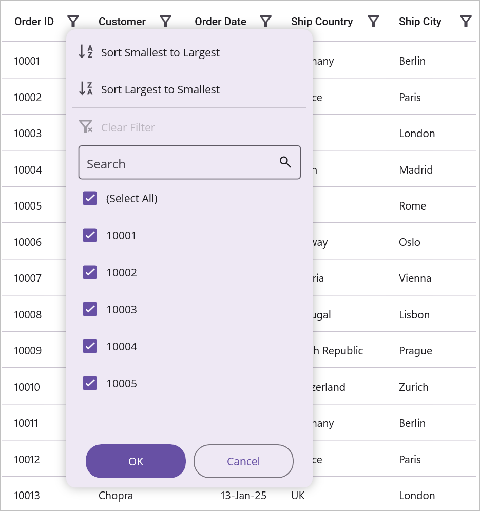

## Filter Type Configuration

The [FilterBehavior](https://help.syncfusion.com/cr/maui/Syncfusion.Maui.DataGrid.DataGridColumn.html#Syncfusion_Maui_DataGrid_DataGridColumn_FilterBehavior) property determines which filter type options appear in the advanced filter UI.

**Filter behavior options:**

 - **StringTyped** — Uses text-based filter options regardless of the column's data type. Use this to apply text filtering to numeric or date columns.
 - **Strongly Typed** — Automatically selects filter options based on the column's data type (default). Recommended for most scenarios.



<syncfusion:DataGridTextColumn MappingName="OrderID" FilterBehavior="StringTyped"/>


dataGrid.Columns["OrderID"].FilterBehavior = FilterBehavior.StringTyped;



## Performance Optimization

For large datasets, improve filter popup loading performance by setting `FilterMode` to `AdvancedFilter` and [CanGenerateUniqueItems](https://help.syncfusion.com/cr/maui/Syncfusion.Maui.DataGrid.DataGridFilterView.html#Syncfusion_Maui_DataGrid_DataGridFilterView_CanGenerateUniqueItems) to `false`. This replaces the combobox with a text entry field, allowing users to type filter values directly without generating a list of unique items.



<ContentPage.Resources>
    
    
</ContentPage.Resources>

<syncfusion:SfDataGrid x:Name="dataGrid"
                       ItemsSource="{Binding OrderInfoCollection}" 
                       AllowFiltering="True"
                       FilterPopupStyle="{StaticResource filterViewStyle}"/>


Style style = new Style(typeof(DataGridFilterView))
{
    Setters = 
    {
        new Setter() {Property = DataGridFilterView.FilterModeProperty, Value = DataGridFilterMode.AdvancedFilter},
        new Setter() {Property = DataGridFilterView.CanGenerateUniqueItemsProperty, Value = false}
    }
};

OrderInfoViewModel orderInfoViewModel = new OrderInfoViewModel();
SfDataGrid dataGrid = new SfDataGrid();
dataGrid.ItemsSource = orderInfoViewModel.OrderInfoCollection;
dataGrid.AllowFiltering = true;
dataGrid.FilterPopupStyle = style;



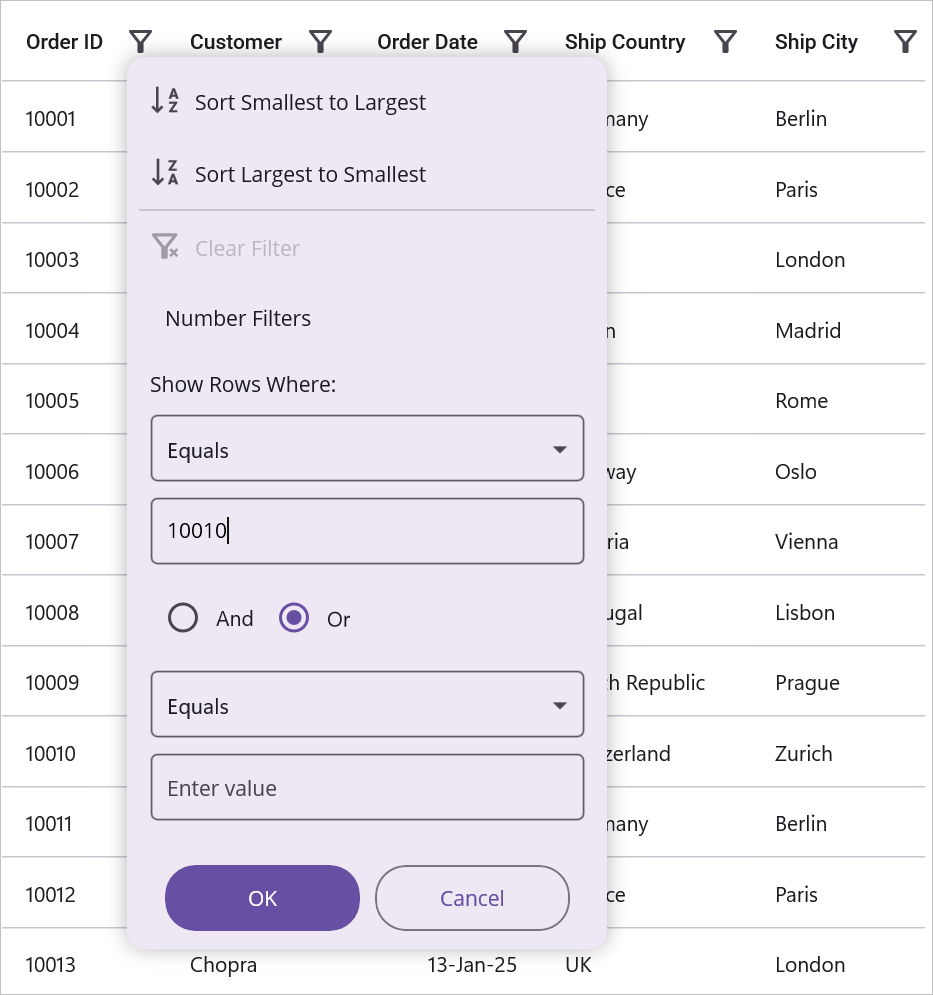

## Filtering Null Values

By default, [AllowBlankFilters](https://help.syncfusion.com/cr/maui/Syncfusion.Maui.DataGrid.DataGridColumn.html#Syncfusion_Maui_DataGrid_DataGridColumn_AllowBlankFilters) is set to `true`, which includes null/empty values in the filter list. This property controls only the UI display; it does not affect the filtering logic itself.

When `AllowBlankFilters` is `True`:
- **Advanced Filter** displays "Null" and "Not Null" options
- **Checkbox Filter** includes a "Blanks" checkbox option

Set `AllowBlankFilters` to `false` to exclude null/empty values from appearing in the filter UI:



<syncfusion:DataGridTextColumn MappingName="OrderID" AllowBlankFilters="False"/>


dataGrid.Columns["OrderID"].AllowBlankFilters = false;



Checkbox Filter with `AllowBlankFilters` as `True`

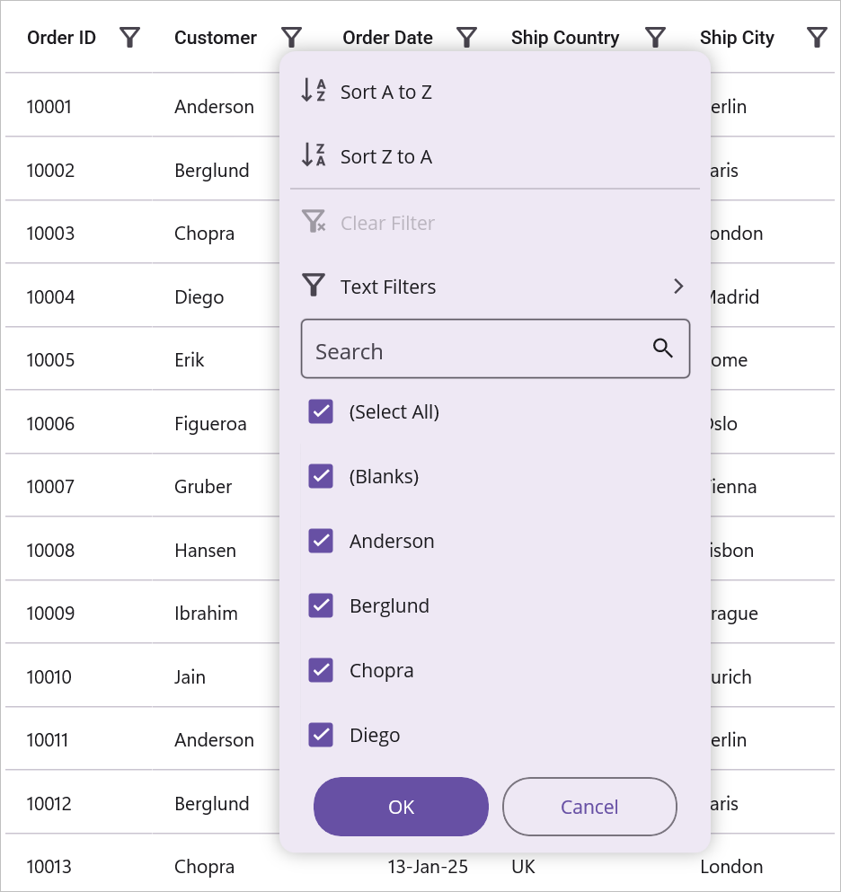

Advanced Filter with `AllowBlankFilters` as `True`

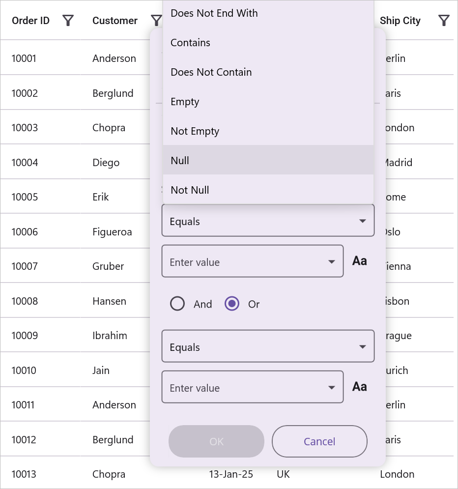

## Instant Filtering

By default, filter changes are applied when the user clicks the OK button. To update filters immediately as selections change, set [ImmediateUpdateColumnFilter](https://help.syncfusion.com/cr/maui/Syncfusion.Maui.DataGrid.DataGridColumn.html#Syncfusion_Maui_DataGrid_DataGridColumn_ImmediateUpdateColumnFilter) to `true`. When enabled, a "Done" button replaces the OK and Cancel buttons to close the filter popup.



<syncfusion:DataGridTextColumn MappingName="OrderID" ImmediateUpdateColumnFilter="True"/>


dataGrid.Columns["OrderID"].ImmediateUpdateColumnFilter = true;



Checkbox Filter with `ImmediateUpdateColumnFilter` as `True`

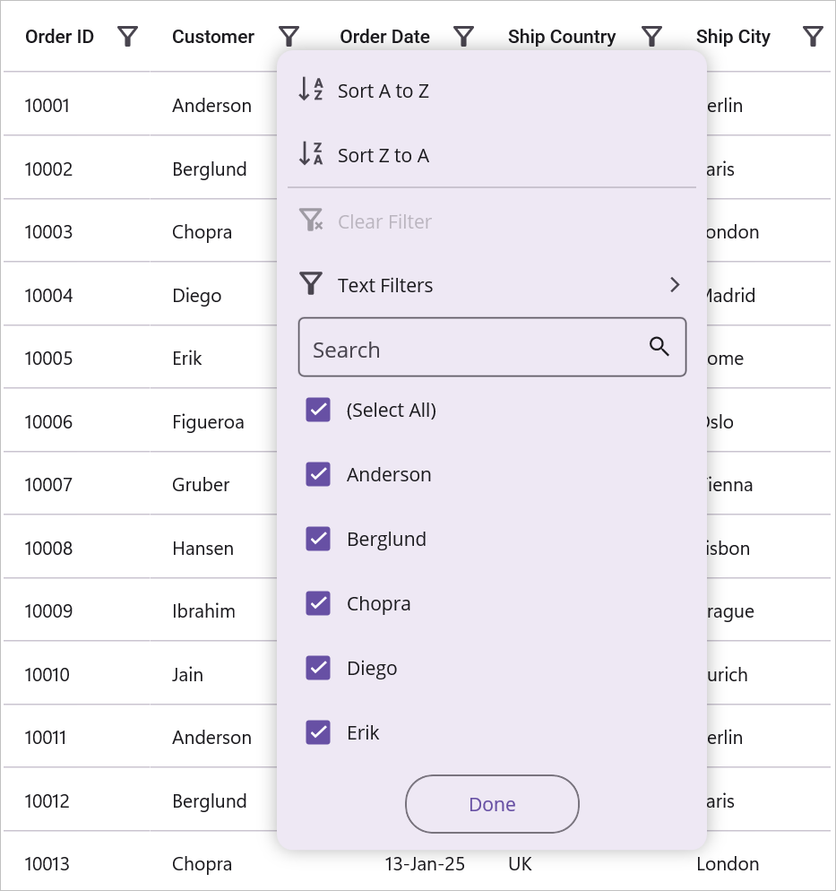

Advanced Filter with `ImmediateUpdateColumnFilter` as `True`

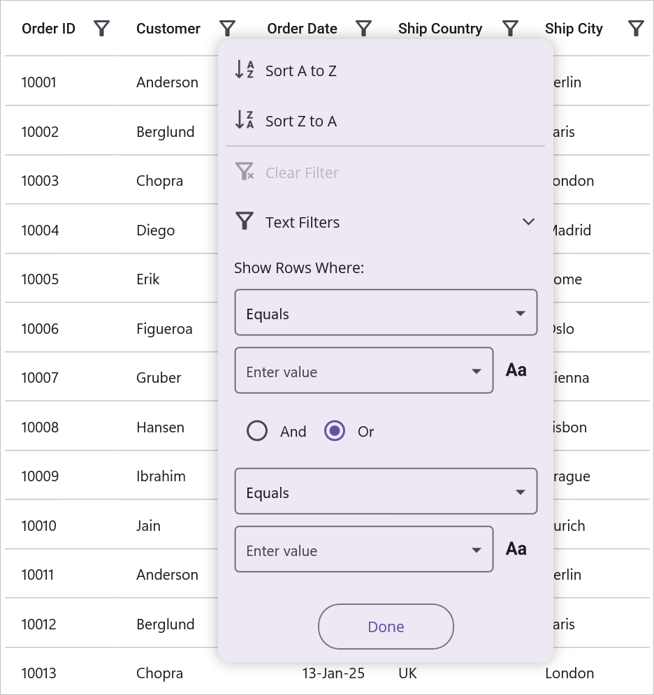

## Customizing Filter Popup Options

### Controlling Sort Option Visibility

Sort options in the filter popup are enabled only when [SortingMode](https://help.syncfusion.com/cr/maui/Syncfusion.Maui.DataGrid.SfDataGrid.html#Syncfusion_Maui_DataGrid_SfDataGrid_SortingMode) is set to `Single` or `Multiple`. When sorting is disabled, sort icons appear grayed out. To hide sort options completely, set [SortOptionsVisibility](https://help.syncfusion.com/cr/maui/Syncfusion.Maui.DataGrid.DataGridFilterView.html#Syncfusion_Maui_DataGrid_DataGridFilterView_SortOptionsVisibility) to `false` in the `FilterPopupStyle`:



<ContentPage.Resources>
    
</ContentPage.Resources>

<syncfusion:SfDataGrid x:Name="dataGrid"
                       ItemsSource="{Binding OrderInfoCollection}" 
                       AllowFiltering="True"
                       FilterPopupStyle="{StaticResource filterViewStyle}"/>



Style styles = new Style(typeof(DataGridFilterView));
styles.Setters.Add(new Setter() { Property = DataGridFilterView.SortOptionVisibilityProperty, Value = false });

OrderInfoViewModel orderInfoViewModel = new OrderInfoViewModel();
SfDataGrid dataGrid = new SfDataGrid();
dataGrid.ItemsSource = orderInfoViewModel.OrderInfoCollection;
dataGrid.AllowFiltering = true;
dataGrid.FilterPopupStyle = styles;



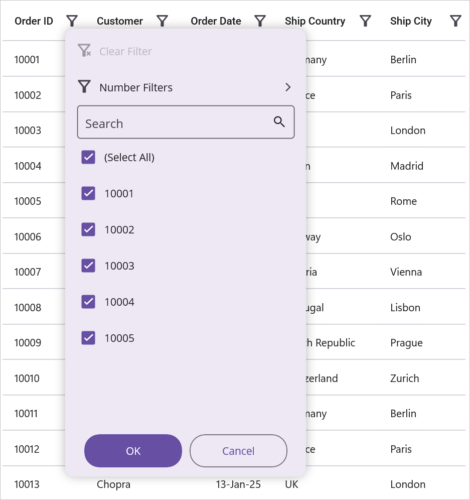

### Customizing Sort Option Text

Customize the text displayed for sort options using [AscendingSortString](https://help.syncfusion.com/cr/maui/Syncfusion.Maui.DataGrid.DataGridFilterView.html#Syncfusion_Maui_DataGrid_DataGridFilterView_AscendingSortString) and [DescendingSortString](https://help.syncfusion.com/cr/maui/Syncfusion.Maui.DataGrid.DataGridFilterView.html#Syncfusion_Maui_DataGrid_DataGridFilterView_DescendingSortString):



dataGrid.FilterItemsPopulating += dataGrid_FilterItemsPopulating;

private void dataGrid_FilterItemsPopulating(object sender, Syncfusion.Maui.DataGrid.DataGridFilterItemsPopulatingEventArgs e)
{
    if (e.Column.MappingName == "Customer")
    {
        e.FilterControl.AscendingSortString = "Sort ascending";
        e.FilterControl.DescendingSortString = "Sort descending";
    }
}



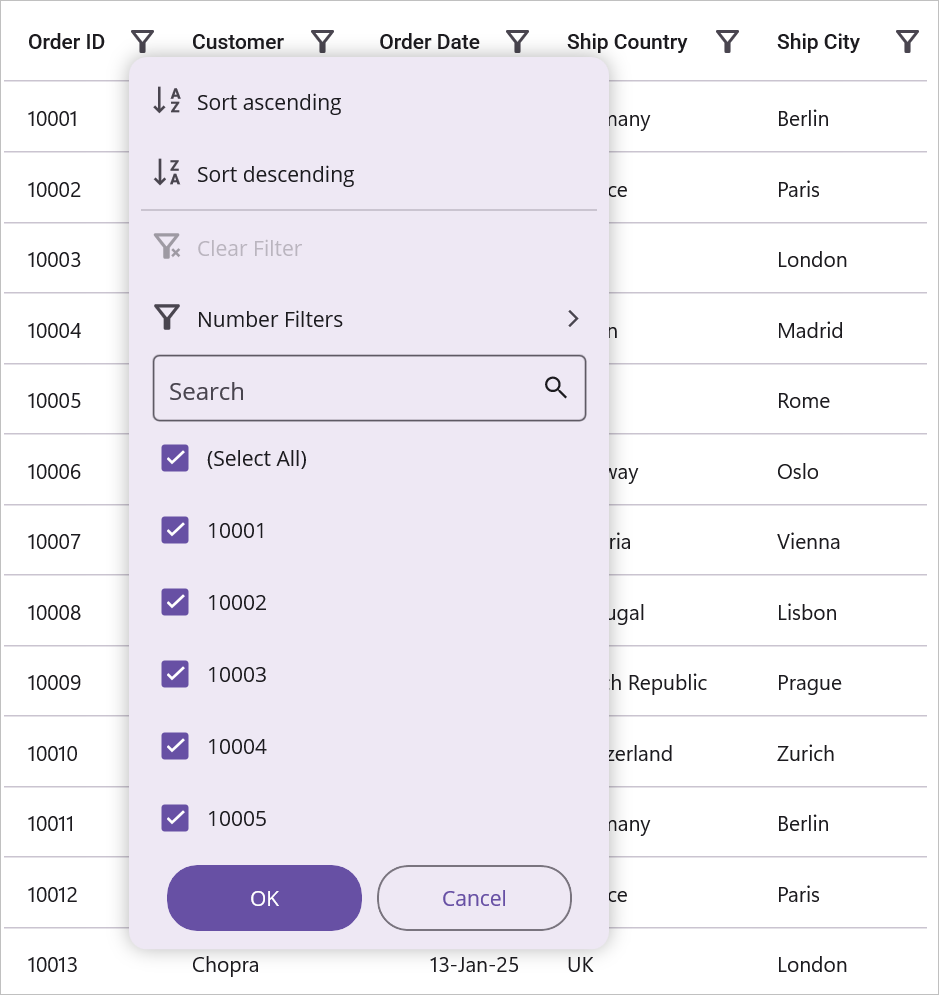

### Customizing Filter Popup Size

Use [FilterPopupHeight](https://help.syncfusion.com/cr/maui/Syncfusion.Maui.DataGrid.DataGridFilterView.html#Syncfusion_Maui_DataGrid_DataGridFilterView_FilterPopupHeight) and [FilterPopupWidth](https://help.syncfusion.com/cr/maui/Syncfusion.Maui.DataGrid.DataGridFilterView.html#Syncfusion_Maui_DataGrid_DataGridFilterView_FilterPopupWidth) properties in a DataGridFilterView style to control the popup dimensions:



<ContentPage.Resources>
    
</ContentPage.Resources>

<syncfusion:SfDataGrid x:Name="dataGrid"
                       ItemsSource="{Binding OrderInfoCollection}" 
                       AllowFiltering="True"
                       FilterPopupStyle="{StaticResource filterViewStyle}"/>


Style style = new Style(typeof(DataGridFilterView))
{
    Setters =
    {
        new Setter() {Property = DataGridFilterView.FilterPopupHeightProperty, Value = 500},
        new Setter() {Property = DataGridFilterView.FilterPopupWidthProperty, Value = 360},
    }
};

OrderInfoViewModel orderInfoViewModel = new OrderInfoViewModel();
SfDataGrid dataGrid = new SfDataGrid();
dataGrid.ItemsSource = orderInfoViewModel.OrderInfoCollection;
dataGrid.AllowFiltering = true;
dataGrid.FilterPopupStyle = style;



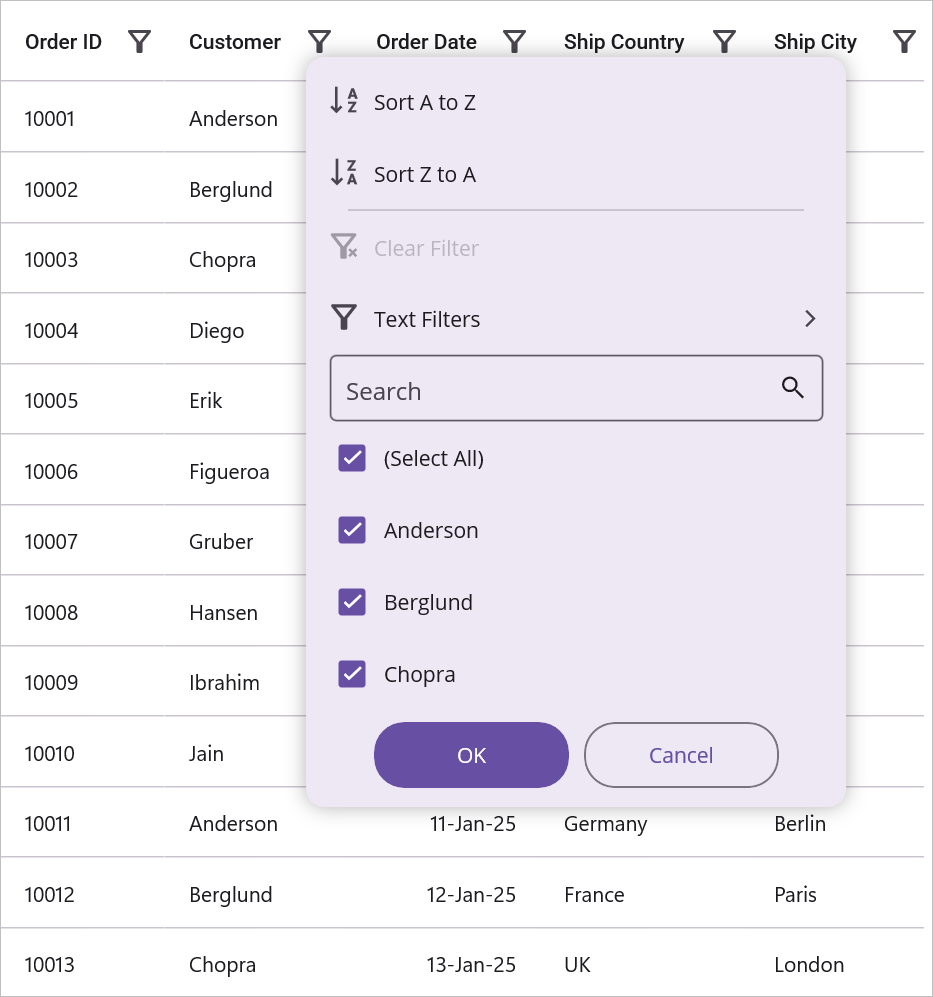

## Customizing Filter Icons

### Changing Filter Icon Color

Customize the filter icon color using [DataGridStyle.FilterIconColor](https://help.syncfusion.com/cr/maui/Syncfusion.Maui.DataGrid.DataGridStyle.html#Syncfusion_Maui_DataGrid_DataGridStyle_FilterIconColor):



<syncfusion:SfDataGrid x:Name="dataGrid"
                        AllowFiltering="True"
                        ItemsSource="{Binding OrderInfoCollection}" >
        <syncfusion:SfDataGrid.DefaultStyle>
                <syncfusion:DataGridStyle FilterIconColor="DarkBlue" />
        </syncfusion:SfDataGrid.DefaultStyle>
</syncfusion:SfDataGrid>


OrderInfoViewModel orderInfoViewModel = new OrderInfoViewModel();
SfDataGrid dataGrid = new SfDataGrid();
dataGrid.ItemsSource = orderInfoViewModel.OrderInfoCollection;
dataGrid.AllowFiltering = true;
dataGrid.DefaultStyle.FilterIconColor = Colors.DarkBlue;



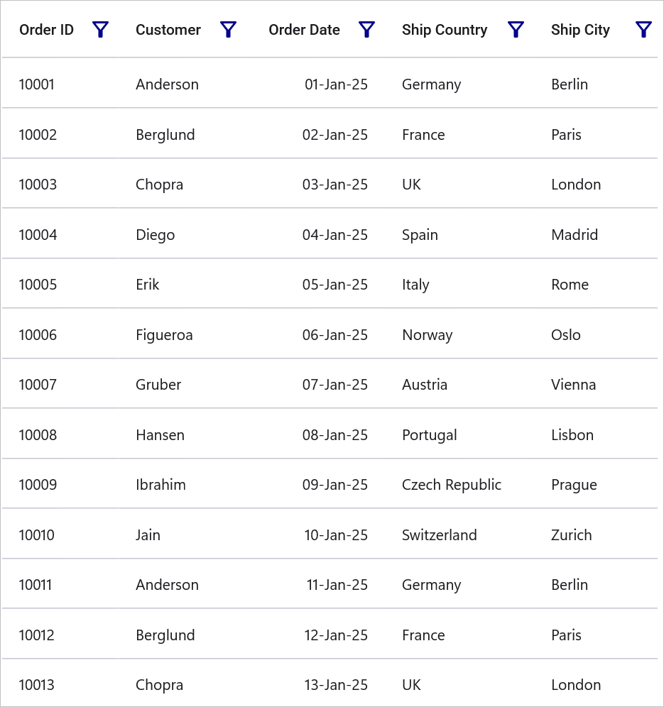

### Replacing Filter Icon with Custom Template

Use [SfDataGrid.FilterIconTemplate](https://help.syncfusion.com/cr/maui/Syncfusion.Maui.DataGrid.SfDataGrid.html#Syncfusion_Maui_DataGrid_SfDataGrid_FilterIconTemplate) to replace the default filter icon with a custom view in the column header:



<syncfusion:SfDataGrid ItemsSource="{Binding OrderInfoCollection}"
                            x:Name="dataGrid"
                            AllowFiltering="True">
        <syncfusion:SfDataGrid.FilterIconTemplate>
                <DataTemplate>
                    <Image Source="filter.png"/>
                </DataTemplate>
        </syncfusion:SfDataGrid.FilterIconTemplate>
</syncfusion:SfDataGrid>


var filterIconTemplate  = new DataTemplate(() =>
{
    var icon = new Image { Source="filter.png"}
	return icon;
});

OrderInfoViewModel orderInfoViewModel = new OrderInfoViewModel();
SfDataGrid dataGrid = new SfDataGrid();
dataGrid.ItemsSource = orderInfoViewModel.OrderInfoCollection;
dataGrid.AllowFiltering = true;
dataGrid.FilterIconTemplate = filterIconTemplate;



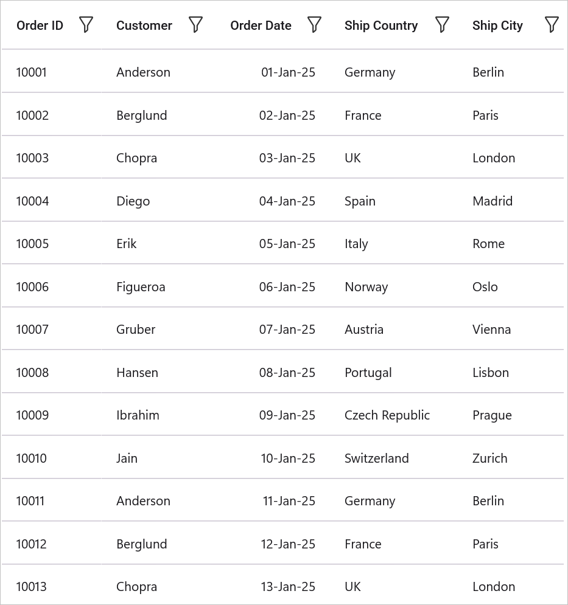

### Using Template Selector for Multiple Filter Icon Styles

Use a `DataTemplateSelector` with `FilterIconTemplate` to display different icons for different columns:



<ContentPage.Resources>
    <ResourceDictionary>
        <DataTemplate x:Key="FilterIcon1">
            <Image Source="filter.png"/>
        </DataTemplate>
        <DataTemplate x:Key="FilterIcon2">
            <Image Source="filterNew.png"/>
        </DataTemplate>
    </ResourceDictionary>
</ContentPage.Resources>

<ContentPage.Content>
<syncfusion:SfDataGrid ItemsSource="{Binding OrderInfoCollection}"
                            x:Name="dataGrid"
                            AllowFiltering="True"
                            >
        <syncfusion:SfDataGrid.FilterIconTemplate >
            <local:FilterIconTemplateSelector IconTemplate1="{StaticResource FilterIcon1 }" IconTemplate2="{StaticResource FilterIcon2}" />
        </syncfusion:SfDataGrid.FilterIconTemplate>
</syncfusion:SfDataGrid>
<ContentPage.Content>



public class FilterIconTemplateSelector : DataTemplateSelector
{
    public DataTemplate? IconTemplate1 { get; set; }

    public DataTemplate? IconTemplate2 { get; set; }

    protected override DataTemplate OnSelectTemplate(object item, BindableObject container)
    {
        var column = item as DataGridColumn;
        if (column == null)
        {
            return null;
        }

        if (column.MappingName == "OrderID")
        {
            return IconTemplate1;
        }
        else
        {
            return IconTemplate2;
        }
    }
}



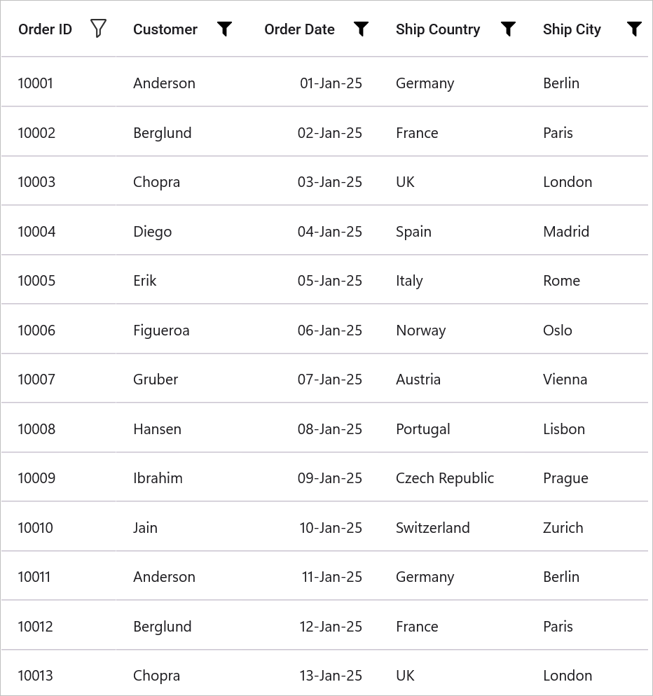

## Customizing Filter Popup Appearance

The `SfDataGrid` provides comprehensive appearance customization for filter popups through the `DataGridStyle`. Customize colors, backgrounds, icons, and button styles in both checkbox and advanced filter modes by assigning a `DataGridStyle` instance to `SfDataGrid.DefaultStyle`:



<syncfusion:SfDataGrid x:Name="dataGrid"
                       ItemsSource="{Binding OrderInfoCollection}"
                       AllowFiltering="True">
    <syncfusion:SfDataGrid.DefaultStyle>
        <syncfusion:DataGridStyle
            FilterPopupIconColor="Maroon"
            FilterPopupBackground="LightCyan"
            FilterPopupOkButtonBackgroundColor="Purple"
            FilterPopupCheckboxCheckedColor="ForestGreen" />
    </syncfusion:SfDataGrid.DefaultStyle>
</syncfusion:SfDataGrid>


OrderInfoViewModel orderInfoViewModel = new OrderInfoViewModel();
SfDataGrid dataGrid = new SfDataGrid();
dataGrid.ItemsSource = orderInfoViewModel.OrderInfoCollection;
dataGrid.AllowFiltering = true;

dataGrid.DefaultStyle = new DataGridStyle
{
    FilterPopupIconColor= Colors.Maroon,
    FilterPopupBackground= Colors.LightCyan,
    FilterPopupOkButtonBackgroundColor= Colors.Purple,
    FilterPopupCheckboxCheckedColor= Colors.ForestGreen,
};



The following images show the checkbox and advanced filter popups with applied customizations:

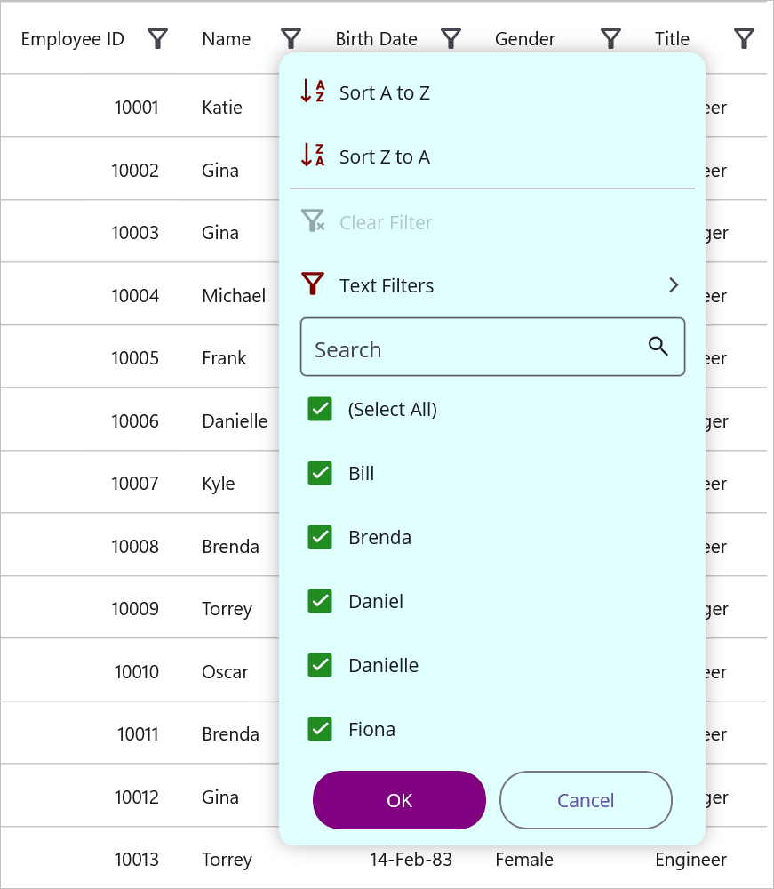

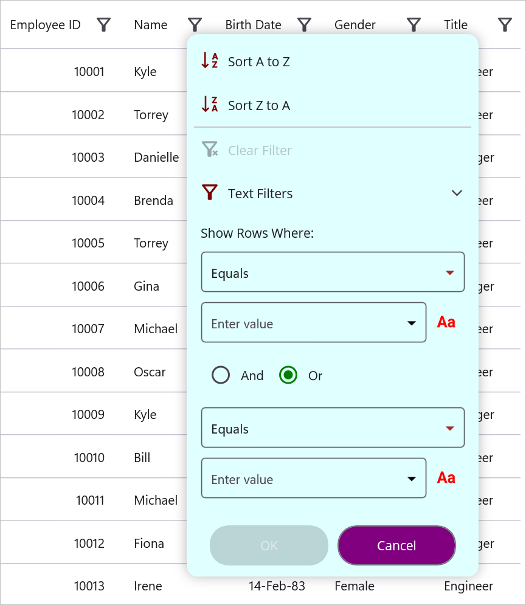

### Appearance Customization Properties

The following `DataGridStyle` properties control the visual appearance of filter popups:

<table>
<tr>
<th>Property</th>
<th>Description</th>
</tr>
<tr>
<td>{{'[DataGridStyle.FilterPopupBackground](https://help.syncfusion.com/cr/maui/Syncfusion.Maui.DataGrid.DataGridStyle.html#Syncfusion_Maui_DataGrid_DataGridStyle_FilterPopupBackground)'| markdownify }}</td>
<td>Background color of the filter popup (Brush).</td>
</tr>
<tr>
<td>{{'[DataGridStyle.FilterPopupTextColor](https://help.syncfusion.com/cr/maui/Syncfusion.Maui.DataGrid.DataGridStyle.html#Syncfusion_Maui_DataGrid_DataGridStyle_FilterPopupTextColor)'| markdownify }}</td>
<td>Text color used within the popup.</td>
</tr>
<tr>
<td>{{'[DataGridStyle.FilterPopupIconColor](https://help.syncfusion.com/cr/maui/Syncfusion.Maui.DataGrid.DataGridStyle.html#Syncfusion_Maui_DataGrid_DataGridStyle_FilterPopupIconColor)'| markdownify }}</td>
<td>Color for icons displayed in the popup.</td>
</tr>
<tr>
<td>{{'[DataGridStyle.FilterPopupDisabledIconColor](https://help.syncfusion.com/cr/maui/Syncfusion.Maui.DataGrid.DataGridStyle.html#Syncfusion_Maui_DataGrid_DataGridStyle_FilterPopupDisabledIconColor)'| markdownify }}</td>
<td>Color of the clear-filter icon when it’s disabled in the popup.</td>
</tr>
<tr>
<td>{{'[DataGridStyle.FilterPopupTopDividerColor](https://help.syncfusion.com/cr/maui/Syncfusion.Maui.DataGrid.DataGridStyle.html#Syncfusion_Maui_DataGrid_DataGridStyle_FilterPopupTopDividerColor)'| markdownify }}</td>
<td>Color of the top divider line in the popup.</td>
</tr>
<tr>
<td>{{'[DataGridStyle.FilterPopupOkButtonBackgroundColor](https://help.syncfusion.com/cr/maui/Syncfusion.Maui.DataGrid.DataGridStyle.html#Syncfusion_Maui_DataGrid_DataGridStyle_FilterPopupOkButtonBackgroundColor)'| markdownify }}</td>
<td>Background color of the OK button in the popup.</td>
</tr>
<tr>
<td>{{'[DataGridStyle.FilterPopupOkButtonTextColor](https://help.syncfusion.com/cr/maui/Syncfusion.Maui.DataGrid.DataGridStyle.html#Syncfusion_Maui_DataGrid_DataGridStyle_FilterPopupOkButtonTextColor)'| markdownify }}</td>
<td>Text color of the OK button in the popup.</td>
</tr>
<tr>
<td>{{'[DataGridStyle.FilterPopupOkButtonDisabledColor](https://help.syncfusion.com/cr/maui/Syncfusion.Maui.DataGrid.DataGridStyle.html#Syncfusion_Maui_DataGrid_DataGridStyle_FilterPopupOkButtonDisabledColor)'| markdownify }}</td>
<td>Color of the OK button when disabled in the popup.</td>
</tr>
<tr>
<td>{{'[DataGridStyle.FilterPopupCancelButtonBackgroundColor](https://help.syncfusion.com/cr/maui/Syncfusion.Maui.DataGrid.DataGridStyle.html#Syncfusion_Maui_DataGrid_DataGridStyle_FilterPopupCancelButtonBackgroundColor)'| markdownify }}</td>
<td>Background color of the Cancel button in the popup.</td>
</tr>
<tr>
<td>{{'[DataGridStyle.FilterPopupCancelButtonTextColor](https://help.syncfusion.com/cr/maui/Syncfusion.Maui.DataGrid.DataGridStyle.html#Syncfusion_Maui_DataGrid_DataGridStyle_FilterPopupCancelButtonTextColor)'| markdownify }}</td>
<td>Text color of the Cancel button in the popup.</td>
</tr>
<tr>
<td>{{'[DataGridStyle.FilterPopupHeaderOkIconColor](https://help.syncfusion.com/cr/maui/Syncfusion.Maui.DataGrid.DataGridStyle.html#Syncfusion_Maui_DataGrid_DataGridStyle_FilterPopupHeaderOkIconColor)'| markdownify }}</td>
<td>Color of the OK icon in the popup in Mobile view.</td>
</tr>
<tr>
<td>{{'[DataGridStyle.FilterPopupHeaderCancelIconColor](https://help.syncfusion.com/cr/maui/Syncfusion.Maui.DataGrid.DataGridStyle.html#Syncfusion_Maui_DataGrid_DataGridStyle_FilterPopupHeaderCancelIconColor)'| markdownify }}</td>
<td>Color of the Cancel/Close icon in the popup in Mobile view.</td>
</tr>
<tr>
<td>{{'[DataGridStyle.FilterPopupPlaceholderColor](https://help.syncfusion.com/cr/maui/Syncfusion.Maui.DataGrid.DataGridStyle.html#Syncfusion_Maui_DataGrid_DataGridStyle_FilterPopupPlaceholderColor)'| markdownify }}</td>
<td>Placeholder color for search bar, entry, and combo boxes in the popup.</td>
</tr>
<tr>
<td>{{'[DataGridStyle.FilterPopupCheckboxCheckedColor](https://help.syncfusion.com/cr/maui/Syncfusion.Maui.DataGrid.DataGridStyle.html#Syncfusion_Maui_DataGrid_DataGridStyle_FilterPopupCheckboxCheckedColor)'| markdownify }}</td>
<td>Fill color of checkboxes when selected in Checkbox filter view.</td>
</tr>
<tr>
<td>{{'[DataGridStyle.FilterPopupSearchBarIconColor](https://help.syncfusion.com/cr/maui/Syncfusion.Maui.DataGrid.DataGridStyle.html#Syncfusion_Maui_DataGrid_DataGridStyle_FilterPopupSearchBarIconColor)'| markdownify }}</td>
<td>Color of the search icon in the checkbox filter view.</td>
</tr>
<tr>
<td>{{'[DataGridStyle.FilterPopupSearchBarStroke](https://help.syncfusion.com/cr/maui/Syncfusion.Maui.DataGrid.DataGridStyle.html#Syncfusion_Maui_DataGrid_DataGridStyle_FilterPopupSearchBarStroke)'| markdownify }}</td>
<td>Border color of the search bar in the checkbox filter view.</td>
</tr>
<tr>
<td>{{'[DataGridStyle.FilterPopupNoMatchesTextColor](https://help.syncfusion.com/cr/maui/Syncfusion.Maui.DataGrid.DataGridStyle.html#Syncfusion_Maui_DataGrid_DataGridStyle_FilterPopupNoMatchesTextColor)'| markdownify }}</td>
<td>Text color of the “No matches” label in the checkbox filter view.</td>
</tr>
<tr>
<td>{{'[DataGridStyle.FilterPopupRadioButtonCheckedColor](https://help.syncfusion.com/cr/maui/Syncfusion.Maui.DataGrid.DataGridStyle.html#Syncfusion_Maui_DataGrid_DataGridStyle_FilterPopupRadioButtonCheckedColor)'| markdownify }}</td>
<td>Color of checked And/Or radio buttons in Advanced filter view.</td>
</tr>
<tr>
<td>{{'[DataGridStyle.FilterPopupRadioButtonUncheckedColor](https://help.syncfusion.com/cr/maui/Syncfusion.Maui.DataGrid.DataGridStyle.html#Syncfusion_Maui_DataGrid_DataGridStyle_FilterPopupRadioButtonUncheckedColor)'| markdownify }}</td>
<td>Color of unchecked And/Or radio buttons in Advanced filter view.</td>
</tr>
<tr>
<td>{{'[DataGridStyle.FilterPopupCaseSensitiveActiveColor](https://help.syncfusion.com/cr/maui/Syncfusion.Maui.DataGrid.DataGridStyle.html#Syncfusion_Maui_DataGrid_DataGridStyle_FilterPopupCaseSensitiveActiveColor)'| markdownify }}</td>
<td>Case-sensitive icon color when activated in Advanced text filters.</td>
</tr>
<tr>
<td>{{'[DataGridStyle.FilterPopupCaseSensitiveInactiveColor](https://help.syncfusion.com/cr/maui/Syncfusion.Maui.DataGrid.DataGridStyle.html#Syncfusion_Maui_DataGrid_DataGridStyle_FilterPopupCaseSensitiveInactiveColor)'| markdownify }}</td>
<td>Case-sensitive icon color when inactive in Advanced text filters.</td>
</tr>
<tr>
<td>{{'[DataGridStyle.FilterPopupCaseSensitiveHoverColor](https://help.syncfusion.com/cr/maui/Syncfusion.Maui.DataGrid.DataGridStyle.html#Syncfusion_Maui_DataGrid_DataGridStyle_FilterPopupCaseSensitiveHoverColor)'| markdownify }}</td>
<td>Background color when hovering the case-sensitive icon (Advanced text filters).</td>
</tr>
<tr>
<td>{{'[DataGridStyle.FilterPopupCalendarIconColor](https://help.syncfusion.com/cr/maui/Syncfusion.Maui.DataGrid.DataGridStyle.html#Syncfusion_Maui_DataGrid_DataGridStyle_FilterPopupCalendarIconColor)'| markdownify }}</td>
<td>Calendar icon color for date pickers in Advanced date filters.</td>
</tr>
<tr>
<td>{{'[DataGridStyle.AdvanceFilterDropdownIconColor](https://help.syncfusion.com/cr/maui/Syncfusion.Maui.DataGrid.DataGridStyle.html#Syncfusion_Maui_DataGrid_DataGridStyle_AdvanceFilterDropdownIconColor)'| markdownify }}</td>
<td>Dropdown icon color used in the advanced filter header area.</td>
</tr>
<tr>
<td>{{'[DataGridStyle.AdvanceFilterTypeDropdownIconColor](https://help.syncfusion.com/cr/maui/Syncfusion.Maui.DataGrid.DataGridStyle.html#Syncfusion_Maui_DataGrid_DataGridStyle_AdvanceFilterTypeDropdownIconColor)'| markdownify }}</td>
<td>Dropdown icon color of the filter type combo box in Advanced filter.</td>
</tr>
<tr>
<td>{{'[DataGridStyle.AdvanceFilterValueDropdownIconColor](https://help.syncfusion.com/cr/maui/Syncfusion.Maui.DataGrid.DataGridStyle.html#Syncfusion_Maui_DataGrid_DataGridStyle_AdvanceFilterValueDropdownIconColor)'| markdownify }}</td>
<td>Dropdown icon color of the filter value combo box in Advanced filter.</td>
</tr>
<tr>
<td>{{'[DataGridStyle.AdvanceFilterTypeDropdownStroke](https://help.syncfusion.com/cr/maui/Syncfusion.Maui.DataGrid.DataGridStyle.html#Syncfusion_Maui_DataGrid_DataGridStyle_AdvanceFilterTypeDropdownStroke)'| markdownify }}</td>
<td>Border color of the filter type combo box (Advanced filter).</td>
</tr>
<tr>
<td>{{'[DataGridStyle.AdvanceFilterValueDropdownStroke](https://help.syncfusion.com/cr/maui/Syncfusion.Maui.DataGrid.DataGridStyle.html#Syncfusion_Maui_DataGrid_DataGridStyle_AdvanceFilterValueDropdownStroke)'| markdownify }}</td>
<td>Border color of the filter value combo box (Advanced filter).</td>
</tr>
</table>

N> The `FilterPopupHeaderCancelIconColor` and `FilterPopupHeaderOkIconColor` properties are supported only on mobile platforms.
