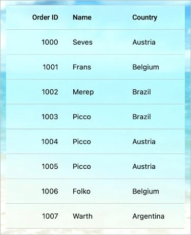

# Liquid Glass Effect in .NET MAUI DataGrid (SfDataGrid)

The Liquid Glass Effect introduces a modern, translucent design with adaptive color tinting and light refraction, creating a sleek, glass like user experience that remains clear and accessible. This section explains how to enable and customize the effect in the Syncfusion® .NET MAUI DataGrid (SfDataGrid) control.

## Apply liquid glass effect

Follow these steps to enable and configure the Liquid Glass Effect in the DataGrid control:

### Step 1: Wrap the control inside glass effect view

To apply the Liquid Glass Effect to Syncfusion® .NET MAUI [SfDataGrid](https://help.syncfusion.com/cr/maui/Syncfusion.Maui.DataGrid.SfDataGrid.html) control, wrap the control inside the [SfGlassEffectView](https://help.syncfusion.com/cr/maui/Syncfusion.Maui.Core.SfGlassEffectView.html) class.

For more details, refer to the [Liquid Glass Getting Started documentation](https://help.syncfusion.com/maui/liquid-glass-ui/getting-started).

### Step 2: Enable the liquid glass effect on DataGrid

Set the [EnableLiquidGlassEffect](https://help.syncfusion.com/cr/maui/Syncfusion.Maui.DataGrid.SfDataGrid.html?tabs=tabid-1#Syncfusion_Maui_DataGrid_SfDataGrid_EnableLiquidGlassEffect) property to `true` in the [SfDataGrid](https://help.syncfusion.com/cr/maui/Syncfusion.Maui.DataGrid.SfDataGrid.html) control to apply the Liquid Glass Effect. When enabled, the effect is also applied to its dependent surfaces such as the row/column dragging view, tooltip, popups, context menu, and editor drop-downs (e.g., ComboBox/Picker) when their corresponding backgrounds are set to `Transparent` for a smooth and engaging user experience.

### Step 3: Customize the background

To achieve a glass like background in the DataGrid related surfaces such as ContextMenu, Tooltip, RowDragViewBackground, and ColumnDragViewBackground, set their `Background` to `Transparent`. The background will then be treated as a tinted color, ensuring a consistent glass effect across the control and its overlays.

The following code snippet demonstrates how to apply the Liquid Glass Effect to the `SfDataGrid` control:




<Grid>
    <Grid.Background>
        <LinearGradientBrush StartPoint="0,0" 
                             EndPoint="0,1">
            <GradientStop Color="#0F4C75" 
                          Offset="0.0"/>
            <GradientStop Color="#3282B8" 
                          Offset="0.5"/>
            <GradientStop Color="#1B262C" 
                          Offset="1.0"/>
        </LinearGradientBrush>
    </Grid.Background>

    <core:SfGlassEffectView EffectType="Regular"
                            CornerRadius="20">
       <syncfusion:SfDataGrid x:Name="dataGrid"
                               Background="Transparent"
                               ItemsSource="{Binding OrderInfoCollection}"
                               EnableLiquidGlassEffect="True">
            <!-- Make specific surfaces transparent to reveal glass -->
            <syncfusion:SfDataGrid.DefaultStyle>
                <syncfusion:DataGridStyle RowDragViewBackgroundColor="Transparent"
                                          ColumnDragViewBackgroundColor="Transparent"/>
            </syncfusion:SfDataGrid.DefaultStyle>
        </syncfusion:SfDataGrid>
    </core:SfGlassEffectView>
</Grid>




using Syncfusion.Maui.Core;
using Syncfusion.Maui.DataGrid;

var gradientBrush = new LinearGradientBrush
{
    StartPoint = new Point(0, 0),
    EndPoint = new Point(0, 1),
    GradientStops = new GradientStopCollection
    {
        new GradientStop { Color = Color.FromArgb("#0F4C75"), Offset = 0.0f },
        new GradientStop { Color = Color.FromArgb("#3282B8"), Offset = 0.5f },
        new GradientStop { Color = Color.FromArgb("#1B262C"), Offset = 1.0f }
    }
};

var grid = new Grid
{
    Background = gradientBrush
};

var glassView = new SfGlassEffectsView
{
    CornerRadius = 20,
    EffectType = LiquidGlassEffectType.Regular
};

var dataGrid = new SfDataGrid
{
    Background = Colors.Transparent,
    ItemsSource = viewModel.OrderInfoCollection,
    EnableLiquidGlassEffect = true
};

// Make specific surfaces transparent to reveal glass

dataGrid.DefaultStyle.RowDragViewBackgroundColor = Colors.Transparent;
dataGrid.DefaultStyle.ColumnDragViewBackgroundColor = Colors.Transparent;

glassView.Content = this.dataGrid;
grid.Children.Add(glassView);
this.Content = grid;




The following screenshot illustrates SfDataGrid within SfGlassEffectView.

   

N>
* Supported on `macOS 26 or higher` and `iOS 26 or higher`.
* This feature is available only in `.NET 10.`
