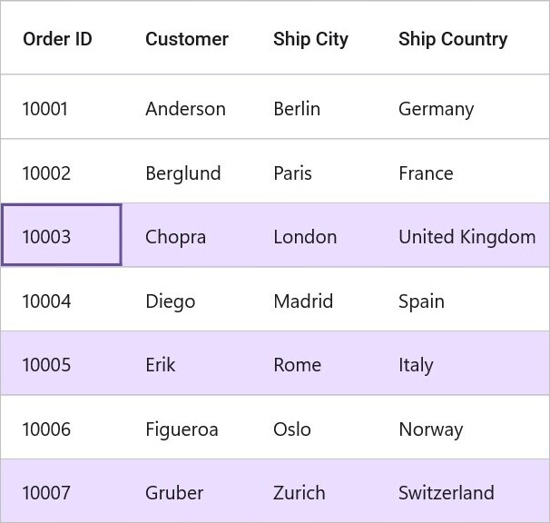
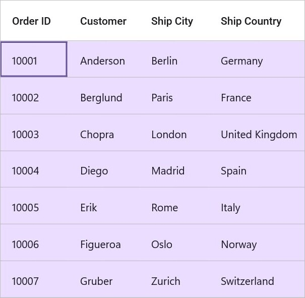
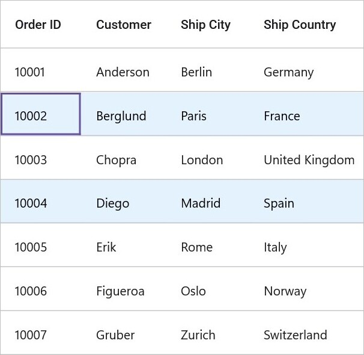

# Selection in .NET MAUI DataGrid (SfDataGrid)

The MAUI DataGrid [SfDataGrid](https://help.syncfusion.com/cr/maui/Syncfusion.Maui.DataGrid.html) allows you to select one or more rows based on the [SelectionMode](https://help.syncfusion.com/cr/maui/Syncfusion.Maui.DataGrid.DataGridSelectionMode.html).

To get start quickly with perform selection in .NET MAUI DataGrid, you can check on this video:

 <iframe id='MAUIDataGridVideoTutorial' src="https://www.youtube.com/embed/mN95SPfVcHo"></iframe>

## Current Cell Navigation
The Keyboard navigation through the cells and rows is determined based on the [NavigationMode](https://help.syncfusion.com/cr/maui/Syncfusion.Maui.DataGrid.SfDataGrid.html#Syncfusion_Maui_DataGrid_SfDataGrid_NavigationMode) property. The [NavigationMode.Cell](https://help.syncfusion.com/cr/maui/Syncfusion.Maui.DataGrid.DataGridNavigationMode.html#Syncfusion_Maui_DataGrid_DataGridNavigationMode_Cell) allows you to navigate between the cells in a row as well as between rows. The [NavigationMode.Row](https://help.syncfusion.com/cr/maui/Syncfusion.Maui.DataGrid.DataGridNavigationMode.html#Syncfusion_Maui_DataGrid_DataGridNavigationMode_Row) allows you to navigate only between rows. 

## Selection Modes
<table>
<tr>
<th> Modes </th>
<th> Description </th>
</tr>
<tr>
<td> {{'[None](https://help.syncfusion.com/cr/maui/Syncfusion.Maui.DataGrid.DataGridSelectionMode.html#Syncfusion_Maui_DataGrid_DataGridSelectionMode_None)'| markdownify }} </td>
<td>Disables selection, and no rows or cells can be selected. This is the default value.</td>
</tr>
<tr>
<td>{{'[Single](https://help.syncfusion.com/cr/maui/Syncfusion.Maui.DataGrid.DataGridSelectionMode.html#Syncfusion_Maui_DataGrid_DataGridSelectionMode_Single)'| markdownify }} </td>
<td> Allows selection of a single row. Upon selecting the next row or cell, the selection in the previous row or cell is cleared. </td>
</tr>
<tr>
<td>{{'[Multiple](https://help.syncfusion.com/cr/maui/Syncfusion.Maui.DataGrid.DataGridSelectionMode.html#Syncfusion_Maui_DataGrid_DataGridSelectionMode_Multiple)'| markdownify }}</td>
<td> Allows selection of more than one row. Selection is not cleared when selecting more than one row or cell. When you click on an already selected row or cell for the second time, the selection is cleared. </td>
</tr>
<tr>
<td> {{'[SingleDeselect](https://help.syncfusion.com/cr/maui/Syncfusion.Maui.DataGrid.DataGridSelectionMode.html#Syncfusion_Maui_DataGrid_DataGridSelectionMode_SingleDeselect)'| markdownify }} </td>
<td> Allows selection of a single row or cell only. However, upon tapping the row or cell again, the selection is cleared. Similar to single mode, upon selecting the next row or cell, the selection in the previous row or cell is cleared. </td>
</tr>
</table>

## Disable selection for rows and columns
Disable selection in a particular row or cell or column by handling the [CurrentCellActivating](https://help.syncfusion.com/cr/maui/Syncfusion.Maui.DataGrid.SfDataGrid.html#Syncfusion_Maui_DataGrid_SfDataGrid_CurrentCellActivating) event.

## Getting selected rows
The `SfDataGrid` provides [SelectedIndex](https://help.syncfusion.com/cr/maui/Syncfusion.Maui.DataGrid.SfDataGrid.html#Syncfusion_Maui_DataGrid_SfDataGrid_SelectedIndex), [SelectedRow](https://help.syncfusion.com/cr/maui/Syncfusion.Maui.DataGrid.SfDataGrid.html#Syncfusion_Maui_DataGrid_SfDataGrid_SelectedRow), [SelectedRows](https://help.syncfusion.com/cr/maui/Syncfusion.Maui.DataGrid.SfDataGrid.html#Syncfusion_Maui_DataGrid_SfDataGrid_SelectedRows) and [CurrentRow](https://help.syncfusion.com/cr/maui/Syncfusion.Maui.DataGrid.SfDataGrid.html#Syncfusion_Maui_DataGrid_SfDataGrid_CurrentRow) properties to get details of the selected rows when the selection mode is Single, Multiple, and SingleDeselect.

`SfDataGrid.SelectedRow`: Provides the underlying data object of the selected row. Denotes the underlying data object of the first selected row in multiple selections.

`SfDataGrid.SelectedIndex`: Provides the row index of SfDataGrid.SelectedRow. Denotes the index of first selected row in multiple selections.

`SfDataGrid.CurrentRow`: Provides the underlying data object of the currently selected row in the DataGrid. Denotes the underlying data object of lastly selected row in multiple selections.

`SfDataGrid.SelectedRows`: Provides all the selected records of the selected items when multiple selection is enabled.

## CurrentRow vs SelectedRow 
Both the `SelectedRow` and `CurrentRow` returns the same data object when the selection mode is single. When multiple selection is enabled, the initially selected record will be maintained in the `SelectedRow`, and the currently selected record will be maintained in the `CurrentRow`.

## Programmatic selection

### Process selection using properties
When the selection mode is set a value other than None, programmatically select a row in two ways either by setting the row index to the `SfDataGrid.SelectedIndex` property or by setting the underlying object to be selected to the `SfDataGrid.SelectedRow` property.
When `SelectionMode` is set as Multiple, select more than one row by setting the `SfDataGrid.SelectedRows` property. 



public partial class MainPage : ContentPage
{
    public MainPage()
    {
        InitializeComponent();
        //Perform selection using the selected index
        this.dataGrid.SelectedIndex = 3;

        //Perform selection using the selected row
        this.dataGrid.SelectedRow = new ViewModel().OrderInfoCollection[3];
    }
}



When the selection mode is multiple, programmatically select more than one row by adding the underlying object to be selected to the `SfDataGrid.SelectedRows` property.



public partial class MainPage : ContentPage
{
    public MainPage()
    {
        InitializeComponent();
        // Perform multiple selection using the selected rows
        var viewModel = new ViewModel();
        dataGrid.SelectedRows.Add(viewModel.OrderInfoCollection[4]);
        dataGrid.SelectedRows.Add(viewModel.OrderInfoCollection[6]);
        dataGrid.SelectedRows.Add(viewModel.OrderInfoCollection[2]);
        dataGrid.SelectedRows.Add(viewModel.OrderInfoCollection[11]);
    }
}



### Select all the rows
Select all the rows in the datagrid using the [SfDataGrid.SelectAll()](https://help.syncfusion.com/cr/maui/Syncfusion.Maui.DataGrid.SfDataGrid.html#Syncfusion_Maui_DataGrid_SfDataGrid_SelectAll) method.


public partial class MainPage : ContentPage
{
    public MainPage()
    {
        InitializeComponent();
        dataGrid.SelectAll();
    }
}



## Keyboard behavior
<table>
<tr>
<th>
Key or KeyCombinations
</th>
<th>
Description
</th>
</tr>
<tr>
<td>
<kbd>DownArrow</kbd>
</td>
<td>
Moves the CurrentCell directly below the active current cell. If the CurrentCell is in the last row, pressing the <kbd>DownArrow</kbd> does nothing.
</td>
</tr>
<tr>
<td>
<kbd>UpArrow</kbd>
</td>
<td>
Moves the CurrentCell directly above the active current cell. If the CurrentCell is in the first row, pressing the <kbd>UpArrow</kbd> does nothing.
</td>
</tr>
<tr>
<td>
<kbd>LeftArrow</kbd>
</td>
<td>
Moves the current cell to previous to the active current cell. If the CurrentCell is in the first cell, pressing the <kbd>LeftArrow</kbd> does nothing. 
</td>
</tr>
<tr>
<td>
<kbd>RightArrow</kbd>
</td>
<td>
Moves the current cell to next to the active current cell. If the CurrentCell is in the last cell, pressing the <kbd>RightArrow</kbd> does nothing. 
</td>
</tr>
<tr>
<td>
<kbd>Home</kbd> / <kbd> Ctrl</kbd> + <kbd>LeftArrow</kbd>
</td>
<td>
Moves the current cell to the first cell of the current row.
</td>
</tr>
<tr>
<td>
<kbd>End</kbd> / <kbd>Ctrl</kbd> + <kbd>RightArrow</kbd>
</td>
<td>
Moves the current cell to the last cell of the current row.
</td>
</tr>
<tr>
<td>
<kbd>PageDown</kbd>
</td>
<td>
The SfDataGrid will be scrolled to the next set of rows that are not displayed in the view, including the row that is partially displayed and the current cell is set to the last row.
</td>
</tr>
<tr>
<td>
<kbd>PageUp</kbd>
</td>
<td>
The SfDataGrid will be scrolled to the previous set of rows that are not displayed in the view, including the row that is partially displayed and the current cell is set to the first row.
</td>
</tr>
<tr>
<td>
<kbd>Tab</kbd>
</td>
<td>
Moves the current cell to next to the active current cell. If the active current cell is the last cell of the current row, the focus will moved to the first cell of the row next to the current row.If the active current cell is the last cell of the last row, the focus will be moved to the next control in the tab order of the parent container.
</td>
</tr>
<tr>
<td>
<kbd>Shift</kbd> + <kbd>Tab</kbd>
</td>
<td>
Moves the current cell to previous to the active current cell. If the active current cell is the first cell of the current row, the current cell will moved to the last cell of the row previous to the current row. If the active current cell is the first cell of the first row, the focus will be moved to the previous control in the tab order of the parent container.
</td>
</tr>
<tr>
<td>
<kbd>Ctrl</kbd> + <kbd>DownArrow</kbd>
</td>
<td>
Moves the current cell to the current column of the last row.
</td>
</tr>
<tr>
<td>
<kbd>Ctrl</kbd> + <kbd>UpArrow</kbd>
</td>
<td>
Moves the current cell to the current column of the first row.
</td>
</tr>
<tr>
<td>
<kbd>Ctrl</kbd> + <kbd>Home</kbd>
</td>
<td>
Moves the current cell to the first cell of the first row.
</td>
</tr>
<tr>
<td>
<kbd>Ctrl</kbd> + <kbd>End</kbd>
</td>
<td>
Moves the current cell to the last cell of the last row.
</td>
</tr>
<tr>
<td>
<kbd>Enter</kbd>
</td>
<td>
If the active current cell is in edit mode, the changes will be committed and moves the current cell to below the active current cell. If the active current cell is in the last row, commits changes only and retains in the same cell.
</td>
</tr>
<tr>
<td>
<kbd>Ctrl</kbd> + <kbd>A</kbd>
</td>
<td>
All rows or cells will be selected.
</td>
</tr>
<tr>
<td>
<kbd>Delete</kbd>
</td>
<td>
Selected rows will be deleted.
</td>
</tr>
</table>

## Move Current Cell
The [CurrentCell](https://help.syncfusion.com/cr/maui/Syncfusion.Maui.DataGrid.SfDataGrid.html#Syncfusion_Maui_DataGrid_SfDataGrid_CurrentCell) can be moved to a particular [RowColumnIndex](https://help.syncfusion.com/cr/maui/Syncfusion.Maui.GridCommon.ScrollAxis.RowColumnIndex.html) by using the [SfDataGrid.MoveCurrentCellTo()](https://help.syncfusion.com/cr/maui/Syncfusion.Maui.DataGrid.SfDataGrid.html#Syncfusion_Maui_DataGrid_SfDataGrid_MoveCurrentCellTo_Syncfusion_Maui_GridCommon_ScrollAxis_RowColumnIndex_System_Boolean_) method. This method is not applicable when the `SfDataGrid.SelectionMode` is None or the `NavigationMode` is Row.



public partial class MainPage : ContentPage
{
    public MainPage()
    {
        InitializeComponent();
        dataGrid.MoveCurrentCellTo(new RowColumnIndex(3, 1), false);
    }
}



## Clear selection
The `DataGrid` allows you to clear the selection applied in the grid rows and columns either by setting the `SfDataGrid.SelectionMode` to None or by calling the [SfDataGrid.ClearSelection()](https://help.syncfusion.com/cr/maui/Syncfusion.Maui.DataGrid.SfDataGrid.html#Syncfusion_Maui_DataGrid_SfDataGrid_ClearSelection) method.



public partial class MainPage : ContentPage
{
    public MainPage()
    {
        InitializeComponent();
        //Clear selection using the selection mode
        dataGrid.SelectionMode = Syncfusion.Maui.DataGrid.DataGridSelectionMode.None;

        //Clear selection using the clear selection method.
        dataGrid.ClearSelection();
    }
}



## Disable focus for a column

By default, the current cell is focusable for all the columns. To disable current cell focus for a particular column, you can simply set `DataGridColumn.AllowFocus` property to `false`.



<syncfusion:SfDataGrid x:Name="sfDataGrid"
                    SelectionMode="Single"
                    NavigationMode="Cell"
                    ColumnWidthMode="Auto"
                    ItemsSource="{Binding OrderInfoCollection}" >
<syncfusion:SfDataGrid.Columns>
   <syncfusion:DataGridTextColumn MappingName="OrderID"
                 Format="D"
                 AllowFocus="False"
                 HeaderText="Order ID" />
   <syncfusion:DataGridTextColumn MappingName="CustomerID"
                 HeaderText="Customer ID" />
   <syncfusion:DataGridTextColumn MappingName="ShipCountry "
                 HeaderText="Ship Country " />
</syncfusion:SfDataGrid.Columns>
</syncfusion:SfDataGrid>



## Disable Deleting the rows

By default, the selected rows will be deleted. If we set the `DataGrid.AllowDeleting` property to `False`, the deletion of rows will be disabled.



<syncfusion:SfDataGrid x:Name="sfDataGrid"
                    SelectionMode="Single"
                    NavigationMode="Cell"
                    AllowDeleting="False"
                    ItemsSource="{Binding OrderInfoCollection}" >
</syncfusion:SfDataGrid>



## Events in selection
The DataGrid provides the following events for selection:

[SelectionChanging](https://help.syncfusion.com/cr/maui/Syncfusion.Maui.DataGrid.SfDataGrid.html#Syncfusion_Maui_DataGrid_SfDataGrid_SelectionChanging): This event is raised while selecting a row at the execution time before the row is selected. So it allows canceling the selection action by setting the [Cancel](https://learn.microsoft.com/en-us/dotnet/api/system.componentmodel.canceleventargs.cancel?view=net-6.0#system-componentmodel-canceleventargs-cancel) property of [DataGridSelectionChangingEventArgs](https://help.syncfusion.com/cr/maui/Syncfusion.Maui.DataGrid.DataGridSelectionChangingEventArgs.html).

[SelectionChanged](https://help.syncfusion.com/cr/maui/Syncfusion.Maui.DataGrid.SfDataGrid.html#Syncfusion_Maui_DataGrid_SfDataGrid_SortColumnsChanged): This event is raised after a row is selected.
These two events are triggered with the `DataGridSelectionChangingEventArgs` and [DataGridSelectionChangedEventArgs](https://help.syncfusion.com/cr/maui/Syncfusion.Maui.DataGrid.DataGridSelectionChangedEventArgs.html) that contain the following properties:

[AddedRows](https://help.syncfusion.com/cr/maui/Syncfusion.Maui.DataGrid.DataGridSelectionChangingEventArgs.html#Syncfusion_Maui_DataGrid_DataGridSelectionChangingEventArgs_AddedRows): Gets a collection of the underlying data objects added for the selection.

[RemovedRows](https://help.syncfusion.com/cr/maui/Syncfusion.Maui.DataGrid.DataGridSelectionChangingEventArgs.html#Syncfusion_Maui_DataGrid_DataGridSelectionChangingEventArgs_RemovedRows): Gets a collection of the underlying data objects removed from the selection.

To hook the SelectionChanging event and cancel the selection, following this code example:



public partial class MainPage : ContentPage
{
    public MainPage()
    {
        InitializeComponent();
        this.dataGrid.SelectionChanging += DataGrid_SelectionChanging;
    }

    private void DataGrid_SelectionChanging(object sender, Syncfusion.Maui.DataGrid.DataGridSelectionChangingEventArgs e)
    {
        e.Cancel = true;
    }
}



To get the selected item in a code-behind using the `SelectionChanged` event, follow this code example:


public partial class MainPage : ContentPage
{
    public MainPage()
    {
        InitializeComponent();
        this.dataGrid.SelectionChanged += DataGrid_SelectionChanged;
    }

    private void DataGrid_SelectionChanged(object sender, Syncfusion.Maui.DataGrid.DataGridSelectionChangedEventArgs e)
    {
        var selectedItem = e.AddedRows[0];
    }
}



## CurrentRow
The [SfDataGrid.CurrentRow](https://help.syncfusion.com/cr/maui/Syncfusion.Maui.DataGrid.SfDataGrid.html#Syncfusion_Maui_DataGrid_SfDataGrid_CurrentRow) property holds the underlying data of the last selected row in the datagrid.

Get the current row in the `SfDataGrid.SelectionChanged` event by setting the `SfDataGrid.SelectionMode` as Multiple or SingleDeselect. If the SelectionMode is Single, the current item and selected item are same.

## Customize the current row highlight color
The `SfDataGrid` supports highlighting the current row when the `SelectionMode` is set to `Multiple`, and the `NavigationMode` is set to `Row`. The color of the currently highlighted row can be customized using the [CurrentRowHighlightColor](https://help.syncfusion.com/cr/maui/Syncfusion.Maui.DataGrid.DataGridStyle.html#Syncfusion_Maui_DataGrid_DataGridStyle_CurrentRowHighlightColor) property in the `DataGridStyle`.



<ContentPage xmlns:syncfusion="http://schemas.syncfusion.com/maui">
    <ContentPage.Content>
        <syncfusion:SfDataGrid ItemsSource="{Binding OrderInfoCollection}">
            <syncfusion:SfDataGrid.DefaultStyle>
                <syncfusion:DataGridStyle CurrentRowHighlightColor="Red"/>
            </syncfusion:SfDataGrid.DefaultStyle>
        </syncfusion:SfDataGrid>
    </ContentPage.Content>
</ContentPage>



## 	Customizing Selection Appearance
Change the selection back color and text color by using the  [SelectionBackground](https://help.syncfusion.com/cr/maui/Syncfusion.Maui.DataGrid.DataGridStyle.html#Syncfusion_Maui_DataGrid_DataGridStyle_SelectionBackground) and [SelectedRowTextColor](https://help.syncfusion.com/cr/maui/Syncfusion.Maui.DataGrid.DataGridStyle.html#Syncfusion_Maui_DataGrid_DataGridStyle_SelectedRowTextColor) in `SfDataGrid.DefaultStyle`.



<ContentPage xmlns:syncfusion="http://schemas.syncfusion.com/maui">
    <ContentPage.Content>
        <syncfusion:SfDataGrid ItemsSource="{Binding OrderInfoCollection}">
            <syncfusion:SfDataGrid.DefaultStyle>
                <syncfusion:DataGridStyle SelectedRowTextColor="Black" SelectionBackground="#E3F2FD"/>
            </syncfusion:SfDataGrid.DefaultStyle>
        </syncfusion:SfDataGrid>
    </ContentPage.Content>
</ContentPage>


public partial class MainPage : ContentPage
{
    public MainPage()
    {
        InitializeComponent();
        this.dataGrid.DefaultStyle.SelectedRowTextColor = Colors.Black;
        this.dataGrid.DefaultStyle.SelectionBackground = Color.FromArgb("#E3F2FD");
    }
}



## Changing current cell border color and width
Change the current cell border color and width by using the [CurrentCellBorderColor](https://help.syncfusion.com/cr/maui/Syncfusion.Maui.DataGrid.DataGridStyle.html#Syncfusion_Maui_DataGrid_DataGridStyle_CurrentCellBorderColor) and [CurrentCellBorderWidth](https://help.syncfusion.com/cr/maui/Syncfusion.Maui.DataGrid.DataGridStyle.html#Syncfusion_Maui_DataGrid_DataGridStyle_CurrentCellBorderWidth) in the SfDataGrid.DefaultStyle.



<ContentPage xmlns:syncfusion="http://schemas.syncfusion.com/maui">
    <ContentPage.Content>
        <syncfusion:SfDataGrid ItemsSource="{Binding OrderInfoCollection}">
            <syncfusion:SfDataGrid.DefaultStyle>
                <syncfusion:DataGridStyle CurrentCellBorderColor="Black" CurrentCellBorderWidth="4"/>
            </syncfusion:SfDataGrid.DefaultStyle>
        </syncfusion:SfDataGrid>
    </ContentPage.Content>
</ContentPage>


public partial class MainPage : ContentPage
{
    public MainPage()
    {
        InitializeComponent();
        this.dataGrid.DefaultStyle.CurrentCellBorderColor = Colors.Black;
        this.dataGrid.DefaultStyle.CurrentCellBorderWidth = 4;
    }
}



## Binding selection properties
The SfDataGrid allows you to bind the selection properties such as `SelectedIndex` and `SelectedRow` to the properties in the ViewModel directly.



<ContentPage xmlns:syncfusion="http://schemas.syncfusion.com/maui">
    <ContentPage.Content>
        <syncfusion:SfDataGrid ItemsSource="{Binding OrderInfoCollection}"
                            SelectedIndex="{Binding DataGridSelectedIndex}"
                            SelectedRow="{Binding DataGridSelectedRow}"/>
    </ContentPage.Content>
</ContentPage>


public class ViewModel : INotifyPropertyChanged
    {
        private int dataGridSelectedIndex;

        private object dataGridSelectedRow;

        public int DataGridSelectedIndex
        {
            get
            {
                return dataGridSelectedIndex;
            }
            set
            {
                this.dataGridSelectedIndex = value;
                RaisePropertyChanged("DataGridSelectedIndex");
            }
        }

        public object DataGridSelectedRow
        {
            get
            {
                return dataGridSelectedRow;
            }
            set
            {
                this.dataGridSelectedRow = value;
                RaisePropertyChanged("DataGridSelectedRow");
            }
        }

        public ViewModel()
        {
            DataGridSelectedIndex = 2;
            DataGridSelectedRow = OrderInfoCollection[5];
        }

        public event PropertyChangedEventHandler PropertyChanged;

        private void RaisePropertyChanged(string name)
        {
            if (PropertyChanged != null)
                this.PropertyChanged(this, new PropertyChangedEventArgs(name));
        }
    }



## Set KeyBoard Navigation

SfDataGrid allows you to set the Keyboard Navigation property as `True` or `False`. By default, Keyboard Navigation works. But you can set it to `False`, if you prefer to deactivate it.



<syncfusion:SfDataGrid x:Name="sfDataGrid"
                    SelectionMode="Single"
                    NavigationMode="Cell"
                    AllowKeyboardNavigation="False"
                    ItemsSource="{Binding OrderInfoCollection}" >
</syncfusion:SfDataGrid>

