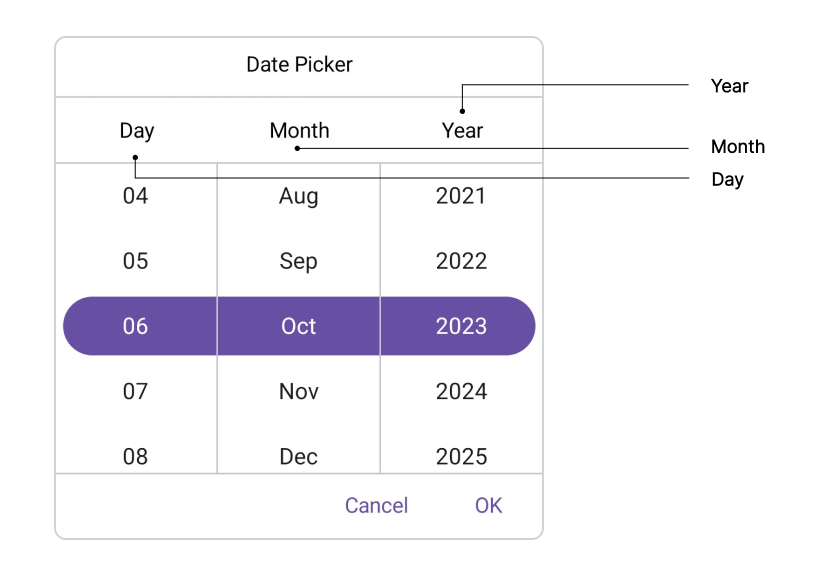
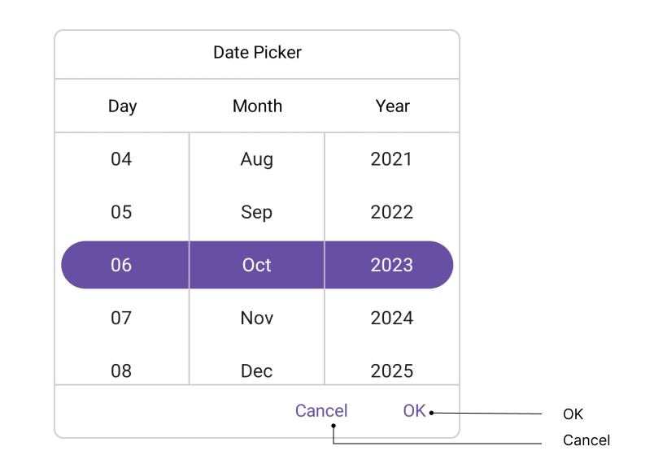
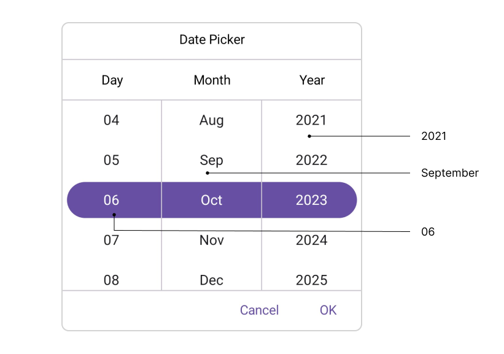

# Accessibility in .NET MAUI Date Picker (SfDatePicker)

The [.NET MAUI Date Picker](https://www.syncfusion.com/maui-controls/maui-datepicker) control has interact with the `Header`, `Column Header`, `Footer`, and `Picker Items`.

## Header Layout

The SfDatePicker control has interact [Header Text](https://help.syncfusion.com/cr/maui/Syncfusion.Maui.Picker.PickerHeaderView.html#Syncfusion_Maui_Picker_PickerHeaderView_Text) with localization of header layout.

## Column Header Layout

The SfDatePicker control has interact column header text with localization of column header layout. It contains [DayHeaderText](https://help.syncfusion.com/cr/maui/Syncfusion.Maui.Picker.DatePickerColumnHeaderView.html#Syncfusion_Maui_Picker_DatePickerColumnHeaderView_DayHeaderText), [MonthHeaderText](https://help.syncfusion.com/cr/maui/Syncfusion.Maui.Picker.DatePickerColumnHeaderView.html#Syncfusion_Maui_Picker_DatePickerColumnHeaderView_MonthHeaderText), and [YearHeaderText](https://help.syncfusion.com/cr/maui/Syncfusion.Maui.Picker.DatePickerColumnHeaderView.html#Syncfusion_Maui_Picker_DatePickerColumnHeaderView_YearHeaderText) properties of the [DatePickerColumnHeaderView](https://help.syncfusion.com/cr/maui/Syncfusion.Maui.Picker.DatePickerColumnHeaderView.html). The default value of the `DayHeaderText` property is "Day", `MonthHeaderText` is "Month", and `YearHeaderText` is "Year".

## Footer Layout

The SfDatePicker control has interact validation buttons (OK and Cancel) with localization of footer layout. The Default value of the [OkButtonText](https://help.syncfusion.com/cr/maui/Syncfusion.Maui.Picker.PickerFooterView.html#Syncfusion_Maui_Picker_PickerFooterView_OkButtonText) property is "OK", and [CancelButtonText](https://help.syncfusion.com/cr/maui/Syncfusion.Maui.Picker.PickerFooterView.html#Syncfusion_Maui_Picker_PickerFooterView_CancelButtonText) is "Cancel".

## Picker Items

The SfDatePicker control has interact with the item source in picker items. The item source contains based on the [Date Format](https://help.syncfusion.com/cr/maui/Syncfusion.Maui.Picker.PickerDateFormat.html). For example, 

<table>
<tr>
<th>Format</th>
<th>Example</th></tr>
<tr>
<td>d, M</td>
<td>1</td>
</tr>
<tr>
<td>dd, MM</td>
<td>01</td>
</tr>
<tr>
<td>MMM</td>
<td>January</td>
</tr> 
<tr>
<td>yyyy</td>
<td>2023</td>
</tr> 
</table>

## Keyboard
`SfDatePicker` supports selection using keyboard interactions.

<table>
<tr>
<th>
Key
</th>
<th>
Description
</th>
</tr>
<tr>
<td>
Tab
</td>
<td>
Focus the picker.
</td>
</tr>
<tr>
<td>
Enter
</td>
<td>
Opens the selected picker.
</td>
</tr>
<tr>
<td>
DownArrow
</td>
<td>
Selects an item from the currently expanded list by moving downwards.
</td>
</tr>
<tr>
<td>
UpArrow
</td>
<td>
Selects an item from the currently expanded list by moving upwards.
</td>
</tr>
<tr>
<td>
RightArrow/Tab
</td>
<td>
Navigates through the selected item in the right direction.
</td>
</tr>
<tr>
<td>
LeftArrow/Shift+Tab
</td>
<td>
Navigates through the selected item in the left direction.
</td>
</tr>
<tr>
<td>
Esc/Enter
</td>
<td>
Exit and commit selection.
</td>
</tr>
</table>
