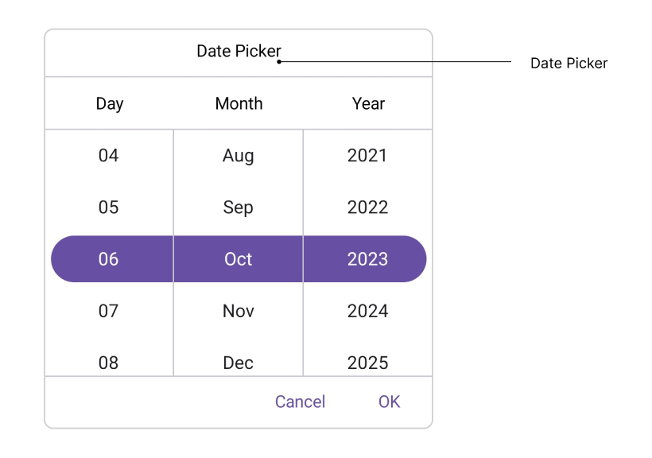
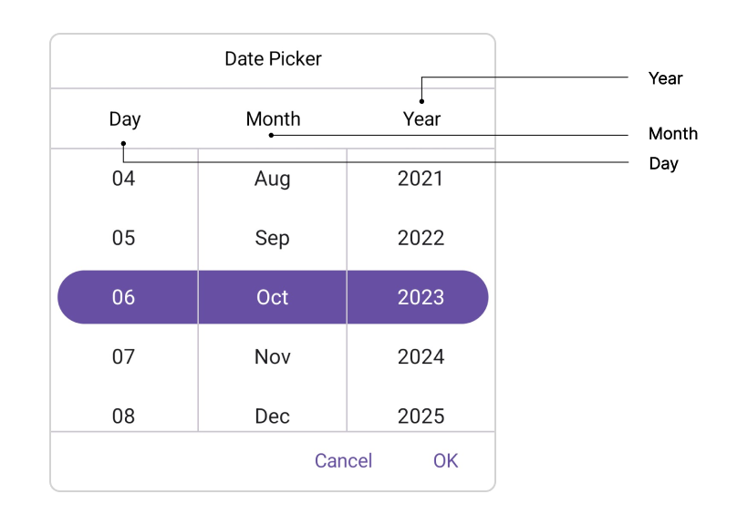
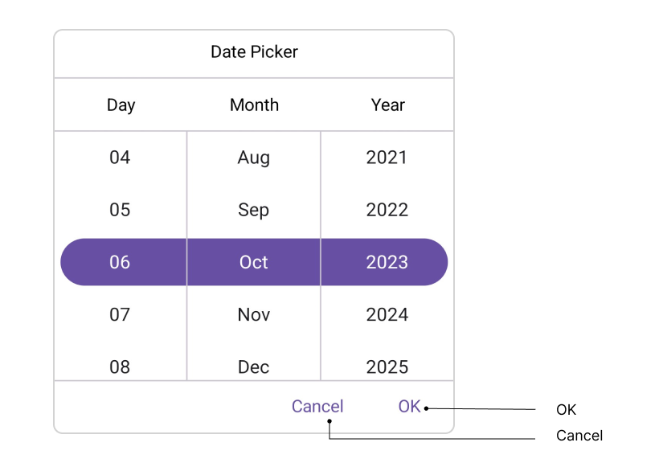
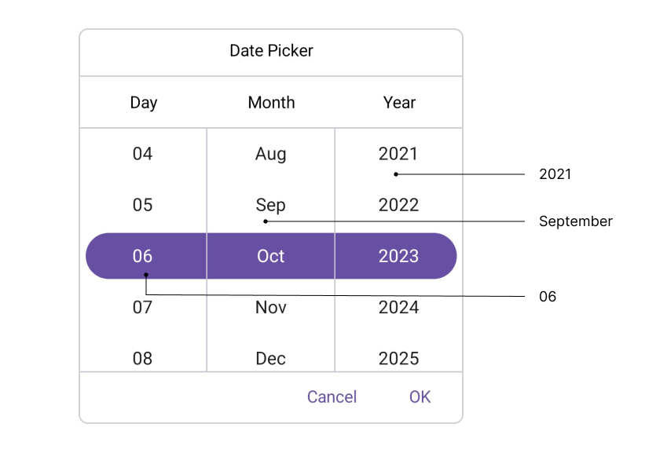

# Accessibility in .NET MAUI Date Picker (SfDatePicker)

The [.NET MAUI Date Picker](https://www.syncfusion.com/maui-controls/maui-datepicker) control has interact with the `Header`, `Column Header`, `Footer`, and `Picker Items`.

## Header Layout

The `SfDatePicker` supports an accessible header through the [Text](https://help.syncfusion.com/cr/maui/Syncfusion.Maui.Picker.PickerHeaderView.html#Syncfusion_Maui_Picker_PickerHeaderView_Text) property of `PickerHeaderView`.

## Column Header Layout

The `SfDatePicker` exposes accessible column header text through the [DayHeaderText](https://help.syncfusion.com/cr/maui/Syncfusion.Maui.Picker.DatePickerColumnHeaderView.html#Syncfusion_Maui_Picker_DatePickerColumnHeaderView_DayHeaderText), [MonthHeaderText](https://help.syncfusion.com/cr/maui/Syncfusion.Maui.Picker.DatePickerColumnHeaderView.html#Syncfusion_Maui_Picker_DatePickerColumnHeaderView_MonthHeaderText), and [YearHeaderText](https://help.syncfusion.com/cr/maui/Syncfusion.Maui.Picker.DatePickerColumnHeaderView.html#Syncfusion_Maui_Picker_DatePickerColumnHeaderView_YearHeaderText) properties of [DatePickerColumnHeaderView](https://help.syncfusion.com/cr/maui/Syncfusion.Maui.Picker.DatePickerColumnHeaderView.html). Localize these values to match the user's language.
The default value of the `DayHeaderText` property is "Day", `MonthHeaderText` is "Month", and `YearHeaderText` is "Year".

## Footer Layout

The `SfDatePicker` supports localized OK and Cancel buttons in the footer through the [OkButtonText](https://help.syncfusion.com/cr/maui/Syncfusion.Maui.Picker.PickerFooterView.html#Syncfusion_Maui_Picker_PickerFooterView_OkButtonText) and [CancelButtonText](https://help.syncfusion.com/cr/maui/Syncfusion.Maui.Picker.PickerFooterView.html#Syncfusion_Maui_Picker_PickerFooterView_CancelButtonText) properties of `PickerFooterView`.
The default value of the `OkButtonText` property is "OK", and `CancelButtonText` is "Cancel".

## Picker Items

The `SfDatePicker` formats picker items using the [DateFormat](https://help.syncfusion.com/cr/maui/Syncfusion.Maui.Picker.PickerDateFormat.html) property. The following table shows the supported formats and the resulting display:

<table>
<tr>
<th>Format</th>
<th>Example</th></tr>
<tr>
<td>d, M</td>
<td>1</td>
</tr>
<tr>
<td>dd, MM</td>
<td>01</td>
</tr>
<tr>
<td>MMM</td>
<td>January</td>
</tr>
<tr>
<td>yyyy</td>
<td>2023</td>
</tr>
</table>

## Keyboard Navigation

`SfDatePicker` supports selection using keyboard interactions. Keyboard mappings may vary slightly by platform (Windows, macOS, iOS, Android); the following tables describe the behavior on Windows.

<table>
<tr>
<th>Key</th>
<th>Description</th>
</tr>
<tr>
<td>Tab</td>
<td>Focus the picker.</td>
</tr>
<tr>
<td>Enter</td>
<td>Opens the selected picker.</td>
</tr>
<tr>
<td>DownArrow</td>
<td>Selects an item from the currently expanded list by moving downwards.</td>
</tr>
<tr>
<td>UpArrow</td>
<td>Selects an item from the currently expanded list by moving upwards.</td>
</tr>
<tr>
<td>RightArrow/Tab</td>
<td>Navigates through the selected item in the right direction.</td>
</tr>
<tr>
<td>LeftArrow/Shift+Tab</td>
<td>Navigates through the selected item in the left direction.</td>
</tr>
<tr>
<td>Esc/Enter</td>
<td>Exit and commit selection.</td>
</tr>
</table>