# Customizations in .NET MAUI Date Picker (SfDatePicker)

The [.NET MAUI Date Picker](https://www.syncfusion.com/maui-controls/maui-datepicker) header, column header, footer, and selection views can be customized.

## Header Customization

Customize the date picker header by using the `HeaderView` property of the `SfDatePicker`.

### Set the header text

The SfDatePicker control allows you to add the header text by setting the [Text](https://help.syncfusion.com/cr/maui/Syncfusion.Maui.Picker.PickerHeaderView.html#Syncfusion_Maui_Picker_PickerHeaderView_Text) property in the [PickerHeaderView](https://help.syncfusion.com/cr/maui/Syncfusion.Maui.Picker.PickerHeaderView.html). To enable the header view, set the [Height](https://help.syncfusion.com/cr/maui/Syncfusion.Maui.Picker.PickerHeaderView.html#Syncfusion_Maui_Picker_PickerHeaderView_Height) property of [PickerHeaderView](https://help.syncfusion.com/cr/maui/Syncfusion.Maui.Picker.PickerHeaderView.html) to a value greater than 0. The default value of the Height property is 0.





<picker:SfDatePicker x:Name="datepicker" >
    <picker:SfDatePicker.HeaderView >
        <picker:PickerHeaderView Height="40" Text="Date Picker"/>
    </picker:SfDatePicker.HeaderView>
</picker:SfDatePicker>





SfDatePicker datePicker = new SfDatePicker();
datepicker.HeaderView = new PickerHeaderView()
{
    Height = 40,
    Text = "Date Picker"
};

this.Content = datePicker;





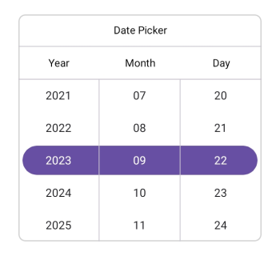

### Set the divider color

The SfDatePicker control allows you to customize the header divider color by setting the [DividerColor](https://help.syncfusion.com/cr/maui/Syncfusion.Maui.Picker.PickerHeaderView.html#Syncfusion_Maui_Picker_PickerHeaderView_DividerColor) property of the [PickerHeaderView](https://help.syncfusion.com/cr/maui/Syncfusion.Maui.Picker.PickerHeaderView.html).





<picker:SfDatePicker x:Name="datepicker" >
    <picker:SfDatePicker.HeaderView >
        <picker:PickerHeaderView DividerColor="Red" />
    </picker:SfDatePicker.HeaderView>
</picker:SfDatePicker>





SfDatePicker datePicker = new SfDatePicker();
datepicker.HeaderView = new PickerHeaderView()
{
    DividerColor = Colors.Red,
};

this.Content = datePicker;





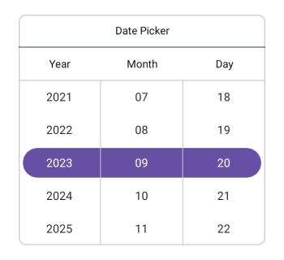

### Customization of the header

Customize the header text style and background color of the `Date picker` using the [TextStyle](https://help.syncfusion.com/cr/maui/Syncfusion.Maui.Picker.PickerHeaderView.html#Syncfusion_Maui_Picker_PickerHeaderView_TextStyle) and [Background](https://help.syncfusion.com/cr/maui/Syncfusion.Maui.Picker.PickerHeaderView.html#Syncfusion_Maui_Picker_PickerHeaderView_Background) properties of the [HeaderView](https://help.syncfusion.com/cr/maui/Syncfusion.Maui.Picker.SfDatePicker.html#Syncfusion_Maui_Picker_SfDatePicker_HeaderView) in the [PickerHeaderView](https://help.syncfusion.com/cr/maui/Syncfusion.Maui.Picker.PickerHeaderView.html).





<picker:SfDatePicker x:Name="datepicker" >
    <picker:SfDatePicker.HeaderView >
        <picker:PickerHeaderView Background="#D3D3D3">
            <picker:PickerHeaderView.TextStyle >
                <picker:PickerTextStyle FontSize="15" TextColor="Black" />
            </picker:PickerHeaderView.TextStyle>
        </picker:PickerHeaderView>
    </picker:SfDatePicker.HeaderView>
</picker:SfDatePicker>





SfDatePicker datePicker = new SfDatePicker();
datePicker.HeaderView = new PickerHeaderView()
{
    Background = Color.FromArgb("#D3D3D3"),
    TextStyle = new PickerTextStyle()
    {
        TextColor = Colors.Black,
        FontSize = 15,
    }
};

this.Content = datePicker;





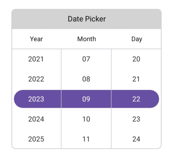

### Custom Header Appearance using Datatemplate

You can customize the date picker header appearance by using the [HeaderTemplate](https://help.syncfusion.com/cr/maui/Syncfusion.Maui.Picker.PickerBase.html#Syncfusion_Maui_Picker_PickerBase_HeaderTemplate) property in the [SfDatePicker](https://help.syncfusion.com/cr/maui/Syncfusion.Maui.Picker.SfDatePicker.html).





<picker:SfDatePicker x:Name="datepicker">
    <picker:SfDatePicker.HeaderTemplate>
        <DataTemplate>
            <Grid BackgroundColor="#BB9AB1">
                <Label HorizontalOptions="Center" VerticalOptions="Center" Text="Select a Date" TextColor="White"/>
            </Grid>
        </DataTemplate>
    </picker:SfDatePicker.HeaderTemplate>
</picker:SfDatePicker>





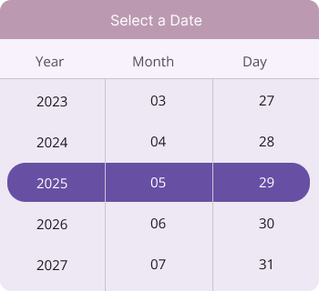

N> If a template is applied to the header in the [PickerHeaderView](https://help.syncfusion.com/cr/maui/Syncfusion.Maui.Picker.PickerHeaderView.html), the remaining header properties will not have any effect, except for the [DividerColor](https://help.syncfusion.com/cr/maui/Syncfusion.Maui.Picker.PickerHeaderView.html#Syncfusion_Maui_Picker_PickerHeaderView_DividerColor) Property.

### Custom Header appearance using DataTemplateSelector

You can customize the date picker header appearance by using the [HeaderTemplate](https://help.syncfusion.com/cr/maui/Syncfusion.Maui.Picker.PickerBase.html#Syncfusion_Maui_Picker_PickerBase_HeaderTemplate) property in the [SfDatePicker](https://help.syncfusion.com/cr/maui/Syncfusion.Maui.Picker.SfDatePicker.html). The DataTemplateSelector allows you to choose a DataTemplate at runtime based on the value bound to the date picker header. This lets you apply a custom data template to the header and customize its appearance based on specific conditions.





<Grid.Resources>
    <DataTemplate x:Key="todayDatesTemplate">
        <Grid Background="LightBlue">
            <Label HorizontalOptions="Center" VerticalOptions="Center" Text="Select a Date" TextColor="Red"/>
        </Grid>
    </DataTemplate>
    <DataTemplate x:Key="normalDatesTemplate">
        <Grid Background="LightGreen">
            <Label HorizontalOptions="Center" VerticalOptions="Center" Text="Select a Date" TextColor="Orange"/>
        </Grid>
    </DataTemplate>
    <local:DateTemplateSelector x:Key="headerTemplateSelector" TodayDatesTemplate="{StaticResource todayDatesTemplate}"  NormaldatesTemplate="{StaticResource normalDatesTemplate}"/>
    <picker:SfDatePicker x:Name="datepicker" HeaderTemplate="{StaticResource headerTemplateSelector}">
    </picker:SfDatePicker>
</Grid.Resources>





public class DateTemplateSelector : DataTemplateSelector
{
    public DateTemplateSelector()
    {
    }
    public DataTemplate TodayDatesTemplate { get; set; }
    public DataTemplate NormaldatesTemplate { get; set; }
    protected override DataTemplate OnSelectTemplate(object item, BindableObject container)
    {
        var Details = item as SfDatePicker;
        if (Details != null)
        {
            if (Details.SelectedDate.HasValue && Details.SelectedDate.Value < DateTime.Now.Date)
                return TodayDatesTemplate;
        }
        return NormaldatesTemplate;
    }
}





## Column Header Customization

Customize the date picker column header by using the `ColumnHeaderView` property of the `SfDatePicker`.

### Set custom column header 

The [SfDatePicker](https://help.syncfusion.com/cr/maui/Syncfusion.Maui.Picker.SfDatePicker.html) provides a custom text to its column header by setting the [ColumnHeaderView](https://help.syncfusion.com/cr/maui/Syncfusion.Maui.Picker.SfDatePicker.html#Syncfusion_Maui_Picker_SfDatePicker_ColumnHeaderView) property of the [SfDatePicker](https://help.syncfusion.com/cr/maui/Syncfusion.Maui.Picker.SfDatePicker.html), which has [DayHeaderText](https://help.syncfusion.com/cr/maui/Syncfusion.Maui.Picker.DatePickerColumnHeaderView.html#Syncfusion_Maui_Picker_DatePickerColumnHeaderView_DayHeaderText), [MonthHeaderText](https://help.syncfusion.com/cr/maui/Syncfusion.Maui.Picker.DatePickerColumnHeaderView.html#Syncfusion_Maui_Picker_DatePickerColumnHeaderView_MonthHeaderText), and [YearHeaderText](https://help.syncfusion.com/cr/maui/Syncfusion.Maui.Picker.DatePickerColumnHeaderView.html#Syncfusion_Maui_Picker_DatePickerColumnHeaderView_YearHeaderText) properties of the [DatePickerColumnHeaderView](https://help.syncfusion.com/cr/maui/Syncfusion.Maui.Picker.DatePickerColumnHeaderView.html). The default value of the [DayHeaderText](https://help.syncfusion.com/cr/maui/Syncfusion.Maui.Picker.DatePickerColumnHeaderView.html#Syncfusion_Maui_Picker_DatePickerColumnHeaderView_DayHeaderText) property is "Day", [MonthHeaderText](https://help.syncfusion.com/cr/maui/Syncfusion.Maui.Picker.DatePickerColumnHeaderView.html#Syncfusion_Maui_Picker_DatePickerColumnHeaderView_MonthHeaderText) is "Month", and [YearHeaderText](https://help.syncfusion.com/cr/maui/Syncfusion.Maui.Picker.DatePickerColumnHeaderView.html#Syncfusion_Maui_Picker_DatePickerColumnHeaderView_YearHeaderText) is "Year".





<picker:SfDatePicker x:Name="datepicker" >
    <picker:SfDatePicker.ColumnHeaderView >
        <picker:DatePickerColumnHeaderView DayHeaderText="Day Column"
                                           MonthHeaderText="Month Column"
                                           YearHeaderText="Year Column"/>
    </picker:SfDatePicker.ColumnHeaderView>
</picker:SfDatePicker>





SfDatePicker datePicker = new SfDatePicker();
datePicker.ColumnHeaderView = new DatePickerColumnHeaderView()
{
    DayHeaderText = "Day Column",
    MonthHeaderText = "Month Column",
    YearHeaderText = "Year Column"
};

this.Content = datePicker;





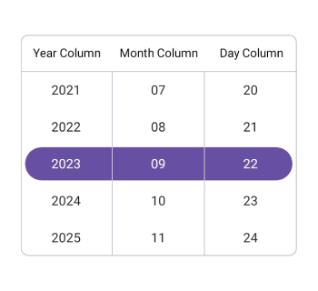

### Set the divider color

The SfDatePicker control allows you to customize the column header divider color by setting the [DividerColor](https://help.syncfusion.com/cr/maui/Syncfusion.Maui.Picker.DatePickerColumnHeaderView.html#Syncfusion_Maui_Picker_DatePickerColumnHeaderView_DividerColor) property of the [DatePickerColumnHeaderView](https://help.syncfusion.com/cr/maui/Syncfusion.Maui.Picker.DatePickerColumnHeaderView.html).





<picker:SfDatePicker x:Name="datepicker" >
    <picker:SfDatePicker.ColumnHeaderView >
        <picker:DatePickerColumnHeaderView DividerColor="Red" />
    </picker:SfDatePicker.ColumnHeaderView>
</picker:SfDatePicker>





SfDatePicker datePicker = new SfDatePicker();
datepicker.ColumnHeaderView = new DatePickerColumnHeaderView()
{
    DividerColor = Colors.Red,
};

this.Content = datePicker;





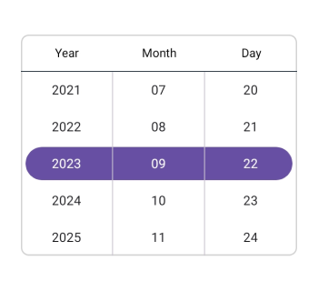

### Customization of the column header

Customize the column header view text style and background color of the Date Picker using the [TextStyle](https://help.syncfusion.com/cr/maui/Syncfusion.Maui.Picker.DatePickerColumnHeaderView.html#Syncfusion_Maui_Picker_DatePickerColumnHeaderView_TextStyle) and [Background](https://help.syncfusion.com/cr/maui/Syncfusion.Maui.Picker.DatePickerColumnHeaderView.html#Syncfusion_Maui_Picker_DatePickerColumnHeaderView_Background) properties of the [DatePickerColumnHeaderView](https://help.syncfusion.com/cr/maui/Syncfusion.Maui.Picker.DatePickerColumnHeaderView.html).





<picker:SfDatePicker x:Name="datepicker" >
    <picker:SfDatePicker.ColumnHeaderView >
        <picker:DatePickerColumnHeaderView Background="#D3D3D3">
            <picker:DatePickerColumnHeaderView.TextStyle >
                <picker:PickerTextStyle FontSize="15" TextColor="Black" />
            </picker:DatePickerColumnHeaderView.TextStyle>
        </picker:DatePickerColumnHeaderView>
    </picker:SfDatePicker.ColumnHeaderView>
</picker:SfDatePicker>





SfDatePicker datePicker = new SfDatePicker();
datePicker.ColumnHeaderView = new DatePickerColumnHeaderView()
{
    Background = Color.FromArgb("#D3D3D3"),
    TextStyle = new PickerTextStyle()
    {
        TextColor = Colors.Black,
        FontSize = 15,
    }
};

this.Content = datePicker;





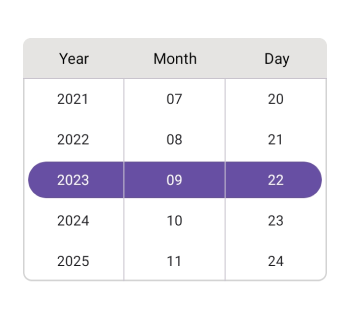

### Custom Column Header Appearance using Datatemplate

You can customize the date picker column header appearance by using the [ColumnHeaderTemplate](https://help.syncfusion.com/cr/maui/Syncfusion.Maui.Picker.PickerBase.html#Syncfusion_Maui_Picker_PickerBase_ColumnHeaderTemplate) property in the [SfDatePicker](https://help.syncfusion.com/cr/maui/Syncfusion.Maui.Picker.SfDatePicker.html).





<picker:SfDatePicker x:Name="datepicker" >
    <picker:SfDatePicker.ColumnHeaderTemplate>
        <DataTemplate>
            <Grid BackgroundColor="#BB9AB1">
                <Grid.ColumnDefinitions>
                    <ColumnDefinition/>
                    <ColumnDefinition/>
                    <ColumnDefinition/>
                </Grid.ColumnDefinitions>
                <Label Text="Year" Grid.Column="0" TextColor="White" HorizontalTextAlignment="Center" VerticalTextAlignment="Center"/>
                <Label Text="Month" Grid.Column="1" TextColor="White"  HorizontalTextAlignment="Center" VerticalTextAlignment="Center"/>
                <Label Text="Day" Grid.Column="2" TextColor="White" HorizontalTextAlignment="Center" VerticalTextAlignment="Center"/>
            </Grid>
        </DataTemplate>
    </picker:SfDatePicker.ColumnHeaderTemplate>
</picker:SfDatePicker>





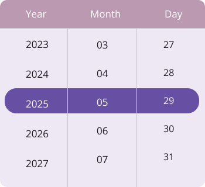

N> If a template is applied to the column header in the [DatePickerColumnHeaderView](https://help.syncfusion.com/cr/maui/Syncfusion.Maui.Picker.DatePickerColumnHeaderView.html), the remaining column header properties will not have any effect, except for the [DividerColor](https://help.syncfusion.com/cr/maui/Syncfusion.Maui.Picker.DatePickerColumnHeaderView.html#Syncfusion_Maui_Picker_DatePickerColumnHeaderView_DividerColor) property.

### Custom Column Header appearance using DataTemplateSelector

You can customize the date picker column header appearance by using the [ColumnHeaderTemplate](https://help.syncfusion.com/cr/maui/Syncfusion.Maui.Picker.PickerBase.html#Syncfusion_Maui_Picker_PickerBase_ColumnHeaderTemplate) property in the [SfDatePicker](https://help.syncfusion.com/cr/maui/Syncfusion.Maui.Picker.SfDatePicker.html). The DataTemplateSelector allows you to choose a DataTemplate at runtime based on the value bound to the date picker column header. This lets you apply a custom data template to the column header and customize its appearance based on specific conditions.





<Grid.Resources>
    <DataTemplate x:Key="todayDatesTemplate">
        <Grid Background="LightBlue">
            <Grid.ColumnDefinitions>
                    <ColumnDefinition/>
                    <ColumnDefinition/>
                    <ColumnDefinition/>
                </Grid.ColumnDefinitions>
            <Label Text="Year" Grid.Column="0" TextColor="Red" HorizontalTextAlignment="Center" VerticalTextAlignment="Center"/>
            <Label Text="Month" Grid.Column="1" TextColor="Red"  HorizontalTextAlignment="Center" VerticalTextAlignment="Center"/>
            <Label Text="Day" Grid.Column="2" TextColor="Red" HorizontalTextAlignment="Center" VerticalTextAlignment="Center"/>
        </Grid>
    </DataTemplate>
    <DataTemplate x:Key="normalDatesTemplate">
        <Grid Background="LightGreen">
            <Grid.ColumnDefinitions>
                <ColumnDefinition/>
                <ColumnDefinition/>
                <ColumnDefinition/>
            </Grid.ColumnDefinitions>
            <Label Text="Year" Grid.Column="0" TextColor="Orange" HorizontalTextAlignment="Center" VerticalTextAlignment="Center"/>
            <Label Text="Month" Grid.Column="1" TextColor="Orange"  HorizontalTextAlignment="Center" VerticalTextAlignment="Center"/>
            <Label Text="Day" Grid.Column="2" TextColor="Orange" HorizontalTextAlignment="Center" VerticalTextAlignment="Center"/>
        </Grid>
    </DataTemplate>
    <local:DateTemplateSelector x:Key="columnHeaderTemplateSelector" TodayDatesTemplate="{StaticResource todayDatesTemplate}"  NormaldatesTemplate="{StaticResource normalDatesTemplate}"/>
    <picker:SfDatePicker x:Name="datepicker" ColumnHeaderTemplate="{StaticResource columnHeaderTemplateSelector}">
    </picker:SfDatePicker>
</Grid.Resources>





public class DateTemplateSelector : DataTemplateSelector
{
    public DateTemplateSelector()
    {
    }
    public DataTemplate TodayDatesTemplate { get; set; }
    public DataTemplate NormaldatesTemplate { get; set; }
    protected override DataTemplate OnSelectTemplate(object item, BindableObject container)
    {
        var Details = item as SfDatePicker;
        if (Details != null)
        {
            if (Details.SelectedDate.HasValue && Details.SelectedDate.Value < DateTime.Now.Date)
                return TodayDatesTemplate;
        }
        return NormaldatesTemplate;
    }
}





## Footer Customization

Customize the date picker footer view by using the FooterView property of the SfDatePicker.

### Set the footer with OK and Cancel button customizations

In the SfDatePicker control, validation buttons (OK and Cancel) can be customized by setting the [OkButtonText](https://help.syncfusion.com/cr/maui/Syncfusion.Maui.Picker.PickerFooterView.html#Syncfusion_Maui_Picker_PickerFooterView_OkButtonText) and [CancelButtonText](https://help.syncfusion.com/cr/maui/Syncfusion.Maui.Picker.PickerFooterView.html#Syncfusion_Maui_Picker_PickerFooterView_CancelButtonText) properties of the [PickerFooterView](https://help.syncfusion.com/cr/maui/Syncfusion.Maui.Picker.PickerFooterView.html). It allows you to confirm or cancel the selected date. The OkButtonText can be enabled using the [ShowOkButton](https://help.syncfusion.com/cr/maui/Syncfusion.Maui.Picker.PickerFooterView.html#Syncfusion_Maui_Picker_PickerFooterView_ShowOkButton) property in the [PickerFooterView](https://help.syncfusion.com/cr/maui/Syncfusion.Maui.Picker.PickerFooterView.html).
The Default value of the [OkButtonText](https://help.syncfusion.com/cr/maui/Syncfusion.Maui.Picker.PickerFooterView.html#Syncfusion_Maui_Picker_PickerFooterView_OkButtonText) property is "OK", and [CancelButtonText](https://help.syncfusion.com/cr/maui/Syncfusion.Maui.Picker.PickerFooterView.html#Syncfusion_Maui_Picker_PickerFooterView_CancelButtonText) is "Cancel". To enable the footer view, set the [Height](https://help.syncfusion.com/cr/maui/Syncfusion.Maui.Picker.PickerFooterView.html#Syncfusion_Maui_Picker_PickerFooterView_Height) property of the [PickerFooterView](https://help.syncfusion.com/cr/maui/Syncfusion.Maui.Picker.PickerFooterView.html) to a value greater than 0. The default value of the Height property is 0.





<picker:SfDatePicker x:Name="datepicker" >
    <picker:SfDatePicker.FooterView >
        <picker:PickerFooterView Height="40" OkButtonText="Save"
                                 CancelButtonText="Exit"/>
    </picker:SfDatePicker.FooterView>
</picker:SfDatePicker>





SfDatePicker datePicker = new SfDatePicker();
datePicker.FooterView = new PickerFooterView()
{
    Height = 40,
    OkButtonText = "Save",
    CancelButtonText = "Exit",
};

this.Content = datePicker;





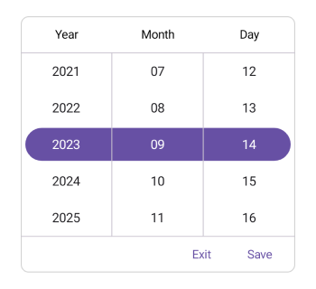

### Set the divider color

The SfDatePicker control allows you to customize the footer divider color by setting the [DividerColor](https://help.syncfusion.com/cr/maui/Syncfusion.Maui.Picker.PickerFooterView.html#Syncfusion_Maui_Picker_PickerFooterView_DividerColor) property of the [PickerFooterView](https://help.syncfusion.com/cr/maui/Syncfusion.Maui.Picker.PickerFooterView.html).





<picker:SfDatePicker x:Name="datepicker" >
    <picker:SfDatePicker.FooterView >
        <picker:PickerFooterView DividerColor="Red" />
    </picker:SfDatePicker.FooterView>
</picker:SfDatePicker>





SfDatePicker datePicker = new SfDatePicker();
datepicker.FooterView = new PickerFooterView()
{
    DividerColor = Colors.Red,
};

this.Content = datePicker;





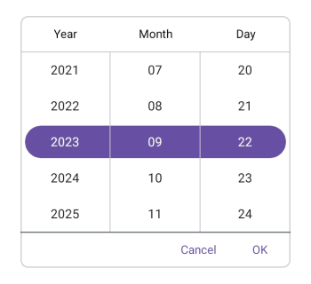

### Customization of the footer

Customize the footer text style and background color of the Date Picker using the [TextStyle](https://help.syncfusion.com/cr/maui/Syncfusion.Maui.Picker.PickerFooterView.html#Syncfusion_Maui_Picker_PickerFooterView_TextStyle) and [Background](https://help.syncfusion.com/cr/maui/Syncfusion.Maui.Picker.PickerFooterView.html#Syncfusion_Maui_Picker_PickerFooterView_Background) properties of the [PickerFooterView](https://help.syncfusion.com/cr/maui/Syncfusion.Maui.Picker.PickerFooterView.html).





<picker:SfDatePicker x:Name="datepicker" >
    <picker:SfDatePicker.FooterView >
        <picker:PickerFooterView Background="#D3D3D3">
            <picker:PickerFooterView.TextStyle >
                <picker:PickerTextStyle FontSize="15" TextColor="Black" />
            </picker:PickerFooterView.TextStyle>
        </picker:PickerFooterView>
    </picker:SfDatePicker.FooterView>
</picker:SfDatePicker>





SfDatePicker datePicker = new SfDatePicker();
datePicker.FooterView = new PickerFooterView()
{
    Background = Color.FromArgb("#D3D3D3"),
    TextStyle = new PickerTextStyle()
    {
        TextColor = Colors.Black,
        FontSize = 15,
    }
};

this.Content = datePicker;





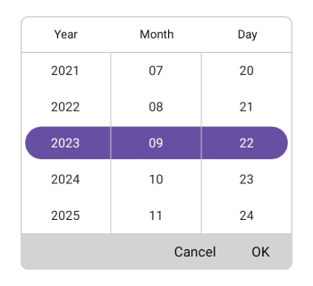

### Custom Footer Appearance using Datatemplate

You can customize the date picker footer appearance by using the [FooterTemplate](https://help.syncfusion.com/cr/maui/Syncfusion.Maui.Picker.PickerBase.html#Syncfusion_Maui_Picker_PickerBase_FooterTemplate) property in the [SfDatePicker](https://help.syncfusion.com/cr/maui/Syncfusion.Maui.Picker.SfDatePicker.html).





<picker:SfDatePicker x:Name="datepicker">
    <picker:SfDatePicker.FooterTemplate>
        <DataTemplate>
            <Grid BackgroundColor="#BB9AB1">
                <Grid.ColumnDefinitions>
                    <ColumnDefinition/>
                    <ColumnDefinition/>
                </Grid.ColumnDefinitions>
                <Button Grid.Column="0" Text="Decline" TextColor="White" Background="Transparent"/>
                <Button Grid.Column="1" Text="Accept" TextColor="White" Background="Transparent"/>
            </Grid>
        </DataTemplate>
    </picker:SfDatePicker.FooterTemplate>
</picker:SfDatePicker>





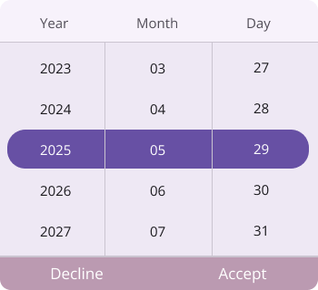

N> If a template is applied to the footer in the [PickerFooterView](https://help.syncfusion.com/cr/maui/Syncfusion.Maui.Picker.PickerFooterView.html), the remaining footer properties will not have any effect, except for the [DividerColor](https://help.syncfusion.com/cr/maui/Syncfusion.Maui.Picker.PickerFooterView.html#Syncfusion_Maui_Picker_PickerFooterView_DividerColor) Property.

### Custom Footer appearance using DataTemplateSelector

You can customize the date picker footer appearance by using the [FooterTemplate](https://help.syncfusion.com/cr/maui/Syncfusion.Maui.Picker.PickerBase.html#Syncfusion_Maui_Picker_PickerBase_FooterTemplate) property in the [SfDatePicker](https://help.syncfusion.com/cr/maui/Syncfusion.Maui.Picker.SfDatePicker.html). The DataTemplateSelector allows you to choose a DataTemplate at runtime based on the value bound to the date picker footer. This lets you apply a custom data template to the footer and customize its appearance based on specific conditions.





<Grid.Resources>
    <DataTemplate x:Key="todayDatesTemplate">
        <Grid Background="LightBlue">
            <Grid.ColumnDefinitions>
                <ColumnDefinition/>
                <ColumnDefinition/>
            </Grid.ColumnDefinitions>
            <Button Grid.Column="0" Text="Decline" TextColor="Red" Background="Transparent"/>
            <Button Grid.Column="1" Text="Accept" TextColor="Red" Background="Transparent"/>
        </Grid>
    </DataTemplate>
    <DataTemplate x:Key="normalDatesTemplate">
        <Grid Background="LightGreen">
            <Grid.ColumnDefinitions>
                <ColumnDefinition/>
                <ColumnDefinition/>
            </Grid.ColumnDefinitions>
            <Button Grid.Column="0" Text="Decline" TextColor="Orange" Background="Transparent"/>
            <Button Grid.Column="1" Text="Accept" TextColor="Orange" Background="Transparent"/>
        </Grid>
    </DataTemplate>
    <local:DateTemplateSelector x:Key="footerTemplateSelector" TodayDatesTemplate="{StaticResource todayDatesTemplate}"  NormaldatesTemplate="{StaticResource normalDatesTemplate}"/>
    <picker:SfDatePicker x:Name="datepicker" FooterTemplate="{StaticResource footerTemplateSelector}">
    </picker:SfDatePicker>
</Grid.Resources>





public class DateTemplateSelector : DataTemplateSelector
{
    public DateTemplateSelector()
    {
    }
    public DataTemplate TodayDatesTemplate { get; set; }
    public DataTemplate NormaldatesTemplate { get; set; }
    protected override DataTemplate OnSelectTemplate(object item, BindableObject container)
    {
        var Details = item as SfDatePicker;
        if (Details != null)
        {
            if (Details.SelectedDate.HasValue && Details.SelectedDate.Value < DateTime.Now.Date)
                return TodayDatesTemplate;
        }
        return NormaldatesTemplate;
    }
}





## Selection View Customization

Customize the date picker selection view by using the `SelectionView` property of the `SfDatePicker`.

### Set selection view

In the SfDatePicker control, the corner radius, stroke, and padding can be customized by setting the [CornerRadius](https://help.syncfusion.com/cr/maui/Syncfusion.Maui.Picker.PickerSelectionView.html#Syncfusion_Maui_Picker_PickerSelectionView_CornerRadius), [Stroke](https://help.syncfusion.com/cr/maui/Syncfusion.Maui.Picker.PickerSelectionView.html#Syncfusion_Maui_Picker_PickerSelectionView_Stroke), and [Padding](https://help.syncfusion.com/cr/maui/Syncfusion.Maui.Picker.PickerSelectionView.html#Syncfusion_Maui_Picker_PickerSelectionView_Padding) properties in the [PickerSelectionView](https://help.syncfusion.com/cr/maui/Syncfusion.Maui.Picker.PickerSelectionView.html).





<picker:SfDatePicker x:Name="datepicker" >
    <picker:SfDatePicker.SelectionView >
        <picker:PickerSelectionView CornerRadius="10" Stroke="#36454F" Padding="10, 5, 10, 5" Background="#808080" />
    </picker:SfDatePicker.SelectionView>
</picker:SfDatePicker>





SfDatePicker datePicker = new SfDatePicker();
datePicker.SelectionView = new PickerSelectionView()
{
    CornerRadius = 10,
    Stroke = Color.FromArgb("#36454F"),
    Pading = new Thickness(10, 5, 10, 5),
    Background = Color.FromArgb("#808080"),
};

this.Content = datePicker;





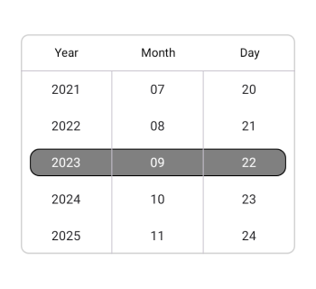

### Customization of the selected item

Customize the selected view text style of the Date Picker using the [SelectedTextStyle](https://help.syncfusion.com/cr/maui/Syncfusion.Maui.Picker.PickerBase.html#Syncfusion_Maui_Picker_PickerBase_SelectedTextStyle) property of the [SfDatePicker](https://help.syncfusion.com/cr/maui/Syncfusion.Maui.Picker.SfDatePicker.html).





<picker:SfDatePicker x:Name="datepicker" >
    <picker:SfDatePicker.SelectedTextStyle >
        <picker:PickerTextStyle FontSize="15" TextColor="White"/>
    </picker:SfDatePicker.SelectedTextStyle>
</picker:SfDatePicker>





SfDatePicker datePicker = new SfDatePicker();
datePicker.SelectedTextStyle = new PickerTextStyle()
{
    TextStyle = new PickerTextStyle()
    {
        TextColor = Colors.White,
        FontSize = 15,
    }
};

this.Content = datePicker;





## Column divider color

Customize the column divider color using the [ColumnDividerColor](https://help.syncfusion.com/cr/maui/Syncfusion.Maui.Picker.PickerBase.html#Syncfusion_Maui_Picker_PickerBase_ColumnDividerColor) property in [SfDatePicker](https://help.syncfusion.com/cr/maui/Syncfusion.Maui.Picker.SfDatePicker.html).




<picker:SfDatePicker x:Name="datepicker"
                     ColumnDividerColor="Red">

</picker:SfDatePicker>




SfDatePicker datepicker = new SfDatePicker();
datepicker.ColumnDividerColor = Colors.Red;
this.Content = datepicker;




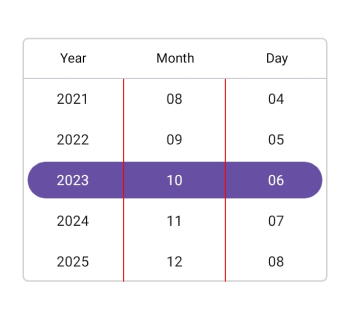

## CloseButtonIcon

### Enable CloseButton

You can enable the CloseButton in the [SfDatePicker](https://help.syncfusion.com/cr/maui/Syncfusion.Maui.Picker.SfDatePicker.html) header by using the [ShowCloseButton](https://help.syncfusion.com/cr/maui/Syncfusion.Maui.Picker.PickerBase.html#Syncfusion_Maui_Picker_PickerBase_ShowCloseButton) property. The default value is false.





 <Grid>
     <picker:SfDatePicker x:Name="datePicker" Mode="Dialog" ShowCloseButton="True">
         <picker:SfDatePicker.HeaderView >
             <picker:PickerHeaderView Height="40" Text="Date Picker"/>
         </picker:SfDatePicker.HeaderView>
     </picker:SfDatePicker>
     <Button Text="Open Picker" 
             x:Name="pickerButton"
             Clicked="Button_Clicked"
             HorizontalOptions="Center"
             VerticalOptions="Center"
             HeightRequest="50" 
             WidthRequest="150">
     </Button>
 </Grid>





private void Button_Clicked(object sender, EventArgs e)
{
    datePicker.IsOpen = true;
}





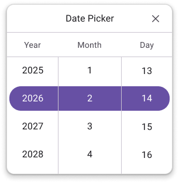

N>For the CloseButton to render properly, the header view must be present; otherwise, it will not function.

### Enable CloseButtonIcon

You can enable the CloseButtonIcon in the [SfDatePicker](https://help.syncfusion.com/cr/maui/Syncfusion.Maui.Picker.SfDatePicker.html) header by assigning a value to the [CloseButtonIcon](https://help.syncfusion.com/cr/maui/Syncfusion.Maui.Picker.PickerBase.html#Syncfusion_Maui_Picker_PickerBase_CloseButtonIcon) property. The default value is false.





 <Grid>
     <picker:SfDatePicker x:Name="datePicker" Mode="Dialog" ShowCloseButton="True" CloseButtonIcon="closeicon.png">
         <picker:SfDatePicker.HeaderView >
             <picker:PickerHeaderView Height="40" Text="Date Picker"/>
         </picker:SfDatePicker.HeaderView>
     </picker:SfDatePicker>
     <Button Text="Open Picker" 
             x:Name="pickerButton"
             Clicked="Button_Clicked"
             HorizontalOptions="Center"
             VerticalOptions="Center"
             HeightRequest="50" 
             WidthRequest="150">
     </Button>
 </Grid>





private void Button_Clicked(object sender, EventArgs e)
{
    datePicker.IsOpen = true;
}





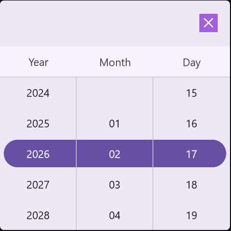

N>The ShowCloseButton property must be set to true for the close button icon to be displayed.
