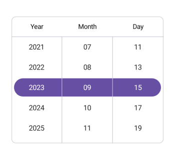
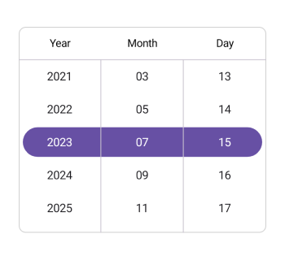
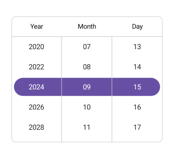

# Date Interval in .NET MAUI Date Picker(SfDatePicker)

The `SfDatePicker` provides three intervals in [.NET MAUI Date Picker](https://www.syncfusion.com/maui-controls/maui-datepicker).

 * [`DayInterval`](https://help.syncfusion.com/cr/maui/Syncfusion.Maui.Picker.SfDatePicker.html#Syncfusion_Maui_Picker_SfDatePicker_DayInterval)
 * [`MonthInterval`](https://help.syncfusion.com/cr/maui/Syncfusion.Maui.Picker.SfDatePicker.html#Syncfusion_Maui_Picker_SfDatePicker_MonthInterval)
 * [`YearInterval`](https://help.syncfusion.com/cr/maui/Syncfusion.Maui.Picker.SfDatePicker.html#Syncfusion_Maui_Picker_SfDatePicker_YearInterval)

## Day interval

Date Picker provides an option to give an interval between days using the [DayInterval](https://help.syncfusion.com/cr/maui/Syncfusion.Maui.Picker.SfDatePicker.html#Syncfusion_Maui_Picker_SfDatePicker_DayInterval) property of [SfDatePicker](https://help.syncfusion.com/cr/maui/Syncfusion.Maui.Picker.SfDatePicker.html).





<picker:SfDatePicker x:Name="datePicker"
                     DayInterval="2"/>





SfDatePicker datePicker = new SfDatePicker()
{
    DayInterval = 2
};

this.Content = datePicker;





## Month interval

Date Picker provides an option to give an interval between months using the [MonthInterval](https://help.syncfusion.com/cr/maui/Syncfusion.Maui.Picker.SfDatePicker.html#Syncfusion_Maui_Picker_SfDatePicker_MonthInterval) property of [SfDatePicker](https://help.syncfusion.com/cr/maui/Syncfusion.Maui.Picker.SfDatePicker.html).





<picker:SfDatePicker x:Name="datePicker"
                     MonthInterval="2"/>





SfDatePicker datePicker = new SfDatePicker()
{
    MonthInterval = 2
};

this.Content = datePicker;





## Year interval

Date Picker provides an option to give an interval between years using the [YearInterval](https://help.syncfusion.com/cr/maui/Syncfusion.Maui.Picker.SfDatePicker.html#Syncfusion_Maui_Picker_SfDatePicker_YearInterval) property of [SfDatePicker](https://help.syncfusion.com/cr/maui/Syncfusion.Maui.Picker.SfDatePicker.html).





<picker:SfDatePicker x:Name="datePicker"
                     YearInterval="2"/>





SfDatePicker datePicker = new SfDatePicker()
{
    YearInterval = 2
};

this.Content = datePicker;





