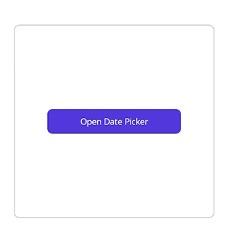
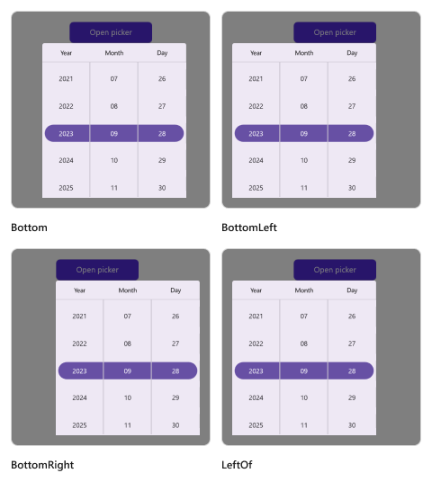
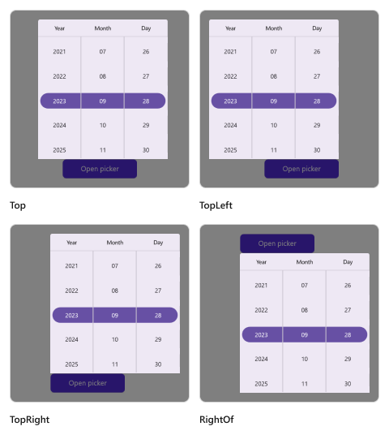

# Date Picker mode in .NET MAUI Date Picker (SfDatePicker)

The date picker mode is specified in the picker property enumeration, which is used to display the date picker based on the modes. It offers three modes: `Default`, `Dialog`, and `RelativeDialog`. The default picker mode is `Default` in the [SfDatePicker](https://help.syncfusion.com/cr/maui/Syncfusion.Maui.Picker.SfDatePicker.html).

## Dialog mode

The dialog mode is used to display the date picker in a pop-up by setting the [Mode](https://help.syncfusion.com/cr/maui/Syncfusion.Maui.Picker.PickerBase.html#Syncfusion_Maui_Picker_PickerBase_Mode) property to [`Dialog`](https://help.syncfusion.com/cr/maui/Syncfusion.Maui.Picker.PickerMode.html#Syncfusion_Maui_Picker_PickerMode_Dialog) in [SfDatePicker](https://help.syncfusion.com/cr/maui/Syncfusion.Maui.Picker.SfDatePicker.html).





<ContentPage
             . . .
             xmlns:picker="clr-namespace:Syncfusion.Maui.Picker;assembly=Syncfusion.Maui.Picker">
    <picker:SfDatePicker x:Name="datePicker"
                         Mode="Dialog"/>
</ContentPage>





using Syncfusion.Maui.Picker;

. . .
SfDatePicker datePicker = new SfDatePicker()
{
    Mode = PickerMode.Dialog
};

this.Content = datePicker;





Open the dialog programmatically by setting the [IsOpen](https://help.syncfusion.com/cr/maui/Syncfusion.Maui.Picker.PickerBase.html#Syncfusion_Maui_Picker_PickerBase_IsOpen) property to `true` of [SfDatePicker](https://help.syncfusion.com/cr/maui/Syncfusion.Maui.Picker.SfDatePicker.html). The default value is `false`.

N> The `IsOpen` property is automatically reset to `false` when you close the dialog by clicking outside of it.





<ContentPage
             . . .
             xmlns:picker="clr-namespace:Syncfusion.Maui.Picker;assembly=Syncfusion.Maui.Picker">
    <Grid>
        <picker:SfDatePicker x:Name="datePicker"
                             Mode="Dialog"/>
        <Button Text="Open Picker"
                x:Name="pickerButton"
                Clicked="Button_Clicked"
                HorizontalOptions="Center"
                VerticalOptions="Center"
                HeightRequest="50"
                WidthRequest="150"/>
    </Grid>
</ContentPage>





using Syncfusion.Maui.Picker;

. . .
private void Button_Clicked(object sender, System.EventArgs e)
{
    this.datePicker.IsOpen = true;
}





  

## Relative dialog mode

The relative dialog mode displays the date picker in a pop-up by setting the [Mode](https://help.syncfusion.com/cr/maui/Syncfusion.Maui.Picker.PickerBase.html#Syncfusion_Maui_Picker_PickerBase_Mode) property to [`RelativeDialog`](https://help.syncfusion.com/cr/maui/Syncfusion.Maui.Picker.PickerMode.html#Syncfusion_Maui_Picker_PickerMode_RelativeDialog). It is used to align the picker in a specific position. You can set the position by setting the [RelativePosition](https://help.syncfusion.com/cr/maui/Syncfusion.Maui.Picker.PickerBase.html#Syncfusion_Maui_Picker_PickerBase_RelativePosition) property in the [SfDatePicker](https://help.syncfusion.com/cr/maui/Syncfusion.Maui.Picker.SfDatePicker.html).

### Relative position

The [RelativePosition](https://help.syncfusion.com/cr/maui/Syncfusion.Maui.Picker.PickerBase.html#Syncfusion_Maui_Picker_PickerBase_RelativePosition) is specified in the picker property enumeration, which is used to align the picker in a specific position. It provides eight positions such as `AlignTop`, `AlignToLeftOf`, `AlignToRightOf`, `AlignBottom`, `AlignTopLeft`, `AlignTopRight`, `AlignBottomLeft`, and `AlignBottomRight`. The default relative position is `AlignTop` in the [SfDatePicker](https://help.syncfusion.com/cr/maui/Syncfusion.Maui.Picker.SfDatePicker.html).

The Date Picker can be opened programmatically by setting the [`IsOpen`](https://help.syncfusion.com/cr/maui/Syncfusion.Maui.Picker.PickerBase.html#Syncfusion_Maui_Picker_PickerBase_IsOpen) property to `true` of [SfDatePicker](https://help.syncfusion.com/cr/maui/Syncfusion.Maui.Picker.SfDatePicker.html). By default, the `IsOpen` property is `false`.

N> The `IsOpen` property is automatically reset to `false` when you close the dialog by clicking outside of it.





<ContentPage
             . . .
             xmlns:picker="clr-namespace:Syncfusion.Maui.Picker;assembly=Syncfusion.Maui.Picker">
    <Grid>
        <picker:SfDatePicker x:Name="datePicker"
                             Mode="RelativeDialog"
                             RelativePosition="AlignTopLeft"/>
        <Button Text="Open picker"
                x:Name="pickerButton"
                Clicked="Button_Clicked"
                HorizontalOptions="Center"
                VerticalOptions="Center"
                HeightRequest="50"
                WidthRequest="150"/>
    </Grid>
</ContentPage>





using Syncfusion.Maui.Picker;

. . .
private void Button_Clicked(object sender, System.EventArgs e)
{
    this.datePicker.IsOpen = true;
}





### Relative view

The [RelativeView](https://help.syncfusion.com/cr/maui/Syncfusion.Maui.Picker.PickerBase.html#Syncfusion_Maui_Picker_PickerBase_RelativeView) is specified in the picker's property enumeration and is used to display the picker dialog relative to a view by setting the [Mode](https://help.syncfusion.com/cr/maui/Syncfusion.Maui.Picker.PickerBase.html#Syncfusion_Maui_Picker_PickerBase_Mode) property to [`RelativeDialog`](https://help.syncfusion.com/cr/maui/Syncfusion.Maui.Picker.PickerMode.html#Syncfusion_Maui_Picker_PickerMode_RelativeDialog). You can set the position by setting the [RelativePosition](https://help.syncfusion.com/cr/maui/Syncfusion.Maui.Picker.PickerBase.html#Syncfusion_Maui_Picker_PickerBase_RelativePosition) property in the [SfDatePicker](https://help.syncfusion.com/cr/maui/Syncfusion.Maui.Picker.SfDatePicker.html).

N> It is only applicable in `RelativeDialog` mode. If `no relative view` is specified, the picker base will be set as the `default` relative view.





<ContentPage
             . . .
             xmlns:picker="clr-namespace:Syncfusion.Maui.Picker;assembly=Syncfusion.Maui.Picker">
    <Grid>
        <picker:SfDatePicker x:Name="datePicker"
                             Mode="RelativeDialog"
                             RelativePosition="AlignTopLeft"
                             RelativeView="{x:Reference pickerButton}"/>
        <Button Text="Open picker"
                x:Name="pickerButton"
                Clicked="Button_Clicked"
                HorizontalOptions="Center"
                VerticalOptions="Center"
                HeightRequest="50"
                WidthRequest="150"/>
    </Grid>
</ContentPage>





using Syncfusion.Maui.Picker;

. . .
private void Button_Clicked(object sender, System.EventArgs e)
{
    this.datePicker.IsOpen = true;
    this.datePicker.RelativeView = this.pickerButton;
}





   

   

### Custom popup size

SfDatePicker allows the display of the Popup to render at any desired size by setting the [PopupWidth](https://help.syncfusion.com/cr/maui/Syncfusion.Maui.Picker.PickerBase.html#Syncfusion_Maui_Picker_PickerBase_PopupWidth) and [PopupHeight](https://help.syncfusion.com/cr/maui/Syncfusion.Maui.Picker.PickerBase.html#Syncfusion_Maui_Picker_PickerBase_PopupHeight) properties.





<ContentPage
             . . .
             xmlns:picker="clr-namespace:Syncfusion.Maui.Picker;assembly=Syncfusion.Maui.Picker">
    <picker:SfDatePicker x:Name="datePicker"
                         Mode="Dialog"
                         PopupWidth="300"
                         PopupHeight="400"/>
</ContentPage>





using Syncfusion.Maui.Picker;

. . .
this.datePicker.PopupWidth = 300;
this.datePicker.PopupHeight = 400;



