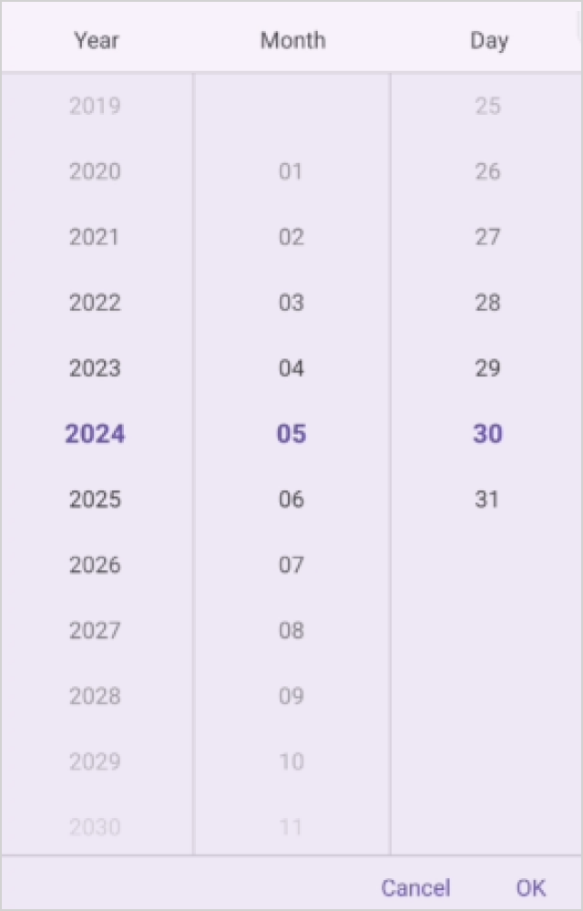
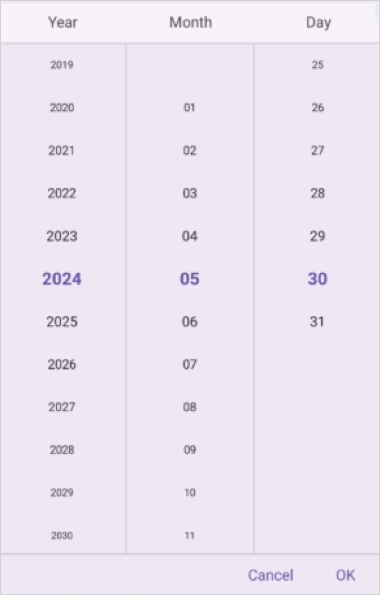
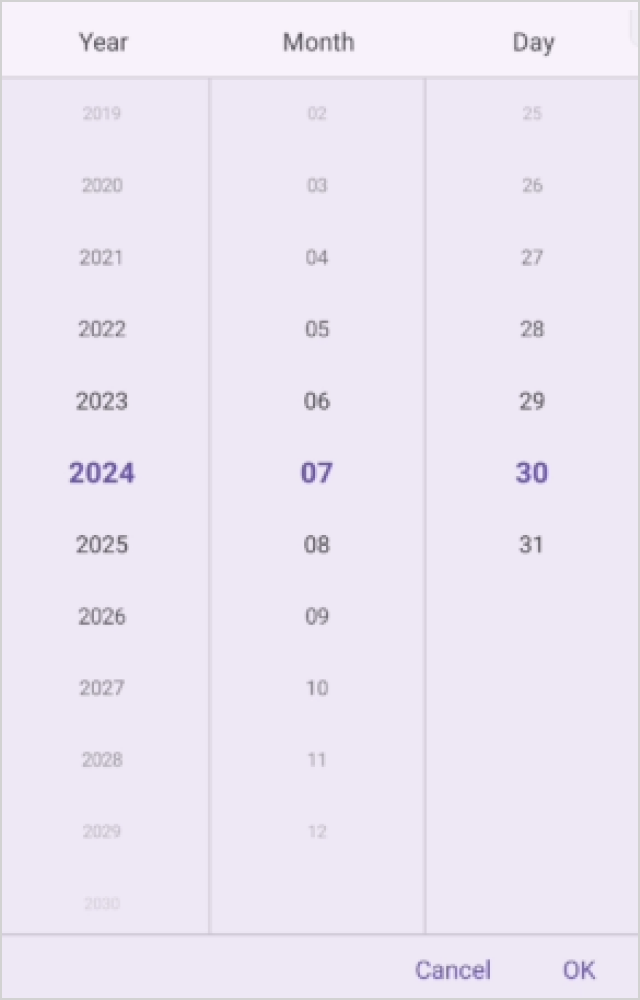

# Date Picker Text display mode in .NET MAUI Date Picker (SfDatePicker)

The date picker text display mode is specified in the date picker property enumeration, which is used to display the date picker items based on the modes. It offers four modes: `Default`, `Fade`, `Shrink` and `FadeAndShrink`. The default date picker text display mode is `Default` in the `SfDatePicker`.

## Fade Mode

The fade mode in the date picker gradually decreases the visibility of unselected items relative to the selected item. This effect is achieved by setting the `TextDisplayMode` property to `Fade` in `SfDatePicker`.





<datePicker:SfDatePicker x:Name="datePicker"
                 TextDisplayMode="Fade"/>





SfDatePicker datePicker = new SfDatePicker()
{
    TextDisplayMode = PickerTextDisplayMode.Fade
};

this.Content = datePicker;





## Shrink Mode

The shrink mode is used to display the font size of date picker items decreased from the selected item by setting the `TextDisplayMode` property to `Shrink` in `SfDatePicker`.





<datePicker:SfDatePicker x:Name="datePicker"
                 TextDisplayMode="Shrink"/>





SfDatePicker datePicker = new SfDatePicker()
{
    TextDisplayMode = PickerTextDisplayMode.Shrink
};

this.Content = datePicker;





## FadeAndShrink Mode

The fade and shrink mode are used to decrease the opacity and font size of date picker items from the selected item by setting the `TextDisplayMode` property to `FadeAndShrink` in `SfDatePicker`.





<datePicker:SfDatePicker x:Name="datePicker"
                 TextDisplayMode="FadeAndShrink"/>





SfDatePicker datePicker = new SfDatePicker()
{
    TextDisplayMode = PickerTextDisplayMode.FadeAndShrink
};

this.Content = datePicker;





