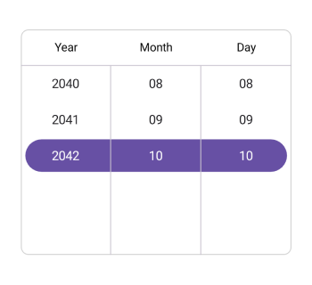

# Date Restriction in .NET MAUI Date Picker control

## Minimum Date

The Date Picker provides an option to restrict the selection of date items by using the [MinimumDate](https://help.syncfusion.com/cr/maui/Syncfusion.Maui.Picker.SfDatePicker.html#Syncfusion_Maui_Picker_SfDatePicker_MinimumDate) property in [SfDatePicker](https://help.syncfusion.com/cr/maui/Syncfusion.Maui.Picker.SfDatePicker.html). You cannot select dates before the minimum date. The MinimumDate value must be less than the MaximumDate value.




<ContentPage
             . . .
             xmlns:picker="clr-namespace:Syncfusion.Maui.Picker;assembly=Syncfusion.Maui.Picker">
    <picker:SfDatePicker x:Name="datePicker"
                         MinimumDate="2000/05/15">
    </picker:SfDatePicker>
</ContentPage>




using Syncfusion.Maui.Picker;

. . .
SfDatePicker datePicker = new SfDatePicker();
datePicker.MinimumDate = new DateTime(2000, 05, 15);
this.Content = datePicker;

  


## Maximum Date

The Date Picker provides an option to restrict the selection of date items by using the [MaximumDate](https://help.syncfusion.com/cr/maui/Syncfusion.Maui.Picker.SfDatePicker.html#Syncfusion_Maui_Picker_SfDatePicker_MaximumDate) property in [SfDatePicker](https://help.syncfusion.com/cr/maui/Syncfusion.Maui.Picker.SfDatePicker.html). You cannot select dates after the maximum date.




<ContentPage
             . . .
             xmlns:picker="clr-namespace:Syncfusion.Maui.Picker;assembly=Syncfusion.Maui.Picker">
    <picker:SfDatePicker x:Name="datePicker"
                         MaximumDate="2042/10/10">
    </picker:SfDatePicker>
</ContentPage>




using Syncfusion.Maui.Picker;

. . .
SfDatePicker datePicker = new SfDatePicker();
datePicker.MaximumDate = new DateTime(2042, 10, 10);
this.Content = datePicker;

  


## Blackout Dates

The [BlackoutDates](https://help.syncfusion.com/cr/maui/Syncfusion.Maui.Picker.SfDatePicker.html#Syncfusion_Maui_Picker_SfDatePicker_BlackoutDates) property in the [SfDatePicker](https://help.syncfusion.com/cr/maui/Syncfusion.Maui.Picker.SfDatePicker.html) lets you restrict the selection of specific dates by providing a list of dates to disable.




<ContentPage
             . . .
             xmlns:picker="clr-namespace:Syncfusion.Maui.Picker;assembly=Syncfusion.Maui.Picker">
    <picker:SfDatePicker x:Name="datePicker">
        <picker:SfDatePicker.BlackoutDates>
            <date:DateTime>2001-08-03</date:DateTime>
            <date:DateTime>2001-08-10</date:DateTime>
            <date:DateTime>2001-08-12</date:DateTime>
            <date:DateTime>2001-08-14</date:DateTime>
            <date:DateTime>2001-08-17</date:DateTime>
            <date:DateTime>2001-08-18</date:DateTime>
            <date:DateTime>2001-08-20</date:DateTime>
            <date:DateTime>2001-08-23</date:DateTime>
            <date:DateTime>2001-08-27</date:DateTime>
        </picker:SfDatePicker.BlackoutDates>
    </picker:SfDatePicker>
</ContentPage>




using Syncfusion.Maui.Picker;

. . .
SfDatePicker datePicker = new SfDatePicker();
datePicker.BlackoutDates.Add(new DateTime(2001, 8, 3));
datePicker.BlackoutDates.Add(new DateTime(2001, 8, 10));
datePicker.BlackoutDates.Add(new DateTime(2001, 8, 12));
datePicker.BlackoutDates.Add(new DateTime(2001, 8, 14));
datePicker.BlackoutDates.Add(new DateTime(2001, 8, 17));
datePicker.BlackoutDates.Add(new DateTime(2001, 8, 18));
datePicker.BlackoutDates.Add(new DateTime(2001, 8, 20));
datePicker.BlackoutDates.Add(new DateTime(2001, 8, 23));
datePicker.BlackoutDates.Add(new DateTime(2001, 8, 27));
this.Content = datePicker;

  


N> The `Selection View` will not be applicable when setting `BlackoutDates`.