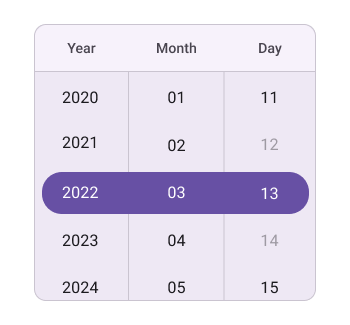

# Date Restriction in .NET MAUI Date Picker (SfDatePicker)

## Minimum date

The Date picker provides an option to restrict the selection of date items by using the [MinimumDate](https://help.syncfusion.com/cr/maui/Syncfusion.Maui.Picker.SfDatePicker.html#Syncfusion_Maui_Picker_SfDatePicker_MinimumDate) property in [SfDatePicker](https://help.syncfusion.com/cr/maui/Syncfusion.Maui.Picker.SfDatePicker.html), and you cannot select the dates beyond the minimum date range. The MinimumDate value has to be lesser than the MaximumDate value.




<picker:SfDatePicker x:Name="picker"
                     MinimumDate="2000/05/15">
</picker:SfDatePicker>




SfDatePicker picker = new SfDatePicker();
picker.MinimumDate = new DateTime(2000, 05, 15);
this.Content = picker;

  


## Maximum date

The Date picker provides an option to restrict the selection of date items by using the [MaximumDate](https://help.syncfusion.com/cr/maui/Syncfusion.Maui.Picker.SfDatePicker.html#Syncfusion_Maui_Picker_SfDatePicker_MaximumDate) property in [SfDatePicker](https://help.syncfusion.com/cr/maui/Syncfusion.Maui.Picker.SfDatePicker.html), and you cannot select the dates beyond the maximum date range.




<picker:SfDatePicker x:Name="picker"
                     MaximumDate="2042/10/10">
</picker:SfDatePicker>




SfDatePicker picker = new SfDatePicker();
picker.MaximumDate = new DateTime(2042, 10, 10);
this.Content = picker;

  


## Blackout Dates

The [BlackoutDates](https://help.syncfusion.com/cr/maui/Syncfusion.Maui.Picker.SfDatePicker.html#Syncfusion_Maui_Picker_SfDatePicker_BlackoutDates) property in the [SfDatePicker](https://help.syncfusion.com/cr/maui/Syncfusion.Maui.Picker.SfDatePicker.html) component lets you restrict the selection of specific dates. You can specify a list of dates to disable, preventing their selection. This feature helps enforce availability limits, such as blocking certain days in a month.




<picker:SfDatePicker x:Name="picker">
    <picker:SfDatePicker.BlackoutDates>
        <date:DateTime>2001-08-10</date:DateTime>
        <date:DateTime>2001-08-12</date:DateTime>
        <date:DateTime>2001-08-14</date:DateTime>
        <date:DateTime>2001-08-17</date:DateTime>
        <date:DateTime>2001-08-18</date:DateTime>
        <date:DateTime>2001-08-20</date:DateTime>
        <date:DateTime>2001-08-23</date:DateTime>
        <date:DateTime>2001-08-27</date:DateTime>
        <date:DateTime>2001-08-03</date:DateTime>
    </picker:SfDatePicker.BlackoutDates>
</picker:SfDatePicker>




SfDatePicker picker = new SfDatePicker();
picker.BlackoutDates.Add(new DateTime(2001, 8, 10));
picker.BlackoutDates.Add(new DateTime(2001, 8, 12));
picker.BlackoutDates.Add(new DateTime(2001, 8, 14));
picker.BlackoutDates.Add(new DateTime(2001, 8, 17));
picker.BlackoutDates.Add(new DateTime(2001, 8, 18));
picker.BlackoutDates.Add(new DateTime(2001, 8, 20));
picker.BlackoutDates.Add(new DateTime(2001, 8, 23));
picker.BlackoutDates.Add(new DateTime(2001, 8, 27));
picker.BlackoutDates.Add(new DateTime(2001, 8, 3));
this.Content = picker;

  


N> The `Selection View` will not be applicable when setting `Blackout dates`.