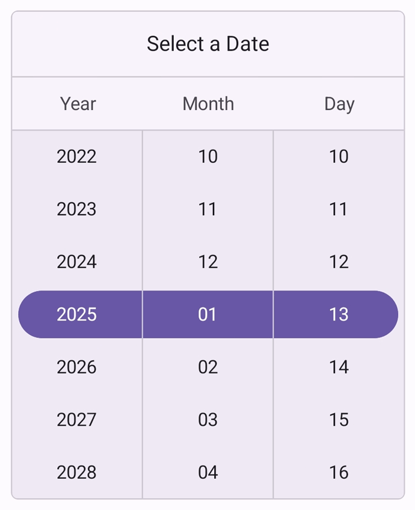

# Looping support in .NET MAUI Date Picker (SfDatePicker)

The [EnableLooping](https://help.syncfusion.com/cr/maui/Syncfusion.Maui.Picker.PickerBase.html#Syncfusion_Maui_Picker_PickerBase_EnableLooping) property allows you to enable looping support in the date picker control. With looping enabled, the control seamlessly navigates from the last item to the first item and back again, iterating in both forward and backward directions.

Enable looping by setting the [EnableLooping](https://help.syncfusion.com/cr/maui/Syncfusion.Maui.Picker.PickerBase.html#Syncfusion_Maui_Picker_PickerBase_EnableLooping) property to `true`. The default value is `false`.





<ContentPage
             . . .
             xmlns:picker="clr-namespace:Syncfusion.Maui.Picker;assembly=Syncfusion.Maui.Picker">
    <picker:SfDatePicker x:Name="datepicker"
                         EnableLooping="True"/>
</ContentPage>





using Syncfusion.Maui.Picker;

. . .
SfDatePicker datePicker = new SfDatePicker()
{
    EnableLooping = true
};

this.Content = datePicker;





{:width="330" height="360"}