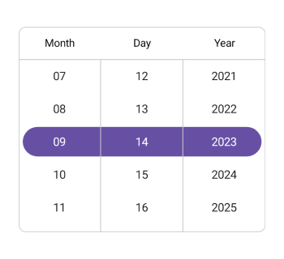

# Formatting in .NET MAUI Date Picker (SfDatePicker)

Format is a way to represent the date in a different string format. You can customize the date format using the [Format](https://help.syncfusion.com/cr/maui/Syncfusion.Maui.Picker.SfDatePicker.html#Syncfusion_Maui_Picker_SfDatePicker_Format) property in [PickerDateFormat](https://help.syncfusion.com/cr/maui/Syncfusion.Maui.Picker.PickerDateFormat.html). The default format is `yyyy_MM_dd`.

The different types of formats are:

[`dd_MM`](https://help.syncfusion.com/cr/maui/Syncfusion.Maui.Picker.PickerDateFormat.html#Syncfusion_Maui_Picker_PickerDateFormat_dd_MM) - Represents the day month in dd/MM format.

[`dd_MM_yyyy`](https://help.syncfusion.com/cr/maui/Syncfusion.Maui.Picker.PickerDateFormat.html#Syncfusion_Maui_Picker_PickerDateFormat_dd_MM_yyyy) - Represents the day month year in dd/MM/yyyy format.

[`dd_MMM_yyyy`](https://help.syncfusion.com/cr/maui/Syncfusion.Maui.Picker.PickerDateFormat.html#Syncfusion_Maui_Picker_PickerDateFormat_dd_MMM_yyyy) - Represents the day month year in dd/MMM/yyyy format.

[`M_d_yyyy`](https://help.syncfusion.com/cr/maui/Syncfusion.Maui.Picker.PickerDateFormat.html#Syncfusion_Maui_Picker_PickerDateFormat_M_d_yyyy) - Represents the month day year in M/d/yyyy format.

[`MM_dd_yyyy`](https://help.syncfusion.com/cr/maui/Syncfusion.Maui.Picker.PickerDateFormat.html#Syncfusion_Maui_Picker_PickerDateFormat_MM_dd_yyyy) - Represents the month day year in MM/dd/yyyy format.

[`MM_yyyy`](https://help.syncfusion.com/cr/maui/Syncfusion.Maui.Picker.PickerDateFormat.html#Syncfusion_Maui_Picker_PickerDateFormat_MM_yyyy) - Represents the month year in MM/yyyy format.

[`MMM_yyyy`](https://help.syncfusion.com/cr/maui/Syncfusion.Maui.Picker.PickerDateFormat.html#Syncfusion_Maui_Picker_PickerDateFormat_MMM_yyyy) - Represents the month year in MMM/yyyy format.

[`yyyy_MM_dd`](https://help.syncfusion.com/cr/maui/Syncfusion.Maui.Picker.PickerDateFormat.html#Syncfusion_Maui_Picker_PickerDateFormat_yyyy_MM_dd) - Represents the year month day in yyyy/MM/dd format.

[`MM_dd`](https://help.syncfusion.com/cr/maui/Syncfusion.Maui.Picker.PickerDateFormat.html#Syncfusion_Maui_Picker_PickerDateFormat_MM_dd) - Represents the month day in MM/dd format.

[`MMM_dd_yyyy`](https://help.syncfusion.com/cr/maui/Syncfusion.Maui.Picker.PickerDateFormat.html#Syncfusion_Maui_Picker_PickerDateFormat_MMM_dd_yyyy) - Represents the  month day year in MMM/dd/yyyy format.

[`MMMM_dd_yyyy`](https://help.syncfusion.com/cr/maui/Syncfusion.Maui.Picker.PickerDateFormat.html#Syncfusion_Maui_Picker_PickerDateFormat_MMMM_dd_yyyy) - Represents the month day year in MMMM/dd/yyyy format.

[`MMMM_yyyy`](https://help.syncfusion.com/cr/maui/Syncfusion.Maui.Picker.PickerDateFormat.html#Syncfusion_Maui_Picker_PickerDateFormat_MMMM_yyyy) - Represents the  month year in MMMM/yyyy format.

[`yyyy_MM`](https://help.syncfusion.com/cr/maui/Syncfusion.Maui.Picker.PickerDateFormat.html#Syncfusion_Maui_Picker_PickerDateFormat_yyyy_MM) - Represents the year month in yyyy/MM format.

[`yyyy_MMM`](https://help.syncfusion.com/cr/maui/Syncfusion.Maui.Picker.PickerDateFormat.html#Syncfusion_Maui_Picker_PickerDateFormat_yyyy_MMM) - Represents the year month in yyyy/MMM format.

[`yyyy_MMMM`](https://help.syncfusion.com/cr/maui/Syncfusion.Maui.Picker.PickerDateFormat.html#Syncfusion_Maui_Picker_PickerDateFormat_yyyy_MMMM) - Represents the year month in yyyy/MMMM format.

[`yyyy_MMM_dd`](https://help.syncfusion.com/cr/maui/Syncfusion.Maui.Picker.PickerDateFormat.html#Syncfusion_Maui_Picker_PickerDateFormat_yyyy_MMM_dd) - Represents the year month day in yyyy/MMM/dd format.

[`yyyy_MMMM_dd`](https://help.syncfusion.com/cr/maui/Syncfusion.Maui.Picker.PickerDateFormat.html#Syncfusion_Maui_Picker_PickerDateFormat_yyyy_MMMM_dd) - Represents the year month day in yyyy/MMMM/dd format.

[`dd_MMM`](https://help.syncfusion.com/cr/maui/Syncfusion.Maui.Picker.PickerDateFormat.html#Syncfusion_Maui_Picker_PickerDateFormat_dd_MMM) - Represents the day month in dd/MMM format.

[`dd_MMMM`](https://help.syncfusion.com/cr/maui/Syncfusion.Maui.Picker.PickerDateFormat.html#Syncfusion_Maui_Picker_PickerDateFormat_dd_MMMM) - Represents the day month in dd/MMMM format.

[`dd_MMMM_yyyy`](https://help.syncfusion.com/cr/maui/Syncfusion.Maui.Picker.PickerDateFormat.html#Syncfusion_Maui_Picker_PickerDateFormat_dd_MMMM_yyyy) - Represents the day month year in dd/MMMM/yyyy format.

[`ddd_dd_MM_YYYY`](https://help.syncfusion.com/cr/maui/Syncfusion.Maui.Picker.PickerDateFormat.html#Syncfusion_Maui_Picker_PickerDateFormat_ddd_dd_MM_YYYY) - Represents the weekday day month year in ddd/dd/MM/YYYY format.

[`Default`](https://help.syncfusion.com/cr/maui/Syncfusion.Maui.Picker.PickerDateFormat.html#Syncfusion_Maui_Picker_PickerDateFormat_Default) - Represents the day month year in default culture based format.

The following example demonstrates the Date Picker with the custom format [PickerDateFormat.MM_dd_yyyy](https://help.syncfusion.com/cr/maui/Syncfusion.Maui.Picker.PickerDateFormat.html#Syncfusion_Maui_Picker_PickerDateFormat_MM_dd_yyyy).





<picker:SfDatePicker x:Name="datepicker"
                     Format="MM_dd_yyyy"/>



  

SfDatePicker datePicker = new SfDatePicker()
{
    Format = PickerDateFormat.MM_dd_yyyy,
};

this.Content = datePicker;





