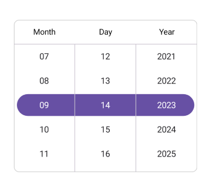

# Formatting in .NET MAUI Date Picker (SfDatePicker)

Format is a way to represent the date in a different string format. You can customize the date format using the [Format](https://help.syncfusion.com/cr/maui/Syncfusion.Maui.Picker.SfDatePicker.html#Syncfusion_Maui_Picker_SfDatePicker_Format) property of type [PickerDateFormat](https://help.syncfusion.com/cr/maui/Syncfusion.Maui.Picker.PickerDateFormat.html). These formats change only the display of the date; the underlying [SelectedDate](https://help.syncfusion.com/cr/maui/Syncfusion.Maui.Picker.SfDatePicker.html#Syncfusion_Maui_Picker_SfDatePicker_SelectedDate) value is not affected.

## Prerequisites

Before proceeding, ensure the [Syncfusion.Maui.Picker](https://www.nuget.org/packages/Syncfusion.Maui.Picker) NuGet package is installed and the Syncfusion&reg; handler is registered. For details, refer to the [Getting Started with .NET MAUI Date Picker](getting-started.md) documentation.

## Format options

The following table lists the available [PickerDateFormat](https://help.syncfusion.com/cr/maui/Syncfusion.Maui.Picker.PickerDateFormat.html) enum members and the date display they produce.

| Format | Description |
| --- | --- |
| [Default](https://help.syncfusion.com/cr/maui/Syncfusion.Maui.Picker.PickerDateFormat.html#Syncfusion_Maui_Picker_PickerDateFormat_Default) | Represents the day, month, and year in the current culture's default format (for example, `M/d/yyyy` in the `en-US` culture). |
| [dd_MM](https://help.syncfusion.com/cr/maui/Syncfusion.Maui.Picker.PickerDateFormat.html#Syncfusion_Maui_Picker_PickerDateFormat_dd_MM) | Represents the day and month in `dd/MM` format. |
| [dd_MM_yyyy](https://help.syncfusion.com/cr/maui/Syncfusion.Maui.Picker.PickerDateFormat.html#Syncfusion_Maui_Picker_PickerDateFormat_dd_MM_yyyy) | Represents the day, month, and year in `dd/MM/yyyy` format. |
| [dd_MMM](https://help.syncfusion.com/cr/maui/Syncfusion.Maui.Picker.PickerDateFormat.html#Syncfusion_Maui_Picker_PickerDateFormat_dd_MMM) | Represents the day and abbreviated month in `dd/MMM` format (for example, `15/Jan`). |
| [dd_MMM_yyyy](https://help.syncfusion.com/cr/maui/Syncfusion.Maui.Picker.PickerDateFormat.html#Syncfusion_Maui_Picker_PickerDateFormat_dd_MMM_yyyy) | Represents the day, abbreviated month, and year in `dd/MMM/yyyy` format. |
| [dd_MMMM](https://help.syncfusion.com/cr/maui/Syncfusion.Maui.Picker.PickerDateFormat.html#Syncfusion_Maui_Picker_PickerDateFormat_dd_MMMM) | Represents the day and full month in `dd/MMMM` format (for example, `15/January`). |
| [dd_MMMM_yyyy](https://help.syncfusion.com/cr/maui/Syncfusion.Maui.Picker.PickerDateFormat.html#Syncfusion_Maui_Picker_PickerDateFormat_dd_MMMM_yyyy) | Represents the day, full month, and year in `dd/MMMM/yyyy` format. |
| [M_d_yyyy](https://help.syncfusion.com/cr/maui/Syncfusion.Maui.Picker.PickerDateFormat.html#Syncfusion_Maui_Picker_PickerDateFormat_M_d_yyyy) | Represents the month, day, and year in `M/d/yyyy` format. |
| [MM_dd](https://help.syncfusion.com/cr/maui/Syncfusion.Maui.Picker.PickerDateFormat.html#Syncfusion_Maui_Picker_PickerDateFormat_MM_dd) | Represents the month and day in `MM/dd` format. |
| [MM_dd_yyyy](https://help.syncfusion.com/cr/maui/Syncfusion.Maui.Picker.PickerDateFormat.html#Syncfusion_Maui_Picker_PickerDateFormat_MM_dd_yyyy) | Represents the month, day, and year in `MM/dd/yyyy` format. |
| [MM_yyyy](https://help.syncfusion.com/cr/maui/Syncfusion.Maui.Picker.PickerDateFormat.html#Syncfusion_Maui_Picker_PickerDateFormat_MM_yyyy) | Represents the month and year in `MM/yyyy` format. |
| [MMM_dd_yyyy](https://help.syncfusion.com/cr/maui/Syncfusion.Maui.Picker.PickerDateFormat.html#Syncfusion_Maui_Picker_PickerDateFormat_MMMM_dd_yyyy) | Represents the abbreviated month, day, and year in `MMM/dd/yyyy` format. |
| [MMM_yyyy](https://help.syncfusion.com/cr/maui/Syncfusion.Maui.Picker.PickerDateFormat.html#Syncfusion_Maui_Picker_PickerDateFormat_MMM_yyyy) | Represents the abbreviated month and year in `MMM/yyyy` format. |
| [MMMM_dd_yyyy](https://help.syncfusion.com/cr/maui/Syncfusion.Maui.Picker.PickerDateFormat.html#Syncfusion_Maui_Picker_PickerDateFormat_MMMM_dd_yyyy) | Represents the full month, day, and year in `MMMM/dd/yyyy` format. |
| [MMMM_yyyy](https://help.syncfusion.com/cr/maui/Syncfusion.Maui.Picker.PickerDateFormat.html#Syncfusion_Maui_Picker_PickerDateFormat_MMMM_yyyy) | Represents the full month and year in `MMMM/yyyy` format. |
| [yyyy_MM](https://help.syncfusion.com/cr/maui/Syncfusion.Maui.Picker.PickerDateFormat.html#Syncfusion_Maui_Picker_PickerDateFormat_yyyy_MM) | Represents the year and month in `yyyy/MM` format. |
| [yyyy_MM_dd](https://help.syncfusion.com/cr/maui/Syncfusion.Maui.Picker.PickerDateFormat.html#Syncfusion_Maui_Picker_PickerDateFormat_yyyy_MM_dd) | Represents the year, month, and day in `yyyy/MM/dd` format. |
| [yyyy_MMM](https://help.syncfusion.com/cr/maui/Syncfusion.Maui.Picker.PickerDateFormat.html#Syncfusion_Maui_Picker_PickerDateFormat_yyyy_MMM) | Represents the year and abbreviated month in `yyyy/MMM` format. |
| [yyyy_MMM_dd](https://help.syncfusion.com/cr/maui/Syncfusion.Maui.Picker.PickerDateFormat.html#Syncfusion_Maui_Picker_PickerDateFormat_yyyy_MMM_dd) | Represents the year, abbreviated month, and day in `yyyy/MMM/dd` format. |
| [yyyy_MMMM](https://help.syncfusion.com/cr/maui/Syncfusion.Maui.Picker.PickerDateFormat.html#Syncfusion_Maui_Picker_PickerDateFormat_yyyy_MMMM) | Represents the year and full month in `yyyy/MMMM` format. |
| [yyyy_MMMM_dd](https://help.syncfusion.com/cr/maui/Syncfusion.Maui.Picker.PickerDateFormat.html#Syncfusion_Maui_Picker_PickerDateFormat_yyyy_MMMM_dd) | Represents the year, full month, and day in `yyyy/MMMM/dd` format. |
| [ddd_dd_MM_YYYY](https://help.syncfusion.com/cr/maui/Syncfusion.Maui.Picker.PickerDateFormat.html#Syncfusion_Maui_Picker_PickerDateFormat_ddd_dd_MM_YYYY) | Represents the weekday, day, month, and year in `ddd/dd/MM/YYYY` format (for example, `Mon/15/01/2026`). |

> Note: The literal characters used as separators (`/`, `-`, etc.) are part of the format definition and are not configurable independently.

## Example

The following example demonstrates the Date Picker with the custom format [PickerDateFormat.MM_dd_yyyy](https://help.syncfusion.com/cr/maui/Syncfusion.Maui.Picker.PickerDateFormat.html#Syncfusion_Maui_Picker_PickerDateFormat_MM_dd_yyyy). The selected date is displayed in `MM/dd/yyyy` format.





<picker:SfDatePicker x:Name="datepicker"
                     xmlns:picker="clr-namespace:Syncfusion.Maui.Picker;assembly=Syncfusion.Maui.Picker"
                     Format="{x:Static picker:PickerDateFormat.MM_dd_yyyy}" />





using Syncfusion.Maui.Picker;

SfDatePicker datePicker = new SfDatePicker()
{
    Format = PickerDateFormat.MM_dd_yyyy
};

this.Content = datePicker;





