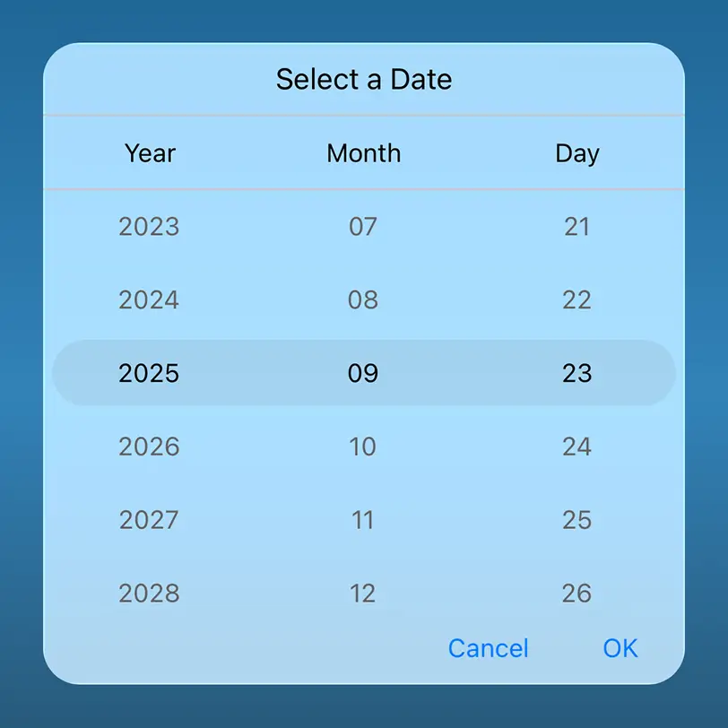

# Liquid Glass Effect in .NET MAUI Date Picker (SfDatePicker)

The Liquid Glass Effect introduces a modern, translucent design with adaptive color tinting and light refraction, creating a sleek, glass-like user experience that remains clear and accessible. This section explains how to enable and customize the effect in the Syncfusion® .NET MAUI Date Picker (SfDatePicker) control.

## Prerequisites

Before applying the Liquid Glass Effect, ensure the following NuGet packages are installed in your .NET MAUI project:

* [Syncfusion.Maui.Picker](https://www.nuget.org/packages/Syncfusion.Maui.Picker)
* [Syncfusion.Maui.Core](https://www.nuget.org/packages/Syncfusion.Maui.Core) (version `26.1.42` or higher, which contains the `SfGlassEffectView` class)

Register the Syncfusion handlers in `MauiProgram.cs`:




using Syncfusion.Maui.Core.Hosting;

public static class MauiProgram
{
    public static MauiApp CreateMauiApp()
    {
        var builder = MauiApp.CreateBuilder();
        builder
            .UseMauiApp<App>()
            .ConfigureSyncfusionCore();
        return builder.Build();
    }
}




## Apply liquid glass effect

Follow these steps to enable and configure the Liquid Glass Effect in the Date Picker control:

### Step 1: Wrap the control inside glass effect view

To apply the Liquid Glass Effect to Syncfusion® .NET MAUI [Date Picker](https://help.syncfusion.com/cr/maui/Syncfusion.Maui.Picker.SfDatePicker.html) control, wrap the control inside the [SfGlassEffectView](https://help.syncfusion.com/cr/maui/Syncfusion.Maui.Core.SfGlassEffectView.html) class. Configure the glass effect using these key properties:

* `EffectType`: Specifies the glass effect style. Available values are `Regular` (standard glass appearance) and other styles defined by the `LiquidGlassEffectType` enum.
* `CornerRadius`: Sets the corner radius of the glass effect view, allowing you to control the shape of the glass surface.

For more details, refer to the [Liquid Glass Getting Started documentation](https://help.syncfusion.com/maui/liquid-glass-ui/getting-started).

### Step 2: Enable the liquid glass effect on Date Picker

Set the [EnableLiquidGlassEffect](https://help.syncfusion.com/cr/maui/Syncfusion.Maui.Picker.PickerBase.html#Syncfusion_Maui_Picker_PickerBase_EnableLiquidGlassEffect) property to `true` in the [SfDatePicker](https://help.syncfusion.com/cr/maui/Syncfusion.Maui.Picker.SfDatePicker.html) control to apply the Liquid Glass Effect. When enabled, the effect is also applied to its dependent controls and responds to touch and gestures, providing a smooth and engaging user experience.

### Step 3: Customize the background

To achieve a glass-like background in the Date Picker, set the `Background` property to `Transparent`. The background will then be applied as a tinted color, ensuring a consistent glass effect across the controls.

The following code snippet demonstrates how to apply the Liquid Glass Effect to the [SfDatePicker](https://help.syncfusion.com/cr/maui/Syncfusion.Maui.Picker.SfDatePicker.html) control:




<ContentPage
    xmlns="http://schemas.microsoft.com/dotnet/2021/maui"
    xmlns:x="http://schemas.microsoft.com/winfx/2009/xaml"
    xmlns:picker="clr-namespace:Syncfusion.Maui.Picker;assembly=Syncfusion.Maui.Picker"
    xmlns:core="clr-namespace:Syncfusion.Maui.Core;assembly=Syncfusion.Maui.Core"
    x:Class="LiquidGlassDatePickerPage">
    <Grid>
        <Grid.Background>
            <LinearGradientBrush StartPoint="0,0"
                                 EndPoint="0,1">
                <GradientStop Color="#0F4C75"
                              Offset="0.0"/>
                <GradientStop Color="#3282B8"
                              Offset="0.5"/>
                <GradientStop Color="#1B262C"
                              Offset="1.0"/>
            </LinearGradientBrush>
        </Grid.Background>
        <Grid>
            <core:SfGlassEffectView
                EffectType="Regular"
                CornerRadius="20"
                WidthRequest="350"
                HeightRequest="350">
                <picker:SfDatePicker x:Name="datepicker"
                                     EnableLiquidGlassEffect="True"
                                     Background="Transparent">
                    <picker:SfDatePicker.ColumnHeaderView>
                        <picker:DatePickerColumnHeaderView Background="Transparent"/>
                    </picker:SfDatePicker.ColumnHeaderView>
                </picker:SfDatePicker>
            </core:SfGlassEffectView>
        </Grid>
    </Grid>
</ContentPage>




using Microsoft.Maui.Controls;
using Syncfusion.Maui.Core;
using Syncfusion.Maui.Picker;

// Outer grid with gradient background
var mainGrid = new Grid()
{
    Background = new LinearGradientBrush()
    {
        StartPoint = new Point(0, 0),
        EndPoint = new Point(0, 1),
        GradientStops =
        {
            new GradientStop { Color = Color.FromArgb("#0F4C75"), Offset = 0.0f },
            new GradientStop { Color = Color.FromArgb("#3282B8"), Offset = 0.5f },
            new GradientStop { Color = Color.FromArgb("#1B262C"), Offset = 1.0f }
        }
    }
};

// Inner grid container
var innerGrid = new Grid();

var glassView = new SfGlassEffectView()
{
    CornerRadius = 20,
    EffectType = LiquidGlassEffectType.Regular,
    WidthRequest = 350,
    HeightRequest = 350,
    Background = Colors.Transparent
};

var datePicker = new SfDatePicker()
{
    EnableLiquidGlassEffect = true,
    Background = Colors.Transparent,
    WidthRequest = 350,
    HeightRequest = 350,
    ColumnHeaderView = new DatePickerColumnHeaderView()
    { 
        Background = Colors.Transparent,
    }
};

glassView.Content = datePicker;
innerGrid.Children.Add(glassView);
mainGrid.Children.Add(innerGrid);
this.Content = mainGrid;




N>
* Supported on `macOS 26 or higher` and `iOS 26 or higher`.
* This feature is available only in `.NET 10.`

## Troubleshooting

* **Effect not visible at runtime:** Confirm the target platform is `iOS 26+` or `macOS 26+`, the target framework is `net10.0`, and the Syncfusion.Maui.Core package version is `26.1.42` or higher.
* **Compile error: `SfGlassEffectView` not found:** Ensure the `Syncfusion.Maui.Core` NuGet package is installed and the Syncfusion handlers are registered with `.ConfigureSyncfusionCore()` in `MauiProgram.cs`.
* **Glass effect appears solid (not translucent):** Make sure the parent layout has a non-solid background (gradient or image) and that the `Background` of the `SfDatePicker` and its column header view are set to `Transparent`.
