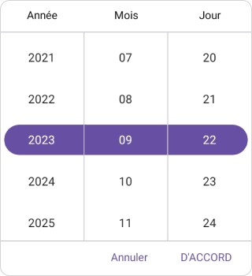
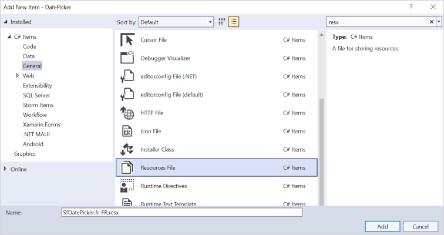
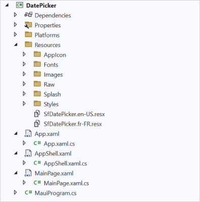
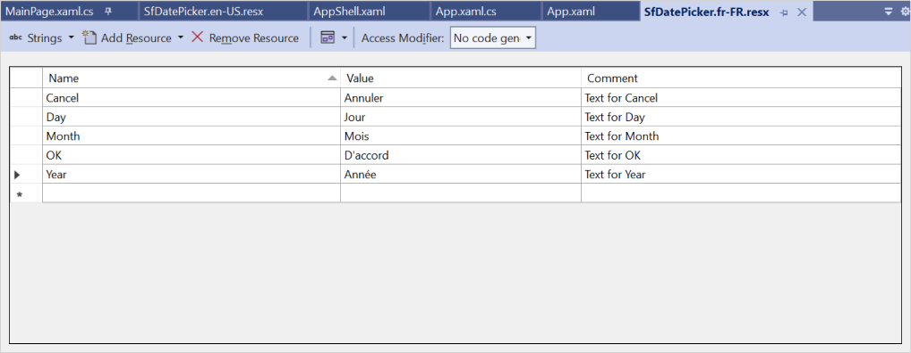

# Localization in .NET MAUI Date Picker (SfDatePicker)

Localization is the process of translating the application resources into different language for the specific cultures. The `SfDatePicker` can be localized by adding `resource` file. In `SfDatePicker`, provides the support to localize the below strings

   * `Day`
   * `Month`
   * `Year`
   * `OK`
   * `Cancel`

## Setting CurrentUICulture to the application

Application culture can be changed by setting `CurrentUICulture.` in `App.xaml.cs` file.




using Syncfusion.Maui.Picker;
using System.Globalization;
using System.Resources;

namespace DatePicker;
public partial class App : Application
{
	public App()
	{
		InitializeComponent();
		CultureInfo.CurrentUICulture = new CultureInfo("fr-FR");
      //// ResXPath => Full path of the resx file; For example : //SfDatePickeresources.ResourceManager = new ResourceManager
      // ("DatePicker.Resources.SfDatePicker", Application.Current.GetType().Assembly);

		SfPickerResources.ResourceManager = new ResourceManager("ResxPath", Application.Current.GetType().Assembly);
	   MainPage = new MainPage();
	}
}




   

N>
The required `resx` files with `Build Action` as `EmbeddedResource` (File name should contain culture code) into the `Resources` folder.

## Localize application level

To localize the `DatePicker` based on `CurrentUICulture` using `resource` files, follow the below steps.

   1. Create new folder, named as `Resources` in the application.

   2. Right-click on the `Resources` folder, select `Add` and then `NewItem.`

   3. In Add New Item wizard, select the Resource File option and name the filename as `SfDatePicker.<culture name>.resx.` For example, give the name as `SfDatePicker.fr-FR.resx` for French culture.

   4. The culture name indicates the name of the language and country.

      

   5. Now, select `Add` option to add the resource file in **Resources** folder.

      

   6. Add the Name/Value pair in Resource Designer of `SfDatePicker.fr-FR.resx` file and change its corresponding value to corresponding culture.

   