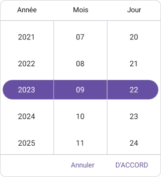
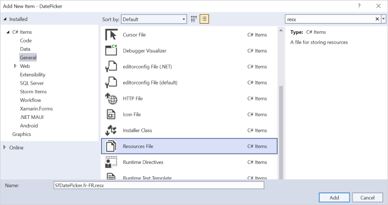
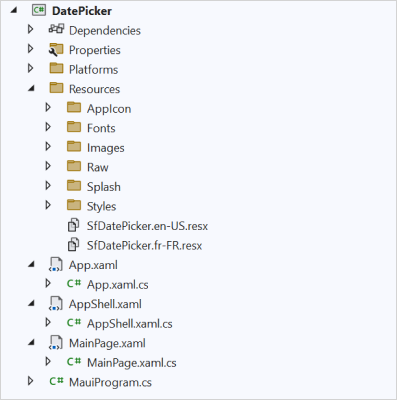
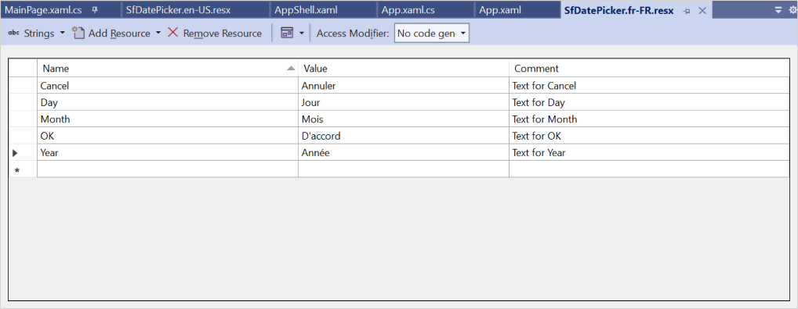

# Localization in .NET MAUI Date Picker (SfDatePicker)

Localization is the process of translating the application resources into different languages for specific cultures. The `SfDatePicker` can be localized by adding a `resource` file. The `SfDatePicker` provides support for localizing the following strings

   * `Day`
   * `Month`
   * `Year`
   * `OK`
   * `Cancel`

## Setting CurrentUICulture to the application

Application culture can be changed by setting `CurrentUICulture` in the `App.xaml.cs` file.




using Syncfusion.Maui.Picker;
using System.Globalization;
using System.Resources;

namespace DatePicker;
public partial class App : Application
{
	public App()
	{
		InitializeComponent();
		CultureInfo.CurrentUICulture = new CultureInfo("fr-FR");
		// ResXPath => Full path of the resx file; For example:
		// SfPickerResources.ResourceManager = new ResourceManager("DatePicker.Resources.SfDatePicker", Application.Current.GetType().Assembly);
		SfPickerResources.ResourceManager = new ResourceManager("ResxPath", Application.Current.GetType().Assembly);
		MainPage = new MainPage();
	}
}




   

N>
Place the required `resx` files with `Build Action` set to `EmbeddedResource` (the file name should contain the culture code) into the `Resources` folder.

## Localize application level

To localize the `DatePicker` based on `CurrentUICulture` using `resource` files, follow the steps below.

   1. Create a new folder named `Resources` in the application.

   2. Right-click the `Resources` folder, select `Add`, and then `New Item`.

   3. In the **Add New Item** wizard, select the **Resource File** option and name the file `SfDatePicker.<culture name>.resx`. For example, name it `SfDatePicker.fr-FR.resx` for the French culture.

   4. The culture name indicates the name of the language and country.

      

   5. Now, select **Add** to add the resource file to the **Resources** folder.

      

   6. Add the Name/Value pair in the Resource Designer of the `SfDatePicker.fr-FR.resx` file and change each value to the corresponding translation.

   