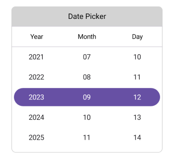
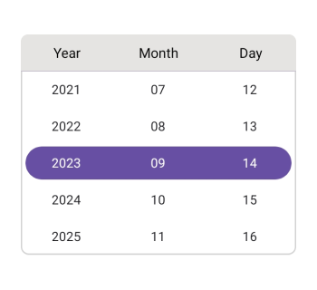
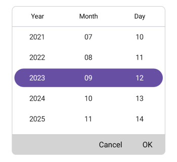
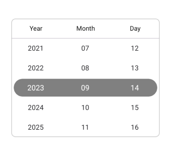
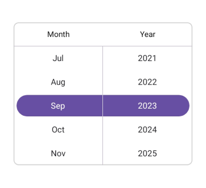
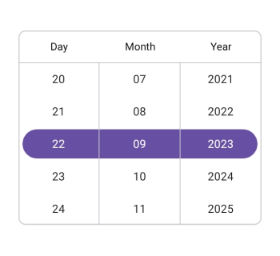
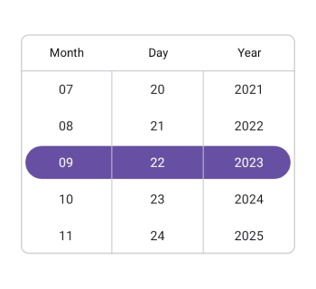
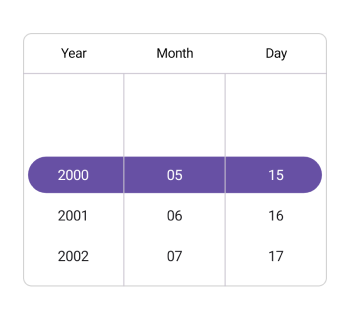
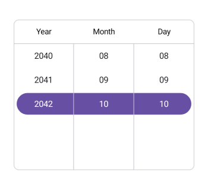

# Overview of .NET MAUI Date Picker (SfDatePicker)

Syncfusion .NET MAUI Date Picker (SfDatePicker) control allows you to select a date and visualize its items inside a popup or a drop-down UI element. The Date Picker also enables you to set date ranges and formats and customize its dialog appearance by configuring its header, footer, and more.

## Key features

* **Header view**: The Date Picker allows you to add the header text and customize it.

   

* **Column header view**: The .NET MAUI Date Picker provides pre-defined column header text and also you can customize it.

   

* **Footer view**: Provides validation buttons (OK and Cancel) in the footer view. The footer text and background color can be customized.

   

* **Selection view**: The selection view is used to show the selected date, and it is customizable.

   

* **Date format**: Offers 8 predefined formats to represent the value of the date in different string formats.





* **Picker mode**: Show the picker in a Popup with a dialog mode. The relative dialog mode is used to align the picker in a specific position.

* **Date restriction**: Restrict the selection of date items beyond the specified minimum and maximum dates.

* **Intervals**: The date values can be populated individually with intervals for days, months, and years.

* **Picker interactions**: The .NET MAUI Date Picker allows you to select dates through tap and scroll interaction.