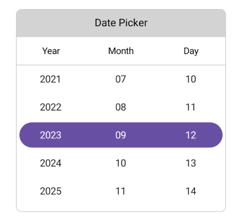
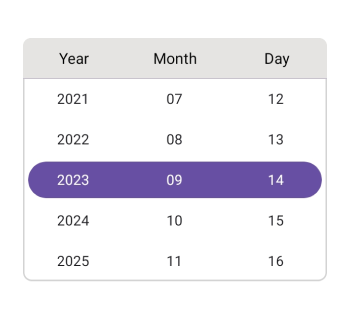
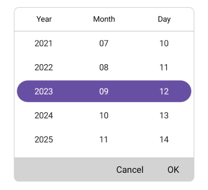
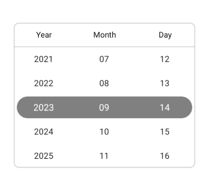
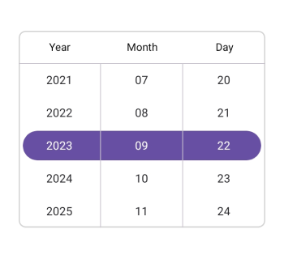
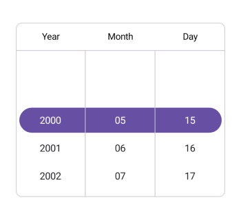
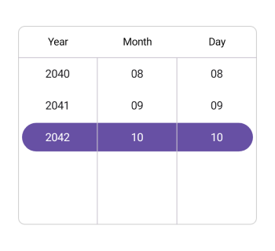
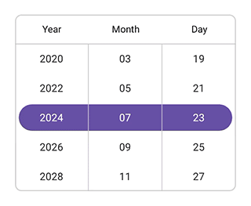
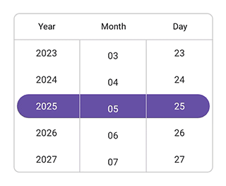

> **Notice**: After **Volume 3 2025 (Mid of Sep 2025)**, feature enhancements for this control will no longer be available in the Syncfusion® package. Please switch to the **Syncfusion® Toolkit for .NET MAUI** for continued support. For a smooth transition refer this [migration document](https://help.syncfusion.com/maui-toolkit/migration).

# Overview of .NET MAUI Date Picker (SfDatePicker)

Syncfusion&reg; .NET MAUI Date Picker (SfDatePicker) control allows you to select a date and visualize its items inside a popup or a drop-down UI element. The Date Picker also enables you to set date ranges and formats and customize its dialog appearance by configuring its header, footer, and more.

## Business use cases

- Booking and reservation applications that require **date selection with validation and range restrictions**.  
- Form-based applications that need **user-friendly date input for registration, scheduling, or data entry**.  
- Business applications that use **date-based filtering and reporting workflows**.  
- Mobile and desktop apps that require **consistent and customizable date selection UI across platforms**. 

## Key features

- **Header view support** allows displaying and customizing header text to provide context in the date picker dialog.  

   

- **Column header view support** allows showing predefined or custom column headers for better readability of date elements. 

   

- **Footer view support** provides OK and Cancel buttons with customizable text and appearance.  

   

- **Selection view support** allows displaying the currently selected date in a dedicated customizable section.

   

- **Date format support** allows representing selected dates using predefined string formats.  

   

- **Picker mode options** allow displaying the picker in popup or dialog mode with flexible positioning. 

   

- **Date restriction support** allows limiting selection within minimum and maximum date ranges.  

   

   

- **Interval support** allows configuring values for days, months, and years using defined intervals.

   

- **User interaction support** allows selecting dates through intuitive tap and scroll gestures.

      

## Globalization

The following table summarizes the globalization support available in the [SfDatePicker](https://www.syncfusion.com/maui-controls/maui-datepicker) control.

 Full Support  

<table>
<tr>
<th align="center">Control</th>
<th align="center">Localization</th>
<th align="center">RTL</th>
<th align="center">Time zone</th>
<th align="center">Screen reader</th>
<th align="center">Keyboard navigation</th>
</tr>
<tr>
<td><a href="/maui/datepicker/overview">DatePicker</a></td>
<td align="center"></td>
<td align="center"></td>
<td align="center"></td>
<td align="center"></td>
<td align="center"></td>
</tr> 
</table>

## Related controls

- **[DateTimePicker](https://help.syncfusion.com/maui/datetimepicker/overview)** for selecting both date and time values.  
- **[Calendar](https://help.syncfusion.com/maui/calendar/overview)** for navigating and selecting dates using full calendar views.  
- **[DataForm](https://help.syncfusion.com/maui/dataform/overview)** for integrating date picker inputs within forms.  

## Next steps

Explore further resources:

- [Getting Started](https://help.syncfusion.com/maui/datepicker/getting-started) - step-by-step guide to begin using the Date Picker control.  
- [Formatting](https://help.syncfusion.com/maui/datepicker/formatting) - configure how date values are displayed.  
- [Customization](https://help.syncfusion.com/maui/datepicker/customizations) - modify appearance and interaction behavior. 
- [UI Kit](https://www.syncfusion.com/demos/maui#maui-ui-control) - explore interactive demos and ready‑made UI examples.

## Learnings

<!-- Card 1 -->
<a href="https://www.syncfusion.com/blogs/category/net-maui" class="form-card" target="_blank">
  

    <h3 class="form-title">Explore Blogs</h3>
    

      Read insights, tutorials, and developer journeys.
    

  

</a>
<!-- Card 2 -->
<a href="https://support.syncfusion.com/kb/cross-platforms/category/76" class="form-card" target="_blank">
  

    <h3 class="form-title">Explore KB's</h3>
    

      Find quick solutions and step‑by‑step guidance.
    

  

</a>
<!-- Card 3 -->
<a href="https://www.syncfusion.com/maui-controls/maui-datepicker" class="form-card" target="_blank">
  

    <h3 class="form-title">Feature Tour</h3>
    

      Walk through highlights and core capabilities.
    

  

</a>
<!-- Card 4 -->
<a href="https://www.syncfusion.com/tutorial-videos/maui/date-picker" class="form-card" target="_blank">
  

    <h3 class="form-title">Tutorial Videos</h3>
    

      Step‑by‑step guidance through video tutorials.
    

  

</a>
