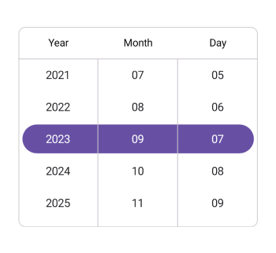

# Selection in .NET MAUI Date Picker control

## Set selected date to the Date Picker

The SfDatePicker control allows you to select the date using the [SelectedDate](https://help.syncfusion.com/cr/maui/Syncfusion.Maui.Picker.SfDatePicker.html#Syncfusion_Maui_Picker_SfDatePicker_SelectedDate) property in the [SfDatePicker](https://help.syncfusion.com/cr/maui/Syncfusion.Maui.Picker.SfDatePicker.html). The default value of the `SelectedDate` is the current date.




<ContentPage
             . . .
             xmlns:picker="clr-namespace:Syncfusion.Maui.Picker;assembly=Syncfusion.Maui.Picker">
    <picker:SfDatePicker x:Name="datePicker"
                         SelectedDate="9/7/2023">
    </picker:SfDatePicker>
</ContentPage>




using Syncfusion.Maui.Picker;

. . .
SfDatePicker datePicker = new SfDatePicker()
{
    SelectedDate = new DateTime(2023, 9, 7).Date,
};

this.Content = datePicker;




## Clear selection

The SfDatePicker provides clear selection support, allowing you to clear the selected date by setting the `SelectedDate` property to `null`.




<ContentPage
             . . .
             xmlns:picker="clr-namespace:Syncfusion.Maui.Picker;assembly=Syncfusion.Maui.Picker">
    <picker:SfDatePicker x:Name="datePicker" />
</ContentPage>




using Syncfusion.Maui.Picker;

. . .
this.datePicker.SelectedDate = null;


