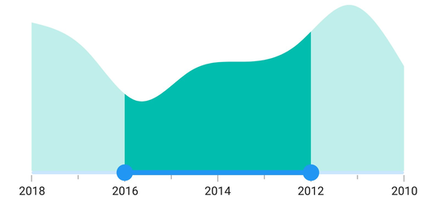
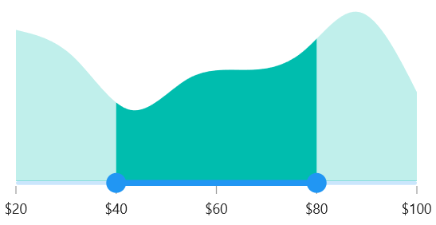

# Customization in .NET MAUI Range Selector (SfDateTimeRangeSelector)

## Inverse the Range Selector

Invert the DateTime Range Selector using the [IsInversed](https://help.syncfusion.com/cr/maui/Syncfusion.Maui.Sliders.RangeView-1.html#Syncfusion_Maui_Sliders_RangeView_1_IsInversed) property. The default value of the [IsInversed](https://help.syncfusion.com/cr/maui/Syncfusion.Maui.Sliders.RangeView-1.html#Syncfusion_Maui_Sliders_RangeView_1_IsInversed) property is `False`.





<ContentPage 
             ...
             xmlns:sliders="clr-namespace:Syncfusion.Maui.Sliders;assembly=Syncfusion.Maui.Sliders"
             xmlns:charts="clr-namespace:Syncfusion.Maui.Charts;assembly=Syncfusion.Maui.Charts">

    <sliders:SfDateTimeRangeSelector Minimum="2010-01-01" 
                                     Maximum="2018-01-01" 
                                     RangeStart="2012-01-01" 
                                     RangeEnd="2016-01-01"
                                     Interval="2"
                                     ShowLabels="True"
                                     ShowTicks="True" 
                                     MinorTicksPerInterval="1" 
                                     IsInversed="True">

        <charts:SfCartesianChart>
            ...
        </charts:SfCartesianChart>

    </sliders:SfDateTimeRangeSelector>
</ContentPage>





SfDateTimeRangeSelector rangeSelector = new SfDateTimeRangeSelector();
rangeSelector.Minimum = new DateTime(2010, 01, 01);
rangeSelector.Maximum = new DateTime(2018, 01, 01);
rangeSelector.RangeStart = new DateTime(2012, 01, 01);
rangeSelector.RangeEnd = new DateTime(2016, 01, 01);
rangeSelector.Interval = 2;
rangeSelector.ShowLabels = true;
rangeSelector.ShowTicks = true;
rangeSelector.MinorTicksPerInterval = 1;
rangeSelector.IsInversed = true;
SfCartesianChart chart = new SfCartesianChart();
rangeSelector.Content = chart;





## Formatting labels

Add prefix or suffix to the labels using the [DateFormat](https://help.syncfusion.com/cr/maui/Syncfusion.Maui.Sliders.IDateTimeElement.html#Syncfusion_Maui_Sliders_IDateTimeElement_DateFormat) property.





<ContentPage 
             ...
             xmlns:sliders="clr-namespace:Syncfusion.Maui.Sliders;assembly=Syncfusion.Maui.Sliders"
             xmlns:charts="clr-namespace:Syncfusion.Maui.Charts;assembly=Syncfusion.Maui.Charts">
    
    <sliders:SfDateTimeRangeSelector Minimum="2010-01-01"
                                     Maximum="2011-01-01"
                                     RangeStart="2010-04-01"
                                     RangeEnd="2010-10-01"
                                     DateFormat="MMM"
                                     IntervalType="Months"
                                     ShowTicks="True"
                                     MinorTicksPerInterval="1"
                                     ShowLabels="True"
                                     Interval="2">
        
        <charts:SfCartesianChart>
            ...
        </charts:SfCartesianChart>
    
    </sliders:SfDateTimeRangeSelector>
</ContentPage> 





SfDateTimeRangeSelector rangeSelector = new SfDateTimeRangeSelector();
rangeSelector.Minimum = new DateTime(2010, 01, 01);
rangeSelector.Maximum = new DateTime(2011, 01, 01);
rangeSelector.RangeStart = new DateTime(2010, 04, 01);
rangeSelector.RangeEnd = new DateTime(2010, 10, 01);
rangeSelector.ShowLabels = true;
rangeSelector.Interval = 2;
rangeSelector.ShowTicks = true;
rangeSelector.MinorTicksPerInterval = 1;
rangeSelector.DateFormat = "MMM";
rangeSelector.IntervalType = SliderDateIntervalType.Months;
SfCartesianChart chart = new SfCartesianChart();
rangeSelector.Content = chart;





