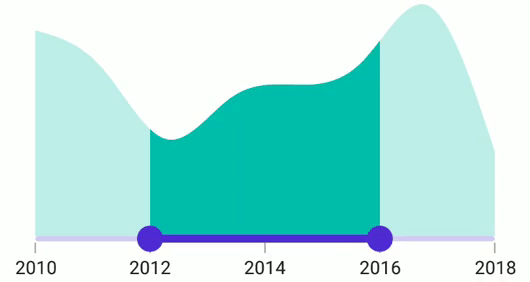
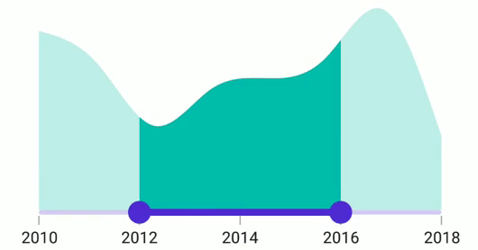

# Thumb DragBehavior in .NET MAUI DateTime Range Selector (SfDateTimeRangeSelector)

This section helps to learn about thumb drag behavior in the date-time Range Selector.

## OnThumb

When the [DragBehavior](https://help.syncfusion.com/cr/maui/Syncfusion.Maui.Sliders.RangeSliderBase.html#Syncfusion_Maui_Sliders_RangeSliderBase_DragBehavior) is set to [OnThumb](https://help.syncfusion.com/cr/maui/Syncfusion.Maui.Sliders.SliderDragBehavior.html#Syncfusion_Maui_Sliders_SliderDragBehavior_OnThumb), individual thumb can be moved based on the dragging. By default, the [OnThumb](https://help.syncfusion.com/cr/maui/Syncfusion.Maui.Sliders.SliderDragBehavior.html#Syncfusion_Maui_Sliders_SliderDragBehavior_OnThumb) has been used as drag behavior.





<ContentPage 
             ...
             xmlns:sliders="clr-namespace:Syncfusion.Maui.Sliders;assembly=Syncfusion.Maui.Sliders"
             xmlns:charts="clr-namespace:Syncfusion.Maui.Charts;assembly=Syncfusion.Maui.Charts">

    <sliders:SfDateTimeRangeSelector Minimum="2010-01-01" 
                                     Maximum="2018-01-01" 
                                     RangeStart="2012-01-01" 
                                     RangeEnd="2016-01-01"
                                     Interval="2" 
                                     ShowTicks="True"
                                     ShowLabels="True"
                                     DragBehavior="OnThumb">
        
        <charts:SfCartesianChart>
            ...
        </charts:SfCartesianChart>

    </sliders:SfRangeSelector>
</ContentPage>





SfDateTimeRangeSelector rangeSelector = new SfDateTimeRangeSelector();
rangeSelector.Minimum = new DateTime(2010, 01, 01);
rangeSelector.Maximum = new DateTime(2018, 01, 01);
rangeSelector.RangeStart = new DateTime(2012, 01, 01);
rangeSelector.RangeEnd = new DateTime(2016, 01, 01);
rangeSelector.Interval = 2; 
rangeSelector.ShowTicks = true;
rangeSelector.ShowLabels = true;  
rangeSelector.DragBehavior = SliderDragBehavior.OnThumb;
SfCartesianChart chart = new SfCartesianChart();
rangeSelector.Content = chart;





## BetweenThumbs

When the [DragBehavior](https://help.syncfusion.com/cr/maui/Syncfusion.Maui.Sliders.RangeSliderBase.html#Syncfusion_Maui_Sliders_RangeSliderBase_DragBehavior) is set to [BetweenThumbs](https://help.syncfusion.com/cr/maui/Syncfusion.Maui.Sliders.SliderDragBehavior.html#Syncfusion_Maui_Sliders_SliderDragBehavior_BetweenThumbs), both the thumbs can be moved at same time without changing the range between the start and end thumbs. We had considered this behavior without the Range Selector thumb radius. Its not possible to move the individual thumb when setting this behavior.





<ContentPage 
             ...
             xmlns:sliders="clr-namespace:Syncfusion.Maui.Sliders;assembly=Syncfusion.Maui.Sliders"
             xmlns:charts="clr-namespace:Syncfusion.Maui.Charts;assembly=Syncfusion.Maui.Charts">

    <sliders:SfDateTimeRangeSelector Minimum="2010-01-01" 
                                     Maximum="2018-01-01" 
                                     RangeStart="2012-01-01" 
                                     RangeEnd="2016-01-01"
                                     Interval="2" 
                                     ShowTicks="True"
                                     ShowLabels="True"
                                     DragBehavior="BetweenThumbs">

        <charts:SfCartesianChart>
            ...
        </charts:SfCartesianChart>

    </sliders:SfDateTimeRangeSelector>
</ContentPage>





SfDateTimeRangeSelector rangeSelector = new SfDateTimeRangeSelector();
rangeSelector.Minimum = new DateTime(2010, 01, 01);
rangeSelector.Maximum = new DateTime(2018, 01, 01);
rangeSelector.RangeStart = new DateTime(2012, 01, 01);
rangeSelector.RangeEnd = new DateTime(2016, 01, 01);
rangeSelector.Interval = 2; 
rangeSelector.ShowTicks = true;
rangeSelector.ShowLabels = true;   
rangeSelector.DragBehavior = SliderDragBehavior.BetweenThumbs;
SfCartesianChart chart = new SfCartesianChart();
rangeSelector.Content = chart;





## Both

When the  [DragBehavior](https://help.syncfusion.com/cr/maui/Syncfusion.Maui.Sliders.RangeSliderBase.html#Syncfusion_Maui_Sliders_RangeSliderBase_DragBehavior) is set to [Both](https://help.syncfusion.com/cr/maui/Syncfusion.Maui.Sliders.SliderDragBehavior.html#Syncfusion_Maui_Sliders_SliderDragBehavior_Both), the individual thumb can be moved and also the both thumbs can be moved at same time without changing the range between the start and end thumbs.





<ContentPage 
             ...
             xmlns:sliders="clr-namespace:Syncfusion.Maui.Sliders;assembly=Syncfusion.Maui.Sliders"
             xmlns:charts="clr-namespace:Syncfusion.Maui.Charts;assembly=Syncfusion.Maui.Charts">

    <sliders:SfDateTimeRangeSelector Minimum="2010-01-01" 
                                     Maximum="2018-01-01" 
                                     RangeStart="2012-01-01" 
                                     RangeEnd="2016-01-01"
                                     Interval="2" 
                                     ShowTicks="True"
                                     ShowLabels="True"
                                     DragBehavior="Both">

        <charts:SfCartesianChart>
            ...
        </charts:SfCartesianChart>

    </sliders:SfDateTimeRangeSelector>
</ContentPage>





SfDateTimeRangeSelector rangeSelector = new SfDateTimeRangeSelector();
rangeSelector.Minimum = new DateTime(2010, 01, 01);
rangeSelector.Maximum = new DateTime(2018, 01, 01);
rangeSelector.RangeStart = new DateTime(2012, 01, 01);
rangeSelector.RangeEnd = new DateTime(2016, 01, 01);
rangeSelector.Interval = 2; 
rangeSelector.ShowTicks = true; 
rangeSelector.ShowLabels = true;  
rangeSelector.DragBehavior = SliderDragBehavior.Both;
SfCartesianChart chart = new SfCartesianChart();
rangeSelector.Content = chart;





