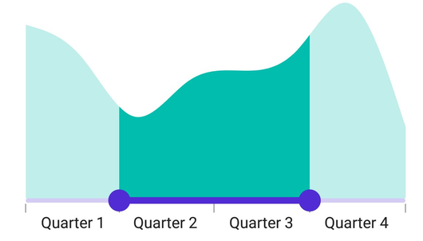
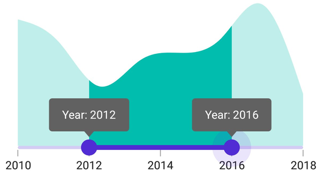

# Events and Commands in .NET MAUI DateTime Range Selector

This section explains how to add the events and commands for the DateTime Range Selector(SfDateTimeRangeSelector).

## Events

### Handle callbacks

* [ValueChangeStart](https://help.syncfusion.com/cr/maui/Syncfusion.Maui.Sliders.SliderBase.html#Syncfusion_Maui_Sliders_SliderBase_ValueChangeStart) -  Called when the user selects a new value for the selector by tapping or mouse down on the thumb.
* [ValueChanging](https://help.syncfusion.com/cr/maui/Syncfusion.Maui.Sliders.SfRangeSelector.html#Syncfusion_Maui_Sliders_SfRangeSelector_ValueChanging) - Called when the user is selecting a new value for the selector by dragging the thumb.
* [ValueChanged](https://help.syncfusion.com/cr/maui/Syncfusion.Maui.Sliders.SfRangeSelector.html#Syncfusion_Maui_Sliders_SfRangeSelector_ValueChanged) - Called when the user completed selecting a new value.
* [ValueChangeEnd](https://help.syncfusion.com/cr/maui/Syncfusion.Maui.Sliders.SliderBase.html#Syncfusion_Maui_Sliders_SliderBase_ValueChangeEnd) - Called when the user stopped interacting with the selector by tapping or mouse up the thumb.





<ContentPage 
             ...
             xmlns:sliders="clr-namespace:Syncfusion.Maui.Sliders;assembly=Syncfusion.Maui.Sliders"
             xmlns:charts="clr-namespace:Syncfusion.Maui.Charts;assembly=Syncfusion.Maui.Charts">
   
   <sliders:SfDateTimeRangeSelector Minimum="2010-01-01" 
                                    Maximum="2020-01-01" 
                                    RangeStart="2012-01-01" 
                                    RangeEnd="2018-01-01" 
                                    ValueChangeStart="OnValueChangeStart" 
                                    ValueChanging="OnValueChanging" 
                                    ValueChanged="OnValueChanged" 
                                    ValueChangeEnd="OnValueChangeEnd">
      
      <charts:SfCartesianChart>
            ...
      </charts:SfCartesianChart>
   
   </sliders:SfDateTimeRangeSelector>
</ContentPage>





{
   SfDateTimeRangeSelector rangeSelector = new SfDateTimeRangeSelector();
   rangeSelector.Minimum = new DateTime(2010, 01, 01);
   rangeSelector.Maximum = new DateTime(2018, 01, 01);
   rangeSelector.RangeStart = new DateTime(2012, 01, 01);
   rangeSelector.RangeEnd = new DateTime(2016, 01, 01);
   rangeSelector.ValueChangeStart += OnValueChanged;
   rangeSelector.ValueChanging += OnValueChanged;
   rangeSelector.ValueChanged += OnValueChanged;
   rangeSelector.ValueChangeEnd += OnValueChanged;
   SfCartesianChart chart = new SfCartesianChart();
   rangeSelector.Content = chart;
}

private void OnValueChangeStart(object sender, EventArgs e)
{
}

private void OnValueChanging(object sender, DateTimeRangeSelectorValueChangingEventArgs e)
{
}

private void OnValueChanged(object sender, DateTimeRangeSelectorValueChangedEventArgs e)
{
}

private void OnValueChangeEnd(object sender, EventArgs e)
{
}





### Customize label text

Format or change the whole numeric or date label text using the [`LabelCreated`](https://help.syncfusion.com/cr/maui/Syncfusion.Maui.Sliders.SliderBase.html#Syncfusion_Maui_Sliders_SliderBase_LabelCreated) event. The [`SliderLabelCreatedEventArgs`](https://help.syncfusion.com/cr/maui/Syncfusion.Maui.Sliders.SliderLabelCreatedEventArgs.html) contains the following parameters:

* Text – Customize the text color using the [`Text`](https://help.syncfusion.com/cr/maui/Syncfusion.Maui.Sliders.SliderLabelCreatedEventArgs.html#Syncfusion_Maui_Sliders_SliderLabelCreatedEventArgs_Style) parameter.
* Style – Formats the text color, font size, font family, and offset using the [`Style`](https://help.syncfusion.com/cr/maui/Syncfusion.Maui.Sliders.SliderLabelCreatedEventArgs.html#Syncfusion_Maui_Sliders_SliderLabelCreatedEventArgs_Style) parameter.





<ContentPage 
             ...
             xmlns:sliders="clr-namespace:Syncfusion.Maui.Sliders;assembly=Syncfusion.Maui.Sliders"
             xmlns:charts="clr-namespace:Syncfusion.Maui.Charts;assembly=Syncfusion.Maui.Charts">

   <sliders:SfDateTimeRangeSelector Minimum="2010-01-01"
                                    Maximum="2011-01-01"
                                    RangeStart="2010-04-01"
                                    RangeEnd="2010-10-01"
                                    Interval="3"
                                    DateFormat="MMM"
                                    ShowTicks="True"
                                    LabelsPlacement="BetweenTicks"
                                    IntervalType="Months"
                                    LabelCreated="OnLabelCreated"
                                    ShowLabels="True">

         <charts:SfCartesianChart>
            ...
         </charts:SfCartesianChart>

      </sliders:SfDateTimeRangeSelector>
</ContentPage>





{
   SfDateTimeRangeSelector rangeSelector = new SfDateTimeRangeSelector();
   rangeSelector.Minimum = new DateTime(2010, 01, 01);
   rangeSelector.Maximum = new DateTime(2011, 01, 01);
   rangeSelector.RangeStart = new DateTime(2010, 04, 01);
   rangeSelector.RangeEnd = new DateTime(2010, 10, 01);
   rangeSelector.Interval = 3;
   rangeSelector.DateFormat = "MMM";
   rangeSelector.IntervalType = SliderDateIntervalType.Months;
   rangeSelector.LabelsPlacement = SliderLabelsPlacement.BetweenTicks;
   rangeSelector.ShowTicks = true;
   rangeSelector.ShowLabels = true;
   SfCartesianChart chart = new SfCartesianChart();
   rangeSelector.Content = chart;
}

private void OnLabelCreated(object sender, SliderLabelCreatedEventArgs e)
{
    if (e.Text == "Jan")
    {
        e.Text = "Quarter 1";
    }
    else if (e.Text == "Apr")
    {
        e.Text = "Quarter 2";
    }
    else if (e.Text == "Jul")
    {
        e.Text = "Quarter 3";
    }
    else
    {
        e.Text = "Quarter 4";
    }
}





### Tooltip text format

By default, it is formatted based on the [`SliderTooltip.DateFormat`](https://help.syncfusion.com/cr/maui/Syncfusion.Maui.Sliders.SliderTooltip.html#Syncfusion_Maui_Sliders_SliderTooltip_DateFormat) property.

Format or change the whole tooltip label text using the [`ToolTipLabelCreated`](https://help.syncfusion.com/cr/maui/Syncfusion.Maui.Sliders.SliderTooltip.html#Syncfusion_Maui_Sliders_SliderTooltip_TooltipLabelCreated) event. The [`SliderTooltipLabelCreatedEventArgs`](https://help.syncfusion.com/cr/maui/Syncfusion.Maui.Sliders.SliderTooltipLabelCreatedEventArgs.html) contains the following parameters:

* Text – Change the format of the tooltip text using the [`Text`](https://help.syncfusion.com/cr/maui/Syncfusion.Maui.Sliders.SliderTooltipLabelCreatedEventArgs.html#Syncfusion_Maui_Sliders_SliderTooltipLabelCreatedEventArgs_Text) property.
* Style – Change the appearance of the tooltip text like color, stroke color, and padding using the [`Style`](https://help.syncfusion.com/cr/maui/Syncfusion.Maui.Sliders.SliderTooltipLabelCreatedEventArgs.html) property.





<ContentPage 
             ...
             xmlns:sliders="clr-namespace:Syncfusion.Maui.Sliders;assembly=Syncfusion.Maui.Sliders"
             xmlns:charts="clr-namespace:Syncfusion.Maui.Charts;assembly=Syncfusion.Maui.Charts">
   
   <sliders:SfDateTimeRangeSelector Minimum="2010-01-01"
                                    Maximum="2018-01-01"
                                    RangeStart="2012-01-01"
                                    RangeEnd="2016-01-01"
                                    Interval="2"
                                    ShowTicks="True"
                                    ShowLabels="True">
      
      <sliders:SfDateTimeRangeSelector.Tooltip>
         <sliders:SliderTooltip TooltipLabelCreated="OnTooltipLabelCreated" />
      </sliders:SfDateTimeRangeSelector.Tooltip>
      
      <charts:SfCartesianChart>
            ...
      </charts:SfCartesianChart>
   
   </sliders:SfDateTimeRangeSelector>
</ContentPage>





{
    SfDateTimeRangeSelector rangeSelector = new SfDateTimeRangeSelector();
    rangeSelector.Minimum = new DateTime(2010, 01, 01);
    rangeSelector.Maximum = new DateTime(2018, 01, 01);
    rangeSelector.RangeStart = new DateTime(2012, 01, 01);
    rangeSelector.RangeEnd = new DateTime(2016, 01, 01);
    rangeSelector.Interval = 2;
    rangeSelector.ShowTicks = true;
    rangeSelector.ShowLabels = true;
    rangeSelector.Tooltip = new SliderTooltip();
    rangeSelector.Tooltip.TooltipLabelCreated += OnTooltipLabelCreated;
    SfCartesianChart chart = new SfCartesianChart();
    rangeSelector.Content = chart;
 }
 private void OnTooltipLabelCreated(object sender, SliderTooltipLabelCreatedEventArgs e)
 {
     e.Text = "Year: " + e.Text;
 }





## Commands and their parameter

### Drag started command

The [`DragStartedCommand`](https://help.syncfusion.com/cr/maui/Syncfusion.Maui.Sliders.SliderBase.html#Syncfusion_Maui_Sliders_SliderBase_DragStartedCommand) will be executed when the user starts moving the thumb.





<ContentPage 
             ...
             xmlns:sliders="clr-namespace:Syncfusion.Maui.Sliders;assembly=Syncfusion.Maui.Sliders"
             xmlns:charts="clr-namespace:Syncfusion.Maui.Charts;assembly=Syncfusion.Maui.Charts">
    
    <ContentPage.BindingContext>
        <local:ViewModel x:Name="viewModel" />
    </ContentPage.BindingContext>

    <sliders:SfDateTimeRangeSelector Minimum="2010-01-01" 
                                     Maximum="2018-01-01" 
                                     RangeStart="2012-01-01" 
                                     RangeEnd="2016-01-01"
                                     DragStartedCommand="{Binding DragStartedCommand}">

        <charts:SfCartesianChart>
            ...
        </charts:SfCartesianChart>

    </sliders:SfDateTimeRangeSelector>
</ContentPage>





SfCartesianChart chart = new SfCartesianChart();
SfDateTimeRangeSelector rangeSelector = new SfDateTimeRangeSelector()
{
    Minimum = new DateTime(2010, 01, 01),
    Maximum = new DateTime(2018, 01, 01),
    RangeStart = new DateTime(2012, 01, 01),
    RangeEnd = new DateTime(2016, 01, 01),
    DragStartedCommand = viewModel.DragStartedCommand,
    Content = chart
};

public class ViewModel
{
    public ICommand DragStartedCommand { get; }

    public ViewModel()
    {
        DragStartedCommand = new Command(OnDragStarted);
    }

    private void OnDragStarted(object obj)
    {
    }
}





### Drag started command parameter

The [`DragStartedCommandParameter`](https://help.syncfusion.com/cr/maui/Syncfusion.Maui.Sliders.SliderBase.html#Syncfusion_Maui_Sliders_SliderBase_DragStartedCommandParameter) will be executed when the user starts moving the thumb.





<ContentPage 
             ...
             xmlns:sliders="clr-namespace:Syncfusion.Maui.Sliders;assembly=Syncfusion.Maui.Sliders"
             xmlns:charts="clr-namespace:Syncfusion.Maui.Charts;assembly=Syncfusion.Maui.Charts">

    <ContentPage.BindingContext>
        <local:ViewModel x:Name="viewModel" />
    </ContentPage.BindingContext>

    <sliders:SfDateTimeRangeSelector Minimum="2010-01-01" 
                                     Maximum="2018-01-01" 
                                     RangeStart="2012-01-01" 
                                     RangeEnd="2016-01-01"
                                     DragStartedCommand="{Binding DragStartedCommand}"
                                     DragStartedCommandParameter="1">

        <charts:SfCartesianChart>
            ...
        </charts:SfCartesianChart>

    </sliders:SfDateTimeRangeSelector>
</ContentPage>





SfCartesianChart chart = new SfCartesianChart();
SfDateTimeRangeSelector rangeSelector = new SfDateTimeRangeSelector()
{
    Minimum = new DateTime(2010, 01, 01),
    Maximum = new DateTime(2018, 01, 01),
    RangeStart = new DateTime(2012, 01, 01),
    RangeEnd = new DateTime(2016, 01, 01),
    DragStartedCommand = viewModel.DragStartedCommand,
    DragStartedCommandParameter = "1",
    Content = chart
};

public class ViewModel
{
    public ICommand DragStartedCommand { get; }

    public ViewModel()
    {
        DragStartedCommand = new Command(OnDragStarted);
    }

    private void OnDragStarted(object obj)
    {
    }
}





### Drag completed command

The [`DragCompletedCommand`](https://help.syncfusion.com/cr/maui/Syncfusion.Maui.Sliders.SliderBase.html#Syncfusion_Maui_Sliders_SliderBase_DragCompletedCommand) will be executed when the user completes moving the thumb.





<ContentPage 
             ...
             xmlns:sliders="clr-namespace:Syncfusion.Maui.Sliders;assembly=Syncfusion.Maui.Sliders"
             xmlns:charts="clr-namespace:Syncfusion.Maui.Charts;assembly=Syncfusion.Maui.Charts">

    <ContentPage.BindingContext>
        <local:ViewModel x:Name="viewModel" />
    </ContentPage.BindingContext>

    <sliders:SfDateTimeRangeSelector Minimum="2010-01-01" 
                                     Maximum="2018-01-01" 
                                     RangeStart="2012-01-01" 
                                     RangeEnd="2016-01-01" DragCompletedCommand="{Binding DragCompletedCommand}">

        <charts:SfCartesianChart>
            ...
        </charts:SfCartesianChart>

    </sliders:SfDateTimeRangeSelector>
</ContentPage>





SfCartesianChart chart = new SfCartesianChart();
SfDateTimeRangeSelector rangeSelector = new SfDateTimeRangeSelector()
{
    Minimum = new DateTime(2010, 01, 01),
    Maximum = new DateTime(2018, 01, 01),
    RangeStart = new DateTime(2012, 01, 01),
    RangeEnd = new DateTime(2016, 01, 01),
    DragStartedCommand = viewModel.DragStartedCommand,
    Content = chart
};

public class ViewModel
{
    public ICommand DragCompletedCommand { get; }

    public ViewModel()
    {
        DragCompletedCommand = new Command(OnDragCompleted);
    }

    private void OnDragCompleted(object obj)
    {
    }
}





### Drag completed command parameter

The [`DragCompletedCommandParameter`](https://help.syncfusion.com/cr/maui/Syncfusion.Maui.Sliders.SliderBase.html#Syncfusion_Maui_Sliders_SliderBase_DragCompletedCommandParameter) will be executed when the user completes moving the thumb.





<ContentPage 
             ...
             xmlns:sliders="clr-namespace:Syncfusion.Maui.Sliders;assembly=Syncfusion.Maui.Sliders"
             xmlns:charts="clr-namespace:Syncfusion.Maui.Charts;assembly=Syncfusion.Maui.Charts">

    <ContentPage.BindingContext>
        <local:ViewModel x:Name="viewModel" />
    </ContentPage.BindingContext>

    <sliders:SfDateTimeRangeSelector Minimum="2010-01-01" 
                                     Maximum="2018-01-01" 
                                     RangeStart="2012-01-01" 
                                     RangeEnd="2016-01-01"
                                     DragCompletedCommand="{Binding DragCompletedCommand}"
                                     DragCompletedCommandParameter="1">

        <charts:SfCartesianChart>
            ...
        </charts:SfCartesianChart>

    </sliders:SfDateTimeRangeSelector>
</ContentPage>





SfCartesianChart chart = new SfCartesianChart();
SfDateTimeRangeSelector rangeSelector = new SfDateTimeRangeSelector()
{
    Minimum = new DateTime(2010, 01, 01),
    Maximum = new DateTime(2018, 01, 01),
    RangeStart = new DateTime(2012, 01, 01),
    RangeEnd = new DateTime(2016, 01, 01),
    DragStartedCommand = viewModel.DragStartedCommand,
    DragCompletedCommandParameter = "1",
    Content = chart
};

public class ViewModel
{
    public ICommand DragCompletedCommand { get; }

    public ViewModel()
    {
        DragCompletedCommand = new Command(OnDragCompleted);
    }

    private void OnDragCompleted(object obj)
    {
    }
}



