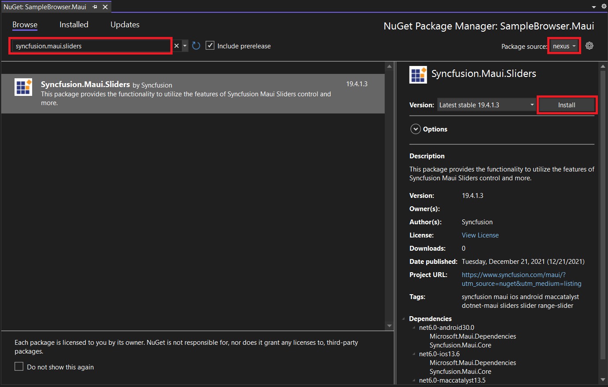
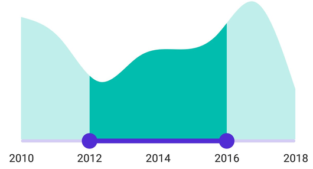
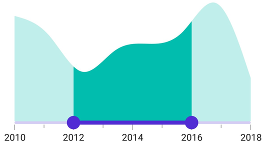
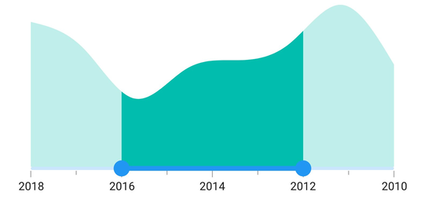
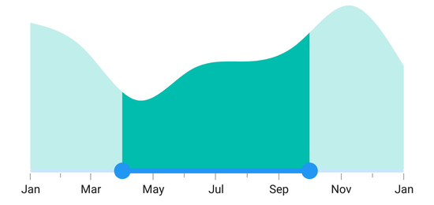

# Getting Started with .NET MAUI DateTime Range Selector

This section explains the steps required to add the DateTime Range Selector control and its elements such as track, ticks, labels and tooltip. This section covers only the basic features needed to know to get started with the Syncfusion DateTime Range Selector.

To get start quickly with MAUI SfDateTimeRangeSelector, you can check on this video:

<iframe id='MAUIDateTimeRangeSelectorVideoTutorial' src='https://www.youtube.com/embed/QpaNVNcn7xc'></iframe>

## Creating an application with .NET MAUI

Create a new .NET MAUI application in the Visual Studio.

 

## Adding the SfDateTimeRangeSelector reference

The Syncfusion .NET MAUI components are available in [nuget.org](https://www.nuget.org/). To add the SfDateTimeRangeSelector to your project, open the NuGet package manager in the Visual Studio, search for the Syncfusion.Maui.Sliders, and install it.

 

## Handler registration

In the MauiProgram.cs file, register the handler for the Syncfusion core.



using Microsoft.Maui;
using Microsoft.Maui.Hosting;
using Microsoft.Maui.Controls.Compatibility;
using Microsoft.Maui.Controls.Hosting;
using Microsoft.Maui.Controls.Xaml;
using Syncfusion.Maui.Core.Hosting;

namespace RangeSelector
{
    public static class MauiProgram
    {
        public static MauiApp CreateMauiApp()
        {
            var builder = MauiApp.CreateBuilder();
            builder
            .UseMauiApp<App>()
            .ConfigureSyncfusionCore()
            .ConfigureFonts(fonts =>
            {
                fonts.AddFont("OpenSans-Regular.ttf", "OpenSansRegular");
            });

            return builder.Build();
        }
    }
}



## Initialize the DateTime Range Selector

Import the [`SfDateTimeRangeSelector`](https://help.syncfusion.com/cr/maui/Syncfusion.Maui.Sliders.SfDateTimeRangeSelector.html) namespace and initialize the DateTime Range Selector as follows.





<ContentPage
    . . .
    xmlns:sliders="clr-namespace:Syncfusion.Maui.Sliders;assembly=Syncfusion.Maui.Sliders">
    <sliders:SfDateTimeRangeSelector Minimum="2010-01-01" 
                                     Maximum="2018-01-01" 
                                     RangeStart="2012-01-01" 
                                     RangeEnd="2016-01-01" />
</ContentPage>





using Syncfusion.Maui.Sliders;

namespace GettingStarted
{
    public partial class MainPage : ContentPage
    {
        public MainPage()
        {
            InitializeComponent();
            SfDateTimeRangeSelector rangeSelector = new SfDateTimeRangeSelector();
            rangeSelector.Minimum = new DateTime(2010, 01, 01);
            rangeSelector.Maximum = new DateTime(2018, 01, 01);
            rangeSelector.RangeStart = new DateTime(2012, 01, 01);
            rangeSelector.RangeEnd = new DateTime(2016, 01, 01);
            content = rangeSelector;
        }
    }
}





## Adding content to the DateTime Range Selector

The [`Content`](https://help.syncfusion.com/cr/maui/Syncfusion.Maui.Sliders.RangeSelectorBase-1.html#Syncfusion_Maui_Sliders_RangeSelectorBase_1_Content) property will add the content to the DateTime Range Selector. Add any control within the DateTime Range Selector with this property. In most cases, the [Charts](https://www.syncfusion.com/maui-controls/maui-cartesian-charts) will be added as a content.





<ContentPage 
             ...
             xmlns:sliders="clr-namespace:Syncfusion.Maui.Sliders;assembly=Syncfusion.Maui.Sliders"
             xmlns:charts="clr-namespace:Syncfusion.Maui.Charts;assembly=Syncfusion.Maui.Charts"
             xmlns:local="clr-namespace:SliderTestbedSample.RangeSelector">
    
    <ContentPage.BindingContext>
        <local:ViewModel />
    </ContentPage.BindingContext>

    <sliders:SfDateTimeRangeSelector Minimum="2010-01-01" 
                                     Maximum="2018-01-01" 
                                     RangeStart="2012-01-01" 
                                     RangeEnd="2016-01-01">
        <charts:SfCartesianChart>

            <charts:SfCartesianChart.XAxes>
                <charts:DateTimeAxis IsVisible="False"
                                    ShowMajorGridLines="False" />
            </charts:SfCartesianChart.XAxes>

            <charts:SfCartesianChart.YAxes>
                <charts:NumericalAxis IsVisible="False"
                                     ShowMajorGridLines="False" />
            </charts:SfCartesianChart.YAxes>

            <charts:SfCartesianChart.Series>
                <charts:SplineAreaSeries ItemsSource="{Binding Source}"
                                        XBindingPath="X"
                                        YBindingPath="Y">
                </charts:SplineAreaSeries>

            </charts:SfCartesianChart.Series>
        
        </charts:SfCartesianChart>
    
    </sliders:SfDateTimeRangeSelector>
</ContentPage>





SfCartesianChart chart = new SfCartesianChart();
DateTimeAxis primaryAxis = new DateTimeAxis();
chart.XAxes.Add(primaryAxis);
NumericalAxis secondaryAxis = new NumericalAxis();
chart.YAxes.Add(secondaryAxis);
SplineAreaSeries series = new SplineAreaSeries()
{
    ItemsSource = new ViewModel().Source,
    XBindingPath = "X",
    YBindingPath = "Y",
};
chart.Series.Add(series);
SfDateTimeRangeSelector rangeSelector = new SfDateTimeRangeSelector()
{
    Minimum = new DateTime(2010, 01, 01),
    Maximum = new DateTime(2018, 01, 01),
    RangeStart = new DateTime(2012, 01, 01),
    RangeEnd = new DateTime(2016, 01, 01),
    Content = chart,
};
this.Content = rangeSelector;





## Enable labels

The [`ShowLabels`](https://help.syncfusion.com/cr/maui/Syncfusion.Maui.Sliders.RangeView-1.html#Syncfusion_Maui_Sliders_RangeView_1_ShowLabels) property enables the labels which render on a given interval.





<ContentPage 
             ...
             xmlns:sliders="clr-namespace:Syncfusion.Maui.Sliders;assembly=Syncfusion.Maui.Sliders"
             xmlns:charts="clr-namespace:Syncfusion.Maui.Charts;assembly=Syncfusion.Maui.Charts">

    <sliders:SfDateTimeRangeSelector Minimum="2010-01-01" 
                                     Maximum="2018-01-01" 
                                     RangeStart="2012-01-01" 
                                     RangeEnd="2016-01-01"
                                     Interval="2" 
                                     ShowLabels="True">

        <charts:SfCartesianChart>
            ...
        </charts:SfCartesianChart>

    </sliders:SfDateTimeRangeSelector>
</ContentPage>





SfDateTimeRangeSelector rangeSelector = new SfDateTimeRangeSelector();
rangeSelector.Minimum = new DateTime(2010, 01, 01);
rangeSelector.Maximum = new DateTime(2018, 01, 01);
rangeSelector.RangeStart = new DateTime(2012, 01, 01);
rangeSelector.RangeEnd = new DateTime(2016, 01, 01);
rangeSelector.Interval = 2;
rangeSelector.ShowLabel = true;
SfCartesianChart chart = new SfCartesianChart();
rangeSelector.Content = chart;





## Enable ticks

The [`ShowTicks`](https://help.syncfusion.com/cr/maui/Syncfusion.Maui.Sliders.RangeView-1.html#Syncfusion_Maui_Sliders_RangeView_1_ShowTicks) property enables the ticks in the DateTime Range Selector while the [`MinorTicksPerInterval`](https://help.syncfusion.com/cr/maui/Syncfusion.Maui.Sliders.RangeView-1.html#Syncfusion_Maui_Sliders_RangeView_1_MinorTicksPerInterval) property enables the minor ticks between the major ticks.





<ContentPage 
             ...
             xmlns:sliders="clr-namespace:Syncfusion.Maui.Sliders;assembly=Syncfusion.Maui.Sliders"
             xmlns:charts="clr-namespace:Syncfusion.Maui.Charts;assembly=Syncfusion.Maui.Charts">
    
    <sliders:SfDateTimeRangeSelector Minimum="2010-01-01" 
                                     Maximum="2018-01-01" 
                                     RangeStart="2012-01-01" 
                                     RangeEnd="2016-01-01"                      
                                     Interval="2" 
                                     ShowLabels="True"
                                     ShowTicks="True" 
                                     MinorTicksPerInterval="1">
        
        <charts:SfCartesianChart>
            ...
        </charts:SfCartesianChart>
    
    </sliders:SfDateTimeRangeSelector>
</ContentPage>





SfDateTimeRangeSelector rangeSelector = new SfDateTimeRangeSelector();
rangeSelector.Minimum = new DateTime(2010, 01, 01);
rangeSelector.Maximum = new DateTime(2018, 01, 01);
rangeSelector.RangeStart = new DateTime(2012, 01, 01);
rangeSelector.RangeEnd = new DateTime(2016, 01, 01);
rangeSelector.Interval = 2;
rangeSelector.ShowLabels = true;
rangeSelector.ShowTicks = true;
rangeSelector.MinorTicksPerInterval = 1;
SfCartesianChart chart = new SfCartesianChart();
rangeSelector.Content = chart;





## Inverse the Range Selector

Invert the DateTime Range Selector using the [`IsInversed`](https://help.syncfusion.com/cr/maui/Syncfusion.Maui.Sliders.RangeView-1.html#Syncfusion_Maui_Sliders_RangeView_1_IsInversed) property. The default value of the [`IsInversed`](https://help.syncfusion.com/cr/maui/Syncfusion.Maui.Sliders.RangeView-1.html#Syncfusion_Maui_Sliders_RangeView_1_IsInversed) property is `False`.





<ContentPage 
             ...
             xmlns:sliders="clr-namespace:Syncfusion.Maui.Sliders;assembly=Syncfusion.Maui.Sliders"
             xmlns:charts="clr-namespace:Syncfusion.Maui.Charts;assembly=Syncfusion.Maui.Charts">

    <sliders:SfDateTimeRangeSelector Minimum="2010-01-01" 
                                     Maximum="2018-01-01" 
                                     RangeStart="2012-01-01" 
                                     RangeEnd="2016-01-01"
                                     Interval="2"
                                     ShowLabels="True"
                                     ShowTicks="True" 
                                     MinorTicksPerInterval="1" 
                                     IsInversed="True">

        <charts:SfCartesianChart>
            ...
        </charts:SfCartesianChart>

    </sliders:SfDateTimeRangeSelector>
</ContentPage>





SfDateTimeRangeSelector rangeSelector = new SfDateTimeRangeSelector();
rangeSelector.Minimum = new DateTime(2010, 01, 01);
rangeSelector.Maximum = new DateTime(2018, 01, 01);
rangeSelector.RangeStart = new DateTime(2012, 01, 01);
rangeSelector.RangeEnd = new DateTime(2016, 01, 01);
rangeSelector.Interval = 2;
rangeSelector.ShowLabels = true;
rangeSelector.ShowTicks = true;
rangeSelector.MinorTicksPerInterval = 1;
rangeSelector.IsInversed = true;
SfCartesianChart chart = new SfCartesianChart();
rangeSelector.Content = chart;





## Formatting labels

Add prefix or suffix to the labels using the [`DateFormat`](https://help.syncfusion.com/cr/maui/Syncfusion.Maui.Sliders.IDateTimeElement.html#Syncfusion_Maui_Sliders_IDateTimeElement_DateFormat) property.





<ContentPage 
             ...
             xmlns:sliders="clr-namespace:Syncfusion.Maui.Sliders;assembly=Syncfusion.Maui.Sliders"
             xmlns:charts="clr-namespace:Syncfusion.Maui.Charts;assembly=Syncfusion.Maui.Charts">
    
    <sliders:SfDateTimeRangeSelector Minimum="2010-01-01"
                                     Maximum="2011-01-01"
                                     RangeStart="2010-04-01"
                                     RangeEnd="2010-10-01"
                                     DateFormat="MMM"
                                     IntervalType="Months"
                                     ShowTicks="True"
                                     MinorTicksPerInterval="1"
                                     ShowLabels="True"
                                     Interval="2">
        
        <charts:SfCartesianChart>
            ...
        </charts:SfCartesianChart>
    
    </sliders:SfDateTimeRangeSelector>
</ContentPage> 





SfDateTimeRangeSelector rangeSelector = new SfDateTimeRangeSelector();
rangeSelector.Minimum = new DateTime(2010, 01, 01);
rangeSelector.Maximum = new DateTime(2011, 01, 01);
rangeSelector.RangeStart = new DateTime(2010, 04, 01);
rangeSelector.RangeEnd = new DateTime(2010, 10, 01);
rangeSelector.ShowLabels = true;
rangeSelector.Interval = 2;
rangeSelector.ShowTicks = true;
rangeSelector.MinorTicksPerInterval = 1;
rangeSelector.DateFormat = "MMM";
rangeSelector.IntervalType = SliderDateIntervalType.Months;
SfCartesianChart chart = new SfCartesianChart();
rangeSelector.Content = chart;





