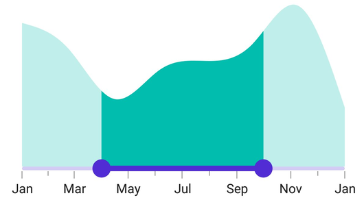

# Getting Started with .NET MAUI DateTime Range Selector

This section guides you through setting up and configuring a [DateTime Range Selector](https://help.syncfusion.com/cr/maui/Syncfusion.Maui.Sliders.SfDateTimeRangeSelector.html) in your .NET MAUI application. Follow the steps below to add a basic DateTime Range Selector to your project.

To quickly get started with the .NET MAUI DateTime Range Selector, watch this video.

<iframe id='MAUIDateTimeRangeSelectorVideoTutorial' src='https://www.youtube.com/embed/QpaNVNcn7xc'></iframe>

## Prerequisites

Before proceeding, ensure the following are in place:

1. Install [.NET 7 SDK](https://dotnet.microsoft.com/en-us/download/dotnet/7.0) or later.
2. Set up a .NET MAUI environment with Visual Studio 2022 (v17.3 or later) or Visual Studio Code. For Visual Studio Code users, ensure that the .NET MAUI workload is installed and configured as described [here](https://learn.microsoft.com/en-us/dotnet/maui/get-started/installation?view=net-maui-8.0&tabs=visual-studio-code).

## Step 1: Create a New MAUI Project

### Visual Studio

1. Go to **File > New > Project** and choose the **.NET MAUI App** template.
2. Name the project and choose a location. Then, click **Next**.
3. Select the .NET framework version and click **Create**.

### Visual Studio Code

1. Open the Command Palette by pressing **Ctrl+Shift+P** and type **.NET:New Project** and press Enter.
2. Choose the **.NET MAUI App** template.
3. Select the project location, type the project name and press Enter.
4. Then choose **Create project**

## Step 2: Install the Syncfusion MAUI Sliders NuGet Package

1. In **Solution Explorer**, right-click the project and choose **Manage NuGet Packages**.
2. Search for [Syncfusion.Maui.Sliders](https://www.nuget.org/packages/Syncfusion.Maui.Sliders) and install the latest version.
3. Ensure the necessary dependencies are installed correctly, and the project is restored.

## Step 3: Register the Handler

[Syncfusion.Maui.Core](https://www.nuget.org/packages/Syncfusion.Maui.Core) nuget is a dependent package for all Syncfusion controls of .NET MAUI. In the **MauiProgram.cs file**, register the handler for Syncfusion core.



using Microsoft.Maui;
using Microsoft.Maui.Hosting;
using Microsoft.Maui.Controls.Compatibility;
using Microsoft.Maui.Controls.Hosting;
using Microsoft.Maui.Controls.Xaml;
using Syncfusion.Maui.Core.Hosting;

namespace RangeSelector
{
    public static class MauiProgram
    {
        public static MauiApp CreateMauiApp()
        {
            var builder = MauiApp.CreateBuilder();
            builder
            .UseMauiApp<App>()
            .ConfigureSyncfusionCore()
            .ConfigureFonts(fonts =>
            {
                fonts.AddFont("OpenSans-Regular.ttf", "OpenSansRegular");
            });

            return builder.Build();
        }
    }
}



## Step 4: Add a Basic DateTime Range Selector

Import the [SfDateTimeRangeSelector](https://help.syncfusion.com/cr/maui/Syncfusion.Maui.Sliders.SfDateTimeRangeSelector.html) namespace and initialize the DateTime Range Selector as follows.





<ContentPage
    . . .
    xmlns:sliders="clr-namespace:Syncfusion.Maui.Sliders;assembly=Syncfusion.Maui.Sliders">
    <sliders:SfDateTimeRangeSelector Minimum="2010-01-01" 
                                     Maximum="2018-01-01" 
                                     RangeStart="2012-01-01" 
                                     RangeEnd="2016-01-01" />
</ContentPage>





using Syncfusion.Maui.Sliders;

namespace GettingStarted
{
    public partial class MainPage : ContentPage
    {
        public MainPage()
        {
            InitializeComponent();
            SfDateTimeRangeSelector rangeSelector = new SfDateTimeRangeSelector();
            rangeSelector.Minimum = new DateTime(2010, 01, 01);
            rangeSelector.Maximum = new DateTime(2018, 01, 01);
            rangeSelector.RangeStart = new DateTime(2012, 01, 01);
            rangeSelector.RangeEnd = new DateTime(2016, 01, 01);
            content = rangeSelector;
        }
    }
}





## Adding content to the DateTime Range Selector

The [Content](https://help.syncfusion.com/cr/maui/Syncfusion.Maui.Sliders.RangeSelectorBase-1.html#Syncfusion_Maui_Sliders_RangeSelectorBase_1_Content) property will add the content to the DateTime Range Selector. Add any control within the DateTime Range Selector with this property. In most cases, the [Charts](https://www.syncfusion.com/maui-controls/maui-cartesian-charts) will be added as a content.





<ContentPage 
             ...
             xmlns:sliders="clr-namespace:Syncfusion.Maui.Sliders;assembly=Syncfusion.Maui.Sliders"
             xmlns:charts="clr-namespace:Syncfusion.Maui.Charts;assembly=Syncfusion.Maui.Charts"
             xmlns:local="clr-namespace:SliderTestbedSample.RangeSelector">
    
    <ContentPage.BindingContext>
        <local:ViewModel />
    </ContentPage.BindingContext>

    <sliders:SfDateTimeRangeSelector Minimum="2010-01-01" 
                                     Maximum="2018-01-01" 
                                     RangeStart="2012-01-01" 
                                     RangeEnd="2016-01-01">
        <charts:SfCartesianChart>

            <charts:SfCartesianChart.XAxes>
                <charts:DateTimeAxis IsVisible="False"
                                    ShowMajorGridLines="False" />
            </charts:SfCartesianChart.XAxes>

            <charts:SfCartesianChart.YAxes>
                <charts:NumericalAxis IsVisible="False"
                                     ShowMajorGridLines="False" />
            </charts:SfCartesianChart.YAxes>

            <charts:SfCartesianChart.Series>
                <charts:SplineAreaSeries ItemsSource="{Binding Source}"
                                        XBindingPath="X"
                                        YBindingPath="Y">
                </charts:SplineAreaSeries>

            </charts:SfCartesianChart.Series>
        
        </charts:SfCartesianChart>
    
    </sliders:SfDateTimeRangeSelector>
</ContentPage>





SfCartesianChart chart = new SfCartesianChart();
DateTimeAxis primaryAxis = new DateTimeAxis();
chart.XAxes.Add(primaryAxis);
NumericalAxis secondaryAxis = new NumericalAxis();
chart.YAxes.Add(secondaryAxis);
SplineAreaSeries series = new SplineAreaSeries()
{
    ItemsSource = new ViewModel().Source,
    XBindingPath = "X",
    YBindingPath = "Y",
};
chart.Series.Add(series);
SfDateTimeRangeSelector rangeSelector = new SfDateTimeRangeSelector()
{
    Minimum = new DateTime(2010, 01, 01),
    Maximum = new DateTime(2018, 01, 01),
    RangeStart = new DateTime(2012, 01, 01),
    RangeEnd = new DateTime(2016, 01, 01),
    Content = chart,
};
this.Content = rangeSelector;





## Enable labels

The [ShowLabels](https://help.syncfusion.com/cr/maui/Syncfusion.Maui.Sliders.RangeView-1.html#Syncfusion_Maui_Sliders_RangeView_1_ShowLabels) property enables the labels which render on a given interval.





<ContentPage 
             ...
             xmlns:sliders="clr-namespace:Syncfusion.Maui.Sliders;assembly=Syncfusion.Maui.Sliders"
             xmlns:charts="clr-namespace:Syncfusion.Maui.Charts;assembly=Syncfusion.Maui.Charts">

    <sliders:SfDateTimeRangeSelector Minimum="2010-01-01" 
                                     Maximum="2018-01-01" 
                                     RangeStart="2012-01-01" 
                                     RangeEnd="2016-01-01"
                                     Interval="2" 
                                     ShowLabels="True">

        <charts:SfCartesianChart>
            ...
        </charts:SfCartesianChart>

    </sliders:SfDateTimeRangeSelector>
</ContentPage>





SfDateTimeRangeSelector rangeSelector = new SfDateTimeRangeSelector();
rangeSelector.Minimum = new DateTime(2010, 01, 01);
rangeSelector.Maximum = new DateTime(2018, 01, 01);
rangeSelector.RangeStart = new DateTime(2012, 01, 01);
rangeSelector.RangeEnd = new DateTime(2016, 01, 01);
rangeSelector.Interval = 2;
rangeSelector.ShowLabel = true;
SfCartesianChart chart = new SfCartesianChart();
rangeSelector.Content = chart;





## Enable ticks

The [ShowTicks](https://help.syncfusion.com/cr/maui/Syncfusion.Maui.Sliders.RangeView-1.html#Syncfusion_Maui_Sliders_RangeView_1_ShowTicks) property enables the ticks in the DateTime Range Selector while the [MinorTicksPerInterval](https://help.syncfusion.com/cr/maui/Syncfusion.Maui.Sliders.RangeView-1.html#Syncfusion_Maui_Sliders_RangeView_1_MinorTicksPerInterval) property enables the minor ticks between the major ticks.





<ContentPage 
             ...
             xmlns:sliders="clr-namespace:Syncfusion.Maui.Sliders;assembly=Syncfusion.Maui.Sliders"
             xmlns:charts="clr-namespace:Syncfusion.Maui.Charts;assembly=Syncfusion.Maui.Charts">
    
    <sliders:SfDateTimeRangeSelector Minimum="2010-01-01" 
                                     Maximum="2018-01-01" 
                                     RangeStart="2012-01-01" 
                                     RangeEnd="2016-01-01"                      
                                     Interval="2" 
                                     ShowLabels="True"
                                     ShowTicks="True" 
                                     MinorTicksPerInterval="1">
        
        <charts:SfCartesianChart>
            ...
        </charts:SfCartesianChart>
    
    </sliders:SfDateTimeRangeSelector>
</ContentPage>





SfDateTimeRangeSelector rangeSelector = new SfDateTimeRangeSelector();
rangeSelector.Minimum = new DateTime(2010, 01, 01);
rangeSelector.Maximum = new DateTime(2018, 01, 01);
rangeSelector.RangeStart = new DateTime(2012, 01, 01);
rangeSelector.RangeEnd = new DateTime(2016, 01, 01);
rangeSelector.Interval = 2;
rangeSelector.ShowLabels = true;
rangeSelector.ShowTicks = true;
rangeSelector.MinorTicksPerInterval = 1;
SfCartesianChart chart = new SfCartesianChart();
rangeSelector.Content = chart;





## Inverse the Range Selector

Invert the DateTime Range Selector using the [IsInversed](https://help.syncfusion.com/cr/maui/Syncfusion.Maui.Sliders.RangeView-1.html#Syncfusion_Maui_Sliders_RangeView_1_IsInversed) property. The default value of the [IsInversed](https://help.syncfusion.com/cr/maui/Syncfusion.Maui.Sliders.RangeView-1.html#Syncfusion_Maui_Sliders_RangeView_1_IsInversed) property is `False`.





<ContentPage 
             ...
             xmlns:sliders="clr-namespace:Syncfusion.Maui.Sliders;assembly=Syncfusion.Maui.Sliders"
             xmlns:charts="clr-namespace:Syncfusion.Maui.Charts;assembly=Syncfusion.Maui.Charts">

    <sliders:SfDateTimeRangeSelector Minimum="2010-01-01" 
                                     Maximum="2018-01-01" 
                                     RangeStart="2012-01-01" 
                                     RangeEnd="2016-01-01"
                                     Interval="2"
                                     ShowLabels="True"
                                     ShowTicks="True" 
                                     MinorTicksPerInterval="1" 
                                     IsInversed="True">

        <charts:SfCartesianChart>
            ...
        </charts:SfCartesianChart>

    </sliders:SfDateTimeRangeSelector>
</ContentPage>





SfDateTimeRangeSelector rangeSelector = new SfDateTimeRangeSelector();
rangeSelector.Minimum = new DateTime(2010, 01, 01);
rangeSelector.Maximum = new DateTime(2018, 01, 01);
rangeSelector.RangeStart = new DateTime(2012, 01, 01);
rangeSelector.RangeEnd = new DateTime(2016, 01, 01);
rangeSelector.Interval = 2;
rangeSelector.ShowLabels = true;
rangeSelector.ShowTicks = true;
rangeSelector.MinorTicksPerInterval = 1;
rangeSelector.IsInversed = true;
SfCartesianChart chart = new SfCartesianChart();
rangeSelector.Content = chart;





## Formatting labels

Add prefix or suffix to the labels using the [DateFormat](https://help.syncfusion.com/cr/maui/Syncfusion.Maui.Sliders.IDateTimeElement.html#Syncfusion_Maui_Sliders_IDateTimeElement_DateFormat) property.





<ContentPage 
             ...
             xmlns:sliders="clr-namespace:Syncfusion.Maui.Sliders;assembly=Syncfusion.Maui.Sliders"
             xmlns:charts="clr-namespace:Syncfusion.Maui.Charts;assembly=Syncfusion.Maui.Charts">
    
    <sliders:SfDateTimeRangeSelector Minimum="2010-01-01"
                                     Maximum="2011-01-01"
                                     RangeStart="2010-04-01"
                                     RangeEnd="2010-10-01"
                                     DateFormat="MMM"
                                     IntervalType="Months"
                                     ShowTicks="True"
                                     MinorTicksPerInterval="1"
                                     ShowLabels="True"
                                     Interval="2">
        
        <charts:SfCartesianChart>
            ...
        </charts:SfCartesianChart>
    
    </sliders:SfDateTimeRangeSelector>
</ContentPage> 





SfDateTimeRangeSelector rangeSelector = new SfDateTimeRangeSelector();
rangeSelector.Minimum = new DateTime(2010, 01, 01);
rangeSelector.Maximum = new DateTime(2011, 01, 01);
rangeSelector.RangeStart = new DateTime(2010, 04, 01);
rangeSelector.RangeEnd = new DateTime(2010, 10, 01);
rangeSelector.ShowLabels = true;
rangeSelector.Interval = 2;
rangeSelector.ShowTicks = true;
rangeSelector.MinorTicksPerInterval = 1;
rangeSelector.DateFormat = "MMM";
rangeSelector.IntervalType = SliderDateIntervalType.Months;
SfCartesianChart chart = new SfCartesianChart();
rangeSelector.Content = chart;





