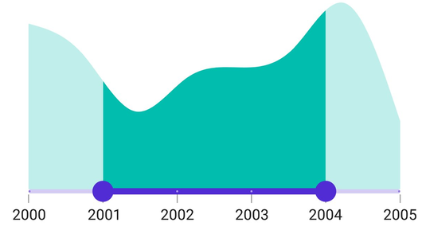

# Interval in DateTime Range Selector (SfDateTimeRangeSelector)

This section explains how to add intervals in the DateTime Range Selector control.

## Date Interval

The DateTime Range Selector includes elements such as labels, ticks, and dividers, which are rendered based on the [`Interval`](https://help.syncfusion.com/cr/maui/Syncfusion.Maui.Sliders.RangeView-1.html#Syncfusion_Maui_Sliders_RangeView_1_Interval), [`Minimum`](https://help.syncfusion.com/cr/maui/Syncfusion.Maui.Sliders.RangeView-1.html#Syncfusion_Maui_Sliders_RangeView_1_Minimum), and [`Maximum`](https://help.syncfusion.com/cr/maui/Syncfusion.Maui.Sliders.RangeView-1.html#Syncfusion_Maui_Sliders_RangeView_1_Maximum) properties. The default value for `Interval` is `0`.

Change the interval type using the [`IntervalType`](https://help.syncfusion.com/cr/maui/Syncfusion.Maui.Sliders.IDateTimeElement.html#Syncfusion_Maui_Sliders_IDateTimeElement_IntervalType) property. Format or change the label text using the [`DateFormat`](https://help.syncfusion.com/cr/maui/Syncfusion.Maui.Sliders.IDateTimeElement.html#Syncfusion_Maui_Sliders_IDateTimeElement_DateFormat) property.

For example, if the [`Minimum`](https://help.syncfusion.com/cr/maui/Syncfusion.Maui.Sliders.RangeView-1.html#Syncfusion_Maui_Sliders_RangeView_1_Minimum) is `DateTime(2000, 01, 01)`, the [`Maximum`](https://help.syncfusion.com/cr/maui/Syncfusion.Maui.Sliders.RangeView-1.html#Syncfusion_Maui_Sliders_RangeView_1_Maximum) is `DateTime(2005, 01, 01)`, the [`Interval`](https://help.syncfusion.com/cr/maui/Syncfusion.Maui.Sliders.RangeView-1.html#Syncfusion_Maui_Sliders_RangeView_1_Interval) is `1`, the [`IntervalType`](https://help.syncfusion.com/cr/maui/Syncfusion.Maui.Sliders.IDateTimeElement.html#Syncfusion_Maui_Sliders_IDateTimeElement_IntervalType) is [`SliderDateIntervalType.Years`](https://help.syncfusion.com/cr/maui/Syncfusion.Maui.Sliders.SliderDateIntervalType.html#Syncfusion_Maui_Sliders_SliderDateIntervalType_Years), and the [`DateFormat`](https://help.syncfusion.com/cr/maui/Syncfusion.Maui.Sliders.IDateTimeElement.html#Syncfusion_Maui_Sliders_IDateTimeElement_DateFormat) is `yyyy`, then the Range Selector will render labels, major ticks, and dividers at 2000, 2001, 2002, and so on.





<ContentPage 
             ...
             xmlns:sliders="clr-namespace:Syncfusion.Maui.Sliders;assembly=Syncfusion.Maui.Sliders"
             xmlns:charts="clr-namespace:Syncfusion.Maui.Charts;assembly=Syncfusion.Maui.Charts">

    <sliders:SfDateTimeRangeSelector Minimum="2000-01-01" 
                                     Maximum="2005-01-01"  
                                     RangeStart="2001-01-01" 
                                     RangeEnd="2004-01-01"
                                     Interval="1"
                                     IntervalType="Years" 
                                     DateFormat="yyyy"  
                                     ShowLabels="True" 
                                     ShowTicks="True" 
                                     ShowDividers="True">

        <charts:SfCartesianChart>
            ...
        </charts:SfCartesianChart>
    
    </sliders:SfDateTimeRangeSelector>
</ContentPage>





SfDateTimeRangeSelector rangeSelector = new SfDateTimeRangeSelector();
rangeSelector.Minimum = new DateTime(2000, 01, 01);
rangeSelector.Maximum = new DateTime(2005, 01, 01);
rangeSelector.RangeStart = new DateTime(2001, 01, 01); 
rangeSelector.RangeEnd = new DateTime(2004, 01, 01);            
rangeSelector.Interval = 1;
rangeSelector.IntervalType = SliderDateIntervalType.Years;
rangeSelector.DateFormat = "yyyy";
rangeSelector.ShowLabels = true;
rangeSelector.ShowTicks = true;
rangeSelector.ShowDividers = true;
SfCartesianChart chart = new SfCartesianChart();
rangeSelector.Content = chart;
        




## Auto Interval

If the [`ShowTicks`](https://help.syncfusion.com/cr/maui/Syncfusion.Maui.Sliders.RangeView-1.html#Syncfusion_Maui_Sliders_RangeView_1_ShowTicks), [`ShowLabels`](https://help.syncfusion.com/cr/maui/Syncfusion.Maui.Sliders.RangeView-1.html#Syncfusion_Maui_Sliders_RangeView_1_ShowLabels), or [`ShowDividers`](https://help.syncfusion.com/cr/maui/Syncfusion.Maui.Sliders.RangeView-1.html#Syncfusion_Maui_Sliders_RangeView_1_ShowDividers) properties are set to `true`, but the [`Interval`](https://help.syncfusion.com/cr/maui/Syncfusion.Maui.Sliders.RangeView-1.html#Syncfusion_Maui_Sliders_RangeView_1_Interval) is `0`, the `Interval` will be calculated based on the available size. If the [`IntervalType`](https://help.syncfusion.com/cr/maui/Syncfusion.Maui.Sliders.IDateTimeElement.html#Syncfusion_Maui_Sliders_IDateTimeElement_IntervalType) or [`DateFormat`](https://help.syncfusion.com/cr/maui/Syncfusion.Maui.Sliders.IDateTimeElement.html#Syncfusion_Maui_Sliders_IDateTimeElement_DateFormat) properties are not set, their values will be automatically determined.

For example, if the [`Minimum`](https://help.syncfusion.com/cr/maui/Syncfusion.Maui.Sliders.RangeView-1.html#Syncfusion_Maui_Sliders_RangeView_1_Minimum) is `DateTime(2000, 01, 01)`, the [`Maximum`](https://help.syncfusion.com/cr/maui/Syncfusion.Maui.Sliders.RangeView-1.html#Syncfusion_Maui_Sliders_RangeView_1_Maximum) is `DateTime(2001, 01, 01)`, [`Interval`](https://help.syncfusion.com/cr/maui/Syncfusion.Maui.Sliders.RangeView-1.html#Syncfusion_Maui_Sliders_RangeView_1_Interval) is `0`, and consider the available size as 350, then the Range Selector will render the labels, major ticks, and dividers at `Jan 01, 2000`, `Jul 01, 2000`, and `Nov 01, 2000` respectively.





<ContentPage 
             ...
             xmlns:sliders="clr-namespace:Syncfusion.Maui.Sliders;assembly=Syncfusion.Maui.Sliders"
             xmlns:charts="clr-namespace:Syncfusion.Maui.Charts;assembly=Syncfusion.Maui.Charts">

    <sliders:SfDateTimeRangeSelector Minimum="2000-01-01" 
                                     Maximum="2005-01-01"  
                                     RangeStart="2001-01-01" 
                                     RangeEnd="2004-01-01"
                                     ShowLabels="True" 
                                     ShowTicks="True" 
                                     ShowDividers="True">

        <charts:SfCartesianChart>
            ...
        </charts:SfCartesianChart>
    
    </sliders:SfDateTimeRangeSelector>
</ContentPage>





SfDateTimeRangeSelector rangeSelector = new SfDateTimeRangeSelector();
rangeSelector.Minimum = new DateTime(2000, 01, 01);
rangeSelector.Maximum = new DateTime(2005, 01, 01);
rangeSelector.RangeStart = new DateTime(2001, 01, 01); 
rangeSelector.RangeEnd = new DateTime(2004, 01, 01);            
rangeSelector.ShowLabels = true;
rangeSelector.ShowTicks = true;
rangeSelector.ShowDividers = true;
SfCartesianChart chart = new SfCartesianChart();
rangeSelector.Content = chart;
        


