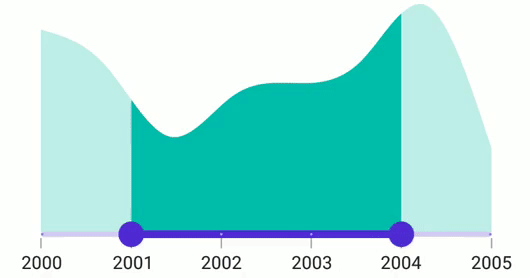
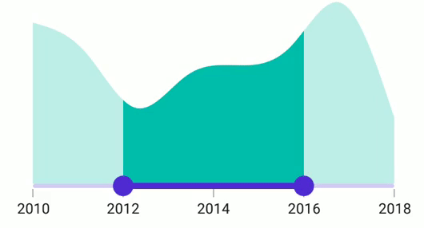

# Interval in .NET MAUI DateTime Range Selector (SfDateTimeRangeSelector)

This section explains about how to add the interval for numeric and DateTime Range Selector.

## Date interval

Range Selector elements like labels, ticks and dividers are rendered based on the [`Interval`](https://help.syncfusion.com/cr/maui/Syncfusion.Maui.Sliders.SliderBase.html#Syncfusion_Maui_Sliders_SliderBase_Interval), [`Minimum`](https://help.syncfusion.com/cr/maui/Syncfusion.Maui.Sliders.NumericRangeSliderBase.html#Syncfusion_Maui_Sliders_NumericRangeSliderBase_Minimum) and [`Maximum`](https://help.syncfusion.com/cr/maui/Syncfusion.Maui.Sliders.NumericRangeSliderBase.html#Syncfusion_Maui_Sliders_NumericRangeSliderBase_Maximum) properties. The default value is `null`.

For date values, the Range Selector does not have auto interval support. So, it is mandatory to set [`Interval`](https://help.syncfusion.com/cr/maui/Syncfusion.Maui.Sliders.SliderBase.html#Syncfusion_Maui_Sliders_SliderBase_Interval), [`IntervalType`](https://help.syncfusion.com/cr/maui/Syncfusion.Maui.Sliders.DateTimeRangeSliderBase.html#Syncfusion_Maui_Sliders_DateTimeRangeSliderBase_IntervalType), and [`DateFormat`](https://help.syncfusion.com/cr/maui/Syncfusion.Maui.Sliders.DateTimeRangeSliderBase.html#Syncfusion_Maui_Sliders_DateTimeRangeSliderBase_DateFormat) for date values.

The default value of [`IntervalType`](https://help.syncfusion.com/cr/maui/Syncfusion.Maui.Sliders.DateTimeRangeSliderBase.html#Syncfusion_Maui_Sliders_DateTimeRangeSliderBase_IntervalType) property is `DateTime.Year`. It can be years to seconds.

For example, if [`Minimum`](https://help.syncfusion.com/cr/maui/Syncfusion.Maui.Sliders.DateTimeRangeSliderBase.html#Syncfusion_Maui_Sliders_DateTimeRangeSliderBase_Minimum) is `DateTime(2000, 01, 01)` and [`Maximum`](https://help.syncfusion.com/cr/maui/Syncfusion.Maui.Sliders.DateTimeRangeSliderBase.html#Syncfusion_Maui_Sliders_DateTimeRangeSliderBase_Maximum) is `DateTime(2005, 01, 01)` and [`Interval`](https://help.syncfusion.com/cr/maui/Syncfusion.Maui.Sliders.SliderBase.html#Syncfusion_Maui_Sliders_SliderBase_Interval) is `1`, [`IntervalType`](https://help.syncfusion.com/cr/maui/Syncfusion.Maui.Sliders.SliderBase.html#Syncfusion_Maui_Sliders_SliderBase_DateIntervalType) is [`SliderDateIntervalType.years`](https://help.syncfusion.com/cr/maui/Syncfusion.Maui.Sliders.SliderDateIntervalType.html#Syncfusion_Maui_Sliders_SliderDateIntervalType_Years), [`DateFormat`](https://help.syncfusion.com/cr/maui/Syncfusion.Maui.Sliders.DateTimeRangeSliderBase.html#Syncfusion_Maui_Sliders_DateTimeRangeSliderBase_DateFormat) is `yyyy` then the range slider will render the labels, major ticks, and dividers at 2000, 2001, 2002 and so on.





<ContentPage 
             ...
             xmlns:sliders="clr-namespace:Syncfusion.Maui.Sliders;assembly=Syncfusion.Maui.Sliders"
             xmlns:charts="clr-namespace:Syncfusion.Maui.Charts;assembly=Syncfusion.Maui.Charts">

    <sliders:SfDateTimeRangeSelector Minimum="2000-01-01" 
                                     Maximum="2005-01-01"  
                                     RangeStart="2001-01-01" 
                                     RangeEnd="2004-01-01"
                                     Interval="1"
                                     IntervalType="Years" 
                                     DateFormat="yyyy"  
                                     ShowLabels="True" 
                                     ShowTicks="True" 
                                     ShowDividers="True">

        <charts:SfCartesianChart>
            ...
        </charts:SfCartesianChart>
    
    </sliders:SfDateTimeRangeSelector>
</ContentPage>





SfDateTimeRangeSelector rangeSelector = new SfDateTimeRangeSelector();
rangeSelector.Minimum = new DateTime(2000, 01, 01);
rangeSelector.Maximum = new DateTime(2005, 01, 01);
rangeSelector.RangeStart = new DateTime(2001, 01, 01); 
rangeSelector.RangeEnd = new DateTime(2004, 01, 01);            
rangeSelector.Interval = 1;
rangeSelector.IntervalType = SliderDateIntervalType.Years;
rangeSelector.DateFormat = "yyyy";
rangeSelector.ShowLabels = true;
rangeSelector.ShowTicks = true;
rangeSelector.ShowDividers = true;
SfCartesianChart chart = new SfCartesianChart();
rangeSelector.Content = chart;
        




## Discrete selection for date values

You can move the thumb in discrete manner for date values using the [`StepDuration`](https://help.syncfusion.com/cr/maui/Syncfusion.Maui.Sliders.DateTimeRangeSliderBase.html#Syncfusion_Maui_Sliders_DateTimeRangeSliderBase_StepDuration) property in the DateTime Range Selector.

For example, if [`Minimum`](https://help.syncfusion.com/cr/maui/Syncfusion.Maui.Sliders.DateTimeRangeSliderBase.html#Syncfusion_Maui_Sliders_DateTimeRangeSliderBase_Minimum) is DateTime(2015, 01, 01) and [`Maximum`](https://help.syncfusion.com/cr/maui/Syncfusion.Maui.Sliders.DateTimeRangeSliderBase.html#Syncfusion_Maui_Sliders_DateTimeRangeSliderBase_Maximum) is DateTime(2020, 01, 01) and [`StepDuration`](https://help.syncfusion.com/cr/maui/Syncfusion.Maui.Sliders.DateTimeRangeSliderBase.html#Syncfusion_Maui_Sliders_DateTimeRangeSliderBase_StepDuration) is `1`, the Range Selector will move the thumbs at DateTime(2015, 01, 01), DateTime(2016, 01, 01), DateTime(2017, 01, 01),and DateTime(2018, 01, 01).





<ContentPage 
             ...
             xmlns:sliders="clr-namespace:Syncfusion.Maui.Sliders;assembly=Syncfusion.Maui.Sliders"
             xmlns:charts="clr-namespace:Syncfusion.Maui.Charts;assembly=Syncfusion.Maui.Charts">

    <sliders:SfDateTimeRangeSelector Minimum="2000-01-01" 
                                     Maximum="2005-01-01" 
                                     RangeStart="2001-01-01"
                                     RangeEnd="2004-01-01"
                                     Interval="1"
                                     IntervalType="Years"
                                     DateFormat="yyyy"  
                                     ShowLabels="True" 
                                     ShowTicks="True" 
                                     ShowDividers="True"
                                     StepDuration="1">
        
        <charts:SfCartesianChart>
            ...
        </charts:SfCartesianChart>
    
    </sliders:SfDateTimeRangeSelector>
</ContentPage>





SfDateTimeRangeSelector rangeSelector = new SfDateTimeRangeSelector();
rangeSelector.Minimum = new DateTime(2000, 01, 01);
rangeSelector.Maximum = new DateTime(2005, 01, 01);
rangeSelector.RangeStart = new DateTime(2001, 01, 01); 
rangeSelector.RangeEnd = new DateTime(2004, 01, 01);
rangeSelector.Interval = 1;
rangeSelector.IntervalType = SliderDateIntervalType.Years;
rangeSelector.DateFormat = "yyyy";    
rangeSelector.ShowLables = true;
rangeSelector.ShowTicks = true;      
rangeSelector.ShowDividers = true;    
rangeSelector.StepDuration = new SliderStepDuration(years: 1);
SfCartesianChart chart = new SfCartesianChart();
rangeSelector.Content = chart;
         




## Interval Selection

You can drag thumbs only in intervals when [EnableIntervalSelection](https://help.syncfusion.com/cr/maui/Syncfusion.Maui.Sliders.RangeSliderBase.html#Syncfusion_Maui_Sliders_RangeSliderBase_EnableIntervalSelection) is true.
If true, both the thumbs can be only moved on the selector Interval.





<ContentPage 
             ...
             xmlns:sliders="clr-namespace:Syncfusion.Maui.Sliders;assembly=Syncfusion.Maui.Sliders"
             xmlns:charts="clr-namespace:Syncfusion.Maui.Charts;assembly=Syncfusion.Maui.Charts">
    
    <sliders:SfDateTimeRangeSelector Minimum="2010-01-01" 
                                     Maximum="2018-01-01" 
                                     RangeStart="2012-01-01" 
                                     RangeEnd="2016-01-01"
                                     Interval="2" 
                                     ShowTicks="True"
                                     ShowLabels="True"
                                     EnableIntervalSelection="True">

        <charts:SfCartesianChart>
            ...
        </charts:SfCartesianChart>
    
    </sliders:SfDateTimeRangeSelector>
</ContentPage>





SfDateTimeRangeSelector rangeSelector = new SfDateTimeRangeSelector();
rangeSelector.Minimum = new DateTime(2010, 01, 01);
rangeSelector.Maximum = new DateTime(2018, 01, 01);
rangeSelector.RangeStart = new DateTime(2012, 01, 01);
rangeSelector.RangeEnd = new DateTime(2016, 01, 01);       
rangeSelector.ShowLables = true;
rangeSelector.ShowTicks = true;    
rangeSelector.EnableIntervalSelection = true;
SfCartesianChart chart = new SfCartesianChart();
rangeSelector.Content = chart;
         




