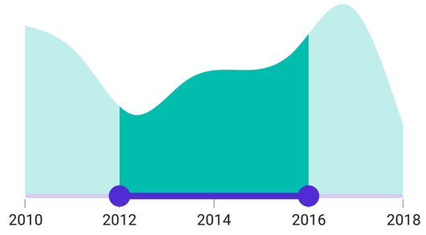
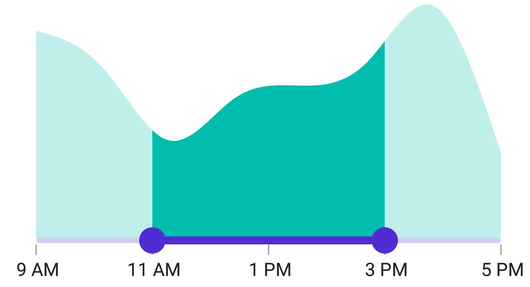

# Labels in .NET MAUI DateTime Range Selector (SfDateTimeRangeSelector)

This section explains how to add the labels in the DateTime Range Selector.

## Show labels

The [`ShowLabels`](https://help.syncfusion.com/cr/maui/Syncfusion.Maui.Sliders.RangeView-1.html#Syncfusion_Maui_Sliders_RangeView_1_ShowLabels) property is used to render the labels at a given interval. The default value of the [`ShowLabels`](https://help.syncfusion.com/cr/maui/Syncfusion.Maui.Sliders.RangeView-1.html#Syncfusion_Maui_Sliders_RangeView_1_ShowLabels) property is `False`.





<ContentPage 
             ...
             xmlns:sliders="clr-namespace:Syncfusion.Maui.Sliders;assembly=Syncfusion.Maui.Sliders"
             xmlns:charts="clr-namespace:Syncfusion.Maui.Charts;assembly=Syncfusion.Maui.Charts">

    <sliders:SfDateTimeRangeSelector Minimum="2010-01-01" 
                                     Maximum="2018-01-01" 
                                     RangeStart="2012-01-01" 
                                     RangeEnd="2016-01-01"
                                     Interval="2" 
                                     ShowLabels="True"
                                     ShowTicks="True">

        <charts:SfCartesianChart>
            ...
        </charts:SfCartesianChart>

    </sliders:SfDateTimeRangeSelector>
</ContentPage>





SfDateTimeRangeSelector rangeSelector = new SfDateTimeRangeSelector();
rangeSelector.Minimum = new DateTime(2010, 01, 01);
rangeSelector.Maximum = new DateTime(2018, 01, 01);
rangeSelector.RangeStart = new DateTime(2012, 01, 01);
rangeSelector.RangeEnd = new DateTime(2016, 01, 01);
rangeSelector.Interval = 2;
rangeSelector.ShowLabels = true;
rangeSelector.ShowTicks = true;
SfCartesianChart chart = new SfCartesianChart();
rangeSelector.Content = chart;





## Date format

The [`DateFormat`](https://help.syncfusion.com/cr/maui/Syncfusion.Maui.Sliders.IDateTimeElement.html#Syncfusion_Maui_Sliders_IDateTimeElement_DateFormat) property is used to format the date labels. The default value of the [`DateFormat`](https://help.syncfusion.com/cr/maui/Syncfusion.Maui.Sliders.IDateTimeElement.html#Syncfusion_Maui_Sliders_IDateTimeElement_DateFormat) property is `string.Empty`.





<ContentPage 
             ...
             xmlns:sliders="clr-namespace:Syncfusion.Maui.Sliders;assembly=Syncfusion.Maui.Sliders"
             xmlns:charts="clr-namespace:Syncfusion.Maui.Charts;assembly=Syncfusion.Maui.Charts">

    <sliders:SfDateTimeRangeSelector Minimum="2000-01-01T09:00:00" 
                                     Maximum="2000-01-01T17:00:00" 
                                     RangeStart="2000-01-01T11:00:00" 
                                     RangeEnd="2000-01-01T15:00:00" 
                                     ShowLabels="True" 
                                     ShowTicks="True" 
                                     IntervalType="Hours" 
                                     Interval="2" 
                                     DateFormat="h tt">

        <charts:SfCartesianChart>
            ...
        </charts:SfCartesianChart>

    </sliders:SfDateTimeRangeSelector>
</ContentPage>





SfDateTimeRangeSelector rangeSelector = new SfDateTimeRangeSelector();
rangeSelector.Minimum = new DateTime(2000, 01, 01, 09, 00, 00);
rangeSelector.Maximum = new DateTime(2000, 01, 01, 17, 00, 00);
rangeSelector.RangeStart = new DateTime(2000, 01, 01, 11, 00, 00);
rangeSelector.RangeEnd = new DateTime(2000, 01, 01, 15, 00, 00);
rangeSelector.Interval = 2;
rangeSelector.IntervalType = SliderDateIntervalType.Hours;
rangeSelector.DateFormat = "h tt";
rangeSelector.ShowLabels = true;
rangeSelector.ShowTicks = true;
SfCartesianChart chart = new SfCartesianChart();
rangeSelector.Content = chart;





## Label placement

The [`LabelsPlacement`](https://help.syncfusion.com/cr/maui/Syncfusion.Maui.Sliders.RangeView-1.html#Syncfusion_Maui_Sliders_RangeView_1_LabelsPlacement) property is used to place the labels either between the major ticks or on the major ticks. The default value of the [`LabelsPlacement`](https://help.syncfusion.com/cr/maui/Syncfusion.Maui.Sliders.RangeView-1.html#Syncfusion_Maui_Sliders_RangeView_1_LabelsPlacement) property is [`SliderLabelsPlacement.OnTicks`](https://help.syncfusion.com/cr/maui/Syncfusion.Maui.Sliders.SliderLabelsPlacement.html#Syncfusion_Maui_Sliders_SliderLabelsPlacement_OnTicks).





<ContentPage 
             ...
             xmlns:sliders="clr-namespace:Syncfusion.Maui.Sliders;assembly=Syncfusion.Maui.Sliders"
             xmlns:charts="clr-namespace:Syncfusion.Maui.Charts;assembly=Syncfusion.Maui.Charts">

    <sliders:SfDateTimeRangeSelector Minimum="2011-01-01"
                                     Maximum="2016-01-01"
                                     RangeStart="2012-01-01"
                                     RangeEnd="2015-01-01"
                                     Interval="1"
                                     LabelsPlacement="BetweenTicks"
                                     ShowLabels="True"
                                     ShowTicks="True">

        <charts:SfCartesianChart>
            ...
        </charts:SfCartesianChart>

    </sliders:SfDateTimeRangeSelector>
</ContentPage>





SfDateTimeRangeSelector rangeSelector = new SfDateTimeRangeSelector();
rangeSelector.Minimum = new DateTime(2011, 01, 01);
rangeSelector.Maximum = new DateTime(2016, 01, 01);
rangeSelector.RangeStart = new DateTime(2012, 01, 01);
rangeSelector.RangeEnd = new DateTime(2015, 01, 01);
rangeSelector.Interval = 1;
rangeSelector.LabelsPlacement = SliderLabelsPlacement.BetweenTicks;
rangeSelector.ShowLabels = true;
rangeSelector.ShowTicks = true;
SfCartesianChart chart = new SfCartesianChart();
rangeSelector.Content = chart;





N> Refer [here](https://help.syncfusion.com/maui/datetime-range-selector/events-and-commands) to customize the label text format through range slider events.

## Edge labels placement

The [`EdgeLabelsPlacement`](https://help.syncfusion.com/cr/maui/Syncfusion.Maui.Sliders.RangeView-1.html#Syncfusion_Maui_Sliders_RangeView_1_EdgeLabelsPlacement) property is used to move the first and the last label either inside the track bounds or based on the intervals. The default value of the [`EdgeLabelsPlacement`](https://help.syncfusion.com/cr/maui/Syncfusion.Maui.Sliders.RangeView-1.html#Syncfusion_Maui_Sliders_RangeView_1_EdgeLabelsPlacement) property is [`SliderEdgeLabelPlacement.Default`](https://help.syncfusion.com/cr/maui/Syncfusion.Maui.Sliders.SliderEdgeLabelsPlacement.html#Syncfusion_Maui_Sliders_SliderEdgeLabelsPlacement_Default).

If the [`TrackExtent`](https://help.syncfusion.com/cr/maui/Syncfusion.Maui.Sliders.RangeView-1.html#Syncfusion_Maui_Sliders_RangeView_1_TrackExtent) > 0 and the [`EdgeLabelsPlacement`](https://help.syncfusion.com/cr/maui/Syncfusion.Maui.Sliders.RangeView-1.html#Syncfusion_Maui_Sliders_RangeView_1_EdgeLabelsPlacement) is [`SliderEdgeLabelsPlacement.Inside`](https://help.syncfusion.com/cr/maui/Syncfusion.Maui.Sliders.SliderEdgeLabelsPlacement.html#Syncfusion_Maui_Sliders_SliderEdgeLabelsPlacement_Inside), the labels get placed inside the extended track edges. 





<ContentPage 
             ...
             xmlns:sliders="clr-namespace:Syncfusion.Maui.Sliders;assembly=Syncfusion.Maui.Sliders"
             xmlns:charts="clr-namespace:Syncfusion.Maui.Charts;assembly=Syncfusion.Maui.Charts">

    <sliders:SfDateTimeRangeSelector Minimum="2002-01-07"
                                     Maximum="2002-01-13"
                                     RangeStart="2002-01-09"
                                     RangeEnd="2002-01-11"
                                     Interval="1"
                                     IntervalType="Days"
                                     DateFormat="ddd" 
                                     EdgeLabelsPlacement="Inside" 
                                     ShowLabels="True" 
                                     ShowTicks="True">

        <charts:SfCartesianChart>
            ...
        </charts:SfCartesianChart>

    </sliders:SfDateTimeRangeSelector>
</ContentPage>





SfDateTimeRangeSelector rangeSelector = new SfDateTimeRangeSelector();
rangeSelector.Minimum = new DateTime(2002, 01, 07);
rangeSelector.Maximum = new DateTime(2002, 01, 13);
rangeSelector.RangeStart = new DateTime(2002, 01, 09);
rangeSelector.RangeEnd = new DateTime(2002, 01, 11);
rangeSelector.Interval = 1;
rangeSelector.IntervalType = SliderDateIntervalType.Days;
rangeSelector.DateFormat = "ddd";
rangeSelector.EdgeLabelsPlacement = SliderEdgeLabelsPlacement.Inside;
rangeSelector.ShowLabels = true;
rangeSelector.ShowTicks = true;
SfCartesianChart chart = new SfCartesianChart();
rangeSelector.Content = chart;





## Label style

Change the active and inactive label appearance using the [`ActiveTextColor`](https://help.syncfusion.com/cr/maui/Syncfusion.Maui.Sliders.SliderLabelStyle.html#Syncfusion_Maui_Sliders_SliderLabelStyle_ActiveTextColor), [`ActiveFontSize`](https://help.syncfusion.com/cr/maui/Syncfusion.Maui.Sliders.SliderLabelStyle.html#Syncfusion_Maui_Sliders_SliderLabelStyle_ActiveFontSize), [`ActiveFontFamily`](https://help.syncfusion.com/cr/maui/Syncfusion.Maui.Sliders.SliderLabelStyle.html#Syncfusion_Maui_Sliders_SliderLabelStyle_ActiveFontFamily), [`ActiveFontAttributes`](https://help.syncfusion.com/cr/maui/Syncfusion.Maui.Sliders.SliderLabelStyle.html#Syncfusion_Maui_Sliders_SliderLabelStyle_ActiveFontAttributes), [`InactiveTextColor`](https://help.syncfusion.com/cr/maui/Syncfusion.Maui.Sliders.SliderLabelStyle.html#Syncfusion_Maui_Sliders_SliderLabelStyle_InactiveTextColor), [`InactiveFontSize`](https://help.syncfusion.com/cr/maui/Syncfusion.Maui.Sliders.SliderLabelStyle.html#Syncfusion_Maui_Sliders_SliderLabelStyle_InactiveFontSize), [`InactiveFontFamily`](https://help.syncfusion.com/cr/maui/Syncfusion.Maui.Sliders.SliderLabelStyle.html#Syncfusion_Maui_Sliders_SliderLabelStyle_InactiveFontFamily), [`InactiveFontAttributes`](https://help.syncfusion.com/cr/maui/Syncfusion.Maui.Sliders.SliderLabelStyle.html#Syncfusion_Maui_Sliders_SliderLabelStyle_InactiveFontAttributes), and [`Offset`](https://help.syncfusion.com/cr/maui/Syncfusion.Maui.Sliders.SliderLabelStyle.html#Syncfusion_Maui_Sliders_SliderLabelStyle_Offset)  properties of the [`LabelStyle`](https://help.syncfusion.com/cr/maui/Syncfusion.Maui.Sliders.SliderLabelStyle.html) class.

The active side of the DateTime Range Selector is between the start and end thumbs.

The inactive side of the DateTime Range Selector is between the [`Minimum`](https://help.syncfusion.com/cr/maui/Syncfusion.Maui.Sliders.RangeView-1.html#Syncfusion_Maui_Sliders_RangeView_1_Minimum) value and the left thumb and the right thumb and the [`Maximum`](https://help.syncfusion.com/cr/maui/Syncfusion.Maui.Sliders.RangeView-1.html#Syncfusion_Maui_Sliders_RangeView_1_Maximum) value.





<ContentPage 
             ...
             xmlns:sliders="clr-namespace:Syncfusion.Maui.Sliders;assembly=Syncfusion.Maui.Sliders"
             xmlns:charts="clr-namespace:Syncfusion.Maui.Charts;assembly=Syncfusion.Maui.Charts">

    <sliders:SfDateTimeRangeSelector Minimum="2010-01-01" 
                                     Maximum="2018-01-01" 
                                     RangeStart="2012-01-01" 
                                     RangeEnd="2016-01-01"
                                     Interval="2"  
                                     ShowLabels="True" 
                                     ShowTicks="True">

        <sliders:SfDateTimeRangeSelector.LabelStyle>
            <sliders:SliderLabelStyle ActiveTextColor="#EE3F3F" 
                                      InactiveTextColor="#F7B1AE" 
                                      ActiveFontAttributes="Italic" 
                                      InactiveFontAttributes="Bold" 
                                      ActiveFontSize="16" 
                                      InactiveFontSize="16" />
        </sliders:SfDateTimeRangeSelector.LabelStyle>

        <charts:SfCartesianChart>
            ...
        </charts:SfCartesianChart>

    </sliders:SfDateTimeRangeSelector>
</ContentPage>





SfDateTimeRangeSelector rangeSelector = new SfDateTimeRangeSelector();
rangeSelector.Minimum = new DateTime(2010, 01, 01);
rangeSelector.Maximum = new DateTime(2018, 01, 01);
rangeSelector.RangeStart = new DateTime(2012, 01, 01);
rangeSelector.RangeEnd = new DateTime(2016, 01, 01);
rangeSelector.Interval = 2;
rangeSelector.ShowLabels = true;
rangeSelector.ShowTicks = true;
rangeSelector.LabelStyle.ActiveTextColor = Color.FromArgb("#EE3F3F");
rangeSelector.LabelStyle.InactiveTextColor = Color.FromArgb("#F7B1AE");
rangeSelector.LabelStyle.ActiveFontSize = 16;
rangeSelector.LabelStyle.InactiveFontSize = 16;
rangeSelector.LabelStyle.ActiveFontAttributes = FontAttributes.Italic;
rangeSelector.LabelStyle.InactiveFontAttributes = FontAttributes.Bold;
SfCartesianChart chart = new SfCartesianChart();
rangeSelector.Content = chart;





## Label offset

Adjust the space between ticks and labels using the [`Offset`](https://help.syncfusion.com/cr/maui/Syncfusion.Maui.Sliders.SliderLabelStyle.html#Syncfusion_Maui_Sliders_SliderLabelStyle_OffsetProperty) property. The default value of the [`Offset`](https://help.syncfusion.com/cr/maui/Syncfusion.Maui.Sliders.SliderLabelStyle.html#Syncfusion_Maui_Sliders_SliderLabelStyle_Offset) property is 5.0 when the  [`ShowTicks`](https://help.syncfusion.com/cr/maui/Syncfusion.Maui.Sliders.RangeView-1.html#Syncfusion_Maui_Sliders_RangeView_1_ShowTicks) is enabled. Otherwise, it is `15.0` by default.





<ContentPage 
             ...
             xmlns:sliders="clr-namespace:Syncfusion.Maui.Sliders;assembly=Syncfusion.Maui.Sliders"
             xmlns:charts="clr-namespace:Syncfusion.Maui.Charts;assembly=Syncfusion.Maui.Charts">
    
    <sliders:SfDateTimeRangeSelector Minimum="2010-01-01" 
                                     Maximum="2018-01-01" 
                                     RangeStart="2012-01-01" 
                                     RangeEnd="2016-01-01"
                                     Interval="2" 
                                     ShowLabels="True" 
                                     ShowTicks="True">
        
        <sliders:SfDateTimeRangeSelector.LabelStyle>
            <sliders:SliderLabelStyle Offset="10" />
        </sliders:SfDateTimeRangeSelector.LabelStyle>
        
        <charts:SfCartesianChart>
            ...
        </charts:SfCartesianChart>
    
    </sliders:SfDateTimeRangeSelector>
</ContentPage>





SfDateTimeRangeSelector rangeSelector = new SfDateTimeRangeSelector();
rangeSelector.Minimum = new DateTime(2010, 01, 01);
rangeSelector.Maximum = new DateTime(2018, 01, 01);
rangeSelector.RangeStart = new DateTime(2012, 01, 01);
rangeSelector.RangeEnd = new DateTime(2016, 01, 01);
rangeSelector.Interval = 2;
rangeSelector.ShowLabels = true;
rangeSelector.ShowTicks = true;
rangeSelector.LabelStyle.Offset = 10;
SfCartesianChart chart = new SfCartesianChart();
rangeSelector.Content = chart;





