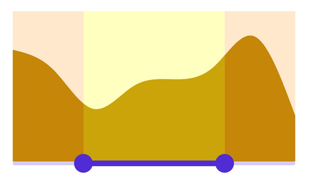
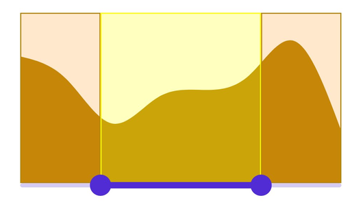
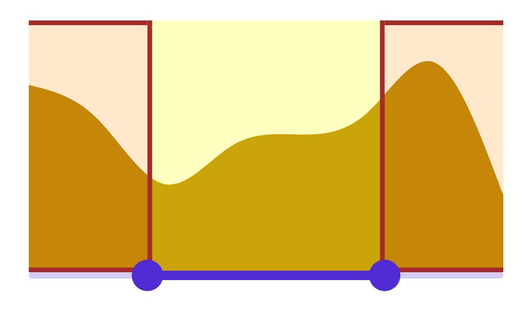

# Regions in DateTime Range Selector (SfDateTimeRangeSelector)

This section explains how to customize the active and inactive regions in the DateTime Range Selector control.

## Region color

Change the color of the active and inactive regions using the [`ActiveRegionFill`](https://help.syncfusion.com/cr/maui/Syncfusion.Maui.Sliders.RangeSelectorBase-1.html#Syncfusion_Maui_Sliders_RangeSelectorBase_1_ActiveRegionFill) and [`InactiveRegionFill`](https://help.syncfusion.com/cr/maui/Syncfusion.Maui.Sliders.RangeSelectorBase-1.html#Syncfusion_Maui_Sliders_RangeSelectorBase_1_InactiveRegionFill) properties of the [`RangeSelectorBase`](https://help.syncfusion.com/cr/maui/Syncfusion.Maui.Sliders.RangeSelectorBase-1.html) class. The default value of the [`ActiveRegionFill`](https://help.syncfusion.com/cr/maui/Syncfusion.Maui.Sliders.RangeSelectorBase-1.html#Syncfusion_Maui_Sliders_RangeSelectorBase_1_ActiveRegionFill) and the [`InactiveRegionFill`](https://help.syncfusion.com/cr/maui/Syncfusion.Maui.Sliders.RangeSelectorBase-1.html#Syncfusion_Maui_Sliders_RangeSelectorBase_1_InactiveRegionFill) properties are `SolidColorBrush(Colors.Transparent)` and `SolidColorBrush(Color.FromRgba(255, 255, 255, 192)` respectively.

The active side of the DateTime Range Selector is between the start and the end thumbs.

The inactive side of the DateTime Range Selector is between the [`Minimum`](https://help.syncfusion.com/cr/maui/Syncfusion.Maui.Sliders.RangeView-1.html#Syncfusion_Maui_Sliders_RangeView_1_Minimum) value and the left thumb and the right thumb and the [`Maximum`](https://help.syncfusion.com/cr/maui/Syncfusion.Maui.Sliders.RangeView-1.html#Syncfusion_Maui_Sliders_RangeView_1_Maximum) value.





<ContentPage 
             ...
             xmlns:sliders="clr-namespace:Syncfusion.Maui.Sliders;assembly=Syncfusion.Maui.Sliders"
             xmlns:charts="clr-namespace:Syncfusion.Maui.Charts;assembly=Syncfusion.Maui.Charts">

    <sliders:SfDateTimeRangeSelector Minimum="2000-01-01"
                                     Maximum="2005-01-01"
                                     RangeStart="2001-01-01"
                                     RangeEnd="2004-01-01"
                                     ActiveRegionFill="#40FFFF00"
                                     InactiveRegionFill="#33FF8A00">

        <charts:SfCartesianChart>
            ...
        </charts:SfCartesianChart>

    </sliders:SfDateTimeRangeSelector>
</ContentPage>





SfDateTimeRangeSelector rangeSelector = new SfDateTimeRangeSelector();
rangeSelector.Minimum = new DateTime(2000, 01, 01);
rangeSelector.Maximum = new DateTime(2005, 01, 01);
rangeSelector.RangeStart = new DateTime(2001, 01, 01); 
rangeSelector.RangeEnd = new DateTime(2004, 01, 01);  
rangeSelector.ActiveRegionFill = new SolidColorBrush(Color.FromArgb("#40FFFF00"));    
rangeSelector.InactiveRegionFill = new SolidColorBrush(Color.FromArgb("#33FF8A00")); 
SfCartesianChart chart = new SfCartesianChart();
rangeSelector.Content = chart;
        




## Region stroke

Change the stroke color of the active and inactive regions using the [`ActiveRegionStroke`](https://help.syncfusion.com/cr/maui/Syncfusion.Maui.Sliders.RangeSelectorBase-1.html#Syncfusion_Maui_Sliders_RangeSelectorBase_1_ActiveRegionStroke) and [`InactiveRegionStroke`](https://help.syncfusion.com/cr/maui/Syncfusion.Maui.Sliders.RangeSelectorBase-1.html#Syncfusion_Maui_Sliders_RangeSelectorBase_1_InactiveRegionStroke) properties of the [`RangeSelectorBase`](https://help.syncfusion.com/cr/maui/Syncfusion.Maui.Sliders.RangeSelectorBase-1.html) class. The default value of the [`ActiveRegionStroke`](https://help.syncfusion.com/cr/maui/Syncfusion.Maui.Sliders.RangeSelectorBase-1.html#Syncfusion_Maui_Sliders_RangeSelectorBase_1_ActiveRegionStroke) and the [`InactiveRegionStroke`](https://help.syncfusion.com/cr/maui/Syncfusion.Maui.Sliders.RangeSelectorBase-1.html#Syncfusion_Maui_Sliders_RangeSelectorBase_1_InactiveRegionStroke) properties are `SolidColorBrush(Colors.Transparent)` and `SolidColorBrush(Colors.Transparent)` respectively.

The active side of the DateTime Range Selector is between the start and the end thumbs.

The inactive side of the DateTime Range Selector is between the [`Minimum`](https://help.syncfusion.com/cr/maui/Syncfusion.Maui.Sliders.RangeView-1.html#Syncfusion_Maui_Sliders_RangeView_1_Minimum) value and the left thumb and the right thumb and the [`Maximum`](https://help.syncfusion.com/cr/maui/Syncfusion.Maui.Sliders.RangeView-1.html#Syncfusion_Maui_Sliders_RangeView_1_Maximum) value.





<ContentPage 
             ...
             xmlns:sliders="clr-namespace:Syncfusion.Maui.Sliders;assembly=Syncfusion.Maui.Sliders"
             xmlns:charts="clr-namespace:Syncfusion.Maui.Charts;assembly=Syncfusion.Maui.Charts">

    <sliders:SfDateTimeRangeSelector Minimum="2000-01-01"
                                     Maximum="2005-01-01"
                                     RangeStart="2001-01-01"
                                     RangeEnd="2004-01-01"
                                     ActiveRegionFill="#40FFFF00"
                                     InactiveRegionFill="#33FF8A00"
                                     ActiveRegionStroke="#FFFF00"
                                     InactiveRegionStroke="#B8860B">

        <charts:SfCartesianChart>
            ...
        </charts:SfCartesianChart>

    </sliders:SfDateTimeRangeSelector>
</ContentPage>





SfDateTimeRangeSelector rangeSelector = new SfDateTimeRangeSelector();
rangeSelector.Minimum = new DateTime(2000, 01, 01);
rangeSelector.Maximum = new DateTime(2005, 01, 01);
rangeSelector.RangeStart = new DateTime(2001, 01, 01); 
rangeSelector.RangeEnd = new DateTime(2004, 01, 01);  
rangeSelector.ActiveRegionFill = new SolidColorBrush(Color.FromArgb("#40FFFF00"));    
rangeSelector.InactiveRegionFill = new SolidColorBrush(Color.FromArgb("#33FF8A00")); 
rangeSelector.ActiveRegionStroke = new SolidColorBrush(Color.FromArgb("#FFFF00")); 
rangeSelector.InactiveRegionStroke = new SolidColorBrush(Color.FromArgb("#B8860B"));       
SfCartesianChart chart = new SfCartesianChart();
rangeSelector.Content = chart;
         




## Region stroke thickness

Change the stroke thickness of the active and inactive regions using the [`ActiveRegionStrokeThickness`](https://help.syncfusion.com/cr/maui/Syncfusion.Maui.Sliders.RangeSelectorBase-1.html#Syncfusion_Maui_Sliders_RangeSelectorBase_1_ActiveRegionStrokeThickness) and [`InactiveRegionStrokeThickness`](https://help.syncfusion.com/cr/maui/Syncfusion.Maui.Sliders.RangeSelectorBase-1.html#Syncfusion_Maui_Sliders_RangeSelectorBase_1_InactiveRegionStrokeThickness) properties of the [`RangeSelectorBase`](https://help.syncfusion.com/cr/maui/Syncfusion.Maui.Sliders.RangeSelectorBase-1.html) class. The default value of the [`ActiveRegionStrokeThickness`](https://help.syncfusion.com/cr/maui/Syncfusion.Maui.Sliders.RangeSelectorBase-1.html#Syncfusion_Maui_Sliders_RangeSelectorBase_1_ActiveRegionStrokeThickness) and the [`InactiveRegionStrokeThickness`](https://help.syncfusion.com/cr/maui/Syncfusion.Maui.Sliders.RangeSelectorBase-1.html#Syncfusion_Maui_Sliders_RangeSelectorBase_1_InactiveRegionStrokeThickness) properties is `Thickness(1)`.

The active side of the DateTime Range Selector is between the start and the end thumbs.

The inactive side of the DateTime Range Selector is between the [`Minimum`](https://help.syncfusion.com/cr/maui/Syncfusion.Maui.Sliders.RangeView-1.html#Syncfusion_Maui_Sliders_RangeView_1_Minimum) value and the left thumb and the right thumb and the [`Maximum`](https://help.syncfusion.com/cr/maui/Syncfusion.Maui.Sliders.RangeView-1.html#Syncfusion_Maui_Sliders_RangeView_1_Maximum) value.





<ContentPage 
             ...
             xmlns:sliders="clr-namespace:Syncfusion.Maui.Sliders;assembly=Syncfusion.Maui.Sliders"
             xmlns:charts="clr-namespace:Syncfusion.Maui.Charts;assembly=Syncfusion.Maui.Charts">

    <sliders:SfDateTimeRangeSelector Minimum="2000-01-01"
                                     Maximum="2005-01-01"
                                     RangeStart="2001-01-01"
                                     RangeEnd="2004-01-01"
                                     ActiveRegionFill="#40FFFF00"
                                     InactiveRegionFill="#33FF8A00"
                                     ActiveRegionStroke="#A52A2A"
                                     InactiveRegionStroke="#A52A2A"
                                     ActiveRegionStrokeThickness="3,0,3,0"
                                     InactiveRegionStrokeThickness="0,3,0,3">

        <charts:SfCartesianChart>
            ...
        </charts:SfCartesianChart>

    </sliders:SfDateTimeRangeSelector>
</ContentPage>





SfDateTimeRangeSelector rangeSelector = new SfDateTimeRangeSelector();
rangeSelector.Minimum = new DateTime(2000, 01, 01);
rangeSelector.Maximum = new DateTime(2005, 01, 01);
rangeSelector.RangeStart = new DateTime(2001, 01, 01); 
rangeSelector.RangeEnd = new DateTime(2004, 01, 01);  
rangeSelector.ActiveRegionFill = new SolidColorBrush(Color.FromArgb("#40FFFF00"));    
rangeSelector.InactiveRegionFill = new SolidColorBrush(Color.FromArgb("#33FF8A00")); 
rangeSelector.ActiveRegionStroke = new SolidColorBrush(Color.FromArgb("#A52A2A")); 
rangeSelector.InactiveRegionStroke = new SolidColorBrush(Color.FromArgb("#A52A2A"));       
rangeSelector.ActiveRegionStrokeThickness = new Thickness(3,0,3,0);
rangeSelector.InactiveRegionStrokeThickness = new Thickness(0,3,0,3);
SfCartesianChart chart = new SfCartesianChart();
rangeSelector.Content = chart;
         




