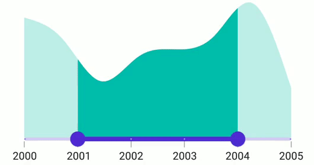
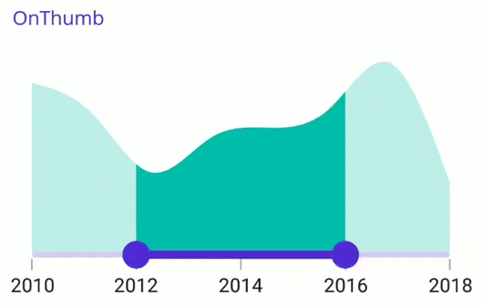

# Range selection in .NET MAUI Range Selector (SfDateTimeRangeSelector)

This section helps to learn about the range selection in the DateTime Range Selector.

## Discrete selection

Move the thumb in a discrete manner for date values using the [`StepDuration`](https://help.syncfusion.com/cr/maui/Syncfusion.Maui.Sliders.IDateTimeElement.html#Syncfusion_Maui_Sliders_IDateTimeElement_StepDuration) property in the DateTime Range Selector.

For example, if the [`Minimum`](https://help.syncfusion.com/cr/maui/Syncfusion.Maui.Sliders.RangeView-1.html#Syncfusion_Maui_Sliders_RangeView_1_Minimum) is DateTime(2015, 01, 01), [`Maximum`](https://help.syncfusion.com/cr/maui/Syncfusion.Maui.Sliders.RangeView-1.html#Syncfusion_Maui_Sliders_RangeView_1_Maximum) is DateTime(2020, 01, 01), and the [`StepDuration`](https://help.syncfusion.com/cr/maui/Syncfusion.Maui.Sliders.IDateTimeElement.html#Syncfusion_Maui_Sliders_IDateTimeElement_StepDuration) is `1`, the Range Selector will move the thumbs at DateTime(2015, 01, 01), DateTime(2016, 01, 01), DateTime(2017, 01, 01),and DateTime(2018, 01, 01).





<ContentPage 
             ...
             xmlns:sliders="clr-namespace:Syncfusion.Maui.Sliders;assembly=Syncfusion.Maui.Sliders"
             xmlns:charts="clr-namespace:Syncfusion.Maui.Charts;assembly=Syncfusion.Maui.Charts">

    <sliders:SfDateTimeRangeSelector Minimum="2000-01-01" 
                                     Maximum="2005-01-01" 
                                     RangeStart="2001-01-01"
                                     RangeEnd="2004-01-01"
                                     Interval="1"
                                     IntervalType="Years"
                                     DateFormat="yyyy"  
                                     ShowLabels="True" 
                                     ShowTicks="True" 
                                     ShowDividers="True"
                                     StepDuration="1">
        
        <charts:SfCartesianChart>
            ...
        </charts:SfCartesianChart>
    
    </sliders:SfDateTimeRangeSelector>
</ContentPage>





SfDateTimeRangeSelector rangeSelector = new SfDateTimeRangeSelector();
rangeSelector.Minimum = new DateTime(2000, 01, 01);
rangeSelector.Maximum = new DateTime(2005, 01, 01);
rangeSelector.RangeStart = new DateTime(2001, 01, 01); 
rangeSelector.RangeEnd = new DateTime(2004, 01, 01);
rangeSelector.Interval = 1;
rangeSelector.IntervalType = SliderDateIntervalType.Years;
rangeSelector.DateFormat = "yyyy";    
rangeSelector.ShowLabels = true;
rangeSelector.ShowTicks = true;      
rangeSelector.ShowDividers = true;    
rangeSelector.StepDuration = new SliderStepDuration(years: 1);
SfCartesianChart chart = new SfCartesianChart();
rangeSelector.Content = chart;
         




## Interval Selection

Both the thumbs are moved to the selected interval if the [EnableIntervalSelection](https://help.syncfusion.com/cr/maui/Syncfusion.Maui.Sliders.RangeSliderBase-1.html#Syncfusion_Maui_Sliders_RangeSliderBase_1_EnableIntervalSelection) property is true, otherwise the nearest thumb is moved to the touch position.





<ContentPage 
             ...
             xmlns:sliders="clr-namespace:Syncfusion.Maui.Sliders;assembly=Syncfusion.Maui.Sliders"
             xmlns:charts="clr-namespace:Syncfusion.Maui.Charts;assembly=Syncfusion.Maui.Charts">
    
    <sliders:SfDateTimeRangeSelector Minimum="2010-01-01" 
                                     Maximum="2018-01-01" 
                                     RangeStart="2012-01-01" 
                                     RangeEnd="2016-01-01"
                                     Interval="2" 
                                     ShowTicks="True"
                                     ShowLabels="True"
                                     EnableIntervalSelection="True">

        <charts:SfCartesianChart>
            ...
        </charts:SfCartesianChart>
    
    </sliders:SfDateTimeRangeSelector>
</ContentPage>





SfDateTimeRangeSelector rangeSelector = new SfDateTimeRangeSelector();
rangeSelector.Minimum = new DateTime(2010, 01, 01);
rangeSelector.Maximum = new DateTime(2018, 01, 01);
rangeSelector.RangeStart = new DateTime(2012, 01, 01);
rangeSelector.RangeEnd = new DateTime(2016, 01, 01);       
rangeSelector.ShowLabels = true;
rangeSelector.ShowTicks = true;    
rangeSelector.EnableIntervalSelection = true;
SfCartesianChart chart = new SfCartesianChart();
rangeSelector.Content = chart;
         




## DragBehavior

### OnThumb

When the [DragBehavior](https://help.syncfusion.com/cr/maui/Syncfusion.Maui.Sliders.RangeSliderBase-1.html#Syncfusion_Maui_Sliders_RangeSliderBase_1_DragBehavior) is set to [OnThumb](https://help.syncfusion.com/cr/maui/Syncfusion.Maui.Sliders.SliderDragBehavior.html#Syncfusion_Maui_Sliders_SliderDragBehavior_OnThumb), the individual thumb can be moved based on the dragging. By default, the [OnThumb](https://help.syncfusion.com/cr/maui/Syncfusion.Maui.Sliders.SliderDragBehavior.html#Syncfusion_Maui_Sliders_SliderDragBehavior_OnThumb) is used as drag behavior.





<ContentPage 
             ...
             xmlns:sliders="clr-namespace:Syncfusion.Maui.Sliders;assembly=Syncfusion.Maui.Sliders"
             xmlns:charts="clr-namespace:Syncfusion.Maui.Charts;assembly=Syncfusion.Maui.Charts">

    <sliders:SfDateTimeRangeSelector Minimum="2010-01-01"
                                     Maximum="2018-01-01"
                                     RangeStart="2012-01-01"
                                     RangeEnd="2016-01-01"
                                     Interval="2"
                                     ShowTicks="True"
                                     ShowLabels="True"
                                     EdgeLabelsPlacement="Inside"
                                     DragBehavior="OnThumb">

        <charts:SfCartesianChart>
            ...
        </charts:SfCartesianChart>

    </sliders:SfDateTimeRangeSelector>
</ContentPage>





SfDateTimeRangeSelector rangeSelector = new SfDateTimeRangeSelector();
rangeSelector.Minimum = new DateTime(2010, 01, 01);
rangeSelector.Maximum = new DateTime(2018, 01, 01);
rangeSelector.RangeStart = new DateTime(2012, 01, 01);
rangeSelector.RangeEnd = new DateTime(2016, 01, 01);
rangeSelector.Interval = 2; 
rangeSelector.ShowTicks = true;
rangeSelector.ShowLabels = true;  
rangeSelector.EdgeLabelsPlacement = SliderEdgeLabelsPlacement.Inside;
rangeSelector.DragBehavior = SliderDragBehavior.OnThumb;
SfCartesianChart chart = new SfCartesianChart();
rangeSelector.Content = chart;





### BetweenThumbs

When the [DragBehavior](https://help.syncfusion.com/cr/maui/Syncfusion.Maui.Sliders.RangeSliderBase-1.html#Syncfusion_Maui_Sliders_RangeSliderBase_1_DragBehavior) is set to [BetweenThumbs](https://help.syncfusion.com/cr/maui/Syncfusion.Maui.Sliders.SliderDragBehavior.html#Syncfusion_Maui_Sliders_SliderDragBehavior_BetweenThumbs), both the thumbs can be moved at the same time without changing the range between the start and end thumbs. This behavior has been considered without the Range Selector thumb radius. It is not possible to move the individual thumb when setting this behavior.





<ContentPage 
             ...
             xmlns:sliders="clr-namespace:Syncfusion.Maui.Sliders;assembly=Syncfusion.Maui.Sliders"
             xmlns:charts="clr-namespace:Syncfusion.Maui.Charts;assembly=Syncfusion.Maui.Charts">

    <sliders:SfDateTimeRangeSelector Minimum="2010-01-01" 
                                     Maximum="2018-01-01" 
                                     RangeStart="2012-01-01" 
                                     RangeEnd="2016-01-01"
                                     Interval="2" 
                                     ShowTicks="True"
                                     ShowLabels="True"
                                     EdgeLabelsPlacement="Inside"
                                     DragBehavior="BetweenThumbs">

        <charts:SfCartesianChart>
            ...
        </charts:SfCartesianChart>

    </sliders:SfDateTimeRangeSelector>
</ContentPage>





SfDateTimeRangeSelector rangeSelector = new SfDateTimeRangeSelector();
rangeSelector.Minimum = new DateTime(2010, 01, 01);
rangeSelector.Maximum = new DateTime(2018, 01, 01);
rangeSelector.RangeStart = new DateTime(2012, 01, 01);
rangeSelector.RangeEnd = new DateTime(2016, 01, 01);
rangeSelector.Interval = 2; 
rangeSelector.ShowTicks = true;
rangeSelector.ShowLabels = true;   
rangeSelector.EdgeLabelsPlacement = SliderEdgeLabelsPlacement.Inside;
rangeSelector.DragBehavior = SliderDragBehavior.BetweenThumbs;
SfCartesianChart chart = new SfCartesianChart();
rangeSelector.Content = chart;





### Both

When the  [DragBehavior](https://help.syncfusion.com/cr/maui/Syncfusion.Maui.Sliders.RangeSliderBase-1.html#Syncfusion_Maui_Sliders_RangeSliderBase_1_DragBehavior) is set to [Both](https://help.syncfusion.com/cr/maui/Syncfusion.Maui.Sliders.SliderDragBehavior.html#Syncfusion_Maui_Sliders_SliderDragBehavior_Both), the individual thumb can be moved, and also both the thumbs can be moved at the same time without changing the range between the start and end thumbs.





<ContentPage 
             ...
             xmlns:sliders="clr-namespace:Syncfusion.Maui.Sliders;assembly=Syncfusion.Maui.Sliders"
             xmlns:charts="clr-namespace:Syncfusion.Maui.Charts;assembly=Syncfusion.Maui.Charts">

    <sliders:SfDateTimeRangeSelector Minimum="2010-01-01" 
                                     Maximum="2018-01-01" 
                                     RangeStart="2012-01-01" 
                                     RangeEnd="2016-01-01"
                                     Interval="2" 
                                     ShowTicks="True"
                                     ShowLabels="True"
                                     EdgeLabelsPlacement="Inside"
                                     DragBehavior="Both">

        <charts:SfCartesianChart>
            ...
        </charts:SfCartesianChart>

    </sliders:SfDateTimeRangeSelector>
</ContentPage>





SfDateTimeRangeSelector rangeSelector = new SfDateTimeRangeSelector();
rangeSelector.Minimum = new DateTime(2010, 01, 01);
rangeSelector.Maximum = new DateTime(2018, 01, 01);
rangeSelector.RangeStart = new DateTime(2012, 01, 01);
rangeSelector.RangeEnd = new DateTime(2016, 01, 01);
rangeSelector.Interval = 2; 
rangeSelector.ShowTicks = true; 
rangeSelector.ShowLabels = true;  
rangeSelector.EdgeLabelsPlacement = SliderEdgeLabelsPlacement.Inside;
rangeSelector.DragBehavior = SliderDragBehavior.Both;
SfCartesianChart chart = new SfCartesianChart();
rangeSelector.Content = chart;





## Deferred update

You can control when the dependent components are updated while thumbs are being dragged continuously. It can be achieved by setting the `EnableDeferredUpdate` property and the delay in the update can be achieved by setting the `DeferredUpdateDelay` property. The default value of the `DeferredUpdateDelay` property is `500` milliseconds.

It invokes the `ValueChanging` event when the thumb is dragged and held for the duration specified in the `DeferredUpdateDelay`. However, the values are immediately updated in touch-up action.





<ContentPage 
             ...
             xmlns:sliders="clr-namespace:Syncfusion.Maui.Sliders;assembly=Syncfusion.Maui.Sliders"
             xmlns:charts="clr-namespace:Syncfusion.Maui.Charts;assembly=Syncfusion.Maui.Charts">
    
    <sliders:SfDateTimeRangeSelector Minimum="2010-01-01" 
                                     Maximum="2018-01-01" 
                                     RangeStart="2012-01-01" 
                                     RangeEnd="2016-01-01"
                                     Interval="2" 
                                     ShowTicks="True"
                                     ShowLabels="True"
                                     EnableDeferredUpdate="True"
                                     DeferredUpdateDelay="1000">

        <charts:SfCartesianChart>
            ...
        </charts:SfCartesianChart>
    
    </sliders:SfDateTimeRangeSelector>
</ContentPage>





SfDateTimeRangeSelector rangeSelector = new SfDateTimeRangeSelector();
rangeSelector.Minimum = new DateTime(2010, 01, 01);
rangeSelector.Maximum = new DateTime(2018, 01, 01);
rangeSelector.RangeStart = new DateTime(2012, 01, 01);
rangeSelector.RangeEnd = new DateTime(2016, 01, 01);   
rangeSelector.Interval = 2;    
rangeSelector.ShowLabels = true;
rangeSelector.ShowTicks = true;    
rangeSelector.EnableDeferredUpdate = true;
rangeSelector.DeferredUpdateDelay = 1000;
SfCartesianChart chart = new SfCartesianChart();
rangeSelector.Content = chart;
         


