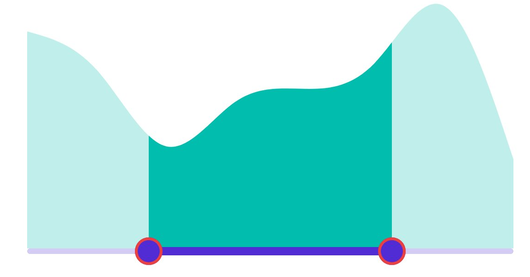

# Thumb and Overlay in DateTime Range Selector (SfDateTimeRangeSelector)

This section helps to learn about how to customize the thumb and thumb overlay in the DateTime Range Selector.

* Thumb - It is one of the slider elements that can be used to drag and change the selected value.
* Thumb overlay - It is rendered around the thumb while interacting with them.

## Thumb size

Change the thumb size using the [`ThumbStyle`](https://help.syncfusion.com/cr/maui/Syncfusion.Maui.Sliders.SliderThumbStyle.html) class's [`Radius`](https://help.syncfusion.com/cr/maui/Syncfusion.Maui.Sliders.SliderThumbStyle.html#Syncfusion_Maui_Sliders_SliderThumbStyle_Radius) property. The default value of the [`Radius`](https://help.syncfusion.com/cr/maui/Syncfusion.Maui.Sliders.SliderThumbStyle.html#Syncfusion_Maui_Sliders_SliderThumbStyle_Radius) property is `10.0`.





<ContentPage 
             ...
             xmlns:sliders="clr-namespace:Syncfusion.Maui.Sliders;assembly=Syncfusion.Maui.Sliders"
             xmlns:charts="clr-namespace:Syncfusion.Maui.Charts;assembly=Syncfusion.Maui.Charts">
    
    <sliders:SfDateTimeRangeSelector Minimum="2010-01-01" 
                                     Maximum="2018-01-01" 
                                     RangeStart="2012-01-01" 
                                     RangeEnd="2016-01-01">
        
        <sliders:SfDateTimeRangeSelector.ThumbStyle>
            <sliders:SliderThumbStyle Radius="15" />
        </sliders:SfDateTimeRangeSelector.ThumbStyle>
        
        <charts:SfCartesianChart>
            ...
        </charts:SfCartesianChart>
    
    </sliders:SfDateTimeRangeSelector>
</ContentPage>





SfDateTimeRangeSelector rangeSelector = new SfDateTimeRangeSelector();
rangeSelector.Minimum = new DateTime(2010, 01, 01);
rangeSelector.Maximum = new DateTime(2018, 01, 01);
rangeSelector.RangeStart = new DateTime(2012, 01, 01);
rangeSelector.RangeEnd = new DateTime(2016, 01, 01);
rangeSelector.ThumbStyle.Radius = 15;
SfCartesianChart chart = new SfCartesianChart();
rangeSelector.Content = chart;
        




## Thumb color

Change the color of the thumb using the [`Fill`](https://help.syncfusion.com/cr/maui/Syncfusion.Maui.Sliders.SliderThumbStyle.html#Syncfusion_Maui_Sliders_SliderThumbStyle_Fill) property of the [`ThumbStyle`](https://help.syncfusion.com/cr/maui/Syncfusion.Maui.Sliders.SliderThumbStyle.html) class.





<ContentPage 
             ...
             xmlns:sliders="clr-namespace:Syncfusion.Maui.Sliders;assembly=Syncfusion.Maui.Sliders"
             xmlns:chart="clr-namespace:Syncfusion.Maui.Charts;assembly=Syncfusion.Maui.Charts">
    
    <sliders:SfDateTimeRangeSelector Minimum="2010-01-01" 
                                     Maximum="2018-01-01" 
                                     RangeStart="2012-01-01" 
                                     RangeEnd="2016-01-01">
        
        <sliders:SfDateTimeRangeSelector.ThumbStyle>
            <sliders:SliderThumbStyle Fill="#EE3F3F" />
        </sliders:SfDateTimeRangeSelector.ThumbStyle>
        
        <charts:SfCartesianChart>
            ...
        </charts:SfCartesianChart>
    
    </sliders:SfDateTimeRangeSelector>
</ContentPage>





SfDateTimeRangeSelector rangeSelector = new SfDateTimeRangeSelector();
rangeSelector.Minimum = new DateTime(2010, 01, 01);
rangeSelector.Maximum = new DateTime(2018, 01, 01);
rangeSelector.RangeStart = new DateTime(2012, 01, 01);
rangeSelector.RangeEnd = new DateTime(2016, 01, 01);
rangeSelector.ThumbStyle.Fill = new SolidColorBrush(Color.FromArgb("#EE3F3F"));
SfCartesianChart chart = new SfCartesianChart();
rangeSelector.Content = chart;
        




## Thumb stroke thickness and stroke

Change the thumb stroke width using the [`StrokeThickness`](https://help.syncfusion.com/cr/maui/Syncfusion.Maui.Sliders.SliderThumbStyle.html#Syncfusion_Maui_Sliders_SliderThumbStyle_StrokeThickness) property and thumb stroke color using the [`Stroke`](https://help.syncfusion.com/cr/maui/Syncfusion.Maui.Sliders.SliderThumbStyle.html#Syncfusion_Maui_Sliders_SliderThumbStyle_Stroke) property of the [`ThumbStyle`](https://help.syncfusion.com/cr/maui/Syncfusion.Maui.Sliders.SliderThumbStyle.html) class.





<ContentPage 
             ...
             xmlns:sliders="clr-namespace:Syncfusion.Maui.Sliders;assembly=Syncfusion.Maui.Sliders"
             xmlns:charts="clr-namespace:Syncfusion.Maui.Charts;assembly=Syncfusion.Maui.Charts">
    
    <sliders:SfDateTimeRangeSelector Minimum="2010-01-01" 
                                     Maximum="2018-01-01" 
                                     RangeStart="2012-01-01" 
                                     RangeEnd="2016-01-01">
        
        <sliders:SfDateTimeRangeSelector.ThumbStyle>
            <sliders:SliderThumbStyle StrokeThickness="2" Stroke="#EE3F3F" />
        </sliders:SfDateTimeRangeSelector.ThumbStyle>
        
        <charts:SfCartesianChart>
            ...
        </charts:SfCartesianChart>
    
    </sliders:SfDateTimeRangeSelector>
</ContentPage>





SfDateTimeRangeSelector rangeSelector = new SfDateTimeRangeSelector();
rangeSelector.Minimum = new DateTime(2010, 01, 01);
rangeSelector.Maximum = new DateTime(2018, 01, 01);
rangeSelector.RangeStart = new DateTime(2012, 01, 01);
rangeSelector.RangeEnd = new DateTime(2016, 01, 01);
rangeSelector.ThumbStyle.Stroke = new SolidColorBrush(Color.FromArgb("#EE3F3F"));
rangeSelector.ThumbStyle.StrokeThickness = 2;
SfCartesianChart chart = new SfCartesianChart();
rangeSelector.Content = chart;
        




## Thumb overlapping stroke color

Change the thumb stroke color while two thumbs overlap using the [`OverlapStroke`](https://help.syncfusion.com/cr/maui/Syncfusion.Maui.Sliders.SliderThumbStyle.html#Syncfusion_Maui_Sliders_SliderThumbStyle_OverlapStroke) property of the [`ThumbStyle`](https://help.syncfusion.com/cr/maui/Syncfusion.Maui.Sliders.SliderThumbStyle.html) class.





<ContentPage 
             ...
             xmlns:sliders="clr-namespace:Syncfusion.Maui.Sliders;assembly=Syncfusion.Maui.Sliders"
             xmlns:charts="clr-namespace:Syncfusion.Maui.Charts;assembly=Syncfusion.Maui.Charts">
    
    <sliders:SfDateTimeRangeSelector Minimum="2010-01-01" 
                                     Maximum="2018-01-01" 
                                     RangeStart="2012-01-01" 
                                     RangeEnd="2016-01-01">
        
        <sliders:SfDateTimeRangeSelector.ThumbStyle>
            <sliders:SliderThumbStyle OverlapStroke="#EE3F3F" />
        </sliders:SfDateTimeRangeSelector.ThumbStyle>
        
        <charts:SfCartesianChart>
            ...
        </charts:SfCartesianChart>
    
    </sliders:SfDateTimeRangeSelector>
</ContentPage>





SfDateTimeRangeSelector rangeSelector = new SfDateTimeRangeSelector();
rangeSelector.Minimum = new DateTime(2010, 01, 01);
rangeSelector.Maximum = new DateTime(2018, 01, 01);
rangeSelector.RangeStart = new DateTime(2012, 01, 01);
rangeSelector.RangeEnd = new DateTime(2016, 01, 01);
rangeSelector.ThumbStyle.OverlapStroke = new SolidColorBrush(Color.FromArgb("#EE3F3F"));
SfCartesianChart chart = new SfCartesianChart();
rangeSelector.Content = chart;
        




## Thumb overlay size

Change the size of the thumb overlay using the [`Radius`](https://help.syncfusion.com/cr/maui/Syncfusion.Maui.Sliders.SliderThumbOverlayStyle.html#Syncfusion_Maui_Sliders_SliderThumbOverlayStyle_Radius) property of the [`ThumbOverlayStyle`](https://help.syncfusion.com/cr/maui/Syncfusion.Maui.Sliders.SliderThumbOverlayStyle.html) class. The default value of the [`Radius`](https://help.syncfusion.com/cr/maui/Syncfusion.Maui.Sliders.SliderThumbOverlayStyle.html#Syncfusion_Maui_Sliders_SliderThumbOverlayStyle_Radius) property is `24.0`.





<ContentPage 
             ...
             xmlns:sliders="clr-namespace:Syncfusion.Maui.Sliders;assembly=Syncfusion.Maui.Sliders"
             xmlns:charts="clr-namespace:Syncfusion.Maui.Charts;assembly=Syncfusion.Maui.Charts">
    
    <sliders:SfDateTimeRangeSelector Minimum="2010-01-01" 
                                     Maximum="2018-01-01" 
                                     RangeStart="2012-01-01" 
                                     RangeEnd="2016-01-01">
        
        <sliders:SfDateTimeRangeSelector.ThumbOverlayStyle>
            <sliders:SliderThumbOverlayStyle Radius="30" />
        </sliders:SfDateTimeRangeSelector.ThumbOverlayStyle>
        
        <charts:SfCartesianChart>
            ...
        </charts:SfCartesianChart>
    
    </sliders:SfDateTimeRangeSelector>
</ContentPage>





SfDateTimeRangeSelector rangeSelector = new SfDateTimeRangeSelector();
rangeSelector.Minimum = new DateTime(2010, 01, 01);
rangeSelector.Maximum = new DateTime(2018, 01, 01);
rangeSelector.RangeStart = new DateTime(2012, 01, 01);
rangeSelector.RangeEnd = new DateTime(2016, 01, 01);
rangeSelector.ThumbOverlayStyle.Radius = 30;
SfCartesianChart chart = new SfCartesianChart();
rangeSelector.Content = chart;
        




## Thumb overlay color

Change the color of the thumb overlay using the [`Fill`](https://help.syncfusion.com/cr/maui/Syncfusion.Maui.Sliders.SliderThumbOverlayStyle.html#Syncfusion_Maui_Sliders_SliderThumbOverlayStyle_Fill) property of the [`ThumbOverlayStyle`](https://help.syncfusion.com/cr/maui/Syncfusion.Maui.Sliders.SliderThumbOverlayStyle.html) class.





<ContentPage 
             ...
             xmlns:sliders="clr-namespace:Syncfusion.Maui.Sliders;assembly=Syncfusion.Maui.Sliders"
             xmlns:charts="clr-namespace:Syncfusion.Maui.Charts;assembly=Syncfusion.Maui.Charts">
    
    <sliders:SfDateTimeRangeSelector Minimum="2010-01-01" 
                                     Maximum="2018-01-01" 
                                     RangeStart="2012-01-01" 
                                     RangeEnd="2016-01-01">
        
        <sliders:SfDateTimeRangeSelector.ThumbOverlayStyle>
            <sliders:SliderThumbOverlayStyle Fill="#F7C8DB" />
        </sliders:SfDateTimeRangeSelector.ThumbOverlayStyle>
        
        <charts:SfCartesianChart>
            ...
        </charts:SfCartesianChart>
    
    </sliders:SfDateTimeRangeSelector>
</ContentPage>





SfDateTimeRangeSelector rangeSelector = new SfDateTimeRangeSelector();
rangeSelector.Minimum = new DateTime(2010, 01, 01);
rangeSelector.Maximum = new DateTime(2018, 01, 01);
rangeSelector.RangeStart = new DateTime(2012, 01, 01);
rangeSelector.RangeEnd = new DateTime(2016, 01, 01);
rangeSelector.ThumbOverlayStyle.Fill = new SolidColorBrush(Color.FromArgb("#F7C8DB"));
SfCartesianChart chart = new SfCartesianChart();
rangeSelector.Content = chart;
        




