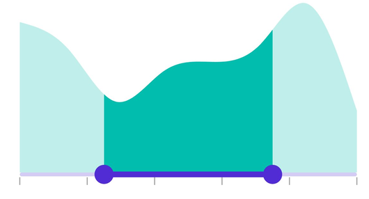
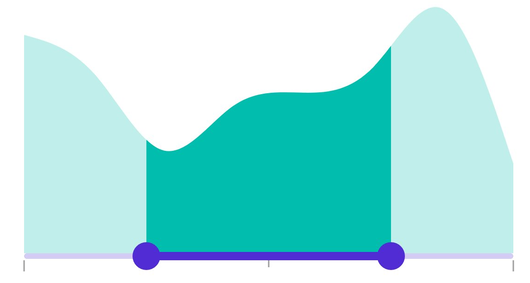
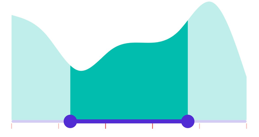
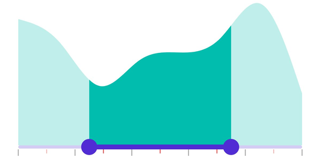
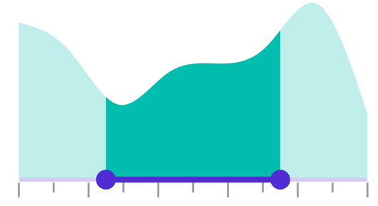
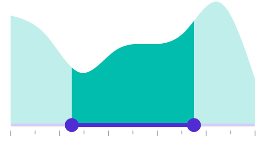

# Tick in .NET MAUI DateTime Range Selector (SfDateTimeRangeSelector)

This section helps to learn about how to add major and minor ticks in the DateTime Range Selector.

## Show major ticks

Enable the major ticks on the track. It is a shape used to represent the major interval points of the track. The default value of the [`ShowTicks`](https://help.syncfusion.com/cr/maui/Syncfusion.Maui.Sliders.RangeView-1.html#Syncfusion_Maui_Sliders_RangeView_1_ShowTicks) property is `False`.

For example, if the [`Minimum`](https://help.syncfusion.com/cr/maui/Syncfusion.Maui.Sliders.RangeView-1.html#Syncfusion_Maui_Sliders_RangeView_1_Minimum) is 2010-01-01, the [`Maximum`](https://help.syncfusion.com/cr/maui/Syncfusion.Maui.Sliders.RangeView-1.html#Syncfusion_Maui_Sliders_RangeView_1_Maximum) is 2018-01-01, and [`Interval`](https://help.syncfusion.com/cr/maui/Syncfusion.Maui.Sliders.RangeView-1.html#Syncfusion_Maui_Sliders_RangeView_1_Interval) is 2.0, the Range Selector will render the major ticks at 2010, 2012, 2014, and so on.

### Without interval





<ContentPage 
             ...
             xmlns:sliders="clr-namespace:Syncfusion.Maui.Sliders;assembly=Syncfusion.Maui.Sliders"
             xmlns:charts="clr-namespace:Syncfusion.Maui.Charts;assembly=Syncfusion.Maui.Charts">
    
    <sliders:SfDateTimeRangeSelector Minimum="2010-01-01" 
                                     Maximum="2018-01-01" 
                                     RangeStart="2012-01-01" 
                                     RangeEnd="2016-01-01"
                                     ShowTicks="True">
        
        <charts:SfCartesianChart>
            ...
        </charts:SfCartesianChart>
    
    </sliders:SfDateTimeRangeSelector>
</ContentPage>





SfDateTimeRangeSelector rangeSelector = new SfDateTimeRangeSelector();
rangeSelector.Minimum = new DateTime(2010, 01, 01);
rangeSelector.Maximum = new DateTime(2018, 01, 01);
rangeSelector.RangeStart = new DateTime(2012, 01, 01);
rangeSelector.RangeEnd = new DateTime(2016, 01, 01);
rangeSelector.ShowTicks = true;
SfCartesianChart chart = new SfCartesianChart();
rangeSelector.Content = chart;





### With interval





<ContentPage 
             ...
             xmlns:sliders="clr-namespace:Syncfusion.Maui.Sliders;assembly=Syncfusion.Maui.Sliders"
             xmlns:charts="clr-namespace:Syncfusion.Maui.Charts;assembly=Syncfusion.Maui.Charts">
    
    <sliders:SfDateTimeRangeSelector Minimum="2010-01-01" 
                                     Maximum="2018-01-01" 
                                     RangeStart="2012-01-01" 
                                     RangeEnd="2016-01-01"
                                     Interval="2"
                                     ShowTicks="True">
        
        <charts:SfCartesianChart>
            ...
        </charts:SfCartesianChart>
    
    </sliders:SfDateTimeRangeSelector>
</ContentPage>





SfDateTimeRangeSelector rangeSelector = new SfDateTimeRangeSelector();
rangeSelector.Minimum = new DateTime(2010, 01, 01);
rangeSelector.Maximum = new DateTime(2018, 01, 01);
rangeSelector.RangeStart = new DateTime(2012, 01, 01);
rangeSelector.RangeEnd = new DateTime(2016, 01, 01);
rangeSelector.Interval = 2;
rangeSelector.ShowTicks = true;
SfCartesianChart chart = new SfCartesianChart();
rangeSelector.Content = chart;





## Show minor ticks

It represents the number of smaller ticks between two major ticks. For example, if the [`Minimum`](https://help.syncfusion.com/cr/maui/Syncfusion.Maui.Sliders.RangeView-1.html#Syncfusion_Maui_Sliders_RangeView_1_Minimum) is `DateTime(2010, 01, 01)`, the  [`Maximum`](https://help.syncfusion.com/cr/maui/Syncfusion.Maui.Sliders.RangeView-1.html#Syncfusion_Maui_Sliders_RangeView_1_Maximum) is `DateTime(2018, 01, 01)`, and [`Interval`](https://help.syncfusion.com/cr/maui/Syncfusion.Maui.Sliders.RangeView-1.html#Syncfusion_Maui_Sliders_RangeView_1_Interval) is 2.0, the DateTime Range Selector will render the major ticks at 2010, 2012, 2014, and so on. If the [`MinorTicksPerInterval`](https://help.syncfusion.com/cr/maui/Syncfusion.Maui.Sliders.RangeView-1.html#Syncfusion_Maui_Sliders_RangeView_1_MinorTicksPerInterval) is 1, then smaller ticks will be rendered on 2010 and 2012 and so on. The default value of the [`MinorTicksPerInterval`](https://help.syncfusion.com/cr/maui/Syncfusion.Maui.Sliders.RangeView-1.html#Syncfusion_Maui_Sliders_RangeView_1_MinorTicksPerInterval) property is `0`.

### Without interval





<ContentPage 
             ...
             xmlns:sliders="clr-namespace:Syncfusion.Maui.Sliders;assembly=Syncfusion.Maui.Sliders"
             xmlns:charts="clr-namespace:Syncfusion.Maui.Charts;assembly=Syncfusion.Maui.Charts">
    
    <sliders:SfDateTimeRangeSelector Minimum="2010-01-01" 
                                     Maximum="2018-01-01" 
                                     RangeStart="2012-01-01" 
                                     RangeEnd="2016-01-01"
                                     ShowTicks="True"
                                     MinorTicksPerInterval="1">
        
        <charts:SfCartesianChart>
            ...
        </charts:SfCartesianChart>
    
    </sliders:SfDateTimeRangeSelector>
</ContentPage>





SfDateTimeRangeSelector rangeSelector = new SfDateTimeRangeSelector();
rangeSelector.Minimum = new DateTime(2010, 01, 01);
rangeSelector.Maximum = new DateTime(2018, 01, 01);
rangeSelector.RangeStart = new DateTime(2012, 01, 01);
rangeSelector.RangeEnd = new DateTime(2016, 01, 01);
rangeSelector.MinorTicksPerInterval = 1;
rangeSelector.ShowTicks = true;
SfCartesianChart chart = new SfCartesianChart();
rangeSelector.Content = chart;





### With interval




<ContentPage 
             ...
             xmlns:sliders="clr-namespace:Syncfusion.Maui.Sliders;assembly=Syncfusion.Maui.Sliders"
             xmlns:charts="clr-namespace:Syncfusion.Maui.Charts;assembly=Syncfusion.Maui.Charts">
    
    <sliders:SfDateTimeRangeSelector Minimum="2010-01-01" 
                                     Maximum="2018-01-01" 
                                     RangeStart="2012-01-01" 
                                     RangeEnd="2016-01-01"
                                     Interval="2"
                                     ShowTicks="True"
                                     MinorTicksPerInterval="1">
        
        <charts:SfCartesianChart>
            ...
        </charts:SfCartesianChart>

    </sliders:SfDateTimeRangeSelector>
</ContentPage>





SfDateTimeRangeSelector rangeSelector = new SfDateTimeRangeSelector();
rangeSelector.Minimum = new DateTime(2010, 01, 01);
rangeSelector.Maximum = new DateTime(2018, 01, 01);
rangeSelector.RangeStart = new DateTime(2012, 01, 01);
rangeSelector.RangeEnd = new DateTime(2016, 01, 01);
rangeSelector.Interval = 2;
rangeSelector.MinorTicksPerInterval = 1;
rangeSelector.ShowTicks = true;
SfCartesianChart chart = new SfCartesianChart();
rangeSelector.Content = chart;





## Major ticks color

Change the color of the active and inactive major ticks using the [`ActiveFill`](https://help.syncfusion.com/cr/maui/Syncfusion.Maui.Sliders.SliderTickStyle.html#Syncfusion_Maui_Sliders_SliderTickStyle_ActiveFill) and [`InactiveFill`](https://help.syncfusion.com/cr/maui/Syncfusion.Maui.Sliders.SliderTickStyle.html#Syncfusion_Maui_Sliders_SliderTickStyle_InactiveFill) properties of the [`MajorTickStyle`](https://help.syncfusion.com/cr/maui/Syncfusion.Maui.Sliders.SliderTickStyle.html?tabs=tabid-1) class.

The active side of the DateTime Range Selector is between the start and end thumbs.

The inactive side of the Range Selector is between the [`Minimum`](https://help.syncfusion.com/cr/maui/Syncfusion.Maui.Sliders.RangeView-1.html#Syncfusion_Maui_Sliders_RangeView_1_Minimum) value and the left thumb, and the right thumb and the [`Maximum`](https://help.syncfusion.com/cr/maui/Syncfusion.Maui.Sliders.RangeView-1.html#Syncfusion_Maui_Sliders_RangeView_1_Maximum) value.





<ContentPage 
             ...
             xmlns:sliders="clr-namespace:Syncfusion.Maui.Sliders;assembly=Syncfusion.Maui.Sliders"
             xmlns:charts="clr-namespace:Syncfusion.Maui.Charts;assembly=Syncfusion.Maui.Charts">
    
    <sliders:SfDateTimeRangeSelector Minimum="2010-01-01" 
                                     Maximum="2018-01-01" 
                                     RangeStart="2012-01-01" 
                                     RangeEnd="2016-01-01"
                                     Interval="2"
                                     ShowTicks="True">
        
        <sliders:SfDateTimeRangeSelector.MajorTickStyle>
            <sliders:SliderTickStyle ActiveFill="#EE3F3F" 
                                     InactiveFill="#F7B1AE" />
        </sliders:SfDateTimeRangeSelector.MajorTickStyle>
        
        <charts:SfCartesianChart>
            ...
        </charts:SfCartesianChart>
    
    </sliders:SfDateTimeRangeSelector>
</ContentPage>





SfDateTimeRangeSelector rangeSelector = new SfDateTimeRangeSelector();
rangeSelector.Minimum = new DateTime(2010, 01, 01);
rangeSelector.Maximum = new DateTime(2018, 01, 01);
rangeSelector.RangeStart = new DateTime(2012, 01, 01);
rangeSelector.RangeEnd = new DateTime(2016, 01, 01);
rangeSelector.Interval = 2;
rangeSelector.ShowTicks = true;
rangeSelector.MajorTickStyle.ActiveFill = new SolidColorBrush(Color.FromArgb("#EE3F3F"));
rangeSelector.MajorTickStyle.InactiveFill = new SolidColorBrush(Color.FromArgb("#F7B1AE"));
SfCartesianChart chart = new SfCartesianChart();
rangeSelector.Content = chart;





## Minor ticks color

Change the color of the active and inactive minor ticks using the [`ActiveFill`](https://help.syncfusion.com/cr/maui/Syncfusion.Maui.Sliders.SliderTickStyle.html#Syncfusion_Maui_Sliders_SliderTickStyle_ActiveFill) and [`InactiveFill`](https://help.syncfusion.com/cr/maui/Syncfusion.Maui.Sliders.SliderTickStyle.html#Syncfusion_Maui_Sliders_SliderTickStyle_InactiveFill) properties of the [`MinorTickStyle`](https://help.syncfusion.com/cr/maui/Syncfusion.Maui.Sliders.RangeView-1.html#Syncfusion_Maui_Sliders_RangeView_1_MinorTickStyle) class.

The active side of the DateTime Range Selector is between the start and end thumbs.

The inactive side of the DateTime Range Selector is between the [`Minimum`](https://help.syncfusion.com/cr/maui/Syncfusion.Maui.Sliders.RangeView-1.html#Syncfusion_Maui_Sliders_RangeView_1_Minimum) value and the left thumb, and the right thumb and the [`Maximum`](https://help.syncfusion.com/cr/maui/Syncfusion.Maui.Sliders.RangeView-1.html#Syncfusion_Maui_Sliders_RangeView_1_Maximum) value.





<ContentPage 
             ...
             xmlns:sliders="clr-namespace:Syncfusion.Maui.Sliders;assembly=Syncfusion.Maui.Sliders"
             xmlns:charts="clr-namespace:Syncfusion.Maui.Charts;assembly=Syncfusion.Maui.Charts">
    
    <sliders:SfDateTimeRangeSelector Minimum="2010-01-01" 
                                     Maximum="2018-01-01" 
                                     RangeStart="2012-01-01" 
                                     RangeEnd="2016-01-01"
                                     Interval="0.2"
                                     ShowTicks="True" 
                                     MinorTicksPerInterval="1">
        
        <sliders:SfDateTimeRangeSelector.MinorTickStyle>
            <sliders:SliderTickStyle ActiveFill="#EE3F3F" 
                                     InactiveFill="#F7B1AE" />
        </sliders:SfDateTimeRangeSelector.MinorTickStyle>
        
        <charts:SfCartesianChart>
            ...
        </charts:SfCartesianChart>
    
    </sliders:SfDateTimeRangeSelector>
</ContentPage>





SfDateTimeRangeSelector rangeSelector = new SfDateTimeRangeSelector();
rangeSelector.Minimum = new DateTime(2010, 01, 01);
rangeSelector.Maximum = new DateTime(2018, 01, 01);
rangeSelector.RangeStart = new DateTime(2012, 01, 01);
rangeSelector.RangeEnd = new DateTime(2016, 01, 01);
rangeSelector.Interval = 2;
rangeSelector.ShowTicks = true;
rangeSelector.MinorTicksPerInterval = 1;
rangeSelector.MinorTickStyle.ActiveFill = new SolidColorBrush(Color.FromArgb("#EE3F3F"));
rangeSelector.MinorTickStyle.InactiveFill = new SolidColorBrush(Color.FromArgb("#F7B1AE"));
SfCartesianChart chart = new SfCartesianChart();
rangeSelector.Content = chart;





## Ticks size

Change the major and minor ticks size using the [`ActiveSize`](https://help.syncfusion.com/cr/maui/Syncfusion.Maui.Sliders.SliderTickStyle.html#Syncfusion_Maui_Sliders_SliderTickStyle_ActiveSize) and [`InactiveSize`](https://help.syncfusion.com/cr/maui/Syncfusion.Maui.Sliders.SliderTickStyle.html#Syncfusion_Maui_Sliders_SliderTickStyle_InactiveSize) property of the [`MajorTickStyle`](https://help.syncfusion.com/cr/maui/Syncfusion.Maui.Sliders.SliderTickStyle.html?tabs=tabid-1) and [`MinorTickStyle`](https://help.syncfusion.com/cr/maui/Syncfusion.Maui.Sliders.SliderTickStyle.html?tabs=tabid-1)  classes. The default value is `Size(2.0, 8.0)`.





<ContentPage 
             ...
             xmlns:sliders="clr-namespace:Syncfusion.Maui.Sliders;assembly=Syncfusion.Maui.Sliders"
             xmlns:charts="clr-namespace:Syncfusion.Maui.Charts;assembly=Syncfusion.Maui.Charts">
    
    <sliders:SfDateTimeRangeSelector Minimum="2010-01-01" 
                                     Maximum="2018-01-01" 
                                     RangeStart="2012-01-01" 
                                     RangeEnd="2016-01-01"
                                     Interval="2"
                                     ShowTicks="True" 
                                     MinorTicksPerInterval="1">
        
        <sliders:SfDateTimeRangeSelector.MinorTickStyle>
            <sliders:SliderTickStyle ActiveSize="2,10" InactiveSize="2, 10" />
        </sliders:SfDateTimeRangeSelector.MinorTickStyle>
        
        <sliders:SfDateTimeRangeSelector.MajorTickStyle>
            <sliders:SliderTickStyle ActiveSize="2,15" InactiveSize="2, 15" />
        </sliders:SfDateTimeRangeSelector.MajorTickStyle>
        
        <charts:SfCartesianChart>
            ...
        </charts:SfCartesianChart>
    
    </sliders:SfDateTimeRangeSelector>
</ContentPage>





SfDateTimeRangeSelector rangeSelector = new SfDateTimeRangeSelector();
rangeSelector.Minimum = new DateTime(2010, 01, 01);
rangeSelector.Maximum = new DateTime(2018, 01, 01);
rangeSelector.RangeStart = new DateTime(2012, 01, 01);
rangeSelector.RangeEnd = new DateTime(2016, 01, 01);
rangeSelector.Interval = 2;
rangeSelector.ShowTicks = true;
rangeSelector.MinorTicksPerInterval = 1;
rangeSelector.MinorTickStyle.ActiveSize = new Size(2, 10);
rangeSelector.MinorTickStyle.InactiveSize = new Size(2, 10);
rangeSelector.MajorTickStyle.ActiveSize = new Size(2, 15);
rangeSelector.MajorTickStyle.InactiveSize = new Size(2, 15);
SfCartesianChart chart = new SfCartesianChart();
rangeSelector.Content = chart;





## Ticks offset

Adjust the space between the track and ticks using the [`Offset`](https://help.syncfusion.com/cr/maui/Syncfusion.Maui.Sliders.SliderTickStyle.html#Syncfusion_Maui_Sliders_SliderTickStyle_Offset) property of the [`MajorTickStyle`](https://help.syncfusion.com/cr/maui/Syncfusion.Maui.Sliders.RangeView-1.html#Syncfusion_Maui_Sliders_RangeView_1_MajorTickStyle) and [`MinorTickStyle`](https://help.syncfusion.com/cr/maui/Syncfusion.Maui.Sliders.RangeView-1.html#Syncfusion_Maui_Sliders_RangeView_1_MinorTickStyle). The default value of the [`Offset`](https://help.syncfusion.com/cr/maui/Syncfusion.Maui.Sliders.SliderTickStyle.html#Syncfusion_Maui_Sliders_SliderTickStyle_Offset) property is `3.0`.





<ContentPage 
             ...
             xmlns:sliders="clr-namespace:Syncfusion.Maui.Sliders;assembly=Syncfusion.Maui.Sliders"
             xmlns:charts="clr-namespace:Syncfusion.Maui.Charts;assembly=Syncfusion.Maui.Charts">
    
    <sliders:SfDateTimeRangeSelector Minimum="2010-01-01" 
                                     Maximum="2018-01-01" 
                                     RangeStart="2012-01-01" 
                                     RangeEnd="2016-01-01"
                                     Interval="2"
                                     ShowTicks="True" 
                                     MinorTicksPerInterval="1">
        
        <sliders:SfDateTimeRangeSelector.MinorTickStyle>
            <sliders:SliderTickStyle Offset="5" />
        </sliders:SfDateTimeRangeSelector.MinorTickStyle>
        
        <sliders:SfDateTimeRangeSelector.MajorTickStyle>
            <sliders:SliderTickStyle Offset="5" />
        </sliders:SfDateTimeRangeSelector.MajorTickStyle>
        
        <charts:SfCartesianChart>
            ...
        </charts:SfCartesianChart>
    
    </sliders:SfDateTimeRangeSelector>
</ContentPage>





SfDateTimeRangeSelector rangeSelector = new SfDateTimeRangeSelector();
rangeSelector.Minimum = new DateTime(2010, 01, 01);
rangeSelector.Maximum = new DateTime(2018, 01, 01);
rangeSelector.RangeStart = new DateTime(2012, 01, 01);
rangeSelector.RangeEnd = new DateTime(2016, 01, 01);
rangeSelector.Interval = 2;
rangeSelector.ShowTicks = true;
rangeSelector.MinorTicksPerInterval = 1;
rangeSelector.MinorTickStyle.Offset = 5;
rangeSelector.MajorTickStyle.Offset = 5;
SfCartesianChart chart = new SfCartesianChart();
rangeSelector.Content = chart;





