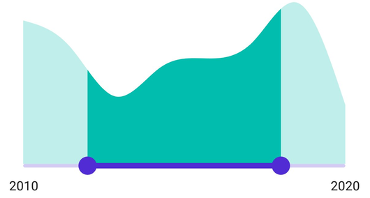
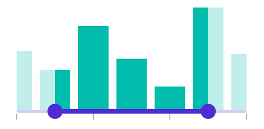
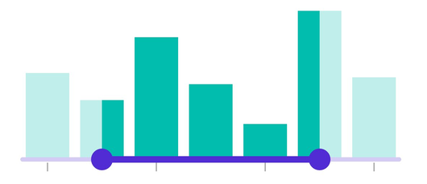

# Track in .NET MAUI DateTime Range Selector (SfDateTimeRangeSelector)

This section explains how to customize the track in the DateTime Range Selector.

## Minimum

Specifies the minimum value that the user can select. The default value of the [`Minimum`](https://help.syncfusion.com/cr/maui/Syncfusion.Maui.Sliders.IDateTimeElement.html#Syncfusion_Maui_Sliders_IDateTimeElement_Minimum) property is `null`. The [`Minimum`](https://help.syncfusion.com/cr/maui/Syncfusion.Maui.Sliders.IDateTimeElement.html#Syncfusion_Maui_Sliders_IDateTimeElement_Minimum) value must be less than the [`Maximum`](https://help.syncfusion.com/cr/maui/Syncfusion.Maui.Sliders.IDateTimeElement.html#Syncfusion_Maui_Sliders_IDateTimeElement_Maximum) value.

## Maximum

Specifies the maximum value that the user can select. The default value of the [`Maximum`](https://help.syncfusion.com/cr/maui/Syncfusion.Maui.Sliders.IDateTimeElement.html#Syncfusion_Maui_Sliders_IDateTimeElement_Maximum) property is `null`. The [`Maximum`](https://help.syncfusion.com/cr/maui/Syncfusion.Maui.Sliders.IDateTimeElement.html#Syncfusion_Maui_Sliders_IDateTimeElement_Maximum) value must be greater than the [`Minimum`](https://help.syncfusion.com/cr/maui/Syncfusion.Maui.Sliders.IDateTimeElement.html#Syncfusion_Maui_Sliders_IDateTimeElement_Minimum) value.

## Range Values

The values currently selected in the DateTime Range Selector. The thumb is drawn corresponding to the [`RangeStart`](https://help.syncfusion.com/cr/maui/Syncfusion.Maui.Sliders.RangeSliderBase-1.html#Syncfusion_Maui_Sliders_RangeSliderBase_1_RangeStart) and [`RangeEnd`](https://help.syncfusion.com/cr/maui/Syncfusion.Maui.Sliders.RangeSliderBase-1.html#Syncfusion_Maui_Sliders_RangeSliderBase_1_RangeEnd) values.





<ContentPage 
             ...
             xmlns:sliders="clr-namespace:Syncfusion.Maui.Sliders;assembly=Syncfusion.Maui.Sliders"
             xmlns:charts="clr-namespace:Syncfusion.Maui.Charts;assembly=Syncfusion.Maui.Charts">

    <sliders:SfDateTimeRangeSelector Minimum="2010-01-01" 
                                     Maximum="2020-01-01" 
                                     RangeStart="2012-01-01" 
                                     RangeEnd="2018-01-01" 
                                     ShowLabels="True">
        
        <charts:SfCartesianChart>
            ...
        </charts:SfCartesianChart>
    
    </sliders:SfDateTimeRangeSelector>
</ContentPage>
 




SfDateTimeRangeSelector rangeSelector = new SfDateTimeRangeSelector();
rangeSelector.Minimum = new DateTime(2010, 01, 01);
rangeSelector.Maximum = new DateTime(2020, 01, 01);
rangeSelector.RangeStart = new DateTime(2012, 01, 01);
rangeSelector.RangeEnd = new DateTime(2018, 01, 01);
rangeSelector.ShowLabels = true;
SfCartesianChart chart = new SfCartesianChart();
rangeSelector.Content = chart;





## Track Color

Change the active and inactive track colors using the [`ActiveFill`](https://help.syncfusion.com/cr/maui/Syncfusion.Maui.Sliders.SliderTrackStyle.html#Syncfusion_Maui_Sliders_SliderTrackStyle_ActiveFill) and [`InactiveFill`](https://help.syncfusion.com/cr/maui/Syncfusion.Maui.Sliders.SliderTrackStyle.html#Syncfusion_Maui_Sliders_SliderTrackStyle_InactiveFill) properties of the [`TrackStyle`](https://help.syncfusion.com/cr/maui/Syncfusion.Maui.Sliders.RangeView-1.html#Syncfusion_Maui_Sliders_RangeView_1_TrackStyle) class.

The active side of the DateTime Range Selector is between the start and end thumbs.

The inactive side of the DateTime Range Selector is between the [`Minimum`](https://help.syncfusion.com/cr/maui/Syncfusion.Maui.Sliders.RangeView-1.html#Syncfusion_Maui_Sliders_RangeView_1_Minimum) value and the left thumb and the right thumb and the [`Maximum`](https://help.syncfusion.com/cr/maui/Syncfusion.Maui.Sliders.RangeView-1.html#Syncfusion_Maui_Sliders_RangeView_1_Maximum) value.





<ContentPage 
             ...
             xmlns:sliders="clr-namespace:Syncfusion.Maui.Sliders;assembly=Syncfusion.Maui.Sliders"
             xmlns:charts="clr-namespace:Syncfusion.Maui.Charts;assembly=Syncfusion.Maui.Charts">
    
    <sliders:SfDateTimeRangeSelector Minimum="2010-01-01" 
                                     Maximum="2018-01-01" 
                                     RangeStart="2012-01-01" 
                                     RangeEnd="2016-01-01">
        
        <sliders:SfDateTimeRangeSelector.TrackStyle>
            <sliders:SliderTrackStyle ActiveFill="#EE3F3F" InactiveFill="#F7B1AE" />
        </sliders:SfDateTimeRangeSelector.TrackStyle>
        
        <charts:SfCartesianChart>
            ...
        </charts:SfCartesianChart>
    
    </sliders:SfDateTimeRangeSelector>
</ContentPage>





SfDateTimeRangeSelector rangeSelector = new SfDateTimeRangeSelector();
rangeSelector.Minimum = new DateTime(2010, 01, 01);
rangeSelector.Maximum = new DateTime(2018, 01, 01);
rangeSelector.RangeStart = new DateTime(2012, 01, 01);
rangeSelector.RangeEnd = new DateTime(2016, 01, 01);
rangeSelector.TrackStyle.ActiveFill = new SolidColorBrush(Color.FromArgb("#EE3F3F"));
rangeSelector.TrackStyle.InactiveFill = new SolidColorBrush(Color.FromArgb("#F7B1AE"));
SfCartesianChart chart = new SfCartesianChart();
rangeSelector.Content = chart;





## Track Height

Change the active and inactive track height using the [`ActiveSize`](https://help.syncfusion.com/cr/maui/Syncfusion.Maui.Sliders.SliderTrackStyle.html#Syncfusion_Maui_Sliders_SliderTrackStyle_ActiveSize) and [`InactiveSize`](https://help.syncfusion.com/cr/maui/Syncfusion.Maui.Sliders.SliderTrackStyle.html#Syncfusion_Maui_Sliders_SliderTrackStyle_InactiveSize) properties of the [`TrackStyle`](https://help.syncfusion.com/cr/maui/Syncfusion.Maui.Sliders.RangeView-1.html#Syncfusion_Maui_Sliders_RangeView_1_TrackStyle) class. The default values for the [`ActiveSize`](https://help.syncfusion.com/cr/maui/Syncfusion.Maui.Sliders.SliderTrackStyle.html#Syncfusion_Maui_Sliders_SliderTrackStyle_ActiveSize) and [`InactiveSize`](https://help.syncfusion.com/cr/maui/Syncfusion.Maui.Sliders.SliderTrackStyle.html#Syncfusion_Maui_Sliders_SliderTrackStyle_InactiveSize) properties are `8.0` and `6.0`, respectively.





<ContentPage 
             ...
             xmlns:sliders="clr-namespace:Syncfusion.Maui.Sliders;assembly=Syncfusion.Maui.Sliders"
             xmlns:charts="clr-namespace:Syncfusion.Maui.Charts;assembly=Syncfusion.Maui.Charts">
    
    <sliders:SfDateTimeRangeSelector Minimum="2010-01-01" 
                                     Maximum="2018-01-01" 
                                     RangeStart="2012-01-01" 
                                     RangeEnd="2016-01-01">
        
        <sliders:SfDateTimeRangeSelector.TrackStyle>
            <sliders:SliderTrackStyle ActiveSize="10" InactiveSize="8" />
        </sliders:SfDateTimeRangeSelector.TrackStyle>
        
        <charts:SfCartesianChart>
            ...
        </charts:SfCartesianChart>
    
    </sliders:SfDateTimeRangeSelector>
</ContentPage>





SfDateTimeRangeSelector rangeSelector = new SfDateTimeRangeSelector();
rangeSelector.Minimum = new DateTime(2010, 01, 01);
rangeSelector.Maximum = new DateTime(2018, 01, 01);
rangeSelector.RangeStart = new DateTime(2012, 01, 01);
rangeSelector.RangeEnd = new DateTime(2016, 01, 01);
rangeSelector.TrackStyle.ActiveSize = 10;
rangeSelector.TrackStyle.InactiveSize = 8;
SfCartesianChart chart = new SfCartesianChart();
rangeSelector.Content = chart;





## Track Extent

Extend the track at the edges using the [`TrackExtent`](https://help.syncfusion.com/cr/maui/Syncfusion.Maui.Sliders.RangeView-1.html#Syncfusion_Maui_Sliders_RangeView_1_TrackExtent) property. The default value is `0`, specified in pixels.





<ContentPage 
             ...
             xmlns:sliders="clr-namespace:Syncfusion.Maui.Sliders;assembly=Syncfusion.Maui.Sliders"
             xmlns:charts="clr-namespace:Syncfusion.Maui.Charts;assembly=Syncfusion.Maui.Charts">

    <sliders:SfDateTimeRangeSelector Minimum="2019-12-01"
                                     Maximum="2019-12-07"
                                     RangeStart="2019-12-02"
                                     RangeEnd="2019-12-06"
                                     Interval="2"
                                     IntervalType="Days"
                                     ShowTicks="True"
                                     TrackExtent="25">

        <charts:SfCartesianChart>
            ...
        </charts:SfCartesianChart>

    </sliders:SfDateTimeRangeSelector>
</ContentPage>





SfDateTimeRangeSelector rangeSelector = new SfDateTimeRangeSelector();
rangeSelector.Minimum = new DateTime(2019, 12, 01);
rangeSelector.Maximum = new DateTime(2019, 12, 07);
rangeSelector.RangeStart = new DateTime(2009, 12, 02);
rangeSelector.RangeEnd = new DateTime(2000, 12, 06);
rangeSelector.Interval = 2;
rangeSelector.IntervalType = SliderDateIntervalType.Days;
rangeSelector.ShowTicks = true;
rangeSelector.TrackExtent = 25;
SfCartesianChart chart = new SfCartesianChart();
rangeSelector.Content = chart;





**Without track extent**

**With track extent**

