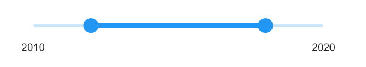

# Basic features in .NET MAUI DateTime Range Slider

This section explains about how to add DateTime Range Slider(SfDateTimeRangeSlider).

## Minimum

The minimum value that the user can select. The default value of [`Minimum`](https://help.syncfusion.com/cr/maui/Syncfusion.Maui.Sliders.IDateTimeElement.html#Syncfusion_Maui_Sliders_IDateTimeElement_Minimum) property is null.
The [`Minimum`](https://help.syncfusion.com/cr/maui/Syncfusion.Maui.Sliders.IDateTimeElement.html#Syncfusion_Maui_Sliders_IDateTimeElement_Minimum) value must be less than the [`Maximum`](https://help.syncfusion.com/cr/maui/Syncfusion.Maui.Sliders.IDateTimeElement.html#Syncfusion_Maui_Sliders_IDateTimeElement_Maximum) value.

## Maximum

The maximum value that the user can select. The default value of [`Maximum`](https://help.syncfusion.com/cr/maui/Syncfusion.Maui.Sliders.IDateTimeElement.html#Syncfusion_Maui_Sliders_IDateTimeElement_Maximum) property is null.
The [`Maximum`](https://help.syncfusion.com/cr/maui/Syncfusion.Maui.Sliders.IDateTimeElement.html#Syncfusion_Maui_Sliders_IDateTimeElement_Maximum) value must be greater than the [`Minimum`](https://help.syncfusion.com/cr/maui/Syncfusion.Maui.Sliders.IDateTimeElement.html#Syncfusion_Maui_Sliders_IDateTimeElement_Minimum) value.

## Range values

It represents the values currently selected in the range slider. The range slider’s thumb is drawn corresponding to this [`RangeStart`](https://help.syncfusion.com/cr/maui/Syncfusion.Maui.Sliders.DateTimeRangeSliderBase.html#Syncfusion_Maui_Sliders_DateTimeRangeSliderBase_RangeStart) and [`RangeEnd`](https://help.syncfusion.com/cr/maui/Syncfusion.Maui.Sliders.DateTimeRangeSliderBase.html#Syncfusion_Maui_Sliders_DateTimeRangeSliderBase_RangeEnd) values.

For date values, the range slider does not have auto interval support. So, it is mandatory to set [`Interval`](https://help.syncfusion.com/cr/maui/Syncfusion.Maui.Sliders.SliderBase.html?tabs=tabid-1#Syncfusion_Maui_Sliders_SliderBase_Interval), [`IntervalType`](https://help.syncfusion.com/cr/maui/Syncfusion.Maui.Sliders.DateTimeRangeSliderBase.html#Syncfusion_Maui_Sliders_DateTimeRangeSliderBase_IntervalType), and [`DateFormat`](https://help.syncfusion.com/cr/maui/Syncfusion.Maui.Sliders.DateTimeRangeSliderBase.html#Syncfusion_Maui_Sliders_DateTimeRangeSliderBase_DateFormat) for date values.





<sliders:SfDateTimeRangeSlider Minimum="2010-01-01" 
                               Maximum="2018-01-01" 
                               RangeStart="2012-01-01" 
                               RangeEnd="2016-01-01" 
                               ShowLabels="True">
</sliders:SfDateTimeRangeSlider>
 




SfDateTimeRangeSlider rangeSlider = new SfDateTimeRangeSlider();
rangeSlider.Minimum = new DateTime(2010, 01, 01);
rangeSlider.Maximum = new DateTime(2018, 01, 01);
rangeSlider.RangeStart = new DateTime(2012, 01, 01);
rangeSlider.RangeEnd = new DateTime(2016, 01, 01);
rangeSlider.ShowLabels = true;





