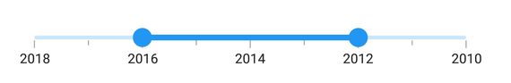
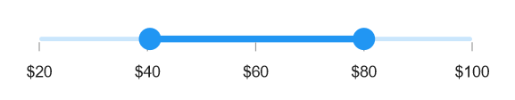

# Customization in .NET MAUI Range Slider (SfDateTimeRangeSlider)

## Inverse the slider

Invert the DateTime Range Slider using the [IsInversed](https://help.syncfusion.com/cr/maui/Syncfusion.Maui.Sliders.RangeView-1.html#Syncfusion_Maui_Sliders_RangeView_1_IsInversed) property. The default value of the IsInversed property is **False**.





<sliders:SfDateTimeRangeSlider Minimum="2010-01-01" 
                               Maximum="2018-01-01" 
                               RangeStart="2012-01-01" 
                               RangeEnd="2016-01-01"
                               Interval="2" 
                               ShowTicks="True"
                               ShowLabels="True"  
                               MinorTicksPerInterval="1" 
                               IsInversed="True">
</sliders:SfDateTimeRangeSlider>





SfDateTimeRangeSlider rangeSlider = new SfDateTimeRangeSlider();
rangeSlider.Minimum = new DateTime(2010, 01, 01);
rangeSlider.Maximum = new DateTime(2018, 01, 01);
rangeSlider.RangeStart = new DateTime(2012, 01, 01);
rangeSlider.RangeEnd = new DateTime(2016, 01, 01);
rangeSlider.Interval = 2;
rangeSlider.ShowLabels = true;
rangeSlider.ShowTicks = true;
rangeSlider.MinorTicksPerInterval = 1;
rangeSlider.IsInversed = true;





## Formatting labels

Add prefix or suffix to the labels using the [DateFormat](https://help.syncfusion.com/cr/maui/Syncfusion.Maui.Sliders.IDateTimeElement.html#Syncfusion_Maui_Sliders_IDateTimeElement_DateFormat) property.





<sliders:SfDateTimeRangeSlider Minimum="2010-01-01"
                               Maximum="2011-01-01"
                               RangeStart="2010-04-01"
                               RangeEnd="2010-10-01"
                               DateFormat="MMM"
                               IntervalType="Months"
                               ShowTicks="True"
                               MinorTicksPerInterval="1"
                               ShowLabels="True"
                               Interval="2">
</sliders:SfDateTimeRangeSlider>





SfDateTimeRangeSlider rangeSlider = new SfDateTimeRangeSlider();
rangeSlider.Minimum = new DateTime(2010, 01, 01);
rangeSlider.Maximum = new DateTime(2011, 01, 01);
rangeSlider.RangeStart = new DateTime(2010, 04, 01);
rangeSlider.RangeEnd = new DateTime(2010, 10, 01);
rangeSlider.ShowLabels = true;
rangeSlider.Interval = 2;
rangeSlider.ShowTicks = true;
rangeSlider.MinorTicksPerInterval = 1;
rangeSlider.DateFormat = "MMM";
rangeSlider.IntervalType = SliderDateIntervalType.Months;





