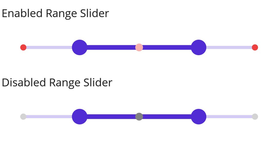

# Dividers in .NET MAUI DateTime Range Slider (SfDateTimeRangeSlider)

This section explains how to add and customize dividers in the DateTime Range Slider.

## Show Dividers

The [`ShowDividers`](https://help.syncfusion.com/cr/maui/Syncfusion.Maui.Sliders.RangeView-1.html#Syncfusion_Maui_Sliders_RangeView_1_ShowDividers) property allows dividers to be rendered on the track. The default value of [`ShowDividers`](https://help.syncfusion.com/cr/maui/Syncfusion.Maui.Sliders.RangeView-1.html#Syncfusion_Maui_Sliders_RangeView_1_ShowDividers) is `False`. Dividers represent the major interval points on the track.

For example, if the [`Minimum`](https://help.syncfusion.com/cr/maui/Syncfusion.Maui.Sliders.RangeView-1.html#Syncfusion_Maui_Sliders_RangeView_1_Minimum) is set to `DateTime(2010, 01, 01)`, [`Maximum`](https://help.syncfusion.com/cr/maui/Syncfusion.Maui.Sliders.RangeView-1.html#Syncfusion_Maui_Sliders_RangeView_1_Maximum) to `DateTime(2018, 01, 01)`, and [`Interval`](https://help.syncfusion.com/cr/maui/Syncfusion.Maui.Sliders.RangeView-1.html#Syncfusion_Maui_Sliders_RangeView_1_Interval) to `2.0`, dividers will appear at 2010, 2012, 2014, etc.





<sliders:SfDateTimeRangeSlider Minimum="2010-01-01" 
                               Maximum="2020-01-01" 
                               RangeStart="2012-01-01" 
                               RangeEnd="2018-01-01"
                               Interval="2" 
                               ShowDividers="True">
</sliders:SfDateTimeRangeSlider>





SfDateTimeRangeSlider rangeSlider = new SfDateTimeRangeSlider();
rangeSlider.Minimum = new DateTime(2010, 01, 01);
rangeSlider.Maximum = new DateTime(2020, 01, 01);
rangeSlider.RangeStart = new DateTime(2012, 01, 01);
rangeSlider.RangeEnd = new DateTime(2018, 01, 01);
rangeSlider.Interval = 2;
rangeSlider.ShowDividers = true;





## Divider Radius

Adjust the active and inactive divider radius using the [`ActiveRadius`](https://help.syncfusion.com/cr/maui/Syncfusion.Maui.Sliders.SliderDividerStyle.html#Syncfusion_Maui_Sliders_SliderDividerStyle_ActiveRadius) and [`InactiveRadius`](https://help.syncfusion.com/cr/maui/Syncfusion.Maui.Sliders.SliderDividerStyle.html#Syncfusion_Maui_Sliders_SliderDividerStyle_InactiveRadius) properties in the [`DividerStyle`](https://help.syncfusion.com/cr/maui/Syncfusion.Maui.Sliders.SliderDividerStyle.html) class.





<sliders:SfDateTimeRangeSlider Minimum="2010-01-01" 
                               Maximum="2020-01-01" 
                               RangeStart="2012-01-01" 
                               RangeEnd="2016-01-01"
                               Interval="2"
                               ShowDividers="True">
   
   <sliders:SfDateTimeRangeSlider.DividerStyle>
      <sliders:SliderDividerStyle ActiveRadius="7" InactiveRadius="7" />
   </sliders:SfDateTimeRangeSlider.DividerStyle>

</sliders:SfDateTimeRangeSlider>





SfDateTimeRangeSlider rangeSlider = new SfDateTimeRangeSlider();
rangeSlider.Minimum = new DateTime(2010, 01, 01);
rangeSlider.Maximum = new DateTime(2020, 01, 01);
rangeSlider.RangeStart = new DateTime(2012, 01, 01);
rangeSlider.RangeEnd = new DateTime(2016, 01, 01);
rangeSlider.Interval = 2;
rangeSlider.ShowDividers = true;
rangeSlider.DividerStyle.ActiveRadius = 7;
rangeSlider.DividerStyle.InactiveRadius = 7;





## Divider Stroke Width and Color

Modify the active and inactive divider stroke width using [`ActiveStrokeThickness`](https://help.syncfusion.com/cr/maui/Syncfusion.Maui.Sliders.SliderDividerStyle.html#Syncfusion_Maui_Sliders_SliderDividerStyle_ActiveStrokeThickness) and [`InactiveStrokeThickness`](https://help.syncfusion.com/cr/maui/Syncfusion.Maui.Sliders.SliderDividerStyle.html#Syncfusion_Maui_Sliders_SliderDividerStyle_InactiveStrokeThickness), and change the stroke colors using [`ActiveStroke`](https://help.syncfusion.com/cr/maui/Syncfusion.Maui.Sliders.SliderDividerStyle.html#Syncfusion_Maui_Sliders_SliderDividerStyle_ActiveStroke) and [`InactiveStroke`](https://help.syncfusion.com/cr/maui/Syncfusion.Maui.Sliders.SliderDividerStyle.html#Syncfusion_Maui_Sliders_SliderDividerStyle_InactiveStroke).

Also, you can change the active and inactive divider stroke color using the [`ActiveStroke`](https://help.syncfusion.com/cr/maui/Syncfusion.Maui.Sliders.SliderDividerStyle.html#Syncfusion_Maui_Sliders_SliderDividerStyle_ActiveStroke) and the [`InactiveStroke`](https://help.syncfusion.com/cr/maui/Syncfusion.Maui.Sliders.SliderDividerStyle.html#Syncfusion_Maui_Sliders_SliderDividerStyle_InactiveStroke) properties of the [`DividerStyle`](https://help.syncfusion.com/cr/maui/Syncfusion.Maui.Sliders.SliderDividerStyle.html) class.





<sliders:SfDateTimeRangeSlider Minimum="2010-01-01" 
                               Maximum="2020-01-01" 
                               RangeStart="2012-01-01" 
                               RangeEnd="2018-01-01"
                               Interval="2"
                               ShowDividers="True">
   
   <sliders:SfDateTimeRangeSlider.DividerStyle>
        <sliders:SliderDividerStyle ActiveRadius="7" 
                                    InactiveRadius="7" 
                                    ActiveStrokeThickness="2" 
                                    InactiveStrokeThickness="2" 
                                    ActiveStroke="#EE3F3F" 
                                    InactiveStroke="#F7B1AE"/>
   </sliders:SfDateTimeRangeSlider.DividerStyle>

</sliders:SfDateTimeRangeSlider>





SfDateTimeRangeSlider rangeSlider = new SfDateTimeRangeSlider();
rangeSlider.Minimum = new DateTime(2010, 01, 01);
rangeSlider.Maximum = new DateTime(2020, 01, 01);
rangeSlider.RangeStart = new DateTime(2012, 01, 01);
rangeSlider.RangeEnd = new DateTime(2018, 01, 01);
rangeSlider.Interval = 2;
rangeSlider.ShowDividers = true;
rangeSlider.DividerStyle.ActiveRadius = 7;
rangeSlider.DividerStyle.InactiveRadius = 7;
rangeSlider.DividerStyle.ActiveStroke = new SolidColorBrush(Color.FromArgb("#EE3F3F"));
rangeSlider.DividerStyle.InactiveStroke = new SolidColorBrush(Color.FromArgb("#F7B1AE"));
rangeSlider.DividerStyle.ActiveStrokeThickness = 2;
rangeSlider.DividerStyle.InactiveStrokeThickness = 2;





## Divider Color

Change the active and inactive divider colors using the [`ActiveFill`](https://help.syncfusion.com/cr/maui/Syncfusion.Maui.Sliders.SliderDividerStyle.html#Syncfusion_Maui_Sliders_SliderDividerStyle_ActiveFill) and [`InactiveFill`](https://help.syncfusion.com/cr/maui/Syncfusion.Maui.Sliders.SliderDividerStyle.html#Syncfusion_Maui_Sliders_SliderDividerStyle_InactiveFill) properties.





<sliders:SfDateTimeRangeSlider Minimum="2010-01-01" 
                               Maximum="2020-01-01" 
                               RangeStart="2012-01-01" 
                               RangeEnd="2018-01-01"
                               Interval="2"
                               ShowDividers="True">
    
    <sliders:SfDateTimeRangeSlider.DividerStyle>
        <sliders:SliderDividerStyle ActiveRadius="7" 
                                    InactiveRadius="7" 
                                    ActiveFill="#EE3F3F" 
                                    InactiveFill="#F7B1AE"/>
     </sliders:SfDateTimeRangeSlider.DividerStyle>

</sliders:SfDateTimeRangeSlider>





SfDateTimeRangeSlider rangeSlider = new SfDateTimeRangeSlider();
rangeSlider.Minimum = new DateTime(2010, 01, 01);
rangeSlider.Maximum = new DateTime(2020, 01, 01);
rangeSlider.RangeStart = new DateTime(2012, 01, 01);
rangeSlider.RangeEnd = new DateTime(2018, 01, 01);
rangeSlider.Interval = 2;
rangeSlider.ShowDividers = true;
rangeSlider.DividerStyle.ActiveRadius = 7;
rangeSlider.DividerStyle.InactiveRadius = 7;
rangeSlider.DividerStyle.ActiveFill = new SolidColorBrush(Color.FromArgb("#EE3F3F"));
rangeSlider.DividerStyle.InactiveFill = new SolidColorBrush(Color.FromArgb("#F7B1AE"));





## Disabled Divider

To change the state of the DateTime Range Slider to disabled, set the `IsEnabled` property to `false`. Visual State Manager (VSM) can customize divider properties based on visual states: enabled (default) and disabled.





<ContentPage.Resources>
    
</ContentPage.Resources>

<ContentPage.Content>
    <VerticalStackLayout>
        <Label Text="Enabled"
               Padding="24,10" />
        <sliders:SfDateTimeRangeSlider />
        <Label Text="Disabled"
               Padding="24,10" />
        <sliders:SfDateTimeRangeSlider IsEnabled="False" />
    </VerticalStackLayout>
</ContentPage.Content>





VerticalStackLayout stackLayout = new();
SfDateTimeRangeSlider defaultRangeSlider = new()
{
    Minimum = new DateTime(2010, 01, 01),
    Maximum = new DateTime(2018, 01, 01),
    RangeStart = new DateTime(2012, 01, 01),
    RangeEnd = new DateTime(2016, 01, 01),
    Interval = 2,
    ShowDividers = true
};
SfDateTimeRangeSlider disabledRangeSlider = new()
{
    Minimum = new DateTime(2010, 01, 01),
    Maximum = new DateTime(2018, 01, 01),
    RangeStart = new DateTime(2012, 01, 01),
    RangeEnd = new DateTime(2016, 01, 01),
    IsEnabled = false,
    Interval = 2,
    ShowDividers = true
};

VisualStateGroupList visualStateGroupList = new();
VisualStateGroup commonStateGroup = new();
// Default State.
VisualState defaultState = new() { Name = "Default" };
defaultState.Setters.Add(new Setter
{
    Property = SfDateTimeRangeSlider.DividerStyleProperty,
    Value = new SliderDividerStyle
    {
        ActiveFill = Color.FromArgb("#EE3F3F"),
        InactiveFill = Color.FromArgb("#88EE3F3F"),
        ActiveRadius = 5,
        InactiveRadius = 4,
    }
});
// Disabled State.
VisualState disabledState = new VisualState { Name = "Disabled" };
disabledState.Setters.Add(new Setter
{
    Property = SfDateTimeRangeSlider.DividerStyleProperty,
    Value = new SliderDividerStyle
    {
        ActiveFill = Colors.Gray,
        InactiveFill = Colors.LightGray,
        ActiveRadius = 5,
        InactiveRadius = 4,
    }
});
disabledState.Setters.Add(new Setter
{
    Property = SfDateTimeRangeSlider.TrackStyleProperty,
    Value = new SliderTrackStyle
    {
        ActiveFill = Colors.Gray,
        InactiveFill = Colors.LightGray,
    }
});
disabledState.Setters.Add(new Setter
{
    Property = SfDateTimeRangeSlider.ThumbStyleProperty,
    Value = new SliderThumbStyle
    {
        Fill = Colors.Gray,
    }
});

commonStateGroup.States.Add(defaultState);
commonStateGroup.States.Add(disabledState);
visualStateGroupList.Add(commonStateGroup);
VisualStateManager.SetVisualStateGroups(defaultRangeSlider, visualStateGroupList);
VisualStateManager.SetVisualStateGroups(disabledRangeSlider, visualStateGroupList);

stackLayout.Children.Add(new Label() { Text = "Enabled", Padding = new Thickness(24, 10) });
stackLayout.Children.Add(defaultRangeSlider);
stackLayout.Children.Add(new Label() { Text = "Disabled", Padding = new Thickness(24, 10) });
stackLayout.Children.Add(disabledRangeSlider);
this.Content = stackLayout;





