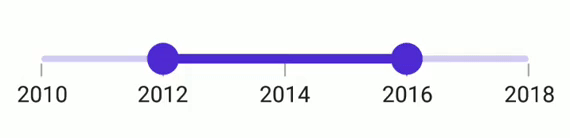

# Thumb DragBehavior in .NET MAUI DateTime Range Slider

This section helps to learn about thumb drag behavior in the DateTime Range Slider (SfDateTimeRangeSlider).

## OnThumb

When the [DragBehavior](https://help.syncfusion.com/cr/maui/Syncfusion.Maui.Sliders.RangeSliderBase.html#Syncfusion_Maui_Sliders_RangeSliderBase_DragBehavior) is set to [OnThumb](https://help.syncfusion.com/cr/maui/Syncfusion.Maui.Sliders.SliderDragBehavior.html#Syncfusion_Maui_Sliders_SliderDragBehavior_OnThumb), an individual thumb can be moved based on the dragging. By default, the [OnThumb](https://help.syncfusion.com/cr/maui/Syncfusion.Maui.Sliders.SliderDragBehavior.html#Syncfusion_Maui_Sliders_SliderDragBehavior_OnThumb) has been used as drag behavior.





<sliders:SfDateTimeRangeSlider Minimum="2010-01-01" 
                               Maximum="2018-01-01" 
                               RangeStart="2012-01-01" 
                               RangeEnd="2016-01-01"
                               Interval="2" 
                               ShowTicks="True"
                               ShowLabels="True"
                               DragBehavior="OnThumb">
</sliders:SfDateTimeRangeSlider>





SfDateTimeRangeSlider rangeSlider = new SfDateTimeRangeSlider();
rangeSlider.Minimum = new DateTime(2010, 01, 01);
rangeSlider.Maximum = new DateTime(2018, 01, 01);
rangeSlider.RangeStart = new DateTime(2012, 01, 01);
rangeSlider.RangeEnd = new DateTime(2016, 01, 01);
rangeSlider.Interval = 2; 
rangeSlider.ShowTicks = true;
rangeSlider.ShowLabels = true;  
rangeSlider.DragBehavior = SliderDragBehavior.OnThumb;





## BetweenThumbs

When the [DragBehavior](https://help.syncfusion.com/cr/maui/Syncfusion.Maui.Sliders.RangeSliderBase.html#Syncfusion_Maui_Sliders_RangeSliderBase_DragBehavior) is set to [BetweenThumbs](https://help.syncfusion.com/cr/maui/Syncfusion.Maui.Sliders.SliderDragBehavior.html#Syncfusion_Maui_Sliders_SliderDragBehavior_BetweenThumbs), both the thumbs can be moved at the same time without changing the range between the start and end thumbs. We had considered this behavior without the range slider thumb radius. It is not possible to move the individual thumb when setting this behavior.





<sliders:SfDateTimeRangeSlider Minimum="2010-01-01" 
                               Maximum="2018-01-01" 
                               RangeStart="2012-01-01" 
                               RangeEnd="2016-01-01" 
                               Interval="2" 
                               ShowTicks="True"
                               ShowLabels="True"
                               DragBehavior="BetweenThumbs">
</sliders:SfDateTimeRangeSlider>





SfDateTimeRangeSlider rangeSlider = new SfDateTimeRangeSlider();
rangeSlider.Minimum = new DateTime(2010, 01, 01);
rangeSlider.Maximum = new DateTime(2018, 01, 01);
rangeSlider.RangeStart = new DateTime(2012, 01, 01);
rangeSlider.RangeEnd = new DateTime(2016, 01, 01);
rangeSlider.Interval = 2; 
rangeSlider.ShowTicks = true;
rangeSlider.ShowLabels = true;   
rangeSlider.DragBehavior = SliderDragBehavior.BetweenThumbs;





## Both

When the  [DragBehavior](https://help.syncfusion.com/cr/maui/Syncfusion.Maui.Sliders.RangeSliderBase.html#Syncfusion_Maui_Sliders_RangeSliderBase_DragBehavior) is set to [Both](https://help.syncfusion.com/cr/maui/Syncfusion.Maui.Sliders.SliderDragBehavior.html#Syncfusion_Maui_Sliders_SliderDragBehavior_Both), the individual thumb can be moved, and both thumbs can be moved at the same time without changing the range between the start and end thumbs.





<sliders:SfDateTimeRangeSlider Minimum="2010-01-01" 
                               Maximum="2018-01-01" 
                               RangeStart="2012-01-01" 
                               RangeEnd="2016-01-01" 
                               Interval="2" 
                               ShowTicks="True"
                               ShowLabels="True"
                               DragBehavior="Both">
</sliders:SfDateTimeRangeSlider>





SfDateTimeRangeSlider rangeSlider = new SfDateTimeRangeSlider();
rangeSlider.Minimum = new DateTime(2010, 01, 01);
rangeSlider.Maximum = new DateTime(2018, 01, 01);
rangeSlider.RangeStart = new DateTime(2012, 01, 01);
rangeSlider.RangeEnd = new DateTime(2016, 01, 01);
rangeSlider.Interval = 2; 
rangeSlider.ShowTicks = true; 
rangeSlider.ShowLabels = true;  
rangeSlider.DragBehavior = SliderDragBehavior.Both;





