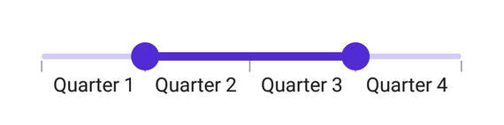

# Events and Commands in .NET MAUI Range Slider (SfDateTimeRangeSlider)

This section explains how to add the events and commands for the DateTime Range Slider.

## Events

### Handle callbacks

* [ValueChangeStart](https://help.syncfusion.com/cr/maui/Syncfusion.Maui.Sliders.RangeView-1.html#Syncfusion_Maui_Sliders_RangeView_1_ValueChangeStart) -  Called when the user selects a new value for the slider by tapping/mouse down on the thumb.
* [ValueChanging](https://help.syncfusion.com/cr/maui/Syncfusion.Maui.Sliders.SfDateTimeRangeSlider.html#Syncfusion_Maui_Sliders_SfDateTimeRangeSlider_ValueChanging) - Called when the user is selecting a new value for the slider by dragging the thumb.
* [ValueChanged](https://help.syncfusion.com/cr/maui/Syncfusion.Maui.Sliders.SfDateTimeRangeSlider.html#Syncfusion_Maui_Sliders_SfDateTimeRangeSlider_ValueChanged) - Called when the user completes selecting a new value.
* [ValueChangeEnd](https://help.syncfusion.com/cr/maui/Syncfusion.Maui.Sliders.RangeView-1.html#Syncfusion_Maui_Sliders_RangeView_1_ValueChangeEnd) - Called when the user stops interacting with the slider by tapping/mouse up the thumb.





 <sliders:SfDateTimeRangeSlider Minimum="2010-01-01" 
                                Maximum="2020-01-01" 
                                RangeStart="2012-01-01" 
                                RangeEnd="2018-01-01" 
                                ValueChangeStart="OnValueChangeStart" 
                                ValueChanging="OnValueChanging" 
                                ValueChanged="OnValueChanged" 
                                ValueChangeEnd="OnValueChangeEnd">
</sliders:SfDateTimeRangeSlider >





{
    SfDateTimeRangeSlider rangeSlider = new SfDateTimeRangeSlider()
    {
        Minimum = new DateTime(2010, 01, 01),
        Maximum = new DateTime(2018, 01, 01),
        RangeStart = new DateTime(2012, 01, 01),
        RangeEnd = new DateTime(2016, 01, 01),
    };
    rangeSlider.ValueChangeStart += OnValueChangeStart;
    rangeSlider.ValueChanging += OnValueChanging;
    rangeSlider.ValueChanged += OnValueChanged;
    rangeSelector.ValueChangeEnd += OnValueChangeEnd;
}

private void OnValueChangeStart(object sender, EventArgs e)
{
}

private void OnValueChanging(object sender, DateTimeRangeSliderValueChangingEventArgs e)
{
}

private void OnValueChanged(object sender, DateTimeRangeSliderValueChangedEventArgs e)
{
}

private void OnValueChangeEnd(object sender, EventArgs e)
{
}





### Customize label text

Format or change the whole date label text using the [`LabelCreated`](https://help.syncfusion.com/cr/maui/Syncfusion.Maui.Sliders.RangeView-1.html#Syncfusion_Maui_Sliders_RangeView_1_LabelCreated) event. The [`SliderLabelCreatedEventArgs`](https://help.syncfusion.com/cr/maui/Syncfusion.Maui.Sliders.SliderLabelCreatedEventArgs.html) contains the following parameters,

* Text – Customize the text color using the [`Text`](https://help.syncfusion.com/cr/maui/Syncfusion.Maui.Sliders.SliderLabelCreatedEventArgs.html#Syncfusion_Maui_Sliders_SliderLabelCreatedEventArgs_Text) parameter.
* Style – Formats the text color, font size, font family, offset using the [`Style`](https://help.syncfusion.com/cr/maui/Syncfusion.Maui.Sliders.SliderLabelCreatedEventArgs.html#Syncfusion_Maui_Sliders_SliderLabelCreatedEventArgs_Style) parameter.





<sliders:SfDateTimeRangeSlider Minimum="2010-01-01"
                               Maximum="2011-01-01"
                               RangeStart="2010-04-01"
                               RangeEnd="2010-10-01"
                               Interval="3"
                               DateFormat="MMM"
                               ShowTicks="True"
                               LabelsPlacement="BetweenTicks"
                               IntervalType="Months"
                               LabelCreated="OnLabelCreated"
                               ShowLabels="True">
</sliders:SfDateTimeRangeSlider>





{
    SfDateTimeRangeSlider rangeSlider = new SfDateTimeRangeSlider()
    {
        Minimum = new DateTime(2010, 01, 01),
        Maximum = new DateTime(2018, 01, 01),
        RangeStart = new DateTime(2012, 01, 01),
        RangeEnd = new DateTime(2016, 01, 01),
        Interval = 3,
        DateFormat = "MMM",
        IntervalType = SliderDateIntervalType.Months,
        LabelsPlacement = SliderLabelsPlacement.BetweenTicks,
        ShowTicks = true,
        ShowLabels = true,
    };
    rangeSlider.LabelCreated += OnLabelCreated;
}

private void OnLabelCreated(object sender, SliderLabelCreatedEventArgs e)
{
    if (e.Text == "Jan")
    {
        e.Text = "Quarter 1";
    }
    else if (e.Text == "Apr")
    {
        e.Text = "Quarter 2";
    }
    else if (e.Text == "Jul")
    {
        e.Text = "Quarter 3";
    }
    else
    {
        e.Text = "Quarter 4";
    }
}





### Tooltip text format

By default, it is formatted based on the [`SliderTooltip.DateFormat`](https://help.syncfusion.com/cr/maui/Syncfusion.Maui.Sliders.SliderTooltip.html#Syncfusion_Maui_Sliders_SliderTooltip_DateFormat) property.

Format or change the whole tooltip label text using the [`TooltipLabelCreated`](https://help.syncfusion.com/cr/maui/Syncfusion.Maui.Sliders.SliderTooltip.html#Syncfusion_Maui_Sliders_SliderTooltip_TooltipLabelCreated) event. The [`SliderTooltipLabelCreatedEventArgs`](https://help.syncfusion.com/cr/maui/Syncfusion.Maui.Sliders.SliderTooltipLabelCreatedEventArgs.html) contains the following parameters,

* Text – Change the tooltip text using the [`Text`](https://help.syncfusion.com/cr/maui/Syncfusion.Maui.Sliders.SliderTooltipLabelCreatedEventArgs.html#Syncfusion_Maui_Sliders_SliderTooltipLabelCreatedEventArgs_Text) property.
* Color – Change the color of the tooltip text using the [`TextColor`](https://help.syncfusion.com/cr/maui/Syncfusion.Maui.Sliders.SliderTooltipLabelCreatedEventArgs.html#Syncfusion_Maui_Sliders_SliderTooltipLabelCreatedEventArgs_TextColor) property.
* Font Size – Change the font size of the tooltip text using the [`FontSize`](https://help.syncfusion.com/cr/maui/Syncfusion.Maui.Sliders.SliderTooltipLabelCreatedEventArgs.html#Syncfusion_Maui_Sliders_SliderTooltipLabelCreatedEventArgs_FontSize) property.
* Font Family – Change the font family of the tooltip text using the [`FontFamily`](https://help.syncfusion.com/cr/maui/Syncfusion.Maui.Sliders.SliderTooltipLabelCreatedEventArgs.html#Syncfusion_Maui_Sliders_SliderTooltipLabelCreatedEventArgs_FontFamily) property.
* Font Attributes – Change the font attributes of the tooltip text using the [`FontAttributes`](https://help.syncfusion.com/cr/maui/Syncfusion.Maui.Sliders.SliderTooltipLabelCreatedEventArgs.html#Syncfusion_Maui_Sliders_SliderTooltipLabelCreatedEventArgs_FontAttributes) property.





<sliders:SfDateTimeRangeSlider Minimum="2010-01-01"
                               Maximum="2018-01-01"
                               RangeStart="2012-01-01"
                               RangeEnd="2016-01-01"
                               Interval="2"
                               ShowTicks="True"
                               ShowLabels="True">

    <sliders:SfDateTimeRangeSlider.Tooltip>
        <sliders:SliderTooltip TooltipLabelCreated="OnTooltipLabelCreated" />
    </sliders:SfDateTimeRangeSlider.Tooltip>

</sliders:SfDateTimeRangeSlider>





{
    SfDateTimeRangeSlider rangeSlider = new SfDateTimeRangeSlider()
    {
        Minimum = new DateTime(2010, 01, 01),
        Maximum = new DateTime(2018, 01, 01),
        RangeStart = new DateTime(2012, 01, 01),
        RangeEnd = new DateTime(2016, 01, 01),
        Interval = 2,
        ShowTicks = true,
        ShowLabels = true,
        Tooltip = new SliderTooltip(),
    };
    rangeSlider.Tooltip.TooltipLabelCreated += OnTooltipLabelCreated;
}

 private void OnTooltipLabelCreated(object sender, SliderTooltipLabelCreatedEventArgs e)
 {
     e.Text = "Year: " + e.Text;
 }





## Commands and their parameter

### Drag started command

The [`DragStartedCommand`](https://help.syncfusion.com/cr/maui/Syncfusion.Maui.Sliders.RangeView-1.html#Syncfusion_Maui_Sliders_RangeView_1_DragStartedCommand) will be executed when the user starts to move the thumb.





<ContentPage.BindingContext>
    <local:ViewModel x:Name="viewModel" />
</ContentPage.BindingContext>

<ContentPage.Content>
    <sliders:SfDateTimeRangeSlider Minimum="2010-01-01"
                                   Maximum="2018-01-01"
                                   RangeStart="2012-01-01"
                                   RangeEnd="2016-01-01"
                                   DragStartedCommand="{Binding DragStartedCommand}" />
</ContentPage.Content>





SfDateTimeRangeSlider rangeSlider = new SfDateTimeRangeSlider()
{
    Minimum = new DateTime(2010, 01, 01),
    Maximum = new DateTime(2018, 01, 01),
    RangeStart = new DateTime(2012, 01, 01),
    RangeEnd = new DateTime(2016, 01, 01),
    DragStartedCommand = viewModel.DragStartedCommand
};

public class ViewModel
{
    public ICommand DragStartedCommand { get; }

    public ViewModel()
    {
        DragStartedCommand = new Command(OnDragStarted);
    }

    private void OnDragStarted(object obj)
    {
    }
}





### Drag started command parameter

The [`DragStartedCommandParameter`](https://help.syncfusion.com/cr/maui/Syncfusion.Maui.Sliders.RangeView-1.html#Syncfusion_Maui_Sliders_RangeView_1_DragStartedCommandParameter) will be executed when the user starts to move the thumb.





<ContentPage.BindingContext>
    <local:ViewModel x:Name="viewModel" />
</ContentPage.BindingContext>

<ContentPage.Content>
    <sliders:SfDateTimeRangeSlider Minimum="2010-01-01"
                                   Maximum="2018-01-01"
                                   RangeStart="2012-01-01"
                                   RangeEnd="2016-01-01"
                                   DragStartedCommand="{Binding DragStartedCommand}"
                                   DragStartedCommandParameter="1" />
</ContentPage.Content>





SfDateTimeRangeSlider rangeSlider = new SfDateTimeRangeSlider()
{
    Minimum = new DateTime(2010, 01, 01),
    Maximum = new DateTime(2018, 01, 01),
    RangeStart = new DateTime(2012, 01, 01),
    RangeEnd = new DateTime(2016, 01, 01),
    DragStartedCommand = viewModel.DragStartedCommand,
    DragStartedCommandParameter = "1"
};

public class ViewModel
{
    public ICommand DragStartedCommand { get; }

    public ViewModel()
    {
        DragStartedCommand = new Command(OnDragStarted);
    }

    private void OnDragStarted(object obj)
    {
    }
}





### Drag completed command

The [`DragCompletedCommand`](https://help.syncfusion.com/cr/maui/Syncfusion.Maui.Sliders.RangeView-1.html#Syncfusion_Maui_Sliders_RangeView_1_DragCompletedCommand) will be executed when the user completes moving the thumb.





<ContentPage.BindingContext>
    <local:ViewModel x:Name="viewModel" />
</ContentPage.BindingContext>

<ContentPage.Content>
    <sliders:SfDateTimeRangeSlider Minimum="2010-01-01"
                                   Maximum="2018-01-01"
                                   RangeStart="2012-01-01"
                                   RangeEnd="2016-01-01"
                                   DragCompletedCommand="{Binding DragCompletedCommand}" />
</ContentPage.Content>





SfDateTimeRangeSlider rangeSlider = new SfDateTimeRangeSlider()
{
    Minimum = new DateTime(2010, 01, 01),
    Maximum = new DateTime(2018, 01, 01),
    RangeStart = new DateTime(2012, 01, 01),
    RangeEnd = new DateTime(2016, 01, 01),
    DragCompletedCommand = viewModel.DragCompletedCommand
};

public class ViewModel
{
    public ICommand DragCompletedCommand { get; }

    public ViewModel()
    {
        DragCompletedCommand = new Command(OnDragCompleted);
    }

    private void OnDragCompleted(object obj)
    {
    }
}





### Drag completed command parameter

The [`DragCompletedCommandParameter`](https://help.syncfusion.com/cr/maui/Syncfusion.Maui.Sliders.RangeView-1.html#Syncfusion_Maui_Sliders_RangeView_1_DragCompletedCommandParameter) will be executed when the user completes moving the thumb.





<ContentPage.BindingContext>
    <local:ViewModel x:Name="viewModel" />
</ContentPage.BindingContext>

<ContentPage.Content>
    <sliders:SfDateTimeRangeSlider Minimum="2010-01-01"
                                   Maximum="2018-01-01"
                                   RangeStart="2012-01-01"
                                   RangeEnd="2016-01-01"
                                   DragCompletedCommand="{Binding DragCompletedCommand}"
                                   DragCompletedCommandParameter="1" />
</ContentPage.Content>





SfDateTimeRangeSlider rangeSlider = new SfDateTimeRangeSlider()
{
    Minimum = new DateTime(2010, 01, 01),
    Maximum = new DateTime(2018, 01, 01),
    RangeStart = new DateTime(2012, 01, 01),
    RangeEnd = new DateTime(2016, 01, 01),
    DragCompletedCommand = viewModel.DragCompletedCommand,
    DragCompletedCommandParameter = "1"
};

public class ViewModel
{
    public ICommand DragCompletedCommand { get; }

    public ViewModel()
    {
        DragCompletedCommand = new Command(OnDragCompleted);
    }

    private void OnDragCompleted(object obj)
    {
    }
}



