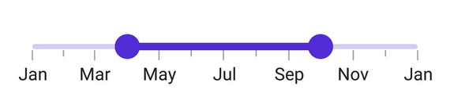

# Getting Started with .NET MAUI DateTime Range Slider

This section explains the steps required to add the [DateTime Range Slider](https://help.syncfusion.com/cr/maui/Syncfusion.Maui.Sliders.SfDateTimeRangeSlider.html) control and its elements track, ticks, labels, and tooltip. This section covers only the basic features needed to know to get started with Syncfusion DateTime Range Slider.

To quickly get started with the .NET MAUI DateTime Range Slider, watch this video.

<iframe id='MAUIDateTimeRangeSliderVideoTutorial' src='https://www.youtube.com/embed/4mdAax8B4n4'></iframe>




## Prerequisites

Before proceeding, ensure the following are in place:

1. Install [.NET 8 SDK](https://dotnet.microsoft.com/en-us/download/dotnet/8.0) or later.
2. Set up a .NET MAUI environment with Visual Studio 2022 (v17.8 or later).

## Step 1: Create a New .NET MAUI Project

1. Go to **File > New > Project** and choose the **.NET MAUI App** template.
2. Name the project and choose a location. Then, click **Next**.
3. Select the .NET framework version and click **Create**.

## Step 2: Install the Syncfusion® MAUI Sliders NuGet Package

1. In **Solution Explorer**, right-click the project and choose **Manage NuGet Packages**.
2. Search for [Syncfusion.Maui.Sliders](https://www.nuget.org/packages/Syncfusion.Maui.Sliders) and install the latest version.
3. Ensure the necessary dependencies are installed correctly, and the project is restored.

## Step 3: Register the Handler

[Syncfusion.Maui.Core](https://www.nuget.org/packages/Syncfusion.Maui.Core) nuget is a dependent package for all Syncfusion controls of .NET MAUI. In the **MauiProgram.cs file**, register the handler for Syncfusion core.



using Microsoft.Maui;
using Microsoft.Maui.Hosting;
using Microsoft.Maui.Controls.Compatibility;
using Microsoft.Maui.Controls.Hosting;
using Microsoft.Maui.Controls.Xaml;
using Syncfusion.Maui.Core.Hosting;

namespace Slider
{
    public static class MauiProgram
    {
        public static MauiApp CreateMauiApp()
        {
            var builder = MauiApp.CreateBuilder();
            builder
            .UseMauiApp<App>()
            .ConfigureSyncfusionCore()
            .ConfigureFonts(fonts =>
            {
                fonts.AddFont("OpenSans-Regular.ttf", "OpenSansRegular");
            });

            return builder.Build();
        }
    }
}



## Step 4: Add a Basic DateTime Range Slider

Step 1: Add the NuGet to the project as discussed in the above reference section. 

Step 2: Add the namespace, as shown in the following code sample:





	<xmlns:rating="clr-namespace:Syncfusion.Maui.Sliders;assembly=Syncfusion.Maui.Sliders"/>





	using Syncfusion.Maui.Sliders;








## Prerequisites

Before proceeding, ensure the following are set up:

1. Install [.NET 8 SDK](https://dotnet.microsoft.com/en-us/download/dotnet/8.0) or later is installed.
2. Set up a .NET MAUI environment with Visual Studio Code.
3. Ensure that the .NET MAUI extension is installed and configured as described [here.](https://learn.microsoft.com/en-us/dotnet/maui/get-started/installation?view=net-maui-8.0&tabs=visual-studio-code)

## Step 1: Create a New .NET MAUI Project

1. Open the Command Palette by pressing **Ctrl+Shift+P** and type **.NET:New Project** and press Enter.
2. Choose the **.NET MAUI App** template.
3. Select the project location, type the project name and press Enter.
4. Then choose **Create project**

## Step 2: Install the Syncfusion® MAUI Sliders NuGet Package

1. Press <kbd>Ctrl</kbd> + <kbd>`</kbd> (backtick) to open the integrated terminal in Visual Studio Code.
2. Ensure you're in the project root directory where your .csproj file is located.
3. Run the command `dotnet add package Syncfusion.Maui.Sliders` to install the Syncfusion® .NET MAUI Sliders package.
4. To ensure all dependencies are installed, run `dotnet restore`.

## Step 3: Register the Handler

[Syncfusion.Maui.Core](https://www.nuget.org/packages/Syncfusion.Maui.Core) nuget is a dependent package for all Syncfusion controls of .NET MAUI. In the **MauiProgram.cs file**, register the handler for Syncfusion core.



using Microsoft.Maui;
using Microsoft.Maui.Hosting;
using Microsoft.Maui.Controls.Compatibility;
using Microsoft.Maui.Controls.Hosting;
using Microsoft.Maui.Controls.Xaml;
using Syncfusion.Maui.Core.Hosting;

namespace Slider
{
    public static class MauiProgram
    {
        public static MauiApp CreateMauiApp()
        {
            var builder = MauiApp.CreateBuilder();
            builder
            .UseMauiApp<App>()
            .ConfigureSyncfusionCore()
            .ConfigureFonts(fonts =>
            {
                fonts.AddFont("OpenSans-Regular.ttf", "OpenSansRegular");
            });

            return builder.Build();
        }
    }
}



## Step 4: Add a Basic DateTime Range Slider

Step 1: Add the NuGet to the project as discussed in the above reference section. 

Step 2: Add the namespace, as shown in the following code sample:





	<xmlns:sliders="clr-namespace:Syncfusion.Maui.Sliders;assembly=Syncfusion.Maui.Sliders"/>





	using Syncfusion.Maui.Sliders;








## Initialize the DateTime Range Slider

Import the [SfDateTimeRangeSlider](https://help.syncfusion.com/cr/maui/Syncfusion.Maui.Sliders.SfDateTimeRangeSlider.html) namespace and initialize the DateTime Range Slider as shown below.





<ContentPage
    . . .
    xmlns:sliders="clr-namespace:Syncfusion.Maui.Sliders;assembly=Syncfusion.Maui.Sliders">
    <sliders:SfDateTimeRangeSlider Minimum="2010-01-01" 
                                   Maximum="2018-01-01" 
                                   RangeStart="2012-01-01" 
                                   RangeEnd="2016-01-01" />
</ContentPage>





using Syncfusion.Maui.Sliders;

namespace RangeSlider
{
    public partial class MainPage : ContentPage
    {
        public MainPage()
        {
            InitializeComponent();
            SfDateTimeRangeSlider rangeSlider = new SfDateTimeRangeSlider();
            rangeSlider.Minimum = new DateTime(2010, 01, 01);
            rangeSlider.Maximum = new DateTime(2018, 01, 01);
            rangeSlider.RangeStart = new DateTime(2012, 01, 01);
            rangeSlider.RangeEnd = new DateTime(2016, 01, 01);
            this.content = rangeSlider;
        }
    }
}





## Enable labels

The [ShowLabels](https://help.syncfusion.com/cr/maui/Syncfusion.Maui.Sliders.RangeView-1.html#Syncfusion_Maui_Sliders_RangeView_1_ShowLabels) property enables the labels which render at given intervals.





<sliders:SfDateTimeRangeSlider Minimum="2010-01-01" 
                               Maximum="2018-01-01" 
                               RangeStart="2012-01-01" 
                               RangeEnd="2016-01-01"
                               Interval="2" 
                               ShowLabels="True">
</sliders:SfDateTimeRangeSlider>





SfDateTimeRangeSlider rangeSlider = new SfDateTimeRangeSlider();
rangeSlider.Minimum = new DateTime(2010, 01, 01);
rangeSlider.Maximum = new DateTime(2018, 01, 01);
rangeSlider.RangeStart = new DateTime(2012, 01, 01);
rangeSlider.RangeEnd = new DateTime(2016, 01, 01);
rangeSlider.ShowLabels = true;
rangeSlider.Interval = 2;





## Enable ticks

The [ShowTicks](https://help.syncfusion.com/cr/maui/Syncfusion.Maui.Sliders.RangeView-1.html#Syncfusion_Maui_Sliders_RangeView_1_ShowTicks) property enables the ticks, while the [MinorTicksPerInterval](https://help.syncfusion.com/cr/maui/Syncfusion.Maui.Sliders.RangeView-1.html#Syncfusion_Maui_Sliders_RangeView_1_MinorTicksPerInterval) property enables the minor ticks between the major ticks.





<sliders:SfDateTimeRangeSlider Minimum="2010-01-01" 
                               Maximum="2018-01-01" 
                               RangeStart="2012-01-01" 
                               RangeEnd="2016-01-01"                       
                               Interval="2" 
                               ShowLabels="True"
                               ShowTicks="True"
                               MinorTicksPerInterval="1">
</sliders:SfDateTimeRangeSlider>





SfDateTimeRangeSlider rangeSlider = new SfDateTimeRangeSlider();
rangeSlider.Minimum = new DateTime(2010, 01, 01);
rangeSlider.Maximum = new DateTime(2018, 01, 01);
rangeSlider.RangeStart = new DateTime(2012, 01, 01);
rangeSlider.RangeEnd = new DateTime(2016, 01, 01);
rangeSlider.ShowLabels = true;
rangeSlider.ShowTicks = true;
rangeSlider.Interval = 2;
rangeSlider.MinorTicksPerInterval = 1;





## Orientation

The [Orientation](https://help.syncfusion.com/cr/maui/Syncfusion.Maui.Sliders.SfDateTimeRangeSlider.html#Syncfusion_Maui_Sliders_SfDateTimeRangeSlider_Orientation) property allows you to show the DateTime Range Slider in both horizontal and vertical directions. The default value of the Orientation property is **Horizontal**.





<sliders:SfDateTimeRangeSlider Minimum="2010-01-01" 
                               Maximum="2018-01-01" 
                               RangeStart="2012-01-01" 
                               RangeEnd="2016-01-01"
                               ShowTicks="True" 
                               ShowLabels="True"
                               Interval="2" 
                               MinorTicksPerInterval="1" 
                               Orientation="Vertical">
</sliders:SfDateTimeRangeSlider>





SfDateTimeRangeSlider rangeSlider = new SfDateTimeRangeSlider();
rangeSlider.Orientation = SliderOrientation.Vertical;
rangeSlider.Minimum = new DateTime(2010, 01, 01);
rangeSlider.Maximum = new DateTime(2018, 01, 01);
rangeSlider.RangeStart = new DateTime(2012, 01, 01);
rangeSlider.RangeEnd = new DateTime(2016, 01, 01);
rangeSlider.ShowLabels = true;
rangeSlider.ShowTicks = true;
rangeSlider.Interval = 2;
rangeSlider.MinorTicksPerInterval = 1;





## Inverse the slider

Invert the DateTime Range Slider using the [IsInversed](https://help.syncfusion.com/cr/maui/Syncfusion.Maui.Sliders.RangeView-1.html#Syncfusion_Maui_Sliders_RangeView_1_IsInversed) property. The default value of the IsInversed property is **False**.





<sliders:SfDateTimeRangeSlider Minimum="2010-01-01" 
                               Maximum="2018-01-01" 
                               RangeStart="2012-01-01" 
                               RangeEnd="2016-01-01"
                               Interval="2" 
                               ShowTicks="True"
                               ShowLabels="True"  
                               MinorTicksPerInterval="1" 
                               IsInversed="True">
</sliders:SfDateTimeRangeSlider>





SfDateTimeRangeSlider rangeSlider = new SfDateTimeRangeSlider();
rangeSlider.Minimum = new DateTime(2010, 01, 01);
rangeSlider.Maximum = new DateTime(2018, 01, 01);
rangeSlider.RangeStart = new DateTime(2012, 01, 01);
rangeSlider.RangeEnd = new DateTime(2016, 01, 01);
rangeSlider.Interval = 2;
rangeSlider.ShowLabels = true;
rangeSlider.ShowTicks = true;
rangeSlider.MinorTicksPerInterval = 1;
rangeSlider.IsInversed = true;





## Formatting labels

Add prefix or suffix to the labels using the [DateFormat](https://help.syncfusion.com/cr/maui/Syncfusion.Maui.Sliders.IDateTimeElement.html#Syncfusion_Maui_Sliders_IDateTimeElement_DateFormat) property.





<sliders:SfDateTimeRangeSlider Minimum="2010-01-01"
                               Maximum="2011-01-01"
                               RangeStart="2010-04-01"
                               RangeEnd="2010-10-01"
                               DateFormat="MMM"
                               IntervalType="Months"
                               ShowTicks="True"
                               MinorTicksPerInterval="1"
                               ShowLabels="True"
                               Interval="2">
</sliders:SfDateTimeRangeSlider>





SfDateTimeRangeSlider rangeSlider = new SfDateTimeRangeSlider();
rangeSlider.Minimum = new DateTime(2010, 01, 01);
rangeSlider.Maximum = new DateTime(2011, 01, 01);
rangeSlider.RangeStart = new DateTime(2010, 04, 01);
rangeSlider.RangeEnd = new DateTime(2010, 10, 01);
rangeSlider.ShowLabels = true;
rangeSlider.Interval = 2;
rangeSlider.ShowTicks = true;
rangeSlider.MinorTicksPerInterval = 1;
rangeSlider.DateFormat = "MMM";
rangeSlider.IntervalType = SliderDateIntervalType.Months;





