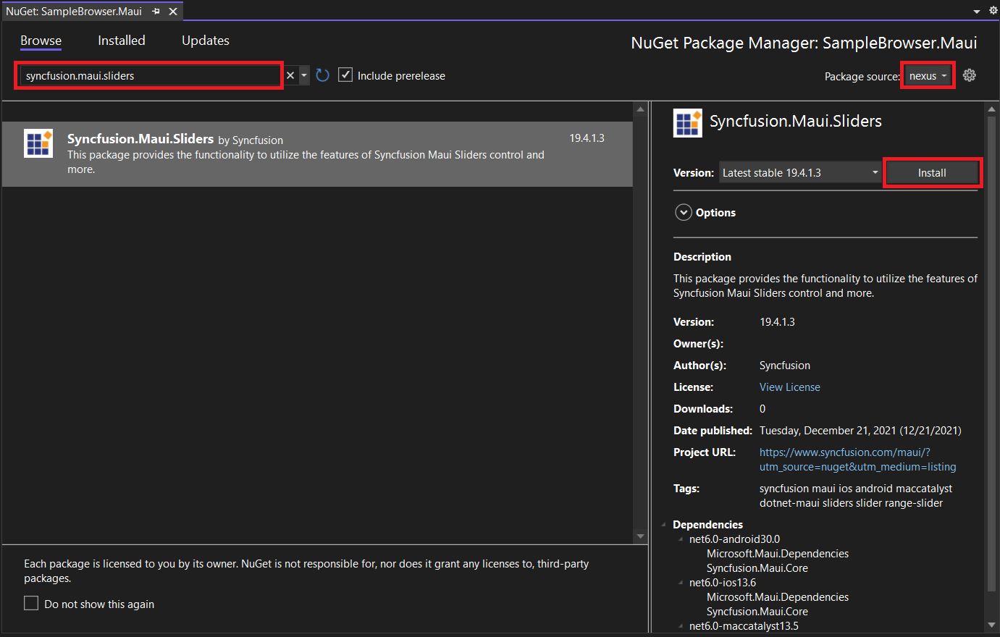
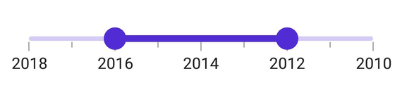

# Getting Started with .NET MAUI Range Slider

This section explains the steps required to add the range slider control and its elements such as numeric and date values, ticks, labels and tooltip. This section covers only basic features needed to know to get started with Syncfusion Range Slider.

## Creating an application with .NET MAUI

Create a new .NET MAUI application in Visual Studio.

 

## Adding SfDateTimeRangeSlider reference

Syncfusion .NET MAUI components are available in [nuget.org](https://www.nuget.org/). To add SfDateTimeRangeSlider to your project, open the NuGet package manager in Visual Studio, search for Syncfusion.Maui.Sliders and then install it.

 

## Handler registration

In the MauiProgram.cs file, register the handler for Syncfusion core



using Microsoft.Maui;
using Microsoft.Maui.Hosting;
using Microsoft.Maui.Controls.Compatibility;
using Microsoft.Maui.Controls.Hosting;
using Microsoft.Maui.Controls.Xaml;
using Syncfusion.Maui.Core.Hosting;

namespace Slider
{
    public static class MauiProgram
    {
        public static MauiApp CreateMauiApp()
        {
            var builder = MauiApp.CreateBuilder();
            builder
            .UseMauiApp<App>()
            .ConfigureSyncfusionCore()
            .ConfigureFonts(fonts =>
            {
                fonts.AddFont("OpenSans-Regular.ttf", "OpenSansRegular");
            });

            return builder.Build();
        }
    }
}



## Initialize range slider

Import the [`SfDateTimeRangeSlider`](https://help.syncfusion.com/cr/maui/Syncfusion.Maui.Sliders.SfDateTimeRangeSlider.html) namespace and initialize the range slider as shown below.





<ContentPage
    . . .
    xmlns:sliders="clr-namespace:Syncfusion.Maui.Sliders;assembly=Syncfusion.Maui.Sliders">
    <sliders:SfDateTimeRangeSlider Minimum="2010-01-01" 
                                   Maximum="2018-01-01" 
                                   RangeStart="2012-01-01" 
                                   RangeEnd="2016-01-01" />
</ContentPage>





using Syncfusion.Maui.Sliders;

namespace RangeSlider
{
    public partial class MainPage : ContentPage
    {
        public MainPage()
        {
            InitializeComponent();
            SfDateTimeRangeSlider rangeSlider = new SfDateTimeRangeSlider();
            rangeSlider.Minimum = new DateTime(2010, 01, 01);
            rangeSlider.Maximum = new DateTime(2018, 01, 01);
            rangeSlider.RangeStart = new DateTime(2012, 01, 01);
            rangeSlider.RangeEnd = new DateTime(2016, 01, 01);
            this.content = rangeSlider;
        }
    }
}





## Enable labels

The [`ShowLabels`](https://help.syncfusion.com/cr/maui/Syncfusion.Maui.Sliders.SliderBase.html#Syncfusion_Maui_Sliders_SliderBase_ShowLabels) property enables the labels which renders on given interval.





<sliders:SfDateTimeRangeSlider Minimum="2010-01-01" 
                               Maximum="2018-01-01" 
                               RangeStart="2012-01-01" 
                               RangeEnd="2016-01-01"
                               Interval="2" 
                               ShowLabel="True">
</sliders:SfDateTimeRangeSlider>





SfDateTimeRangeSlider rangeSlider = new SfDateTimeRangeSlider();
rangeSlider.Minimum = new DateTime(2010, 01, 01);
rangeSlider.Maximum = new DateTime(2018, 01, 01);
rangeSlider.RangeStart = new DateTime(2012, 01, 01);
rangeSlider.RangeEnd = new DateTime(2016, 01, 01);
rangeSlider.ShowLabel = true;
rangeSlider.Interval = 2;





## Enable ticks

The [`ShowTicks`](https://help.syncfusion.com/cr/maui/Syncfusion.Maui.Sliders.SliderBase.html#Syncfusion_Maui_Sliders_SliderBase_ShowTicks) property enables the ticks in the range selector, while the [`MinorTicksPerInterval`](https://help.syncfusion.com/cr/maui/Syncfusion.Maui.Sliders.SliderBase.html#Syncfusion_Maui_Sliders_SliderBase_MinorTicksPerInterval) property enables the minor ticks between the major ticks.





<sliders:SfDateTimeRangeSlider Minimum="2010-01-01" 
                               Maximum="2018-01-01" 
                               RangeStart="2012-01-01" 
                               RangeEnd="2016-01-01"                       
                               Interval="2" 
                               ShowLabels="True"
                               ShowTicks="True"
                               MinorTicksPerInterval="1">
</sliders:SfDateTimeRangeSlider>





SfDateTimeRangeSlider rangeSlider = new SfDateTimeRangeSlider();
rangeSlider.Minimum = new DateTime(2010, 01, 01);
rangeSlider.Maximum = new DateTime(2018, 01, 01);
rangeSlider.RangeStart = new DateTime(2012, 01, 01);
rangeSlider.RangeEnd = new DateTime(2016, 01, 01);
rangeSlider.ShowLabels = true;
rangeSlider.ShowTicks = true;
rangeSlider.Interval = 2;
rangeSlider.MinorTicksPerInterval = 1;





## Orientation

The [`Orientation`](https://help.syncfusion.com/cr/maui/Syncfusion.Maui.Sliders.SfDateTimeRangeSlider.html#Syncfusion_Maui_Sliders_SfRangeSlider_Orientation) property allows you to show the range slider in both horizontal and vertical directions. The default value of the [`Orientation`](https://help.syncfusion.com/cr/maui/Syncfusion.Maui.Sliders.SfDateTimeRangeSlider.html#Syncfusion_Maui_Sliders_SfRangeSlider_Orientation) property is `Horizontal`.





<sliders:SfDateTimeRangeSlider Minimum="2010-01-01" 
                               Maximum="2018-01-01" 
                               RangeStart="2012-01-01" 
                               RangeEnd="2016-01-01"
                               ShowTicks="True" 
                               Interval="2" 
                               MinorTicksPerInterval="1" 
                               Orientation="Vertical">
</sliders:SfDateTimeRangeSlider>





SfDateTimeRangeSlider rangeSlider = new SfDateTimeRangeSlider();
rangeSlider.Orientation = SliderOrientation.Vertical;
rangeSlider.Minimum = new DateTime(2010, 01, 01);
rangeSlider.Maximum = new DateTime(2018, 01, 01);
rangeSlider.RangeStart = new DateTime(2012, 01, 01);
rangeSlider.RangeEnd = new DateTime(2016, 01, 01);
rangeSlider.ShowLabels = true;
rangeSlider.ShowTicks = true;
rangeSlider.Interval = 2;
rangeSlider.MinorTicksPerInterval = 1;





## Inverse the slider

You can invert the range slider using the [`IsInversed`](https://help.syncfusion.com/cr/maui/Syncfusion.Maui.Sliders.SliderBase.html#Syncfusion_Maui_Sliders_SliderBase_IsInversed) property. The default value of the [`IsInversed`](https://help.syncfusion.com/cr/maui/Syncfusion.Maui.Sliders.SliderBase.html#Syncfusion_Maui_Sliders_SliderBase_IsInversed) property is `False`.





<sliders:SfDateTimeRangeSlider Minimum="2010-01-01" 
                               Maximum="2018-01-01" 
                               RangeStart="2012-01-01" 
                               RangeEnd="2016-01-01"
                               Interval="2" 
                               ShowTicks="True"
                               ShowLablels="True"  
                               MinorTicksPerInterval="1" 
                               Orientation="Vertical" 
                               IsInversed="True">
</sliders:SfDateTimeRangeSlider>





SfDateTimeRangeSlider rangeSlider = new SfDateTimeRangeSlider();
rangeSlider.Minimum = new DateTime(2010, 01, 01);
rangeSlider.Maximum = new DateTime(2018, 01, 01);
rangeSlider.RangeStart = new DateTime(2012, 01, 01);
rangeSlider.RangeEnd = new DateTime(2016, 01, 01);
rangeSlider.Interval = 2;
rangeSlider.ShowLabels = true;
rangeSlider.ShowTicks = true;
rangeSlider.MinorTicksPerInterval = 1;
rangeSlider.IsInversed = true;





## Formatting labels

You can add prefix or suffix to the labels using the [`NumberFormat`](https://help.syncfusion.com/cr/maui/Syncfusion.Maui.Sliders.NumericRangeSliderBase.html#Syncfusion_Maui_Sliders_NumericRangeSliderBase_NumberFormat) or [`DateFormat`](https://help.syncfusion.com/cr/maui/Syncfusion.Maui.Sliders.DateTimeRangeSliderBase.html#Syncfusion_Maui_Sliders_DateTimeRangeSliderBase_DateFormat) properties.





<sliders:SfDateTimeRangeSlider Minimum="2010-01-01" 
                               Maximum="2018-01-01" 
                               RangeStart="2012-01-01" 
                               RangeEnd="2016-01-01"
                               Interval="2"
                               ShowLabels="True"
                               DateFormat="MMM dd" 
                               ShowTicks="True">
</sliders:SfDateTimeRangeSlider>





SfDateTimeRangeSlider rangeSlider = new SfDateTimeRangeSlider();
rangeSlider.Minimum = new DateTime(2010, 01, 01);
rangeSlider.Maximum = new DateTime(2018, 01, 01);
rangeSlider.RangeStart = new DateTime(2012, 01, 01);
rangeSlider.RangeEnd = new DateTime(2016, 01, 01);
rangeSlider.Interval = 2;
rangeSlider.ShowLabels = true;
rangeSlider.DateFormat = "MMM dd";
rangeSlider.ShowTicks = true;





