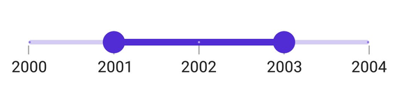

# Interval in .NET MAUI Range Slider (SfDateTimeRangeSlider)

This section explains how to add intervals to the DateTime Range Slider.

## Date Interval

The elements of a DateTime Range Slider, such as labels, ticks, and dividers, are rendered based on the [`Interval`](https://help.syncfusion.com/cr/maui/Syncfusion.Maui.Sliders.RangeView-1.html#Syncfusion_Maui_Sliders_RangeView_1_Interval), [`Minimum`](https://help.syncfusion.com/cr/maui/Syncfusion.Maui.Sliders.RangeView-1.html#Syncfusion_Maui_Sliders_RangeView_1_Minimum), and [`Maximum`](https://help.syncfusion.com/cr/maui/Syncfusion.Maui.Sliders.RangeView-1.html#Syncfusion_Maui_Sliders_RangeView_1_Maximum) properties. The default value of `Interval` is `0`.

You can change the interval type using the [`IntervalType`](https://help.syncfusion.com/cr/maui/Syncfusion.Maui.Sliders.IDateTimeElement.html#Syncfusion_Maui_Sliders_IDateTimeElement_IntervalType) property, and format or change the label text using the [`DateFormat`](https://help.syncfusion.com/cr/maui/Syncfusion.Maui.Sliders.IDateTimeElement.html#Syncfusion_Maui_Sliders_IDateTimeElement_DateFormat) property.

For example, if [`Minimum`](https://help.syncfusion.com/cr/maui/Syncfusion.Maui.Sliders.RangeView-1.html#Syncfusion_Maui_Sliders_RangeView_1_Minimum) is set to `DateTime(2000, 01, 01)`, [`Maximum`](https://help.syncfusion.com/cr/maui/Syncfusion.Maui.Sliders.RangeView-1.html#Syncfusion_Maui_Sliders_RangeView_1_Maximum) is `DateTime(2005, 01, 01)`, `Interval` is `1`, `IntervalType` is set to [`SliderDateIntervalType.Years`](https://help.syncfusion.com/cr/maui/Syncfusion.Maui.Sliders.SliderDateIntervalType.html#Syncfusion_Maui_Sliders_SliderDateIntervalType_Years), and `DateFormat` is `yyyy`, the Range Slider will render labels, major ticks, and dividers at 2000, 2001, 2002, etc.





<sliders:SfDateTimeRangeSlider Minimum="2000-01-01" 
                               Maximum="2004-01-01" 
                               RangeStart="2001-01-01" 
                               RangeEnd="2003-01-01"
                               Interval="1" 
                               IntervalType="Years"
                               DateFormat="yyyy" 
                               ShowLabels="True" 
                               ShowTicks="True" 
                               ShowDividers="True">
</sliders:SfDateTimeRangeSlider>





SfDateTimeRangeSlider rangeSlider = new SfDateTimeRangeSlider();
rangeSlider.Minimum = new DateTime(2000, 01, 01);
rangeSlider.Maximum = new DateTime(2004, 01, 01);
rangeSlider.RangeStart = new DateTime(2001, 01, 01); 
rangeSlider.RangeEnd = new DateTime(2003, 01, 01);            
rangeSlider.Interval = 1;
rangeSlider.IntervalType = SliderDateIntervalType.Years;
rangeSlider.DateFormat = "yyyy";
rangeSlider.ShowLabels = true;
rangeSlider.ShowTicks = true;
rangeSlider.ShowDividers = true;
        




## Auto Interval

If [`ShowTicks`](https://help.syncfusion.com/cr/maui/Syncfusion.Maui.Sliders.RangeView-1.html#Syncfusion_Maui_Sliders_RangeView_1_ShowTicks), [`ShowLabels`](https://help.syncfusion.com/cr/maui/Syncfusion.Maui.Sliders.RangeView-1.html#Syncfusion_Maui_Sliders_RangeView_1_ShowLabels), or [`ShowDividers`](https://help.syncfusion.com/cr/maui/Syncfusion.Maui.Sliders.RangeView-1.html#Syncfusion_Maui_Sliders_RangeView_1_ShowDividers) is set to `True`, and `Interval` is `0`, the interval will be automatically calculated based on available size. If [`IntervalType`](https://help.syncfusion.com/cr/maui/Syncfusion.Maui.Sliders.IDateTimeElement.html#Syncfusion_Maui_Sliders_IDateTimeElement_IntervalType) or [`DateFormat`](https://help.syncfusion.com/cr/maui/Syncfusion.Maui.Sliders.IDateTimeElement.html#Syncfusion_Maui_Sliders_IDateTimeElement_DateFormat) is not set, their values will also be computed automatically.

For example, if [`Minimum`](https://help.syncfusion.com/cr/maui/Syncfusion.Maui.Sliders.RangeView-1.html#Syncfusion_Maui_Sliders_RangeView_1_Minimum) is `DateTime(2000, 01, 01)`, [`Maximum`](https://help.syncfusion.com/cr/maui/Syncfusion.Maui.Sliders.RangeView-1.html#Syncfusion_Maui_Sliders_RangeView_1_Maximum) is `DateTime(2001, 01, 01)`, `Interval` is `0`, and the available size is 350, the Range Slider will render labels, major ticks, and dividers at `Jan 01, 2000`, `Jul 01, 2000`, and `Nov 01, 2000`.





<sliders:SfDateTimeRangeSlider Minimum="2000-01-01" 
                               Maximum="2004-01-01" 
                               RangeStart="2001-01-01" 
                               RangeEnd="2003-01-01"
                               ShowLabels="True" 
                               ShowTicks="True" 
                               ShowDividers="True">
</sliders:SfDateTimeRangeSlider>





SfDateTimeRangeSlider rangeSlider = new SfDateTimeRangeSlider();
rangeSlider.Minimum = new DateTime(2000, 01, 01);
rangeSlider.Maximum = new DateTime(2004, 01, 01);
rangeSlider.RangeStart = new DateTime(2001, 01, 01); 
rangeSlider.RangeEnd = new DateTime(2003, 01, 01);            
rangeSlider.ShowLabels = true;
rangeSlider.ShowTicks = true;
rangeSlider.ShowDividers = true;
        


