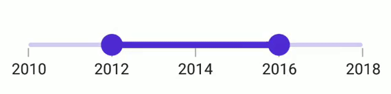

# Interval in .NET MAUI Range Slider (SfDateTimeRangeSlider)

This section explains how to add the interval for the DateTime Range Slider.

## Date interval

DateTime Range Slider elements like labels, ticks, and dividers are rendered based on the [`Interval`](https://help.syncfusion.com/cr/maui/Syncfusion.Maui.Sliders.SliderBase.html#Syncfusion_Maui_Sliders_SliderBase_Interval), [`Minimum`](https://help.syncfusion.com/cr/maui/Syncfusion.Maui.Sliders.NumericRangeSliderBase.html#Syncfusion_Maui_Sliders_NumericRangeSliderBase_Minimum), and [`Maximum`](https://help.syncfusion.com/cr/maui/Syncfusion.Maui.Sliders.NumericRangeSliderBase.html#Syncfusion_Maui_Sliders_NumericRangeSliderBase_Maximum) properties. The default value is `0`.

The DateTime Range Slider does not have auto interval support. So, setting [`Interval`](https://help.syncfusion.com/cr/maui/Syncfusion.Maui.Sliders.SliderBase.html#Syncfusion_Maui_Sliders_SliderBase_Interval), [`IntervalType`](https://help.syncfusion.com/cr/maui/Syncfusion.Maui.Sliders.DateTimeRangeSliderBase.html#Syncfusion_Maui_Sliders_DateTimeRangeSliderBase_IntervalType), and [`DateFormat`](https://help.syncfusion.com/cr/maui/Syncfusion.Maui.Sliders.SliderBase.html#Syncfusion_Maui_Sliders_SliderBase_DateFormat) for date values is mandatory. The default value of the [`IntervalType`](https://help.syncfusion.com/cr/maui/Syncfusion.Maui.Sliders.DateTimeRangeSliderBase.html#Syncfusion_Maui_Sliders_DateTimeRangeSliderBase_IntervalType) property is `DateTime.Year`. It can be years to seconds.

For example, if the [`Minimum`](https://help.syncfusion.com/cr/maui/Syncfusion.Maui.Sliders.DateTimeRangeSliderBase.html#Syncfusion_Maui_Sliders_DateTimeRangeSliderBase_Minimum) is `DateTime(2000, 01, 01)`, the [`Maximum`](https://help.syncfusion.com/cr/maui/Syncfusion.Maui.Sliders.DateTimeRangeSliderBase.html#Syncfusion_Maui_Sliders_DateTimeRangeSliderBase_Maximum) is `DateTime(2005, 01, 01)`, and [`Interval`](https://help.syncfusion.com/cr/maui/Syncfusion.Maui.Sliders.SliderBase.html#Syncfusion_Maui_Sliders_SliderBase_Interval) is `1`, [`IntervalType`](https://help.syncfusion.com/cr/maui/Syncfusion.Maui.Sliders.DateTimeRangeSliderBase.html#Syncfusion_Maui_Sliders_DateTimeRangeSliderBase_IntervalType) is [`SliderDateIntervalType.Years`](https://help.syncfusion.com/cr/maui/Syncfusion.Maui.Sliders.SliderDateIntervalType.html#Syncfusion_Maui_Sliders_SliderDateIntervalType_Years), [`DateFormat`](https://help.syncfusion.com/cr/maui/Syncfusion.Maui.Sliders.DateTimeRangeSliderBase.html#Syncfusion_Maui_Sliders_DateTimeRangeSliderBase_DateFormat) is `yyyy` then the range slider will render the labels, major ticks, and dividers at 2000, 2001, 2002, and so on.





<sliders:SfDateTimeRangeSlider Minimum="2000-01-01" 
                               Maximum="2004-01-01" 
                               RangeStart="2001-01-01" 
                               RangeEnd="2003-01-01"
                               Interval="1" 
                               IntervalType="Years"
                               DateFormat="yyyy" 
                               ShowLabels="True" 
                               ShowTicks="True" 
                               ShowDividers="True">
</sliders:SfDateTimeRangeSlider>





SfDateTimeRangeSlider rangeSlider = new SfDateTimeRangeSlider();
rangeSlider.Minimum = new DateTime(2000, 01, 01);
rangeSlider.Maximum = new DateTime(2004, 01, 01);
rangeSlider.RangeStart = new DateTime(2001, 01, 01); 
rangeSlider.RangeEnd = new DateTime(2003, 01, 01);            
rangeSlider.Interval = 1;
rangeSlider.IntervalType = SliderDateIntervalType.Years;
rangeSlider.DateFormat = "yyyy";
rangeSlider.ShowLabels = true;
rangeSlider.ShowTicks = true;
rangeSlider.ShowDividers = true;
        




## Discrete selection for date values

Move the thumb in a discrete manner for date values using the [`StepDuration`](https://help.syncfusion.com/cr/maui/Syncfusion.Maui.Sliders.DateTimeRangeSliderBase.html#Syncfusion_Maui_Sliders_DateTimeRangeSliderBase_StepDuration) property in the DateTime Range Slider.

For example, if the [`Minimum`](https://help.syncfusion.com/cr/maui/Syncfusion.Maui.Sliders.DateTimeRangeSliderBase.html#Syncfusion_Maui_Sliders_DateTimeRangeSliderBase_Minimum) is DateTime(2015, 01, 01), [`Maximum`](https://help.syncfusion.com/cr/maui/Syncfusion.Maui.Sliders.DateTimeRangeSliderBase.html#Syncfusion_Maui_Sliders_DateTimeRangeSliderBase_Maximum) is DateTime(2020, 01, 01), and the [`StepDuration`](https://help.syncfusion.com/cr/maui/Syncfusion.Maui.Sliders.DateTimeRangeSliderBase.html#Syncfusion_Maui_Sliders_DateTimeRangeSliderBase_StepDuration) is `1`, the range slider will move the thumbs at DateTime(2015, 01, 01), DateTime(2016, 01, 01), DateTime(2017, 01, 01),and DateTime(2018, 01, 01).





<sliders:SfDateTimeRangeSlider Minimum="2000-01-01"
                               Maximum="2004-01-01"
                               RangeStart="2001-01-01"
                               RangeEnd="2003-01-01"
                               Interval="1"
                               StepDuration="1"
                               ShowLabels="True"
                               ShowTicks="True"
                               ShowDividers="True" />





SfDateTimeRangeSlider rangeSlider = new SfDateTimeRangeSlider();
rangeSlider.Minimum = new DateTime(2000, 01, 01);
rangeSlider.Maximum = new DateTime(2004, 01, 01);
rangeSlider.RangeStart = new DateTime(2001, 01, 01); 
rangeSlider.RangeEnd = new DateTime(2003, 01, 01);     
rangeSlider.ShowLabels = true;
rangeSlider.ShowTicks = true;      
rangeSlider.ShowDividers = true;    
rangeSlider.Interval = 1;  
rangeSlider.StepDuration = new SliderStepDuration(years: 1);
         




## Interval Selection

Drag thumbs only in intervals when the [EnableIntervalSelection](https://help.syncfusion.com/cr/maui/Syncfusion.Maui.Sliders.RangeSliderBase.html#Syncfusion_Maui_Sliders_RangeSliderBase_EnableIntervalSelection) is true. If true, both thumbs can only be moved on the slider Interval.





<sliders:SfDateTimeRangeSlider Minimum="2010-01-01" 
                               Maximum="2018-01-01" 
                               RangeStart="2012-01-01" 
                               RangeEnd="2016-01-01" 
                               Interval="2"
                               ShowTicks="True"
                               ShowLabels="True"
                               EnableIntervalSelection="True" >
</sliders:SfDateTimeRangeSlider>





SfDateTimeRangeSlider rangeSlider = new SfDateTimeRangeSlider();
rangeSlider.Minimum = new DateTime(2010, 01, 01);
rangeSlider.Maximum = new DateTime(2018, 01, 01);
rangeSlider.RangeStart = new DateTime(2012, 01, 01);
rangeSlider.RangeEnd = new DateTime(2016, 01, 01);
rangeSlider.Interval = 2;        
rangeSlider.ShowLables = true;
rangeSlider.ShowTicks = true;    
rangeSlider.EnableIntervalSelection = true;
         




