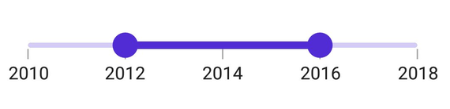
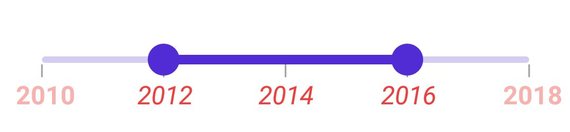

# Labels in .NET MAUI DateTime Range Slider (SfDateTimeRangeSlider)

This section explains how to add and customize labels in the DateTime Range Slider.

## Show Labels

The [`ShowLabels`](https://help.syncfusion.com/cr/maui/Syncfusion.Maui.Sliders.RangeView-1.html#Syncfusion_Maui_Sliders_RangeView_1_ShowLabels) property is used to render labels at specified intervals. The default value is `False`.





<sliders:SfDateTimeRangeSlider Minimum="2010-01-01" 
                               Maximum="2018-01-01" 
                               RangeStart="2012-01-01" 
                               RangeEnd="2016-01-01"
                               Interval="2" 
                               ShowLabels="True"
                               ShowTicks="True">
</sliders:SfDateTimeRangeSlider>





SfDateTimeRangeSlider rangeSlider = new SfDateTimeRangeSlider();
rangeSlider.Minimum = new DateTime(2010, 01, 01);
rangeSlider.Maximum = new DateTime(2018, 01, 01);
rangeSlider.RangeStart = new DateTime(2012, 01, 01);
rangeSlider.RangeEnd = new DateTime(2016, 01, 01);
rangeSlider.Interval = 2;
rangeSlider.ShowLabels = true;
rangeSlider.ShowTicks = true;





## Date Format

The [`DateFormat`](https://help.syncfusion.com/cr/maui/Syncfusion.Maui.Sliders.IDateTimeElement.html#Syncfusion_Maui_Sliders_IDateTimeElement_DateFormat) property formats the date labels. By default, it is set to `string.Empty`.





<sliders:SfDateTimeRangeSlider Minimum="2000-01-01T09:00:00" 
                               Maximum="2000-01-01T17:00:00" 
                               RangeStart="2000-01-01T11:00:00" 
                               RangeEnd="2000-01-01T15:00:00" 
                               Interval="2"
                               IntervalType="Hours"
                               ShowLabels="True"  
                               DateFormat="h tt"
                               ShowTicks="True">
</sliders:SfDateTimeRangeSlider>





SfDateTimeRangeSlider rangeSlider = new SfDateTimeRangeSlider();
rangeSlider.Minimum = new DateTime(2000, 01, 01, 09, 00, 00);
rangeSlider.Maximum = new DateTime(2000, 01, 01, 17, 00, 00);
rangeSlider.RangeStart = new DateTime(2000, 01, 01, 11, 00, 00);
rangeSlider.RangeEnd = new DateTime(2000, 01, 01, 15, 00, 00);
rangeSlider.Interval = 2;
rangeSlider.DateIntervalType = SliderDateIntervalType.Hours;
rangeSlider.DateFormat = "h tt";
rangeSlider.ShowLabels = true;
rangeSlider.ShowTicks = true;





## Label Placement

The [`LabelsPlacement`](https://help.syncfusion.com/cr/maui/Syncfusion.Maui.Sliders.RangeView-1.html#Syncfusion_Maui_Sliders_RangeView_1_LabelsPlacement) property specifies the placement of labels either between the major ticks or on the major ticks. The default is [`SliderLabelsPlacement.OnTicks`](https://help.syncfusion.com/cr/maui/Syncfusion.Maui.Sliders.SliderLabelsPlacement.html#Syncfusion_Maui_Sliders_SliderLabelsPlacement_OnTicks).





<sliders:SfDateTimeRangeSlider Minimum="2011-01-01"
                               Maximum="2016-01-01"
                               RangeStart="2012-01-01"
                               RangeEnd="2015-01-01"
                               Interval="1"
                               LabelsPlacement="BetweenTicks"
                               ShowLabels="True"
                               ShowTicks="True">
</sliders:SfDateTimeRangeSlider>





SfDateTimeRangeSlider rangeSlider = new SfDateTimeRangeSlider();
rangeSlider.Minimum = new DateTime(2011, 01, 01);
rangeSlider.Maximum = new DateTime(2016, 01, 01);
rangeSlider.RangeStart = new DateTime(2012, 01, 01);
rangeSlider.RangeEnd = new DateTime(2015, 01, 01);
rangeSlider.Interval = 1;
rangeSlider.LabelsPlacement = SliderLabelsPlacement.BetweenTicks;
rangeSlider.ShowLabels = true;
rangeSlider.ShowTicks = true;





> Note: Refer [here](https://help.syncfusion.com/maui/range-slider/events) to customize label text format through range slider events.

## Edge Labels Placement

The [`EdgeLabelsPlacement`](https://help.syncfusion.com/cr/maui/Syncfusion.Maui.Sliders.RangeView-1.html#Syncfusion_Maui_Sliders_RangeView_1_EdgeLabelsPlacement) property controls the placement of the first and last labels, allowing them to be positioned inside the track bounds or based on intervals. The default is [`SliderEdgeLabelPlacement.Default`](https://help.syncfusion.com/cr/maui/Syncfusion.Maui.Sliders.SliderEdgeLabelsPlacement.html#Syncfusion_Maui_Sliders_SliderEdgeLabelsPlacement_Default).

If [`TrackExtent`](https://help.syncfusion.com/cr/maui/Syncfusion.Maui.Sliders.RangeView-1.html#Syncfusion_Maui_Sliders_RangeView_1_TrackExtent) is greater than `0`, and `EdgeLabelsPlacement` is set to [`SliderEdgeLabelsPlacement.Inside`](https://help.syncfusion.com/cr/maui/Syncfusion.Maui.Sliders.SliderEdgeLabelsPlacement.html#Syncfusion_Maui_Sliders_SliderEdgeLabelsPlacement_Inside), the labels will be placed inside the extended track edges.





<sliders:SfDateTimeRangeSlider Minimum="2010-01-01" 
                               Maximum="2018-01-01" 
                               RangeStart="2012-01-01" 
                               RangeEnd="2016-01-01"
                               Interval="2"
                               ShowLabels="True"
                               ShowTicks="True"
                               EdgeLabelsPlacement="Inside" />





SfDateTimeRangeSlider rangeSlider = new SfDateTimeRangeSlider();
rangeSlider.Minimum = new DateTime(2010, 01, 01);
rangeSlider.Maximum = new DateTime(2018, 01, 01);
rangeSlider.RangeStart = new DateTime(2012, 01, 01);
rangeSlider.RangeEnd = new DateTime(2016, 01, 01);
rangeSlider.Interval = 2;
rangeSlider.EdgeLabelsPlacement = SliderEdgeLabelsPlacement.Inside;
rangeSlider.ShowLabels = true;
rangeSlider.ShowTicks = true;





## Label Style

Customize the appearance of active and inactive labels using the properties of the [`LabelStyle`](https://help.syncfusion.com/cr/maui/Syncfusion.Maui.Sliders.SliderLabelStyle.html) class, such as [`ActiveTextColor`](https://help.syncfusion.com/cr/maui/Syncfusion.Maui.Sliders.SliderLabelStyle.html#Syncfusion_Maui_Sliders_SliderLabelStyle_ActiveTextColor), [`InactiveTextColor`](https://help.syncfusion.com/cr/maui/Syncfusion.Maui.Sliders.SliderLabelStyle.html#Syncfusion_Maui_Sliders_SliderLabelStyle_InactiveTextColor), [`ActiveFontSize`](https://help.syncfusion.com/cr/maui/Syncfusion.Maui.Sliders.SliderLabelStyle.html#Syncfusion_Maui_Sliders_SliderLabelStyle_ActiveFontSize), [`InactiveFontSize`](https://help.syncfusion.com/cr/maui/Syncfusion.Maui.Sliders.SliderLabelStyle.html#Syncfusion_Maui_Sliders_SliderLabelStyle_InactiveFontSize), etc.
- The active portion of the DateTime Range Slider is between the start and end thumbs.
- The inactive portion is between the [`Minimum`](https://help.syncfusion.com/cr/maui/Syncfusion.Maui.Sliders.RangeView-1.html#Syncfusion_Maui_Sliders_RangeView_1_Minimum) value and the left thumb, and the right thumb and the [`Maximum`](https://help.syncfusion.com/cr/maui/Syncfusion.Maui.Sliders.RangeView-1.html#Syncfusion_Maui_Sliders_RangeView_1_Maximum) value.

The active side of the DateTime Range Slider is between the start and end thumbs.

The inactive side of the DateTime Range Slider is between the [`Minimum`](https://help.syncfusion.com/cr/maui/Syncfusion.Maui.Sliders.RangeView-1.html#Syncfusion_Maui_Sliders_RangeView_1_Minimum) value and the left thumb, and the right thumb and the [`Maximum`](https://help.syncfusion.com/cr/maui/Syncfusion.Maui.Sliders.RangeView-1.html#Syncfusion_Maui_Sliders_RangeView_1_Maximum) value.





<sliders:SfDateTimeRangeSlider Minimum="2010-01-01" 
                               Maximum="2018-01-01" 
                               RangeStart="2012-01-01" 
                               RangeEnd="2016-01-01" 
                               Interval="2" 
                               ShowLabels="True" 
                               ShowTicks="True">

    <sliders:SfDateTimeRangeSlider.LabelStyle>
        <sliders:SliderLabelStyle ActiveTextColor="#EE3F3F" 
                                  InactiveTextColor="#F7B1AE" 
                                  ActiveFontAttributes="Italic" 
                                  InactiveFontAttributes="Bold" 
                                  ActiveFontSize="16" 
                                  InactiveFontSize="16" />
    </sliders:SfDateTimeRangeSlider.LabelStyle>
</sliders:SfDateTimeRangeSlider>





SfDateTimeRangeSlider rangeSlider = new SfDateTimeRangeSlider();
rangeSlider.Minimum = new DateTime(2010, 01, 01);
rangeSlider.Maximum = new DateTime(2018, 01, 01);
rangeSlider.RangeStart = new DateTime(2012, 01, 01);
rangeSlider.RangeEnd = new DateTime(2016, 01, 01);
rangeSlider.Interval = 2;
rangeSlider.ShowLabels = true;
rangeSlider.ShowTicks = true;
rangeSlider.LabelStyle.ActiveTextColor = Color.FromArgb("#EE3F3F");
rangeSlider.LabelStyle.InactiveTextColor = Color.FromArgb("#F7B1AE");
rangeSlider.LabelStyle.ActiveFontSize = 16;
rangeSlider.LabelStyle.InactiveFontSize = 16;
rangeSlider.LabelStyle.ActiveFontAttributes = FontAttributes.Italic;
rangeSlider.LabelStyle.InactiveFontAttributes = FontAttributes.Bold;





## Label Offset

Adjust the space between ticks and labels using the [`Offset`](https://help.syncfusion.com/cr/maui/Syncfusion.Maui.Sliders.SliderLabelStyle.html#Syncfusion_Maui_Sliders_SliderLabelStyle_Offset) property. The default is `5.0` when [`ShowTicks`](https://help.syncfusion.com/cr/maui/Syncfusion.Maui.Sliders.RangeView-1.html#Syncfusion_Maui_Sliders_RangeView_1_ShowTicks) is enabled, otherwise, it is `15.0`.





<sliders:SfDateTimeRangeSlider Minimum="2010-01-01" 
                               Maximum="2018-01-01" 
                               RangeStart="2012-01-01" 
                               RangeEnd="2016-01-01" 
                               Interval="2" 
                               ShowLabels="True" 
                               ShowTicks="True">
  
  <sliders:SfDateTimeRangeSlider.LabelStyle>
    <sliders:SliderLabelStyle Offset="10" />
  </sliders:SfDateTimeRangeSlider.LabelStyle>

</sliders:SfDateTimeRangeSlider>





SfDateTimeRangeSlider rangeSlider = new SfDateTimeRangeSlider();
rangeSlider.Minimum = new DateTime(2010, 01, 01);
rangeSlider.Maximum = new DateTime(2018, 01, 01);
rangeSlider.RangeStart = new DateTime(2012, 01, 01);
rangeSlider.RangeEnd = new DateTime(2016, 01, 01);
rangeSlider.Interval = 2;
rangeSlider.ShowLabels = true;
rangeSlider.ShowTicks = true;
rangeSlider.LabelStyle.Offset = 10;





## Disabled Labels

Set the `IsEnabled` property to `false` to disable the DateTime Range Slider. Customize label properties for different visual states using the Visual State Manager (VSM). The applicable states are enabled (default) and disabled.




<ContentPage.Resources>
    
</ContentPage.Resources>

<ContentPage.Content>
    <VerticalStackLayout>
        <Label Text="Enabled"
               Padding="10" />
        <sliders:SfDateTimeRangeSlider />
        <Label Text="Disabled"
               Padding="10" />
        <sliders:SfDateTimeRangeSlider IsEnabled="False" />
    </VerticalStackLayout>
</ContentPage.Content>





VerticalStackLayout stackLayout = new();
SfDateTimeRangeSlider defaultRangeSlider = new()
{
    Minimum = new DateTime(2010, 01, 01),
    Maximum = new DateTime(2018, 01, 01),
    RangeStart = new DateTime(2012, 01, 01),
    RangeEnd = new DateTime(2016, 01, 01),
    Interval = 2,
    ShowTicks = true,
    ShowLabels = true
};
SfDateTimeRangeSlider disabledRangeSlider = new()
{
    Minimum = new DateTime(2010, 01, 01),
    Maximum = new DateTime(2018, 01, 01),
    RangeStart = new DateTime(2012, 01, 01),
    RangeEnd = new DateTime(2016, 01, 01),
    IsEnabled = false,
    Interval = 2,
    ShowTicks = true,
    ShowLabels = true
};

VisualStateGroupList visualStateGroupList = new();
VisualStateGroup commonStateGroup = new();
// Default State.
VisualState defaultState = new() { Name = "Default" };
defaultState.Setters.Add(new Setter
{
    Property = SfDateTimeRangeSlider.LabelStyleProperty,
    Value = new SliderLabelStyle
    {
        ActiveFontSize = 16,
        InactiveFontSize = 14,
        ActiveTextColor = Color.FromArgb("#EE3F3F"),
        InactiveTextColor = Color.FromArgb("#F7B1AE"),
        ActiveFontAttributes = FontAttributes.Bold,
        InactiveFontAttributes = FontAttributes.Italic,
    }
});
// Disabled State.
VisualState disabledState = new VisualState { Name = "Disabled" };
disabledState.Setters.Add(new Setter
{
    Property = SfDateTimeRangeSlider.LabelStyleProperty,
    Value = new SliderLabelStyle
    {
        ActiveFontSize = 16,
        InactiveFontSize = 14,
        ActiveTextColor = Color.FromArgb("#EE3F3F"),
        InactiveTextColor = Color.FromArgb("#F7B1AE"),
        ActiveFontAttributes = FontAttributes.Italic,
        InactiveFontAttributes = FontAttributes.Bold,
    }
});
disabledState.Setters.Add(new Setter
{
    Property = SfDateTimeRangeSlider.ThumbStyleProperty,
    Value = new SliderThumbStyle
    {
        Fill = Colors.Gray,
    }
});
disabledState.Setters.Add(new Setter
{
    Property = SfDateTimeRangeSlider.TrackStyleProperty,
    Value = new SliderTrackStyle
    {
        ActiveFill = Colors.Gray,
        InactiveFill = Colors.LightGray,
    }
});

commonStateGroup.States.Add(defaultState);
commonStateGroup.States.Add(disabledState);
visualStateGroupList.Add(commonStateGroup);
VisualStateManager.SetVisualStateGroups(defaultRangeSlider, visualStateGroupList);
VisualStateManager.SetVisualStateGroups(disabledRangeSlider, visualStateGroupList);

stackLayout.Children.Add(new Label() { Text = "Enabled", Padding = new Thickness(10) });
stackLayout.Children.Add(defaultRangeSlider);
stackLayout.Children.Add(new Label() { Text = "Disabled", Padding = new Thickness(10) });
stackLayout.Children.Add(disabledRangeSlider);
this.Content = stackLayout;





