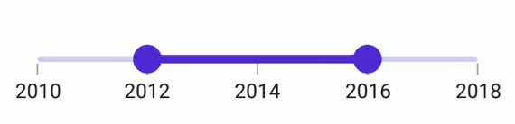
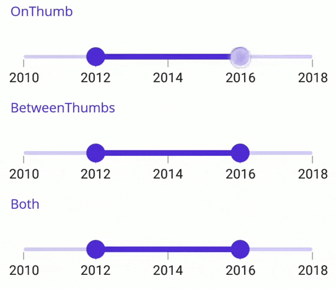

# Range Selection in .NET MAUI Range Slider (SfDateTimeRangeSlider)

This section explains the range selection capabilities in the DateTime Range Slider.

## Discrete Selection

The DateTime Range Slider allows discrete thumb movement for date values using the [`StepDuration`](https://help.syncfusion.com/cr/maui/Syncfusion.Maui.Sliders.IDateTimeElement.html#Syncfusion_Maui_Sliders_IDateTimeElement_StepDuration) property.

For instance, with a [`Minimum`](https://help.syncfusion.com/cr/maui/Syncfusion.Maui.Sliders.RangeView-1.html#Syncfusion_Maui_Sliders_RangeView_1_Minimum) of `DateTime(2015, 01, 01)`, a [`Maximum`](https://help.syncfusion.com/cr/maui/Syncfusion.Maui.Sliders.RangeView-1.html#Syncfusion_Maui_Sliders_RangeView_1_Maximum) of `DateTime(2020, 01, 01)`, and a `StepDuration` of `1`, the slider will incrementally move the thumbs to DateTime(2015, 01, 01), DateTime(2016, 01, 01), and so forth.





<sliders:SfDateTimeRangeSlider Minimum="2000-01-01"
                               Maximum="2004-01-01"
                               RangeStart="2001-01-01"
                               RangeEnd="2003-01-01"
                               Interval="1"
                               StepDuration="1"
                               ShowLabels="True"
                               ShowTicks="True"
                               ShowDividers="True" />





SfDateTimeRangeSlider rangeSlider = new SfDateTimeRangeSlider();
rangeSlider.Minimum = new DateTime(2000, 01, 01);
rangeSlider.Maximum = new DateTime(2004, 01, 01);
rangeSlider.RangeStart = new DateTime(2001, 01, 01); 
rangeSlider.RangeEnd = new DateTime(2003, 01, 01);     
rangeSlider.ShowLabels = true;
rangeSlider.ShowTicks = true;      
rangeSlider.ShowDividers = true;    
rangeSlider.Interval = 1;  
rangeSlider.StepDuration = new SliderStepDuration(years: 1);
         




## Interval Selection

When the [EnableIntervalSelection](https://help.syncfusion.com/cr/maui/Syncfusion.Maui.Sliders.RangeSliderBase-1.html#Syncfusion_Maui_Sliders_RangeSliderBase_1_EnableIntervalSelection) property is set to `true`, both thumbs move to the selected interval; otherwise, the nearest thumb moves to the touch position.





<sliders:SfDateTimeRangeSlider Minimum="2010-01-01" 
                               Maximum="2018-01-01" 
                               RangeStart="2012-01-01" 
                               RangeEnd="2016-01-01" 
                               Interval="2"
                               ShowTicks="True"
                               ShowLabels="True"
                               EnableIntervalSelection="True" >
</sliders:SfDateTimeRangeSlider>





SfDateTimeRangeSlider rangeSlider = new SfDateTimeRangeSlider();
rangeSlider.Minimum = new DateTime(2010, 01, 01);
rangeSlider.Maximum = new DateTime(2018, 01, 01);
rangeSlider.RangeStart = new DateTime(2012, 01, 01);
rangeSlider.RangeEnd = new DateTime(2016, 01, 01);
rangeSlider.Interval = 2;        
rangeSlider.ShowLabels = true;
rangeSlider.ShowTicks = true;    
rangeSlider.EnableIntervalSelection = true;
         




## Drag Behavior

### OnThumb

Set the [DragBehavior](https://help.syncfusion.com/cr/maui/Syncfusion.Maui.Sliders.RangeSliderBase-1.html#Syncfusion_Maui_Sliders_RangeSliderBase_1_DragBehavior) to [OnThumb](https://help.syncfusion.com/cr/maui/Syncfusion.Maui.Sliders.SliderDragBehavior.html#Syncfusion_Maui_Sliders_SliderDragBehavior_OnThumb) to allow individual thumb movement based on dragging. This is the default behavior.





<sliders:SfDateTimeRangeSlider Minimum="2010-01-01" 
                               Maximum="2018-01-01" 
                               RangeStart="2012-01-01" 
                               RangeEnd="2016-01-01"
                               Interval="2" 
                               ShowTicks="True"
                               ShowLabels="True"
                               DragBehavior="OnThumb">
</sliders:SfDateTimeRangeSlider>





SfDateTimeRangeSlider rangeSlider = new SfDateTimeRangeSlider();
rangeSlider.Minimum = new DateTime(2010, 01, 01);
rangeSlider.Maximum = new DateTime(2018, 01, 01);
rangeSlider.RangeStart = new DateTime(2012, 01, 01);
rangeSlider.RangeEnd = new DateTime(2016, 01, 01);
rangeSlider.Interval = 2; 
rangeSlider.ShowTicks = true;
rangeSlider.ShowLabels = true;  
rangeSlider.DragBehavior = SliderDragBehavior.OnThumb;





### BetweenThumbs

With [DragBehavior](https://help.syncfusion.com/cr/maui/Syncfusion.Maui.Sliders.RangeSliderBase-1.html#Syncfusion_Maui_Sliders_RangeSliderBase_1_DragBehavior) set to [BetweenThumbs](https://help.syncfusion.com/cr/maui/Syncfusion.Maui.Sliders.SliderDragBehavior.html#Syncfusion_Maui_Sliders_SliderDragBehavior_BetweenThumbs), both thumbs move together without altering the range. This prevents individual thumb movement.





<sliders:SfDateTimeRangeSlider Minimum="2010-01-01" 
                               Maximum="2018-01-01" 
                               RangeStart="2012-01-01" 
                               RangeEnd="2016-01-01" 
                               Interval="2" 
                               ShowTicks="True"
                               ShowLabels="True"
                               DragBehavior="BetweenThumbs">
</sliders:SfDateTimeRangeSlider>





SfDateTimeRangeSlider rangeSlider = new SfDateTimeRangeSlider();
rangeSlider.Minimum = new DateTime(2010, 01, 01);
rangeSlider.Maximum = new DateTime(2018, 01, 01);
rangeSlider.RangeStart = new DateTime(2012, 01, 01);
rangeSlider.RangeEnd = new DateTime(2016, 01, 01);
rangeSlider.Interval = 2; 
rangeSlider.ShowTicks = true;
rangeSlider.ShowLabels = true;   
rangeSlider.DragBehavior = SliderDragBehavior.BetweenThumbs;





### Both

Setting [DragBehavior](https://help.syncfusion.com/cr/maui/Syncfusion.Maui.Sliders.RangeSliderBase-1.html#Syncfusion_Maui_Sliders_RangeSliderBase_1_DragBehavior) to [Both](https://help.syncfusion.com/cr/maui/Syncfusion.Maui.Sliders.SliderDragBehavior.html#Syncfusion_Maui_Sliders_SliderDragBehavior_Both) allows individual and simultaneous thumb movement without changing the range.





<sliders:SfDateTimeRangeSlider Minimum="2010-01-01" 
                               Maximum="2018-01-01" 
                               RangeStart="2012-01-01" 
                               RangeEnd="2016-01-01" 
                               Interval="2" 
                               ShowTicks="True"
                               ShowLabels="True"
                               DragBehavior="Both">
</sliders:SfDateTimeRangeSlider>





SfDateTimeRangeSlider rangeSlider = new SfDateTimeRangeSlider();
rangeSlider.Minimum = new DateTime(2010, 01, 01);
rangeSlider.Maximum = new DateTime(2018, 01, 01);
rangeSlider.RangeStart = new DateTime(2012, 01, 01);
rangeSlider.RangeEnd = new DateTime(2016, 01, 01);
rangeSlider.Interval = 2; 
rangeSlider.ShowTicks = true; 
rangeSlider.ShowLabels = true;  
rangeSlider.DragBehavior = SliderDragBehavior.Both;





## Deferred Update

Control update timing of dependent components while dragging thumbs by setting `EnableDeferredUpdate`. Adjust the delay using the `DeferredUpdateDelay` property, defaulting at `500` milliseconds.

Value changes invoke the `ValueChanging` event after the specified delay, while immediate updates occur on touch-up actions.




<sliders:SfDateTimeRangeSlider Minimum="2010-01-01" 
                               Maximum="2018-01-01" 
                               RangeStart="2012-01-01" 
                               RangeEnd="2016-01-01" 
                               Interval="2"
                               ShowTicks="True"
                               ShowLabels="True"
                               EnableDeferredUpdate="True"
                               DeferredUpdateDelay="1000" >
</sliders:SfDateTimeRangeSlider>





SfDateTimeRangeSlider rangeSlider = new SfDateTimeRangeSlider();
rangeSlider.Minimum = new DateTime(2010, 01, 01);
rangeSlider.Maximum = new DateTime(2018, 01, 01);
rangeSlider.RangeStart = new DateTime(2012, 01, 01);
rangeSlider.RangeEnd = new DateTime(2016, 01, 01);
rangeSlider.Interval = 2;        
rangeSlider.ShowLabels = true;
rangeSlider.ShowTicks = true;    
rangeSlider.EnableDeferredUpdate = true;
rangeSlider.DeferredUpdateDelay = 1000;
         


