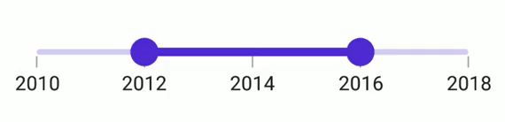
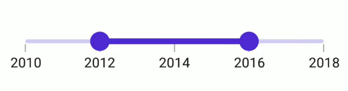
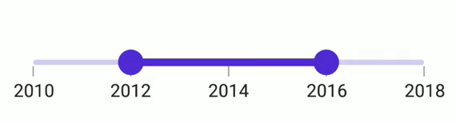

# Range selection in .NET MAUI DateTime Range Slider (SfDateTimeRangeSlider)

This section helps to learn about the range selection in the DateTime Range Slider.

## Discrete selection

Move the thumb in a discrete manner for date values using the [`StepDuration`](https://help.syncfusion.com/cr/maui/Syncfusion.Maui.Sliders.DateTimeRangeSliderBase.html#Syncfusion_Maui_Sliders_DateTimeRangeSliderBase_StepDuration) property in the DateTime Range Slider.

For example, if the [`Minimum`](https://help.syncfusion.com/cr/maui/Syncfusion.Maui.Sliders.DateTimeRangeSliderBase.html#Syncfusion_Maui_Sliders_DateTimeRangeSliderBase_Minimum) is DateTime(2015, 01, 01), [`Maximum`](https://help.syncfusion.com/cr/maui/Syncfusion.Maui.Sliders.DateTimeRangeSliderBase.html#Syncfusion_Maui_Sliders_DateTimeRangeSliderBase_Maximum) is DateTime(2020, 01, 01), and the [`StepDuration`](https://help.syncfusion.com/cr/maui/Syncfusion.Maui.Sliders.DateTimeRangeSliderBase.html#Syncfusion_Maui_Sliders_DateTimeRangeSliderBase_StepDuration) is `1`, the range slider will move the thumbs at DateTime(2015, 01, 01), DateTime(2016, 01, 01), DateTime(2017, 01, 01),and DateTime(2018, 01, 01).





<sliders:SfDateTimeRangeSlider Minimum="2000-01-01"
                               Maximum="2004-01-01"
                               RangeStart="2001-01-01"
                               RangeEnd="2003-01-01"
                               Interval="1"
                               StepDuration="1"
                               ShowLabels="True"
                               ShowTicks="True"
                               ShowDividers="True" />





SfDateTimeRangeSlider rangeSlider = new SfDateTimeRangeSlider();
rangeSlider.Minimum = new DateTime(2000, 01, 01);
rangeSlider.Maximum = new DateTime(2004, 01, 01);
rangeSlider.RangeStart = new DateTime(2001, 01, 01); 
rangeSlider.RangeEnd = new DateTime(2003, 01, 01);     
rangeSlider.ShowLabels = true;
rangeSlider.ShowTicks = true;      
rangeSlider.ShowDividers = true;    
rangeSlider.Interval = 1;  
rangeSlider.StepDuration = new SliderStepDuration(years: 1);
         




## Interval Selection

Drag thumbs only in intervals when the [EnableIntervalSelection](https://help.syncfusion.com/cr/maui/Syncfusion.Maui.Sliders.RangeSliderBase.html#Syncfusion_Maui_Sliders_RangeSliderBase_EnableIntervalSelection) is true. If true, both thumbs can only be moved on the slider Interval.





<sliders:SfDateTimeRangeSlider Minimum="2010-01-01" 
                               Maximum="2018-01-01" 
                               RangeStart="2012-01-01" 
                               RangeEnd="2016-01-01" 
                               Interval="2"
                               ShowTicks="True"
                               ShowLabels="True"
                               EnableIntervalSelection="True" >
</sliders:SfDateTimeRangeSlider>





SfDateTimeRangeSlider rangeSlider = new SfDateTimeRangeSlider();
rangeSlider.Minimum = new DateTime(2010, 01, 01);
rangeSlider.Maximum = new DateTime(2018, 01, 01);
rangeSlider.RangeStart = new DateTime(2012, 01, 01);
rangeSlider.RangeEnd = new DateTime(2016, 01, 01);
rangeSlider.Interval = 2;        
rangeSlider.ShowLabels = true;
rangeSlider.ShowTicks = true;    
rangeSlider.EnableIntervalSelection = true;
         




## DragBehavior

### OnThumb

When the [DragBehavior](https://help.syncfusion.com/cr/maui/Syncfusion.Maui.Sliders.RangeSliderBase.html#Syncfusion_Maui_Sliders_RangeSliderBase_DragBehavior) is set to [OnThumb](https://help.syncfusion.com/cr/maui/Syncfusion.Maui.Sliders.SliderDragBehavior.html#Syncfusion_Maui_Sliders_SliderDragBehavior_OnThumb), an individual thumb can be moved based on the dragging. By default, the [OnThumb](https://help.syncfusion.com/cr/maui/Syncfusion.Maui.Sliders.SliderDragBehavior.html#Syncfusion_Maui_Sliders_SliderDragBehavior_OnThumb) is used as drag behavior.





<sliders:SfDateTimeRangeSlider Minimum="2010-01-01" 
                               Maximum="2018-01-01" 
                               RangeStart="2012-01-01" 
                               RangeEnd="2016-01-01"
                               Interval="2" 
                               ShowTicks="True"
                               ShowLabels="True"
                               DragBehavior="OnThumb">
</sliders:SfDateTimeRangeSlider>





SfDateTimeRangeSlider rangeSlider = new SfDateTimeRangeSlider();
rangeSlider.Minimum = new DateTime(2010, 01, 01);
rangeSlider.Maximum = new DateTime(2018, 01, 01);
rangeSlider.RangeStart = new DateTime(2012, 01, 01);
rangeSlider.RangeEnd = new DateTime(2016, 01, 01);
rangeSlider.Interval = 2; 
rangeSlider.ShowTicks = true;
rangeSlider.ShowLabels = true;  
rangeSlider.DragBehavior = SliderDragBehavior.OnThumb;





### BetweenThumbs

When the [DragBehavior](https://help.syncfusion.com/cr/maui/Syncfusion.Maui.Sliders.RangeSliderBase.html#Syncfusion_Maui_Sliders_RangeSliderBase_DragBehavior) is set to [BetweenThumbs](https://help.syncfusion.com/cr/maui/Syncfusion.Maui.Sliders.SliderDragBehavior.html#Syncfusion_Maui_Sliders_SliderDragBehavior_BetweenThumbs), both the thumbs can be moved at the same time without changing the range between the start and end thumbs. We had considered this behavior without the range slider thumb radius. It is not possible to move the individual thumb when setting this behavior.





<sliders:SfDateTimeRangeSlider Minimum="2010-01-01" 
                               Maximum="2018-01-01" 
                               RangeStart="2012-01-01" 
                               RangeEnd="2016-01-01" 
                               Interval="2" 
                               ShowTicks="True"
                               ShowLabels="True"
                               DragBehavior="BetweenThumbs">
</sliders:SfDateTimeRangeSlider>





SfDateTimeRangeSlider rangeSlider = new SfDateTimeRangeSlider();
rangeSlider.Minimum = new DateTime(2010, 01, 01);
rangeSlider.Maximum = new DateTime(2018, 01, 01);
rangeSlider.RangeStart = new DateTime(2012, 01, 01);
rangeSlider.RangeEnd = new DateTime(2016, 01, 01);
rangeSlider.Interval = 2; 
rangeSlider.ShowTicks = true;
rangeSlider.ShowLabels = true;   
rangeSlider.DragBehavior = SliderDragBehavior.BetweenThumbs;





### Both

When the  [DragBehavior](https://help.syncfusion.com/cr/maui/Syncfusion.Maui.Sliders.RangeSliderBase.html#Syncfusion_Maui_Sliders_RangeSliderBase_DragBehavior) is set to [Both](https://help.syncfusion.com/cr/maui/Syncfusion.Maui.Sliders.SliderDragBehavior.html#Syncfusion_Maui_Sliders_SliderDragBehavior_Both), the individual thumb can be moved, and both thumbs can be moved at the same time without changing the range between the start and end thumbs.





<sliders:SfDateTimeRangeSlider Minimum="2010-01-01" 
                               Maximum="2018-01-01" 
                               RangeStart="2012-01-01" 
                               RangeEnd="2016-01-01" 
                               Interval="2" 
                               ShowTicks="True"
                               ShowLabels="True"
                               DragBehavior="Both">
</sliders:SfDateTimeRangeSlider>





SfDateTimeRangeSlider rangeSlider = new SfDateTimeRangeSlider();
rangeSlider.Minimum = new DateTime(2010, 01, 01);
rangeSlider.Maximum = new DateTime(2018, 01, 01);
rangeSlider.RangeStart = new DateTime(2012, 01, 01);
rangeSlider.RangeEnd = new DateTime(2016, 01, 01);
rangeSlider.Interval = 2; 
rangeSlider.ShowTicks = true; 
rangeSlider.ShowLabels = true;  
rangeSlider.DragBehavior = SliderDragBehavior.Both;





